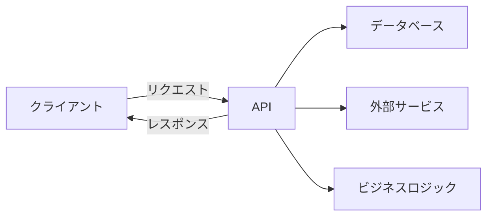
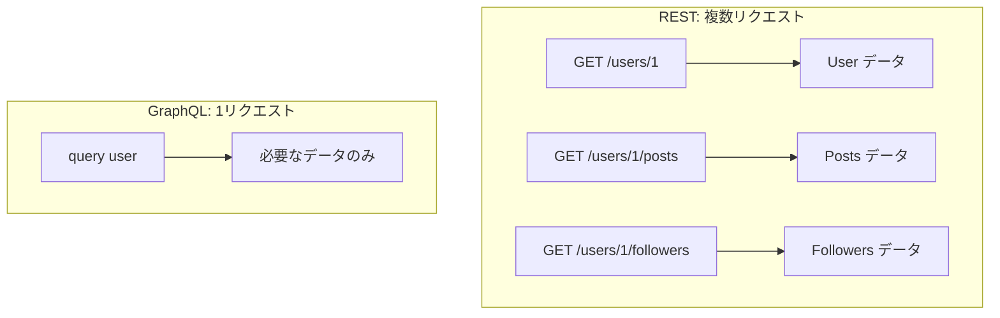

# Phase 1-1: API 設計基礎

## 学習目標

この単元を終えると、以下ができるようになります：

- API の役割を説明できる
- HTTP メソッド・ステータスコードを理解できる
- REST と GraphQL の違いを説明できる

## 概念解説

### API とは



**API（Application Programming Interface）** = アプリケーション間の通信インターフェース

### Web API の種類

| 種類 | 特徴 | 用途 |
|------|------|------|
| REST | リソース指向、HTTP ベース | 一般的な Web API |
| GraphQL | クエリ言語、柔軟なデータ取得 | 複雑なデータ要件 |
| gRPC | バイナリプロトコル、高速 | マイクロサービス間通信 |
| WebSocket | 双方向通信 | リアルタイム通信 |

## HTTP の基礎

### HTTP メソッド

| メソッド | 用途 | 冪等性 | 安全性 |
|---------|------|--------|--------|
| GET | リソース取得 | ✅ | ✅ |
| POST | リソース作成 | ❌ | ❌ |
| PUT | リソース全体更新 | ✅ | ❌ |
| PATCH | リソース部分更新 | ❌ | ❌ |
| DELETE | リソース削除 | ✅ | ❌ |

**冪等性**: 何度実行しても結果が同じ
**安全性**: リソースを変更しない

### ステータスコード

| コード | カテゴリ | 例 |
|-------|---------|-----|
| 1xx | 情報 | 100 Continue |
| 2xx | 成功 | 200 OK, 201 Created |
| 3xx | リダイレクト | 301 Moved, 304 Not Modified |
| 4xx | クライアントエラー | 400 Bad Request, 404 Not Found |
| 5xx | サーバーエラー | 500 Internal Error, 503 Unavailable |

### よく使うステータスコード

| コード | 意味 | 使用場面 |
|-------|------|---------|
| 200 | OK | GET 成功 |
| 201 | Created | POST 成功（リソース作成） |
| 204 | No Content | DELETE 成功 |
| 400 | Bad Request | リクエスト形式エラー |
| 401 | Unauthorized | 認証エラー |
| 403 | Forbidden | 認可エラー（権限なし） |
| 404 | Not Found | リソースなし |
| 409 | Conflict | 競合（重複など） |
| 422 | Unprocessable Entity | バリデーションエラー |
| 500 | Internal Server Error | サーバーエラー |

## REST vs GraphQL

### REST

```
GET /users          → 全ユーザー取得
GET /users/1        → ユーザー1取得
GET /users/1/posts  → ユーザー1の投稿取得
POST /users         → ユーザー作成
PUT /users/1        → ユーザー1更新
DELETE /users/1     → ユーザー1削除
```

### GraphQL

```graphql
# 1回のリクエストで必要なデータを取得
query {
  user(id: 1) {
    name
    email
    posts {
      title
      createdAt
    }
  }
}
```

### 比較

| 観点 | REST | GraphQL |
|------|------|---------|
| データ取得 | 複数リクエスト | 1リクエスト |
| オーバーフェッチ | 発生しやすい | 必要なデータのみ |
| アンダーフェッチ | 発生しやすい | 発生しない |
| キャッシュ | HTTP キャッシュ活用 | 複雑 |
| 学習コスト | 低 | 中〜高 |
| ツール | 豊富 | 発展中 |



## ハンズオン

### 演習: curl で API を叩く

```bash
# GET リクエスト
curl -X GET https://jsonplaceholder.typicode.com/users/1

# POST リクエスト
curl -X POST https://jsonplaceholder.typicode.com/posts \
  -H "Content-Type: application/json" \
  -d '{"title": "Test", "body": "Content", "userId": 1}'

# ヘッダー付き
curl -X GET https://api.example.com/users \
  -H "Authorization: Bearer your-token"

# レスポンスヘッダーも表示
curl -i https://jsonplaceholder.typicode.com/users/1
```

## 理解度確認

### 問題

リソースを新規作成する際に使用する HTTP メソッドと、成功時の適切なステータスコードの組み合わせはどれか。

**A.** GET / 200

**B.** POST / 201

**C.** PUT / 200

**D.** POST / 200

---

### 解答・解説

**正解: B**

- POST: 新規リソースの作成
- 201 Created: リソースが正常に作成された

200 OK は主に GET の成功時に使用します。

---

## 次のステップ

API 設計基礎を学びました。次は RESTful 設計の原則を学びましょう。

**次の単元**: [Phase 1-2: RESTful 設計](./02_RESTful設計.md)
