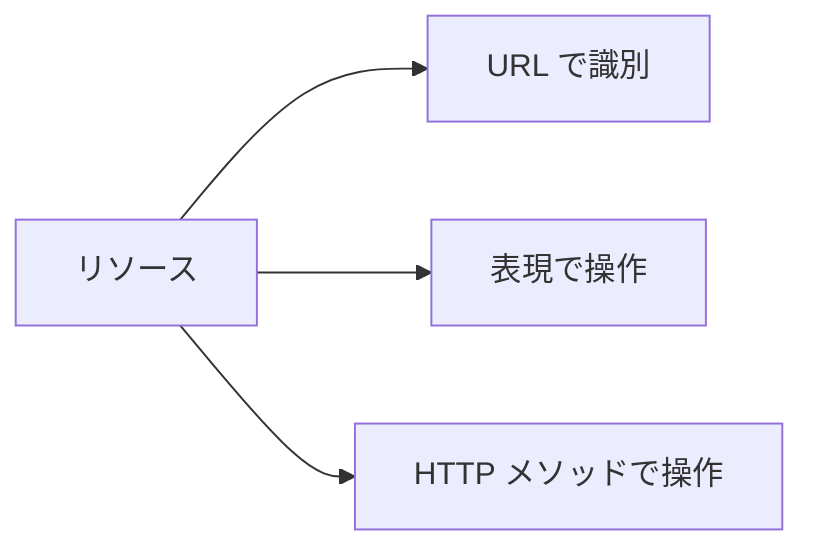

# Phase 1-2: RESTful 設計

## 学習目標

この単元を終えると、以下ができるようになります：

- REST の原則を説明できる
- 適切な URL 設計ができる
- レスポンス設計ができる

## REST の原則

### 6つの制約

| 制約 | 説明 |
|------|------|
| クライアント・サーバー | 責務の分離 |
| ステートレス | サーバーはセッションを保持しない |
| キャッシュ可能 | レスポンスのキャッシュ |
| 統一インターフェース | 一貫した操作方法 |
| レイヤードシステム | 階層構造 |
| コードオンデマンド | 実行可能コードの返却（オプション） |

### リソース指向



## URL 設計

### 良い設計

```
# リソースは名詞・複数形
GET /users
GET /users/{id}
GET /users/{id}/posts
POST /users
PUT /users/{id}
DELETE /users/{id}

# 検索・フィルタ
GET /users?status=active
GET /users?page=1&limit=20
GET /users?sort=created_at&order=desc

# ネストは2階層まで
GET /users/{user_id}/posts
GET /posts/{post_id}/comments

# 深いネストは避ける
# ❌ GET /users/{user_id}/posts/{post_id}/comments/{comment_id}/likes
# ✅ GET /comments/{comment_id}/likes
```

### 悪い設計

```
# ❌ 動詞を使用
GET /getUsers
POST /createUser
DELETE /deleteUser/1

# ❌ 単数形
GET /user/1

# ❌ 操作をURLに含める
POST /users/1/delete
GET /users/1/update?name=John
```

### 特殊なアクション

```
# 標準的なCRUDで表現できない場合
POST /orders/{id}/cancel
POST /users/{id}/activate
POST /emails/{id}/resend

# または RPC スタイル
POST /users/{id}/actions/send-verification-email
```

## レスポンス設計

### 成功レスポンス

```json
// GET /users/1 - 単一リソース
{
  "id": 1,
  "name": "John Doe",
  "email": "john@example.com",
  "createdAt": "2024-01-15T10:00:00Z"
}

// GET /users - コレクション
{
  "data": [
    {"id": 1, "name": "John"},
    {"id": 2, "name": "Jane"}
  ],
  "meta": {
    "total": 100,
    "page": 1,
    "limit": 20,
    "totalPages": 5
  },
  "links": {
    "self": "/users?page=1",
    "next": "/users?page=2",
    "last": "/users?page=5"
  }
}

// POST /users - 作成成功
{
  "id": 3,
  "name": "New User",
  "email": "new@example.com",
  "createdAt": "2024-01-15T12:00:00Z"
}
// + Location ヘッダー: /users/3
```

### エラーレスポンス

```json
// 400 Bad Request
{
  "error": {
    "code": "VALIDATION_ERROR",
    "message": "Validation failed",
    "details": [
      {
        "field": "email",
        "message": "Invalid email format"
      },
      {
        "field": "password",
        "message": "Password must be at least 8 characters"
      }
    ]
  }
}

// 404 Not Found
{
  "error": {
    "code": "NOT_FOUND",
    "message": "User not found"
  }
}

// 500 Internal Server Error
{
  "error": {
    "code": "INTERNAL_ERROR",
    "message": "An unexpected error occurred",
    "requestId": "abc-123-def"
  }
}
```

## ページネーション

### オフセットベース

```
GET /users?page=2&limit=20
GET /users?offset=20&limit=20
```

```json
{
  "data": [...],
  "meta": {
    "total": 100,
    "page": 2,
    "limit": 20,
    "totalPages": 5
  }
}
```

### カーソルベース（推奨）

```
GET /users?cursor=eyJpZCI6MjB9&limit=20
```

```json
{
  "data": [...],
  "meta": {
    "hasNext": true,
    "nextCursor": "eyJpZCI6NDB9"
  }
}
```

| 方式 | メリット | デメリット |
|------|---------|----------|
| オフセット | 実装簡単、ページジャンプ可能 | 大量データで遅い |
| カーソル | 高速、一貫性 | ページジャンプ不可 |

## バージョニング

### URL パス

```
/v1/users
/v2/users
```

### ヘッダー

```
Accept: application/vnd.myapi.v1+json
```

### クエリパラメータ

```
/users?version=1
```

**推奨**: URL パス方式（明確で分かりやすい）

## 設計チェックリスト

```markdown
## URL
- [ ] リソースは名詞・複数形
- [ ] 小文字、ハイフン区切り
- [ ] ネストは2階層まで
- [ ] 末尾スラッシュなし

## レスポンス
- [ ] 適切なステータスコード
- [ ] 一貫したレスポンス形式
- [ ] エラー時もJSON
- [ ] 日時はISO 8601形式

## その他
- [ ] バージョニング
- [ ] ページネーション
- [ ] HATEOAS（任意）
```

## 理解度確認

### 問題

RESTful API の URL 設計として最も適切なものはどれか。

**A.** `GET /getUsers`

**B.** `GET /user/1`

**C.** `GET /users/1`

**D.** `GET /users/get/1`

---

### 解答・解説

**正解: C**

RESTful な URL 設計：
- リソース名は複数形（users）
- HTTP メソッドで操作を表現（GET = 取得）
- ID はパスパラメータ（/users/1）

動詞（getUsers, get）は使用しません。

---

## 次のステップ

RESTful 設計を学びました。次は FastAPI で実装しましょう。

**次の単元**: [Phase 2-1: FastAPI 入門](../phase2/01_FastAPI入門.md)
