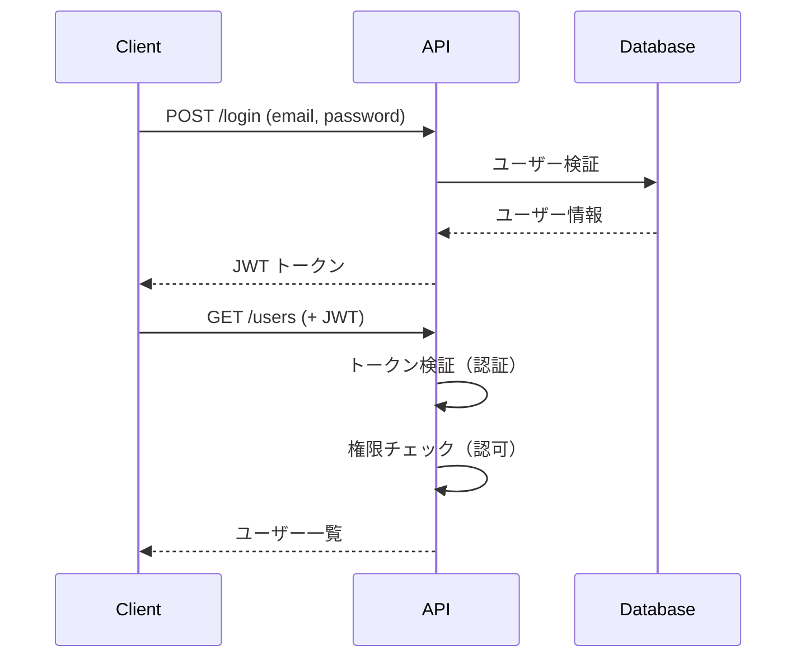

# Phase 3-1: 認証と認可

## 学習目標

この単元を終えると、以下ができるようになります：

- JWT による認証を実装できる
- 認証と認可の違いを説明できる
- ロールベースのアクセス制御ができる

## 概念解説

### 認証 vs 認可

| 概念 | 英語 | 説明 | 例 |
|------|------|------|-----|
| 認証 | Authentication | 「誰か」を確認 | ログイン |
| 認可 | Authorization | 「何ができるか」を確認 | 管理者のみ削除可能 |



## JWT（JSON Web Token）

### 構造

```
eyJhbGciOiJIUzI1NiIsInR5cCI6IkpXVCJ9.  # ヘッダー
eyJzdWIiOiIxMjM0NTY3ODkwIiwibmFtZSI6IkpvaG4ifQ.  # ペイロード
SflKxwRJSMeKKF2QT4fwpMeJf36POk6yJV_adQssw5c  # 署名
```

### ペイロードの例

```json
{
  "sub": "1234567890",      // Subject（ユーザーID）
  "name": "John Doe",
  "role": "admin",
  "iat": 1516239022,        // 発行日時
  "exp": 1516242622         // 有効期限
}
```

## ハンズオン

### 演習1: JWT 認証の実装

```python
# auth.py
from datetime import datetime, timedelta
from typing import Optional
from jose import JWTError, jwt
from passlib.context import CryptContext
from pydantic import BaseModel

# 設定
SECRET_KEY = "your-secret-key"  # 本番では環境変数から
ALGORITHM = "HS256"
ACCESS_TOKEN_EXPIRE_MINUTES = 30

# パスワードハッシュ
pwd_context = CryptContext(schemes=["bcrypt"], deprecated="auto")

# モデル
class Token(BaseModel):
    access_token: str
    token_type: str = "bearer"

class TokenData(BaseModel):
    user_id: Optional[int] = None
    role: Optional[str] = None

class UserInDB(BaseModel):
    id: int
    email: str
    hashed_password: str
    role: str

# ユーティリティ関数
def verify_password(plain_password: str, hashed_password: str) -> bool:
    return pwd_context.verify(plain_password, hashed_password)

def get_password_hash(password: str) -> str:
    return pwd_context.hash(password)

def create_access_token(data: dict, expires_delta: Optional[timedelta] = None) -> str:
    to_encode = data.copy()
    expire = datetime.utcnow() + (expires_delta or timedelta(minutes=15))
    to_encode.update({"exp": expire})
    return jwt.encode(to_encode, SECRET_KEY, algorithm=ALGORITHM)

def decode_token(token: str) -> TokenData:
    try:
        payload = jwt.decode(token, SECRET_KEY, algorithms=[ALGORITHM])
        return TokenData(
            user_id=payload.get("sub"),
            role=payload.get("role")
        )
    except JWTError:
        return None
```

### 演習2: FastAPI での認証

```python
# main.py
from fastapi import FastAPI, Depends, HTTPException, status
from fastapi.security import OAuth2PasswordBearer, OAuth2PasswordRequestForm
from auth import (
    Token, TokenData, UserInDB,
    verify_password, get_password_hash, create_access_token, decode_token,
    ACCESS_TOKEN_EXPIRE_MINUTES
)
from datetime import timedelta
from pydantic import BaseModel, EmailStr

app = FastAPI()

# OAuth2 スキーム
oauth2_scheme = OAuth2PasswordBearer(tokenUrl="token")

# 仮のユーザーDB
fake_users_db = {
    "john@example.com": {
        "id": 1,
        "email": "john@example.com",
        "hashed_password": get_password_hash("password123"),
        "role": "user"
    },
    "admin@example.com": {
        "id": 2,
        "email": "admin@example.com",
        "hashed_password": get_password_hash("adminpass"),
        "role": "admin"
    }
}

# ユーザー取得
def get_user(email: str) -> Optional[UserInDB]:
    if email in fake_users_db:
        return UserInDB(**fake_users_db[email])
    return None

# 認証
def authenticate_user(email: str, password: str) -> Optional[UserInDB]:
    user = get_user(email)
    if not user or not verify_password(password, user.hashed_password):
        return None
    return user

# 現在のユーザー取得
async def get_current_user(token: str = Depends(oauth2_scheme)) -> UserInDB:
    credentials_exception = HTTPException(
        status_code=status.HTTP_401_UNAUTHORIZED,
        detail="Could not validate credentials",
        headers={"WWW-Authenticate": "Bearer"},
    )
    
    token_data = decode_token(token)
    if token_data is None:
        raise credentials_exception
    
    user = get_user_by_id(token_data.user_id)  # 実装が必要
    if user is None:
        raise credentials_exception
    
    return user

# ログインエンドポイント
@app.post("/token", response_model=Token)
async def login(form_data: OAuth2PasswordRequestForm = Depends()):
    user = authenticate_user(form_data.username, form_data.password)
    if not user:
        raise HTTPException(
            status_code=status.HTTP_401_UNAUTHORIZED,
            detail="Incorrect email or password",
            headers={"WWW-Authenticate": "Bearer"},
        )
    
    access_token = create_access_token(
        data={"sub": user.id, "role": user.role},
        expires_delta=timedelta(minutes=ACCESS_TOKEN_EXPIRE_MINUTES)
    )
    return Token(access_token=access_token)

# 保護されたエンドポイント
@app.get("/users/me")
async def get_me(current_user: UserInDB = Depends(get_current_user)):
    return {
        "id": current_user.id,
        "email": current_user.email,
        "role": current_user.role
    }
```

### 演習3: ロールベースのアクセス制御

```python
from functools import wraps
from typing import List

# ロールチェック依存関係
def require_role(allowed_roles: List[str]):
    async def role_checker(current_user: UserInDB = Depends(get_current_user)):
        if current_user.role not in allowed_roles:
            raise HTTPException(
                status_code=status.HTTP_403_FORBIDDEN,
                detail="Insufficient permissions"
            )
        return current_user
    return role_checker

# 管理者のみ
@app.delete("/users/{user_id}")
async def delete_user(
    user_id: int,
    current_user: UserInDB = Depends(require_role(["admin"]))
):
    # 削除処理
    return {"message": "User deleted"}

# 管理者またはモデレーター
@app.put("/posts/{post_id}/moderate")
async def moderate_post(
    post_id: int,
    current_user: UserInDB = Depends(require_role(["admin", "moderator"]))
):
    return {"message": "Post moderated"}
```

### 演習4: リフレッシュトークン

```python
REFRESH_TOKEN_EXPIRE_DAYS = 7

class TokenPair(BaseModel):
    access_token: str
    refresh_token: str
    token_type: str = "bearer"

def create_refresh_token(user_id: int) -> str:
    expire = datetime.utcnow() + timedelta(days=REFRESH_TOKEN_EXPIRE_DAYS)
    return jwt.encode(
        {"sub": user_id, "exp": expire, "type": "refresh"},
        SECRET_KEY,
        algorithm=ALGORITHM
    )

@app.post("/token", response_model=TokenPair)
async def login(form_data: OAuth2PasswordRequestForm = Depends()):
    user = authenticate_user(form_data.username, form_data.password)
    if not user:
        raise HTTPException(status_code=401, detail="Incorrect credentials")
    
    return TokenPair(
        access_token=create_access_token({"sub": user.id, "role": user.role}),
        refresh_token=create_refresh_token(user.id)
    )

@app.post("/token/refresh", response_model=Token)
async def refresh_token(refresh_token: str):
    try:
        payload = jwt.decode(refresh_token, SECRET_KEY, algorithms=[ALGORITHM])
        if payload.get("type") != "refresh":
            raise HTTPException(status_code=401, detail="Invalid token type")
        
        user_id = payload.get("sub")
        user = get_user_by_id(user_id)
        
        return Token(
            access_token=create_access_token({"sub": user.id, "role": user.role})
        )
    except JWTError:
        raise HTTPException(status_code=401, detail="Invalid refresh token")
```

## セキュリティベストプラクティス

| 項目 | 推奨 |
|------|------|
| シークレットキー | 環境変数から取得、十分な長さ |
| トークン有効期限 | アクセス: 15-30分、リフレッシュ: 7日 |
| パスワード | bcrypt でハッシュ化 |
| HTTPS | 本番環境では必須 |
| トークン保存 | HttpOnly Cookie 推奨 |

## 理解度確認

### 問題

JWT の3つのパートのうち、ユーザーIDやロールなどの情報が含まれるのはどれか。

**A.** ヘッダー（Header）

**B.** ペイロード（Payload）

**C.** 署名（Signature）

**D.** フッター（Footer）

---

### 解答・解説

**正解: B**

JWT の構造：
- **ヘッダー**: アルゴリズムとトークンタイプ
- **ペイロード**: ユーザー情報（sub, role, exp など）
- **署名**: 改ざん検証用

---

## 次のステップ

認証と認可を学びました。次は API ドキュメントを学びましょう。

**次の単元**: [Phase 3-2: ドキュメント](./02_ドキュメント.md)
