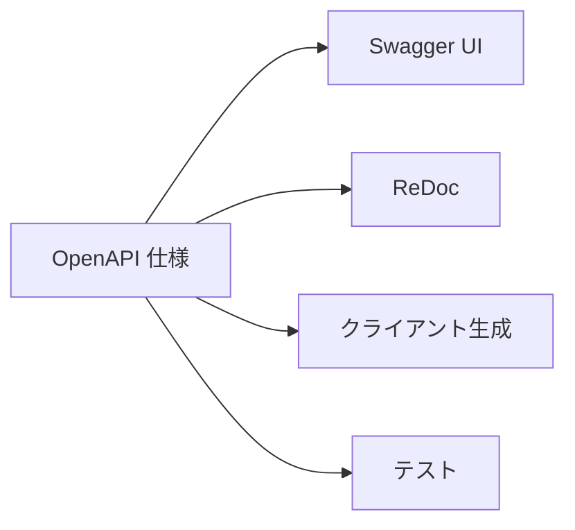

# Phase 3-2: API ドキュメント

## 学習目標

この単元を終えると、以下ができるようになります：

- OpenAPI（Swagger）ドキュメントを作成できる
- FastAPI の自動ドキュメント機能を活用できる
- 良い API ドキュメントを設計できる

## OpenAPI（Swagger）

### 概要



FastAPI は自動で OpenAPI ドキュメントを生成：
- `/docs` - Swagger UI
- `/redoc` - ReDoc
- `/openapi.json` - OpenAPI JSON

## ハンズオン

### 演習1: API メタデータ

```python
from fastapi import FastAPI

app = FastAPI(
    title="My Awesome API",
    description="""
## 概要
このAPIはユーザー管理機能を提供します。

## 認証
Bearer トークンによる認証が必要です。

## レート制限
- 認証済み: 1000リクエスト/時間
- 未認証: 100リクエスト/時間
    """,
    version="1.0.0",
    terms_of_service="https://example.com/terms",
    contact={
        "name": "API Support",
        "url": "https://example.com/support",
        "email": "support@example.com",
    },
    license_info={
        "name": "MIT",
        "url": "https://opensource.org/licenses/MIT",
    },
)
```

### 演習2: タグでグループ化

```python
from fastapi import FastAPI

tags_metadata = [
    {
        "name": "users",
        "description": "ユーザー管理操作",
    },
    {
        "name": "items",
        "description": "アイテム管理操作",
        "externalDocs": {
            "description": "詳細ドキュメント",
            "url": "https://example.com/docs/items",
        },
    },
    {
        "name": "auth",
        "description": "認証関連操作",
    },
]

app = FastAPI(openapi_tags=tags_metadata)

@app.get("/users", tags=["users"])
def list_users():
    """ユーザー一覧を取得"""
    pass

@app.post("/users", tags=["users"])
def create_user():
    """新しいユーザーを作成"""
    pass

@app.post("/token", tags=["auth"])
def login():
    """ログインしてトークンを取得"""
    pass
```

### 演習3: 詳細なエンドポイントドキュメント

```python
from fastapi import FastAPI, Query, Path
from pydantic import BaseModel, Field
from typing import Optional, List

app = FastAPI()

class UserCreate(BaseModel):
    """ユーザー作成リクエスト"""
    name: str = Field(..., example="John Doe", description="ユーザー名")
    email: str = Field(..., example="john@example.com", description="メールアドレス")
    age: Optional[int] = Field(None, ge=0, le=150, example=25, description="年齢")

class UserResponse(BaseModel):
    """ユーザーレスポンス"""
    id: int = Field(..., example=1, description="ユーザーID")
    name: str = Field(..., example="John Doe")
    email: str = Field(..., example="john@example.com")
    
    class Config:
        json_schema_extra = {
            "example": {
                "id": 1,
                "name": "John Doe",
                "email": "john@example.com"
            }
        }

@app.get(
    "/users/{user_id}",
    response_model=UserResponse,
    summary="ユーザー取得",
    description="指定されたIDのユーザー情報を取得します。",
    response_description="ユーザー情報",
    tags=["users"],
    responses={
        200: {
            "description": "成功",
            "content": {
                "application/json": {
                    "example": {"id": 1, "name": "John", "email": "john@example.com"}
                }
            }
        },
        404: {
            "description": "ユーザーが見つかりません",
            "content": {
                "application/json": {
                    "example": {"detail": "User not found"}
                }
            }
        }
    }
)
def get_user(
    user_id: int = Path(..., ge=1, description="ユーザーID", example=1)
):
    """
    ユーザー情報を取得します。
    
    - **user_id**: 取得するユーザーのID
    """
    pass

@app.get(
    "/users",
    response_model=List[UserResponse],
    summary="ユーザー一覧取得",
    tags=["users"]
)
def list_users(
    page: int = Query(1, ge=1, description="ページ番号"),
    limit: int = Query(20, ge=1, le=100, description="1ページあたりの件数"),
    status: Optional[str] = Query(None, description="ステータスフィルタ", enum=["active", "inactive"]),
):
    """
    ユーザー一覧を取得します。
    
    ページネーション対応：
    - **page**: ページ番号（1始まり）
    - **limit**: 1ページあたりの件数（最大100）
    """
    pass
```

### 演習4: レスポンスモデルの使い分け

```python
from pydantic import BaseModel
from typing import List, Optional

# 基本モデル
class UserBase(BaseModel):
    name: str
    email: str

# 作成リクエスト（パスワード含む）
class UserCreate(UserBase):
    password: str

# 更新リクエスト（全てオプショナル）
class UserUpdate(BaseModel):
    name: Optional[str] = None
    email: Optional[str] = None

# レスポンス（パスワードは含まない）
class UserResponse(UserBase):
    id: int
    created_at: datetime
    
    class Config:
        from_attributes = True

# 詳細レスポンス
class UserDetailResponse(UserResponse):
    posts: List["PostResponse"]
    followers_count: int

# 一覧レスポンス
class UserListResponse(BaseModel):
    data: List[UserResponse]
    meta: PaginationMeta
```

### 演習5: 認証スキームのドキュメント

```python
from fastapi import FastAPI, Security
from fastapi.security import OAuth2PasswordBearer, APIKeyHeader

app = FastAPI()

# Bearer トークン
oauth2_scheme = OAuth2PasswordBearer(
    tokenUrl="token",
    description="OAuth2 パスワードフローによる認証"
)

# API キー
api_key_header = APIKeyHeader(
    name="X-API-Key",
    description="API キーによる認証"
)

@app.get("/protected")
def protected_route(token: str = Security(oauth2_scheme)):
    """認証が必要なエンドポイント"""
    pass
```

### 演習6: カスタム OpenAPI スキーマ

```python
from fastapi import FastAPI
from fastapi.openapi.utils import get_openapi

app = FastAPI()

def custom_openapi():
    if app.openapi_schema:
        return app.openapi_schema
    
    openapi_schema = get_openapi(
        title="My API",
        version="1.0.0",
        description="Custom OpenAPI schema",
        routes=app.routes,
    )
    
    # カスタマイズ
    openapi_schema["info"]["x-logo"] = {
        "url": "https://example.com/logo.png"
    }
    
    # セキュリティ要件を追加
    openapi_schema["security"] = [{"bearerAuth": []}]
    
    app.openapi_schema = openapi_schema
    return app.openapi_schema

app.openapi = custom_openapi
```

## ドキュメントのベストプラクティス

| 項目 | 推奨 |
|------|------|
| 説明 | 各エンドポイントに明確な説明 |
| 例 | リクエスト/レスポンスの具体例 |
| エラー | 想定されるエラーコードと説明 |
| 認証 | 認証方法の明記 |
| バージョン | APIバージョンの明記 |

## 理解度確認

### 問題

FastAPI で自動生成される Swagger UI にアクセスするためのデフォルトパスはどれか。

**A.** `/swagger`

**B.** `/docs`

**C.** `/api-docs`

**D.** `/openapi`

---

### 解答・解説

**正解: B**

FastAPI のデフォルトドキュメント：
- `/docs` - Swagger UI
- `/redoc` - ReDoc
- `/openapi.json` - OpenAPI JSON スキーマ

---

## 次のステップ

API ドキュメントを学びました。次は GraphQL を学びましょう。

**次の単元**: [Phase 4-1: GraphQL 入門](../phase4/01_GraphQL入門.md)
