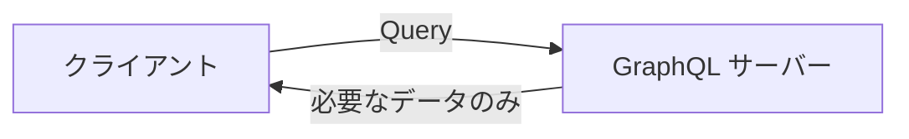

# Phase 4-1: GraphQL 入門

## 学習目標

この単元を終えると、以下ができるようになります：

- GraphQL の基本概念を説明できる
- Query / Mutation / Subscription を理解できる
- REST との使い分けができる

## 概念解説

### GraphQL とは



**GraphQL** = Facebook が開発したクエリ言語・ランタイム

### REST の課題と GraphQL の解決

| 課題 | REST | GraphQL |
|------|------|---------|
| オーバーフェッチ | 不要なフィールドも返す | 必要なフィールドのみ指定 |
| アンダーフェッチ | 複数リクエスト必要 | 1リクエストで取得 |
| バージョニング | /v1, /v2 が必要 | スキーマ進化 |
| ドキュメント | 別途作成 | スキーマがドキュメント |

### 例: ユーザーと投稿の取得

```
# REST: 2リクエスト必要
GET /users/1
GET /users/1/posts

# GraphQL: 1リクエスト
query {
  user(id: 1) {
    name
    email
    posts {
      title
      createdAt
    }
  }
}
```

## 基本構文

### Query（読み取り）

```graphql
# 基本的なクエリ
query {
  users {
    id
    name
  }
}

# 引数付き
query {
  user(id: 1) {
    name
    email
  }
}

# エイリアス
query {
  activeUsers: users(status: "active") {
    name
  }
  inactiveUsers: users(status: "inactive") {
    name
  }
}

# フラグメント
fragment UserFields on User {
  id
  name
  email
}

query {
  user(id: 1) {
    ...UserFields
    posts {
      title
    }
  }
}

# 変数
query GetUser($id: ID!) {
  user(id: $id) {
    name
    email
  }
}
# 変数: {"id": 1}
```

### Mutation（書き込み）

```graphql
mutation {
  createUser(input: {
    name: "John"
    email: "john@example.com"
  }) {
    id
    name
  }
}

mutation UpdateUser($id: ID!, $input: UserInput!) {
  updateUser(id: $id, input: $input) {
    id
    name
    updatedAt
  }
}
```

### Subscription（リアルタイム）

```graphql
subscription {
  messageAdded(roomId: "123") {
    id
    content
    createdAt
    author {
      name
    }
  }
}
```

## スキーマ定義

### 型システム

```graphql
# スカラー型
type User {
  id: ID!           # 非null
  name: String!
  age: Int
  score: Float
  isActive: Boolean!
  createdAt: DateTime
}

# オブジェクト型
type Post {
  id: ID!
  title: String!
  content: String
  author: User!     # リレーション
  comments: [Comment!]!
}

# 入力型（Mutation用）
input CreateUserInput {
  name: String!
  email: String!
  password: String!
}

# 列挙型
enum Status {
  ACTIVE
  INACTIVE
  PENDING
}

# インターフェース
interface Node {
  id: ID!
}

type User implements Node {
  id: ID!
  name: String!
}

# Union型
union SearchResult = User | Post | Comment
```

### クエリとミューテーション定義

```graphql
type Query {
  user(id: ID!): User
  users(page: Int, limit: Int): UserConnection!
  searchUsers(query: String!): [User!]!
}

type Mutation {
  createUser(input: CreateUserInput!): User!
  updateUser(id: ID!, input: UpdateUserInput!): User!
  deleteUser(id: ID!): Boolean!
}

type Subscription {
  userCreated: User!
  postAdded(userId: ID!): Post!
}
```

### ページネーション（Relay スタイル）

```graphql
type UserConnection {
  edges: [UserEdge!]!
  pageInfo: PageInfo!
  totalCount: Int!
}

type UserEdge {
  node: User!
  cursor: String!
}

type PageInfo {
  hasNextPage: Boolean!
  hasPreviousPage: Boolean!
  startCursor: String
  endCursor: String
}

# クエリ
query {
  users(first: 10, after: "cursor123") {
    edges {
      node {
        id
        name
      }
      cursor
    }
    pageInfo {
      hasNextPage
      endCursor
    }
  }
}
```

## REST vs GraphQL の選択基準

| GraphQL が向いている | REST が向いている |
|---------------------|------------------|
| 複雑なデータ要件 | シンプルな CRUD |
| モバイルアプリ | キャッシュ重視 |
| 多様なクライアント | ファイルアップロード |
| 頻繁な要件変更 | シンプルなAPI |

## 理解度確認

### 問題

GraphQL でデータの更新（作成、更新、削除）を行う際に使用するのはどれか。

**A.** Query

**B.** Mutation

**C.** Subscription

**D.** Update

---

### 解答・解説

**正解: B**

GraphQL の操作タイプ：
- **Query**: データの読み取り（GET相当）
- **Mutation**: データの変更（POST/PUT/DELETE相当）
- **Subscription**: リアルタイム更新

---

## 次のステップ

GraphQL の概念を学びました。次は Python で実装しましょう。

**次の単元**: [Phase 4-2: GraphQL 実装](./02_GraphQL実装.md)
