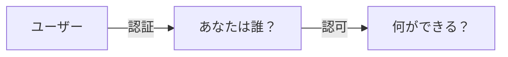
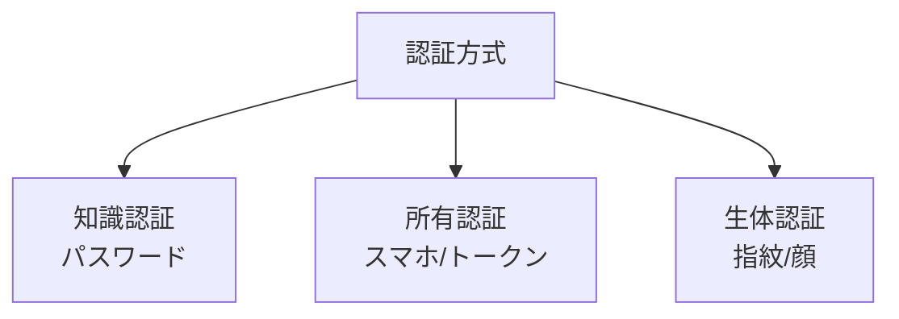
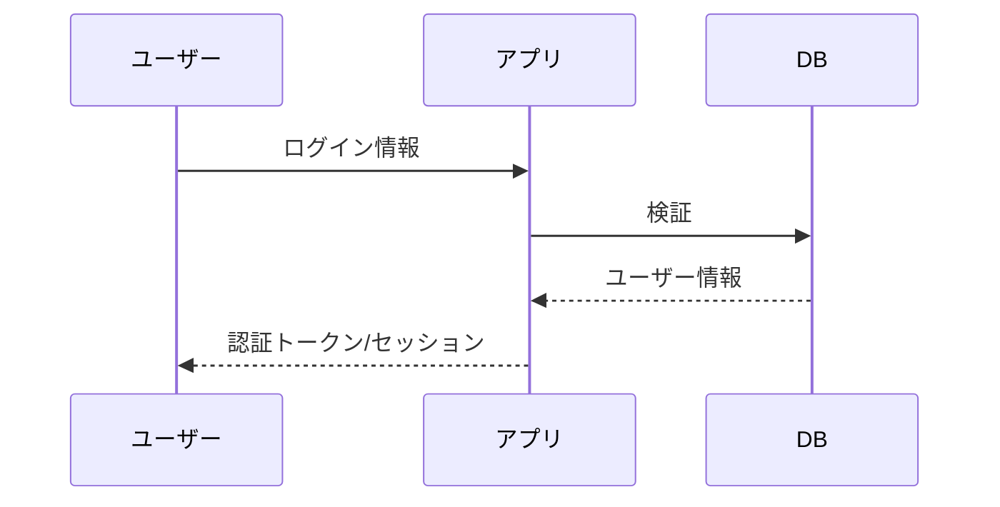

# Phase 1-1: 認証・認可とは

## 学習目標

この単元を終えると、以下ができるようになります：

- 認証（Authentication）と認可（Authorization）の違いを説明できる
- 主要な認証方式を理解できる
- セキュリティの基本概念を理解できる

## 概念解説

### 認証 vs 認可



| 項目 | 認証 (AuthN) | 認可 (AuthZ) |
|------|-------------|-------------|
| 英語 | Authentication | Authorization |
| 質問 | あなたは誰？ | 何ができる？ |
| 例 | ログイン | アクセス権限 |
| 確認 | ID/パスワード | ロール/権限 |

### AWS での比較

```
AWS でいうと：
- 認証: IAM ユーザーでログイン
- 認可: IAM ポリシーでアクセス制御
```

### 主要な認証方式



| 方式 | 例 | 強度 |
|------|-----|------|
| 知識 | パスワード、PIN | 低〜中 |
| 所有 | スマホ、セキュリティキー | 中〜高 |
| 生体 | 指紋、顔認証 | 高 |
| 多要素 | 上記の組み合わせ | 最高 |

## Web アプリケーションの認証

### 認証の流れ



### 認証方式の比較

| 方式 | 特徴 | 用途 |
|------|------|------|
| セッション | サーバー側で状態管理 | 従来の Web アプリ |
| トークン (JWT) | クライアント側で保持 | SPA、API |
| OAuth 2.0 | 第三者認証 | ソーシャルログイン |

## 基本用語

| 用語 | 説明 |
|------|------|
| クレデンシャル | 認証情報（ID/パスワード等） |
| プリンシパル | 認証された主体（ユーザー） |
| セッション | サーバー側の認証状態 |
| トークン | 認証の証明 |
| MFA | 多要素認証 |

## ハンズオン

### 演習1: 認証フローの整理

以下のシナリオで、認証と認可を区別してください：

```
1. ユーザーが ID とパスワードでログイン → ???
2. ログイン後、管理画面にアクセス可能か確認 → ???
3. SMS で送られたコードを入力 → ???
4. 一般ユーザーが管理者機能を使おうとして拒否 → ???
```

**答え:**
1. 認証
2. 認可
3. 認証（MFA）
4. 認可

### 演習2: 認証方式の選択

以下の要件に適した認証方式を選んでください：

```
A. 社内 Web アプリ（従来型）
B. モバイルアプリ向け API
C. Google でログインしたい
D. 銀行システム
```

**答え:**
- A: セッション認証
- B: JWT トークン認証
- C: OAuth 2.0 / OIDC
- D: 多要素認証（MFA）

## 理解度確認

### 問題

「ログイン後、ユーザーが管理者ページにアクセスできるか確認する」処理はどれか。

**A.** 認証

**B.** 認可

**C.** 多要素認証

**D.** シングルサインオン

---

### 解答・解説

**正解: B**

認証 = 誰か確認
認可 = 何ができるか確認

管理者ページへのアクセス可否は「権限の確認」なので認可です。

---

## 次のステップ

認証・認可の概念を学びました。次はパスワード認証を学びましょう。

**次の単元**: [Phase 1-2: パスワード認証](./02_パスワード認証.md)
