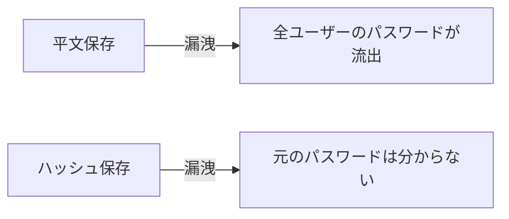
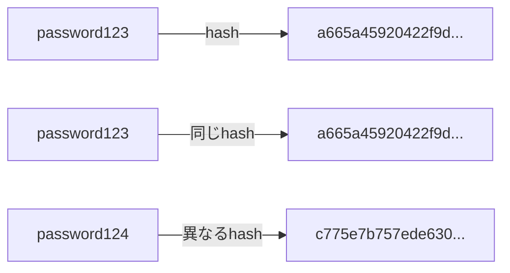

# Phase 1-2: パスワード認証

## 学習目標

この単元を終えると、以下ができるようになります：

- 安全なパスワード保存を実装できる
- パスワードハッシュ化の仕組みを理解できる
- 一般的な攻撃と対策を知る

## なぜハッシュ化が必要？



| 保存方法 | 危険度 | 説明 |
|---------|--------|------|
| 平文 | 最悪 | 絶対NG |
| 暗号化 | 危険 | 鍵が漏れたら終わり |
| ハッシュ | 安全 | 元に戻せない |
| ハッシュ+ソルト | より安全 | レインボーテーブル対策 |

## ハッシュ化の仕組み



### 主要なハッシュアルゴリズム

| アルゴリズム | 用途 | 推奨 |
|------------|------|------|
| MD5 | レガシー | ❌ 使用禁止 |
| SHA-256 | 一般的なハッシュ | △ パスワードには不向き |
| bcrypt | パスワード専用 | ✅ 推奨 |
| Argon2 | 最新のパスワードハッシュ | ✅ 最も推奨 |

## ハンズオン

### 演習1: bcrypt でパスワードハッシュ

```bash
pip install bcrypt
```

```python
# password_hash.py
import bcrypt

def hash_password(password: str) -> str:
    """パスワードをハッシュ化"""
    salt = bcrypt.gensalt(rounds=12)  # コスト係数12
    hashed = bcrypt.hashpw(password.encode('utf-8'), salt)
    return hashed.decode('utf-8')

def verify_password(password: str, hashed: str) -> bool:
    """パスワードを検証"""
    return bcrypt.checkpw(
        password.encode('utf-8'),
        hashed.encode('utf-8')
    )

# 使用例
password = 'my_secure_password'

# ハッシュ化
hashed = hash_password(password)
print(f'Hashed: {hashed}')
# $2b$12$... のような形式

# 検証
print(verify_password('my_secure_password', hashed))  # True
print(verify_password('wrong_password', hashed))       # False
```

### 演習2: Argon2 でパスワードハッシュ

```bash
pip install argon2-cffi
```

```python
# argon2_hash.py
from argon2 import PasswordHasher
from argon2.exceptions import VerifyMismatchError

ph = PasswordHasher(
    time_cost=2,        # イテレーション回数
    memory_cost=65536,  # メモリ使用量 (KB)
    parallelism=1       # 並列度
)

def hash_password(password: str) -> str:
    return ph.hash(password)

def verify_password(password: str, hashed: str) -> bool:
    try:
        ph.verify(hashed, password)
        return True
    except VerifyMismatchError:
        return False

# 使用例
hashed = hash_password('my_secure_password')
print(f'Hashed: {hashed}')

print(verify_password('my_secure_password', hashed))  # True
```

### 演習3: ユーザー認証システム

```python
# auth_system.py
from argon2 import PasswordHasher
from argon2.exceptions import VerifyMismatchError
from dataclasses import dataclass
from typing import Optional

ph = PasswordHasher()

@dataclass
class User:
    id: int
    email: str
    password_hash: str
    is_active: bool = True

# 簡易データベース
users_db: dict[str, User] = {}

def register(email: str, password: str) -> User:
    """ユーザー登録"""
    if email in users_db:
        raise ValueError('Email already exists')
    
    # パスワード強度チェック
    if len(password) < 8:
        raise ValueError('Password must be at least 8 characters')
    
    user = User(
        id=len(users_db) + 1,
        email=email,
        password_hash=ph.hash(password)
    )
    users_db[email] = user
    return user

def authenticate(email: str, password: str) -> Optional[User]:
    """ユーザー認証"""
    user = users_db.get(email)
    if not user:
        return None
    
    if not user.is_active:
        return None
    
    try:
        ph.verify(user.password_hash, password)
        
        # リハッシュが必要か確認
        if ph.check_needs_rehash(user.password_hash):
            user.password_hash = ph.hash(password)
        
        return user
    except VerifyMismatchError:
        return None

# 使用例
user = register('alice@example.com', 'password123')
print(f'Registered: {user.email}')

auth_user = authenticate('alice@example.com', 'password123')
if auth_user:
    print(f'Authenticated: {auth_user.email}')
else:
    print('Authentication failed')
```

### 演習4: パスワードポリシー

```python
# password_policy.py
import re
from dataclasses import dataclass

@dataclass
class PasswordPolicy:
    min_length: int = 8
    require_uppercase: bool = True
    require_lowercase: bool = True
    require_digit: bool = True
    require_special: bool = True

def validate_password(password: str, policy: PasswordPolicy = None) -> tuple[bool, list[str]]:
    """パスワードポリシーを検証"""
    policy = policy or PasswordPolicy()
    errors = []
    
    if len(password) < policy.min_length:
        errors.append(f'Password must be at least {policy.min_length} characters')
    
    if policy.require_uppercase and not re.search(r'[A-Z]', password):
        errors.append('Password must contain uppercase letter')
    
    if policy.require_lowercase and not re.search(r'[a-z]', password):
        errors.append('Password must contain lowercase letter')
    
    if policy.require_digit and not re.search(r'\d', password):
        errors.append('Password must contain digit')
    
    if policy.require_special and not re.search(r'[!@#$%^&*(),.?":{}|<>]', password):
        errors.append('Password must contain special character')
    
    return len(errors) == 0, errors

# 使用例
is_valid, errors = validate_password('Password123!')
print(f'Valid: {is_valid}')  # True

is_valid, errors = validate_password('password')
print(f'Errors: {errors}')
```

## 一般的な攻撃と対策

| 攻撃 | 説明 | 対策 |
|------|------|------|
| ブルートフォース | 全パターン試行 | レート制限、ロックアウト |
| 辞書攻撃 | 一般的なパスワード試行 | 強力なパスワードポリシー |
| レインボーテーブル | 事前計算ハッシュ | ソルト（bcrypt/argon2に内蔵） |
| パスワードリスト | 漏洩パスワードの再利用 | Have I Been Pwned API |

## 理解度確認

### 問題

パスワード保存に最も適したアルゴリズムはどれか。

**A.** MD5

**B.** SHA-256

**C.** AES

**D.** bcrypt

---

### 解答・解説

**正解: D**

bcrypt（または Argon2）はパスワード専用に設計されており：
- ソルトが自動付与
- コスト係数で計算量を調整可能
- 意図的に遅い（ブルートフォース対策）

---

## 次のステップ

パスワード認証を学びました。次はセッション認証を学びましょう。

**次の単元**: [Phase 2-1: セッション認証](../phase2/01_セッション認証.md)
