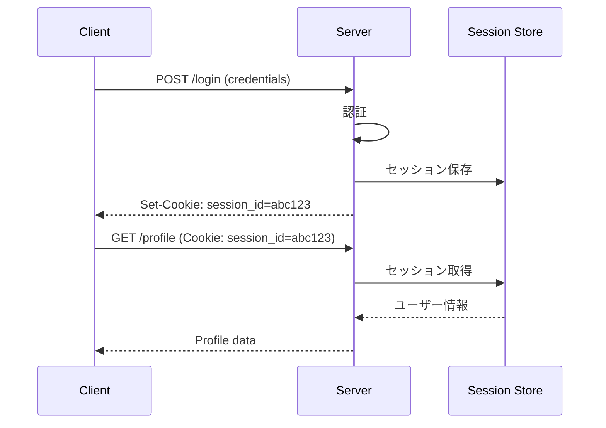

# Phase 2-1: セッション認証

## 学習目標

この単元を終えると、以下ができるようになります：

- セッション認証の仕組みを理解できる
- Cookie の設定を適切に行える
- セッション管理を実装できる

## セッション認証の仕組み



## Cookie の設定

| 属性 | 説明 | 推奨値 |
|------|------|--------|
| HttpOnly | JS からアクセス不可 | true |
| Secure | HTTPS のみ | true (本番) |
| SameSite | CSRF 対策 | Lax or Strict |
| Max-Age | 有効期限 | 適切な値 |
| Path | 適用パス | / |

## ハンズオン

### 演習1: Flask でセッション認証

```bash
pip install flask
```

```python
# app.py
from flask import Flask, session, request, jsonify
from functools import wraps

app = Flask(__name__)
app.secret_key = 'your-secret-key'  # 本番では安全な値

# 簡易ユーザーDB
users = {
    'alice': {'password': 'password123', 'role': 'admin'},
    'bob': {'password': 'password456', 'role': 'user'},
}

def login_required(f):
    @wraps(f)
    def decorated(*args, **kwargs):
        if 'user' not in session:
            return jsonify({'error': 'Unauthorized'}), 401
        return f(*args, **kwargs)
    return decorated

@app.route('/login', methods=['POST'])
def login():
    data = request.json
    username = data.get('username')
    password = data.get('password')
    
    user = users.get(username)
    if user and user['password'] == password:
        session['user'] = username
        session['role'] = user['role']
        return jsonify({'message': 'Logged in', 'user': username})
    
    return jsonify({'error': 'Invalid credentials'}), 401

@app.route('/logout', methods=['POST'])
def logout():
    session.clear()
    return jsonify({'message': 'Logged out'})

@app.route('/profile')
@login_required
def profile():
    return jsonify({
        'user': session['user'],
        'role': session['role']
    })

if __name__ == '__main__':
    app.run(debug=True)
```

### 演習2: FastAPI でセッション認証

```bash
pip install fastapi uvicorn python-multipart itsdangerous
```

```python
# main.py
from fastapi import FastAPI, Request, Response, HTTPException, Depends
from fastapi.responses import JSONResponse
from pydantic import BaseModel
from itsdangerous import URLSafeTimedSerializer
import secrets

app = FastAPI()

SECRET_KEY = secrets.token_hex(32)
serializer = URLSafeTimedSerializer(SECRET_KEY)

# セッションストア（本番では Redis）
sessions = {}

class LoginRequest(BaseModel):
    username: str
    password: str

# ユーザーDB
users = {
    'alice': {'password': 'password123', 'role': 'admin'},
    'bob': {'password': 'password456', 'role': 'user'},
}

def get_session(request: Request) -> dict:
    session_id = request.cookies.get('session_id')
    if not session_id:
        return None
    
    try:
        # 署名を検証（1時間有効）
        data = serializer.loads(session_id, max_age=3600)
        return sessions.get(data)
    except:
        return None

def get_current_user(request: Request) -> dict:
    session = get_session(request)
    if not session:
        raise HTTPException(status_code=401, detail='Not authenticated')
    return session

@app.post('/login')
async def login(request: LoginRequest, response: Response):
    user = users.get(request.username)
    if not user or user['password'] != request.password:
        raise HTTPException(status_code=401, detail='Invalid credentials')
    
    # セッション作成
    session_data = {'user': request.username, 'role': user['role']}
    session_key = secrets.token_urlsafe(32)
    sessions[session_key] = session_data
    
    # 署名付き Cookie
    signed_session = serializer.dumps(session_key)
    response.set_cookie(
        key='session_id',
        value=signed_session,
        httponly=True,
        secure=False,  # 本番では True
        samesite='lax',
        max_age=3600
    )
    
    return {'message': 'Logged in', 'user': request.username}

@app.post('/logout')
async def logout(request: Request, response: Response):
    session_id = request.cookies.get('session_id')
    if session_id:
        try:
            data = serializer.loads(session_id, max_age=3600)
            sessions.pop(data, None)
        except:
            pass
    
    response.delete_cookie('session_id')
    return {'message': 'Logged out'}

@app.get('/profile')
async def profile(user: dict = Depends(get_current_user)):
    return {'user': user['user'], 'role': user['role']}
```

### 演習3: Redis でセッション管理

```python
# redis_session.py
import redis
import json
import secrets
from datetime import datetime

class RedisSessionStore:
    def __init__(self, redis_url='redis://localhost:6379', prefix='session', ttl=3600):
        self.r = redis.from_url(redis_url, decode_responses=True)
        self.prefix = prefix
        self.ttl = ttl
    
    def create(self, user_data: dict) -> str:
        session_id = secrets.token_urlsafe(32)
        key = f'{self.prefix}:{session_id}'
        
        data = {
            **user_data,
            'created_at': datetime.now().isoformat()
        }
        
        self.r.setex(key, self.ttl, json.dumps(data))
        return session_id
    
    def get(self, session_id: str) -> dict:
        key = f'{self.prefix}:{session_id}'
        data = self.r.get(key)
        
        if data:
            # TTL を延長（スライディング）
            self.r.expire(key, self.ttl)
            return json.loads(data)
        return None
    
    def delete(self, session_id: str):
        key = f'{self.prefix}:{session_id}'
        self.r.delete(key)
    
    def update(self, session_id: str, user_data: dict):
        key = f'{self.prefix}:{session_id}'
        current = self.get(session_id)
        if current:
            data = {**current, **user_data}
            self.r.setex(key, self.ttl, json.dumps(data))
```

## セッションのセキュリティ

| 脅威 | 対策 |
|------|------|
| セッション固定 | ログイン時に ID 再生成 |
| セッションハイジャック | HTTPS、HttpOnly Cookie |
| CSRF | SameSite Cookie、CSRF トークン |
| XSS | HttpOnly Cookie |

## 理解度確認

### 問題

Cookie の HttpOnly 属性の役割はどれか。

**A.** HTTPS のみで送信

**B.** JavaScript からアクセス不可

**C.** 同一サイトのみで送信

**D.** 有効期限を設定

---

### 解答・解説

**正解: B**

HttpOnly を設定すると、JavaScript から `document.cookie` でアクセスできなくなります。XSS 攻撃によるセッション ID の窃取を防ぎます。

---

## 次のステップ

セッション認証を学びました。次は JWT を学びましょう。

**次の単元**: [Phase 2-2: JWT 入門](./02_JWT入門.md)
