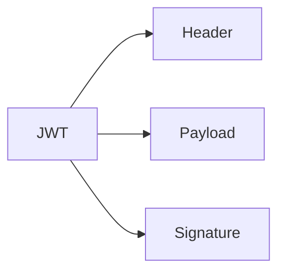

# Phase 2-2: JWT 入門

## 学習目標

この単元を終えると、以下ができるようになります：

- JWT の構造を理解できる
- JWT を生成・検証できる
- JWT とセッションの違いを説明できる

## JWT とは



**JWT** = JSON Web Token

### 構造

```
eyJhbGciOiJIUzI1NiIsInR5cCI6IkpXVCJ9.
eyJzdWIiOiIxMjM0NTY3ODkwIiwibmFtZSI6IkpvaG4gRG9lIiwiaWF0IjoxNTE2MjM5MDIyfQ.
SflKxwRJSMeKKF2QT4fwpMeJf36POk6yJV_adQssw5c
```

| 部分 | 内容 | エンコード |
|------|------|-----------|
| Header | アルゴリズム、タイプ | Base64URL |
| Payload | ユーザー情報（クレーム） | Base64URL |
| Signature | 署名 | Base64URL |

### セッションとの比較

| 項目 | セッション | JWT |
|------|-----------|-----|
| 状態 | サーバー側 | クライアント側 |
| スケーラビリティ | △ 共有必要 | ◎ ステートレス |
| 無効化 | 容易 | 困難 |
| サイズ | 小 | 大 |

## ハンズオン

### 演習1: JWT の基本

```bash
pip install pyjwt
```

```python
# jwt_basic.py
import jwt
from datetime import datetime, timedelta

SECRET_KEY = 'your-secret-key'
ALGORITHM = 'HS256'

# トークン生成
def create_token(user_id: int, username: str) -> str:
    payload = {
        'sub': str(user_id),      # Subject（ユーザーID）
        'name': username,
        'iat': datetime.utcnow(), # Issued At
        'exp': datetime.utcnow() + timedelta(hours=1)  # Expiration
    }
    return jwt.encode(payload, SECRET_KEY, algorithm=ALGORITHM)

# トークン検証
def verify_token(token: str) -> dict:
    try:
        payload = jwt.decode(token, SECRET_KEY, algorithms=[ALGORITHM])
        return payload
    except jwt.ExpiredSignatureError:
        raise ValueError('Token has expired')
    except jwt.InvalidTokenError:
        raise ValueError('Invalid token')

# 使用例
token = create_token(1, 'alice')
print(f'Token: {token}')

# デコード
payload = verify_token(token)
print(f'Payload: {payload}')
```

### 演習2: JWT の内容を見る

```python
# jwt_decode.py
import jwt
import base64
import json

def decode_jwt_parts(token: str):
    """JWT を分解して表示（検証なし）"""
    parts = token.split('.')
    
    # Header
    header = base64.urlsafe_b64decode(parts[0] + '==')
    print(f'Header: {json.loads(header)}')
    
    # Payload
    payload = base64.urlsafe_b64decode(parts[1] + '==')
    print(f'Payload: {json.loads(payload)}')
    
    # Signature は Base64 のまま
    print(f'Signature: {parts[2][:20]}...')

token = create_token(1, 'alice')
decode_jwt_parts(token)
```

### 演習3: FastAPI で JWT 認証

```python
# jwt_auth.py
from fastapi import FastAPI, HTTPException, Depends
from fastapi.security import HTTPBearer, HTTPAuthorizationCredentials
from pydantic import BaseModel
import jwt
from datetime import datetime, timedelta

app = FastAPI()
security = HTTPBearer()

SECRET_KEY = 'your-secret-key'
ALGORITHM = 'HS256'

class LoginRequest(BaseModel):
    username: str
    password: str

class TokenResponse(BaseModel):
    access_token: str
    token_type: str = 'bearer'

# ユーザーDB
users = {
    'alice': {'password': 'password123', 'role': 'admin'},
}

def create_access_token(data: dict, expires_delta: timedelta = None) -> str:
    to_encode = data.copy()
    expire = datetime.utcnow() + (expires_delta or timedelta(hours=1))
    to_encode.update({'exp': expire, 'iat': datetime.utcnow()})
    return jwt.encode(to_encode, SECRET_KEY, algorithm=ALGORITHM)

def get_current_user(credentials: HTTPAuthorizationCredentials = Depends(security)):
    token = credentials.credentials
    try:
        payload = jwt.decode(token, SECRET_KEY, algorithms=[ALGORITHM])
        username = payload.get('sub')
        if username is None:
            raise HTTPException(status_code=401, detail='Invalid token')
        return {'username': username, 'role': payload.get('role')}
    except jwt.ExpiredSignatureError:
        raise HTTPException(status_code=401, detail='Token expired')
    except jwt.InvalidTokenError:
        raise HTTPException(status_code=401, detail='Invalid token')

@app.post('/login', response_model=TokenResponse)
async def login(request: LoginRequest):
    user = users.get(request.username)
    if not user or user['password'] != request.password:
        raise HTTPException(status_code=401, detail='Invalid credentials')
    
    access_token = create_access_token({
        'sub': request.username,
        'role': user['role']
    })
    
    return TokenResponse(access_token=access_token)

@app.get('/profile')
async def profile(user: dict = Depends(get_current_user)):
    return user

@app.get('/admin')
async def admin(user: dict = Depends(get_current_user)):
    if user['role'] != 'admin':
        raise HTTPException(status_code=403, detail='Admin only')
    return {'message': 'Admin area', 'user': user}
```

### 演習4: リフレッシュトークン

```python
# refresh_token.py
from datetime import datetime, timedelta
import jwt
import secrets

SECRET_KEY = 'your-secret-key'
REFRESH_SECRET_KEY = 'refresh-secret-key'

# リフレッシュトークンの保存（本番では Redis）
refresh_tokens = {}

def create_tokens(user_id: str) -> dict:
    """アクセストークンとリフレッシュトークンを生成"""
    # アクセストークン（短時間）
    access_token = jwt.encode({
        'sub': user_id,
        'exp': datetime.utcnow() + timedelta(minutes=15),
        'type': 'access'
    }, SECRET_KEY, algorithm='HS256')
    
    # リフレッシュトークン（長時間）
    refresh_token = jwt.encode({
        'sub': user_id,
        'exp': datetime.utcnow() + timedelta(days=7),
        'jti': secrets.token_urlsafe(32),  # 一意ID
        'type': 'refresh'
    }, REFRESH_SECRET_KEY, algorithm='HS256')
    
    # リフレッシュトークンを保存
    refresh_tokens[user_id] = refresh_token
    
    return {
        'access_token': access_token,
        'refresh_token': refresh_token,
        'expires_in': 900  # 15分
    }

def refresh_access_token(refresh_token: str) -> str:
    """リフレッシュトークンで新しいアクセストークンを取得"""
    try:
        payload = jwt.decode(refresh_token, REFRESH_SECRET_KEY, algorithms=['HS256'])
        
        if payload.get('type') != 'refresh':
            raise ValueError('Invalid token type')
        
        user_id = payload['sub']
        
        # 保存されているトークンと一致するか確認
        if refresh_tokens.get(user_id) != refresh_token:
            raise ValueError('Token has been revoked')
        
        # 新しいアクセストークンを発行
        access_token = jwt.encode({
            'sub': user_id,
            'exp': datetime.utcnow() + timedelta(minutes=15),
            'type': 'access'
        }, SECRET_KEY, algorithm='HS256')
        
        return access_token
        
    except jwt.ExpiredSignatureError:
        raise ValueError('Refresh token expired')
    except jwt.InvalidTokenError:
        raise ValueError('Invalid refresh token')

def revoke_refresh_token(user_id: str):
    """リフレッシュトークンを無効化"""
    refresh_tokens.pop(user_id, None)
```

## JWT のベストプラクティス

| ✅ やること | ❌ やらないこと |
|------------|---------------|
| 短い有効期限（15分） | 長い有効期限 |
| HTTPS で送信 | HTTP で送信 |
| ペイロードは最小限 | 機密情報を含める |
| リフレッシュトークン併用 | アクセストークンのみ |
| 署名を検証 | デコードのみ |

## 理解度確認

### 問題

JWT の特徴として正しいものはどれか。

**A.** サーバー側で状態を管理する

**B.** トークンの無効化が容易

**C.** ステートレスでスケーラブル

**D.** サイズが小さい

---

### 解答・解説

**正解: C**

JWT はクライアント側でトークンを保持するためステートレスです。サーバーは状態を持たないためスケールしやすいです。

---

## 次のステップ

JWT 入門を学びました。次は OAuth 2.0 を学びましょう。

**次の単元**: [Phase 3-1: OAuth 2.0 基礎](../phase3/01_OAuth2.0基礎.md)
