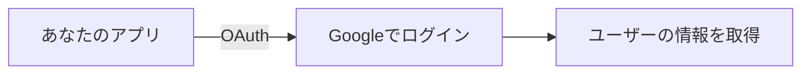
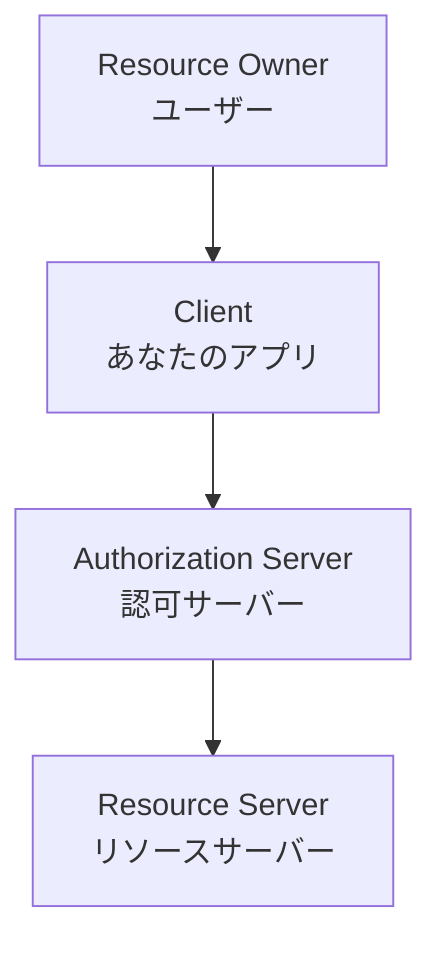
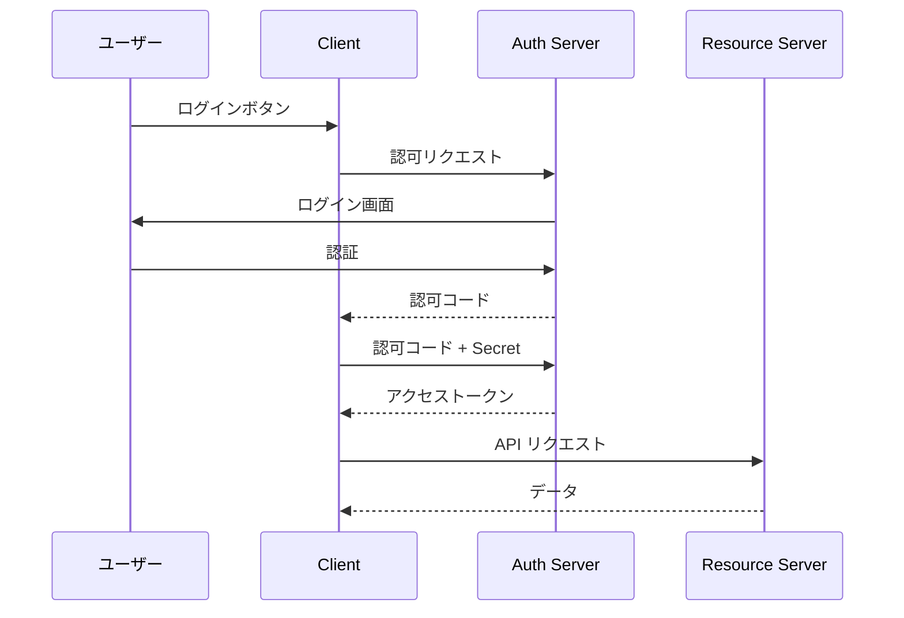
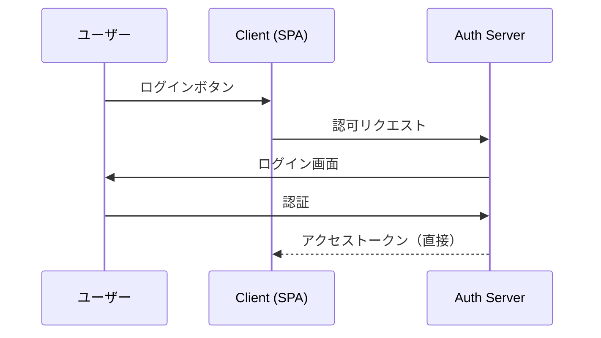
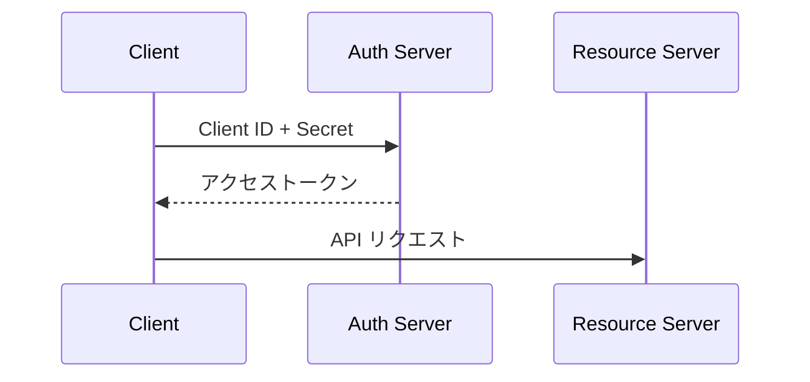
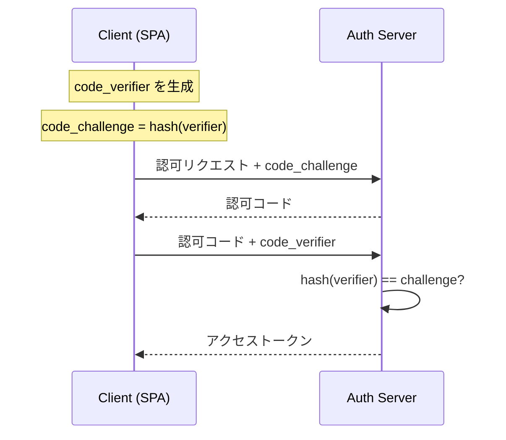

# Phase 3-1: OAuth 2.0 基礎

## 学習目標

この単元を終えると、以下ができるようになります：

- OAuth 2.0 の概念を理解できる
- 主要なフローを説明できる
- OAuth の登場人物を理解できる

## OAuth 2.0 とは



**OAuth 2.0** = 認可のためのプロトコル

### なぜ OAuth？

| 従来の方法 | 問題点 |
|-----------|--------|
| パスワード共有 | 危険、全権限 |
| 専用アカウント作成 | ユーザー体験悪い |
| **OAuth** | 安全、限定的な権限 |

## OAuth 2.0 の登場人物



| 役割 | 説明 | 例 |
|------|------|-----|
| Resource Owner | リソースの所有者 | ユーザー |
| Client | リソースにアクセスしたいアプリ | あなたのアプリ |
| Authorization Server | 認可を行うサーバー | Google Auth |
| Resource Server | リソースを持つサーバー | Google API |

## OAuth 2.0 のフロー

### 1. Authorization Code Flow（最も安全）



**用途**: サーバーサイドアプリ

### 2. Implicit Flow（非推奨）



**用途**: SPA（現在は PKCE を使う）

### 3. Client Credentials Flow



**用途**: サーバー間通信（ユーザーなし）

### 4. Authorization Code + PKCE



**用途**: SPA、モバイルアプリ（推奨）

## スコープ

```
scope=openid profile email
```

| スコープ | 取得できる情報 |
|---------|--------------|
| openid | ユーザー ID |
| profile | 名前、アバター等 |
| email | メールアドレス |

## ハンズオン

### 演習1: 用語の整理

以下のシナリオで登場人物を特定してください：

```
あなたが作った Todo アプリで、
Google カレンダーの予定を表示したい。
ユーザーは Google アカウントでログイン。
```

**答え:**
- Resource Owner: ユーザー（あなた）
- Client: Todo アプリ
- Authorization Server: Google OAuth
- Resource Server: Google Calendar API

### 演習2: フローの選択

以下の要件に適したフローを選んでください：

| シナリオ | フロー |
|---------|--------|
| Django Web アプリ | Authorization Code |
| React SPA | Authorization Code + PKCE |
| バッチ処理 | Client Credentials |
| モバイルアプリ | Authorization Code + PKCE |

### 演習3: OAuth URL の構造

```python
# oauth_url.py
from urllib.parse import urlencode

def build_auth_url(
    client_id: str,
    redirect_uri: str,
    scope: str,
    state: str
) -> str:
    """Google OAuth の認可URL を生成"""
    base_url = 'https://accounts.google.com/o/oauth2/v2/auth'
    
    params = {
        'client_id': client_id,
        'redirect_uri': redirect_uri,
        'response_type': 'code',
        'scope': scope,
        'state': state,
        'access_type': 'offline',  # リフレッシュトークン取得
    }
    
    return f'{base_url}?{urlencode(params)}'

# 使用例
url = build_auth_url(
    client_id='your-client-id.apps.googleusercontent.com',
    redirect_uri='http://localhost:8000/callback',
    scope='openid profile email',
    state='random-state-string'
)
print(url)
```

## セキュリティ上の注意

| 項目 | 対策 |
|------|------|
| CSRF | state パラメータ |
| トークン漏洩 | HTTPS 必須 |
| リダイレクト攻撃 | redirect_uri の厳密な検証 |
| Client Secret 漏洩 | サーバーサイドで管理 |

## 理解度確認

### 問題

SPA で OAuth 2.0 を実装する場合に推奨されるフローはどれか。

**A.** Implicit Flow

**B.** Client Credentials Flow

**C.** Authorization Code Flow + PKCE

**D.** Resource Owner Password Flow

---

### 解答・解説

**正解: C**

PKCE（Proof Key for Code Exchange）は：
- Client Secret なしで安全に認可コードを交換
- Implicit Flow より安全
- RFC 7636 で標準化

---

## 次のステップ

OAuth 2.0 基礎を学びました。次は実装を学びましょう。

**次の単元**: [Phase 3-2: OAuth 2.0 実装](./02_OAuth2.0実装.md)
