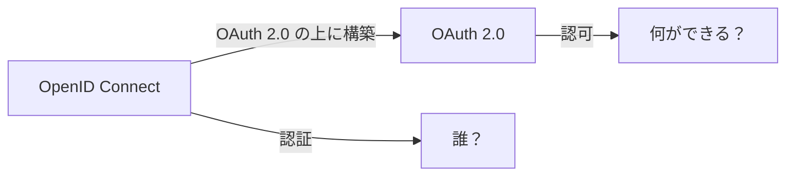

# Phase 4-1: OpenID Connect

## 学習目標

この単元を終えると、以下ができるようになります：

- OIDC と OAuth の違いを説明できる
- ID トークンを理解できる
- OIDC フローを実装できる

## OpenID Connect とは



**OIDC** = OAuth 2.0 + 認証レイヤー

### OAuth 2.0 vs OIDC

| 項目 | OAuth 2.0 | OIDC |
|------|-----------|------|
| 目的 | 認可 | 認証 + 認可 |
| トークン | access_token | access_token + id_token |
| ユーザー情報 | 別途 API 呼び出し | ID トークンに含まれる |
| スコープ | 任意 | openid 必須 |

## ID トークン

### 構造

```python
# ID トークン（JWT）の中身
{
    "iss": "https://accounts.google.com",  # 発行者
    "sub": "123456789",                    # ユーザーID
    "aud": "your-client-id",               # 対象（あなたのアプリ）
    "exp": 1234567890,                     # 有効期限
    "iat": 1234567890,                     # 発行時刻
    "nonce": "abc123",                     # リプレイ攻撃対策
    "email": "user@example.com",
    "name": "John Doe",
    "picture": "https://..."
}
```

### 標準クレーム

| クレーム | 説明 |
|---------|------|
| sub | ユーザー識別子（一意） |
| name | フルネーム |
| email | メールアドレス |
| email_verified | メール確認済み |
| picture | プロフィール画像 URL |

## ハンズオン

### 演習1: ID トークンの検証

```python
# oidc_verify.py
import jwt
import httpx
from jwt import PyJWKClient

GOOGLE_JWKS_URL = 'https://www.googleapis.com/oauth2/v3/certs'
CLIENT_ID = 'your-client-id'

async def verify_id_token(id_token: str) -> dict:
    """Google の ID トークンを検証"""
    # JWKS から公開鍵を取得
    jwks_client = PyJWKClient(GOOGLE_JWKS_URL)
    signing_key = jwks_client.get_signing_key_from_jwt(id_token)
    
    # トークンを検証
    payload = jwt.decode(
        id_token,
        signing_key.key,
        algorithms=['RS256'],
        audience=CLIENT_ID,
        issuer='https://accounts.google.com'
    )
    
    return payload

# 同期版
def verify_id_token_sync(id_token: str) -> dict:
    jwks_client = PyJWKClient(GOOGLE_JWKS_URL)
    signing_key = jwks_client.get_signing_key_from_jwt(id_token)
    
    return jwt.decode(
        id_token,
        signing_key.key,
        algorithms=['RS256'],
        audience=CLIENT_ID,
        issuer='https://accounts.google.com'
    )
```

### 演習2: OIDC フロー実装

```python
# oidc_flow.py
from fastapi import FastAPI, Request, HTTPException
from fastapi.responses import RedirectResponse
import httpx
import secrets
from urllib.parse import urlencode
from jwt import PyJWKClient
import jwt

app = FastAPI()

CLIENT_ID = 'your-client-id'
CLIENT_SECRET = 'your-client-secret'
REDIRECT_URI = 'http://localhost:8000/callback'

states = {}
nonces = {}

GOOGLE_CONFIG = {
    'authorization_endpoint': 'https://accounts.google.com/o/oauth2/v2/auth',
    'token_endpoint': 'https://oauth2.googleapis.com/token',
    'jwks_uri': 'https://www.googleapis.com/oauth2/v3/certs',
    'issuer': 'https://accounts.google.com',
}

@app.get('/login')
async def login():
    state = secrets.token_urlsafe(32)
    nonce = secrets.token_urlsafe(32)
    
    states[state] = True
    nonces[nonce] = True
    
    params = {
        'client_id': CLIENT_ID,
        'redirect_uri': REDIRECT_URI,
        'response_type': 'code',
        'scope': 'openid profile email',
        'state': state,
        'nonce': nonce,
    }
    
    url = f'{GOOGLE_CONFIG["authorization_endpoint"]}?{urlencode(params)}'
    return RedirectResponse(url)

@app.get('/callback')
async def callback(code: str, state: str):
    # State 検証
    if state not in states:
        raise HTTPException(status_code=400, detail='Invalid state')
    del states[state]
    
    # トークン取得
    async with httpx.AsyncClient() as client:
        response = await client.post(
            GOOGLE_CONFIG['token_endpoint'],
            data={
                'client_id': CLIENT_ID,
                'client_secret': CLIENT_SECRET,
                'code': code,
                'grant_type': 'authorization_code',
                'redirect_uri': REDIRECT_URI,
            }
        )
        tokens = response.json()
    
    # ID トークン検証
    id_token = tokens['id_token']
    jwks_client = PyJWKClient(GOOGLE_CONFIG['jwks_uri'])
    signing_key = jwks_client.get_signing_key_from_jwt(id_token)
    
    claims = jwt.decode(
        id_token,
        signing_key.key,
        algorithms=['RS256'],
        audience=CLIENT_ID,
        issuer=GOOGLE_CONFIG['issuer']
    )
    
    # Nonce 検証
    if claims.get('nonce') not in nonces:
        raise HTTPException(status_code=400, detail='Invalid nonce')
    del nonces[claims['nonce']]
    
    return {
        'user': {
            'id': claims['sub'],
            'email': claims.get('email'),
            'name': claims.get('name'),
            'picture': claims.get('picture'),
        }
    }
```

### 演習3: Discovery Document

```python
# oidc_discovery.py
import httpx

async def get_oidc_config(issuer: str) -> dict:
    """OIDC Discovery Document を取得"""
    url = f'{issuer}/.well-known/openid-configuration'
    
    async with httpx.AsyncClient() as client:
        response = await client.get(url)
        return response.json()

# 使用例
# config = await get_oidc_config('https://accounts.google.com')
# print(config['authorization_endpoint'])
# print(config['token_endpoint'])
# print(config['jwks_uri'])
```

## UserInfo エンドポイント

```python
# userinfo.py
async def get_userinfo(access_token: str) -> dict:
    """UserInfo エンドポイントからユーザー情報を取得"""
    async with httpx.AsyncClient() as client:
        response = await client.get(
            'https://openidconnect.googleapis.com/v1/userinfo',
            headers={'Authorization': f'Bearer {access_token}'}
        )
        return response.json()
```

## 理解度確認

### 問題

OIDC の ID トークンに必ず含まれるクレームはどれか。

**A.** email

**B.** name

**C.** sub

**D.** picture

---

### 解答・解説

**正解: C**

`sub`（Subject）はユーザーを一意に識別するクレームで、必須です。email、name、picture はスコープによって含まれます。

---

## 次のステップ

OpenID Connect を学びました。次はソーシャルログインを実装しましょう。

**次の単元**: [Phase 4-2: ソーシャルログイン](./02_ソーシャルログイン.md)
