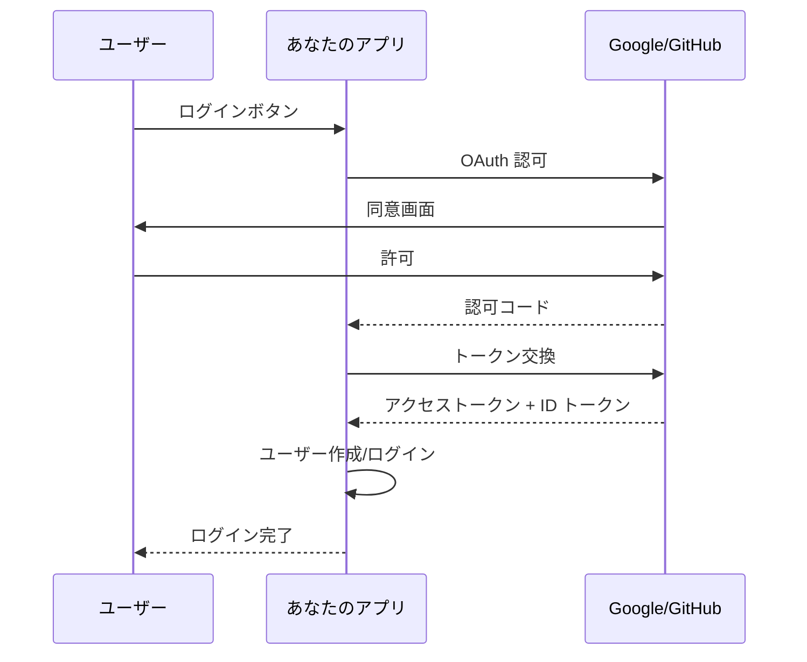

# Phase 4-2: ソーシャルログイン

## 学習目標

この単元を終えると、以下ができるようになります：

- Google ログインを実装できる
- GitHub ログインを実装できる
- 複数プロバイダーを統合できる

## ソーシャルログインの流れ



## ハンズオン

### 演習1: Google ログイン

```python
# google_login.py
from fastapi import FastAPI, Request, HTTPException
from fastapi.responses import RedirectResponse, HTMLResponse
from authlib.integrations.starlette_client import OAuth
from starlette.middleware.sessions import SessionMiddleware
import secrets

app = FastAPI()
app.add_middleware(SessionMiddleware, secret_key=secrets.token_hex(32))

oauth = OAuth()

# Google 設定
oauth.register(
    name='google',
    client_id='your-client-id.apps.googleusercontent.com',
    client_secret='your-client-secret',
    server_metadata_url='https://accounts.google.com/.well-known/openid-configuration',
    client_kwargs={'scope': 'openid email profile'}
)

@app.get('/')
async def home(request: Request):
    user = request.session.get('user')
    if user:
        return HTMLResponse(f'''
            <h1>Hello, {user["name"]}!</h1>
            
            <p>Email: {user["email"]}</p>
            <a href="/logout">Logout</a>
        ''')
    return HTMLResponse('''
        <h1>Welcome</h1>
        <a href="/login/google">Login with Google</a>
    ''')

@app.get('/login/google')
async def login_google(request: Request):
    redirect_uri = request.url_for('auth_google')
    return await oauth.google.authorize_redirect(request, redirect_uri)

@app.get('/auth/google')
async def auth_google(request: Request):
    token = await oauth.google.authorize_access_token(request)
    user = token.get('userinfo')
    
    # セッションに保存
    request.session['user'] = {
        'id': user['sub'],
        'email': user['email'],
        'name': user['name'],
        'picture': user['picture'],
        'provider': 'google'
    }
    
    return RedirectResponse(url='/')

@app.get('/logout')
async def logout(request: Request):
    request.session.clear()
    return RedirectResponse(url='/')
```

### 演習2: GitHub ログイン

```python
# github_login.py
from fastapi import FastAPI, Request
from fastapi.responses import RedirectResponse
from authlib.integrations.starlette_client import OAuth
from starlette.middleware.sessions import SessionMiddleware
import secrets
import httpx

app = FastAPI()
app.add_middleware(SessionMiddleware, secret_key=secrets.token_hex(32))

oauth = OAuth()

# GitHub 設定
oauth.register(
    name='github',
    client_id='your-github-client-id',
    client_secret='your-github-client-secret',
    access_token_url='https://github.com/login/oauth/access_token',
    authorize_url='https://github.com/login/oauth/authorize',
    api_base_url='https://api.github.com/',
    client_kwargs={'scope': 'user:email'}
)

@app.get('/login/github')
async def login_github(request: Request):
    redirect_uri = request.url_for('auth_github')
    return await oauth.github.authorize_redirect(request, redirect_uri)

@app.get('/auth/github')
async def auth_github(request: Request):
    token = await oauth.github.authorize_access_token(request)
    
    # ユーザー情報を取得
    async with httpx.AsyncClient() as client:
        response = await client.get(
            'https://api.github.com/user',
            headers={'Authorization': f'Bearer {token["access_token"]}'}
        )
        user = response.json()
        
        # メールを取得
        response = await client.get(
            'https://api.github.com/user/emails',
            headers={'Authorization': f'Bearer {token["access_token"]}'}
        )
        emails = response.json()
        primary_email = next((e['email'] for e in emails if e['primary']), None)
    
    request.session['user'] = {
        'id': str(user['id']),
        'email': primary_email,
        'name': user['name'] or user['login'],
        'picture': user['avatar_url'],
        'provider': 'github'
    }
    
    return RedirectResponse(url='/')
```

### 演習3: 複数プロバイダー統合

```python
# multi_provider.py
from fastapi import FastAPI, Request
from fastapi.responses import RedirectResponse, HTMLResponse
from authlib.integrations.starlette_client import OAuth
from starlette.middleware.sessions import SessionMiddleware
import secrets

app = FastAPI()
app.add_middleware(SessionMiddleware, secret_key=secrets.token_hex(32))

oauth = OAuth()

# 複数プロバイダーを登録
oauth.register(
    name='google',
    client_id='google-client-id',
    client_secret='google-client-secret',
    server_metadata_url='https://accounts.google.com/.well-known/openid-configuration',
    client_kwargs={'scope': 'openid email profile'}
)

oauth.register(
    name='github',
    client_id='github-client-id',
    client_secret='github-client-secret',
    access_token_url='https://github.com/login/oauth/access_token',
    authorize_url='https://github.com/login/oauth/authorize',
    api_base_url='https://api.github.com/',
    client_kwargs={'scope': 'user:email'}
)

@app.get('/')
async def home(request: Request):
    user = request.session.get('user')
    if user:
        return HTMLResponse(f'''
            <h1>Hello, {user["name"]}!</h1>
            <p>Provider: {user["provider"]}</p>
            <a href="/logout">Logout</a>
        ''')
    return HTMLResponse('''
        <h1>Login</h1>
        <a href="/login/google">Login with Google</a><br>
        <a href="/login/github">Login with GitHub</a>
    ''')

# 共通のログインハンドラ
async def handle_login(request: Request, provider: str):
    redirect_uri = request.url_for('auth_callback', provider=provider)
    client = oauth.create_client(provider)
    return await client.authorize_redirect(request, redirect_uri)

@app.get('/login/{provider}')
async def login(request: Request, provider: str):
    if provider not in ['google', 'github']:
        return RedirectResponse(url='/')
    return await handle_login(request, provider)

@app.get('/auth/{provider}')
async def auth_callback(request: Request, provider: str):
    client = oauth.create_client(provider)
    token = await client.authorize_access_token(request)
    
    if provider == 'google':
        user_info = token.get('userinfo')
        user = {
            'id': user_info['sub'],
            'email': user_info['email'],
            'name': user_info['name'],
            'picture': user_info['picture'],
        }
    elif provider == 'github':
        resp = await client.get('user', token=token)
        user_data = resp.json()
        user = {
            'id': str(user_data['id']),
            'email': user_data.get('email'),
            'name': user_data['name'] or user_data['login'],
            'picture': user_data['avatar_url'],
        }
    
    user['provider'] = provider
    request.session['user'] = user
    
    # DB にユーザー作成/更新
    # await upsert_user(user)
    
    return RedirectResponse(url='/')
```

### 演習4: ユーザー管理

```python
# user_management.py
from dataclasses import dataclass
from typing import Optional

@dataclass
class SocialAccount:
    provider: str
    provider_user_id: str
    email: str
    name: str
    picture: str

@dataclass
class User:
    id: int
    email: str
    name: str
    picture: str
    accounts: list[SocialAccount]

# 簡易 DB
users_db = {}
social_accounts_db = {}

def find_or_create_user(account: SocialAccount) -> User:
    """ソーシャルアカウントからユーザーを作成/取得"""
    key = f'{account.provider}:{account.provider_user_id}'
    
    # 既存のソーシャルアカウントを探す
    if key in social_accounts_db:
        user_id = social_accounts_db[key]
        return users_db[user_id]
    
    # メールで既存ユーザーを探す
    for user in users_db.values():
        if user.email == account.email:
            # アカウントをリンク
            user.accounts.append(account)
            social_accounts_db[key] = user.id
            return user
    
    # 新規ユーザー作成
    user_id = len(users_db) + 1
    user = User(
        id=user_id,
        email=account.email,
        name=account.name,
        picture=account.picture,
        accounts=[account]
    )
    users_db[user_id] = user
    social_accounts_db[key] = user_id
    
    return user
```

## 理解度確認

### 問題

複数のソーシャルプロバイダーでログインしたユーザーを同一ユーザーとして扱う方法として適切なのはどれか。

**A.** provider_user_id のみで判定

**B.** email で既存ユーザーを検索してリンク

**C.** 常に新規ユーザーとして作成

**D.** name で判定

---

### 解答・解説

**正解: B**

同じメールアドレスを持つユーザーを同一ユーザーとしてリンクするのが一般的です。ただし、メールアドレスが検証済みであることを確認する必要があります。

---

## 次のステップ

ソーシャルログインを学びました。次は総仕上げです。

**次の単元**: [Phase 5-1: 総仕上げ](../phase5/01_総仕上げ.md)
