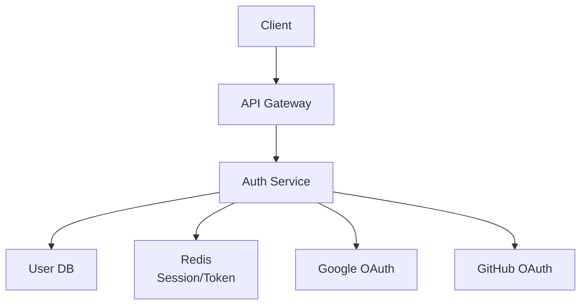

# Phase 5-1: 総仕上げ ～ 認証システムの設計 ～

## 学習目標

この単元を終えると、以下ができるようになります：

- 本番レベルの認証システムを設計できる
- セキュリティのベストプラクティスを適用できる
- 認証フローを選択できる

## 総合演習: 認証システムの構築

### 要件

```
- JWT ベースの認証
- Google/GitHub ソーシャルログイン
- リフレッシュトークン
- ロールベースアクセス制御（RBAC）
```

### アーキテクチャ



### 認証サービス実装

```python
# auth_service.py
from fastapi import FastAPI, Depends, HTTPException, Request, Response
from fastapi.security import HTTPBearer, HTTPAuthorizationCredentials
from pydantic import BaseModel, EmailStr
from argon2 import PasswordHasher
from argon2.exceptions import VerifyMismatchError
import jwt
import secrets
from datetime import datetime, timedelta
from typing import Optional
from enum import Enum

app = FastAPI()
security = HTTPBearer()
ph = PasswordHasher()

# 設定
SECRET_KEY = secrets.token_hex(32)
REFRESH_SECRET_KEY = secrets.token_hex(32)
ALGORITHM = 'HS256'
ACCESS_TOKEN_EXPIRE = timedelta(minutes=15)
REFRESH_TOKEN_EXPIRE = timedelta(days=7)

# ロール
class Role(str, Enum):
    USER = 'user'
    ADMIN = 'admin'
    MODERATOR = 'moderator'

# モデル
class UserCreate(BaseModel):
    email: EmailStr
    password: str
    name: str

class UserLogin(BaseModel):
    email: EmailStr
    password: str

class TokenResponse(BaseModel):
    access_token: str
    refresh_token: str
    token_type: str = 'bearer'
    expires_in: int

# 簡易 DB
users_db = {}
refresh_tokens_db = {}

# トークン生成
def create_access_token(user_id: str, role: str) -> str:
    payload = {
        'sub': user_id,
        'role': role,
        'type': 'access',
        'exp': datetime.utcnow() + ACCESS_TOKEN_EXPIRE,
        'iat': datetime.utcnow(),
    }
    return jwt.encode(payload, SECRET_KEY, algorithm=ALGORITHM)

def create_refresh_token(user_id: str) -> str:
    jti = secrets.token_urlsafe(32)
    payload = {
        'sub': user_id,
        'type': 'refresh',
        'jti': jti,
        'exp': datetime.utcnow() + REFRESH_TOKEN_EXPIRE,
        'iat': datetime.utcnow(),
    }
    token = jwt.encode(payload, REFRESH_SECRET_KEY, algorithm=ALGORITHM)
    refresh_tokens_db[jti] = {'user_id': user_id, 'revoked': False}
    return token

def create_tokens(user_id: str, role: str) -> TokenResponse:
    return TokenResponse(
        access_token=create_access_token(user_id, role),
        refresh_token=create_refresh_token(user_id),
        expires_in=int(ACCESS_TOKEN_EXPIRE.total_seconds())
    )

# 認証
def get_current_user(credentials: HTTPAuthorizationCredentials = Depends(security)):
    token = credentials.credentials
    try:
        payload = jwt.decode(token, SECRET_KEY, algorithms=[ALGORITHM])
        if payload.get('type') != 'access':
            raise HTTPException(status_code=401, detail='Invalid token type')
        return payload
    except jwt.ExpiredSignatureError:
        raise HTTPException(status_code=401, detail='Token expired')
    except jwt.InvalidTokenError:
        raise HTTPException(status_code=401, detail='Invalid token')

def require_role(allowed_roles: list[Role]):
    def dependency(user = Depends(get_current_user)):
        if user['role'] not in [r.value for r in allowed_roles]:
            raise HTTPException(status_code=403, detail='Insufficient permissions')
        return user
    return dependency

# エンドポイント
@app.post('/register')
async def register(user: UserCreate):
    if user.email in users_db:
        raise HTTPException(status_code=400, detail='Email already registered')
    
    users_db[user.email] = {
        'id': str(len(users_db) + 1),
        'email': user.email,
        'password_hash': ph.hash(user.password),
        'name': user.name,
        'role': Role.USER.value,
    }
    
    return {'message': 'User registered'}

@app.post('/login', response_model=TokenResponse)
async def login(user: UserLogin):
    db_user = users_db.get(user.email)
    if not db_user:
        raise HTTPException(status_code=401, detail='Invalid credentials')
    
    try:
        ph.verify(db_user['password_hash'], user.password)
    except VerifyMismatchError:
        raise HTTPException(status_code=401, detail='Invalid credentials')
    
    return create_tokens(db_user['id'], db_user['role'])

@app.post('/refresh', response_model=TokenResponse)
async def refresh(refresh_token: str):
    try:
        payload = jwt.decode(refresh_token, REFRESH_SECRET_KEY, algorithms=[ALGORITHM])
        
        if payload.get('type') != 'refresh':
            raise HTTPException(status_code=401, detail='Invalid token type')
        
        jti = payload.get('jti')
        if jti not in refresh_tokens_db or refresh_tokens_db[jti]['revoked']:
            raise HTTPException(status_code=401, detail='Token revoked')
        
        user_id = payload['sub']
        user = next((u for u in users_db.values() if u['id'] == user_id), None)
        
        if not user:
            raise HTTPException(status_code=401, detail='User not found')
        
        # 古いリフレッシュトークンを無効化
        refresh_tokens_db[jti]['revoked'] = True
        
        return create_tokens(user_id, user['role'])
        
    except jwt.ExpiredSignatureError:
        raise HTTPException(status_code=401, detail='Refresh token expired')
    except jwt.InvalidTokenError:
        raise HTTPException(status_code=401, detail='Invalid refresh token')

@app.post('/logout')
async def logout(user = Depends(get_current_user)):
    # 全てのリフレッシュトークンを無効化
    for jti, data in refresh_tokens_db.items():
        if data['user_id'] == user['sub']:
            data['revoked'] = True
    return {'message': 'Logged out'}

@app.get('/me')
async def me(user = Depends(get_current_user)):
    db_user = next((u for u in users_db.values() if u['id'] == user['sub']), None)
    return {
        'id': db_user['id'],
        'email': db_user['email'],
        'name': db_user['name'],
        'role': db_user['role'],
    }

@app.get('/admin')
async def admin(user = Depends(require_role([Role.ADMIN]))):
    return {'message': 'Admin area', 'user': user}
```

## セキュリティチェックリスト

```markdown
## 認証
- [ ] パスワードは bcrypt/Argon2 でハッシュ化
- [ ] JWT の署名を必ず検証
- [ ] アクセストークンは短時間（15分）
- [ ] リフレッシュトークンは無効化可能

## 通信
- [ ] HTTPS 必須
- [ ] Cookie は HttpOnly、Secure、SameSite
- [ ] CORS を適切に設定

## 攻撃対策
- [ ] CSRF トークン（Cookie 使用時）
- [ ] レート制限
- [ ] ログイン試行回数制限
- [ ] State/Nonce パラメータ（OAuth）
```

## 認証フロー選択ガイド

| シナリオ | 推奨フロー |
|---------|-----------|
| サーバーサイド Web アプリ | Authorization Code |
| SPA | Authorization Code + PKCE |
| モバイルアプリ | Authorization Code + PKCE |
| サーバー間通信 | Client Credentials |
| 内部 API | JWT |

## カリキュラム完了！

おめでとうございます！認証・認可のカリキュラムを完了しました。

### 学んだこと

1. **認証・認可の基礎** - 概念、用語
2. **パスワード認証** - ハッシュ化、bcrypt
3. **セッション認証** - Cookie、セッション管理
4. **JWT** - トークンベース認証
5. **OAuth 2.0** - 認可フロー、PKCE
6. **OpenID Connect** - 認証、ID トークン
7. **ソーシャルログイン** - Google、GitHub

### 次のステップ

- **Auth0 / Firebase Auth** - マネージド認証サービス
- **AWS Cognito** - AWS の認証サービス
- **Keycloak** - オープンソース IdP
