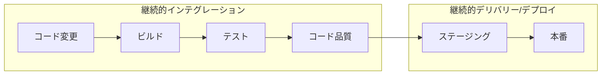
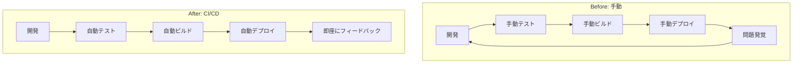
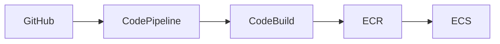

# Phase 1-1: CI/CD とは

## 学習目標

この単元を終えると、以下ができるようになります：

- CI/CD の概念を説明できる
- 各ステージの役割を理解できる
- 導入のメリットを説明できる

## 概念解説

### CI/CD とは

### 用語整理

| 用語 | 英語 | 説明 |
|------|------|------|
| CI | Continuous Integration | コード統合の自動化 |
| CD | Continuous Delivery | デプロイ可能な状態を維持 |
| CD | Continuous Deployment | 本番デプロイまで自動化 |

### Before / After

## CI/CD パイプラインの構成

### 典型的なパイプライン

### 各ステージの役割

| ステージ | 目的 | ツール例 |
|---------|------|---------|
| Lint | コードスタイルチェック | ESLint, Flake8, Black |
| Unit Test | 単体テスト | pytest, Jest |
| Build | アーティファクト作成 | Docker, npm build |
| Integration Test | 結合テスト | pytest, Postman |
| Deploy Staging | ステージング環境へ | K8s, ECS |
| E2E Test | エンドツーエンドテスト | Cypress, Playwright |
| Deploy Prod | 本番環境へ | K8s, ECS |

## CI/CD ツールの比較

| ツール | 特徴 | 適した環境 |
|-------|------|-----------|
| GitHub Actions | GitHub統合、無料枠大 | GitHub ユーザー |
| GitLab CI | GitLab統合 | GitLab ユーザー |
| CircleCI | 高速、柔軟 | 大規模チーム |
| Jenkins | 自己ホスト、自由度高 | オンプレ環境 |
| AWS CodePipeline | AWS統合 | AWS ユーザー |

## CI/CD のメリット

### 開発チームへのメリット

| メリット | 説明 |
|---------|------|
| 早期発見 | バグを早く見つけられる |
| 品質向上 | 自動テストで品質担保 |
| デプロイ高速化 | 数分でリリース可能 |
| 手動作業削減 | 人的ミス減少 |
| 開発者体験向上 | 本質的な作業に集中 |

### ビジネスへのメリット

| メリット | 説明 |
|---------|------|
| リリース頻度向上 | 機能を素早く提供 |
| ダウンタイム減少 | 安全なデプロイ |
| コスト削減 | 手動作業の削減 |
| 競争力向上 | 素早い市場投入 |

## AWS での CI/CD

| サービス | 役割 |
|---------|------|
| CodePipeline | パイプラインオーケストレーション |
| CodeBuild | ビルド・テスト実行 |
| ECR | Docker イメージ保存 |
| ECS/EKS | コンテナ実行 |

## 理解度確認

### 問題

CI/CD で「テストが失敗したらデプロイしない」という制御を行うことで得られる最大のメリットはどれか。

**A.** 開発速度の向上

**B.** 本番環境の品質担保

**C.** コスト削減

**D.** セキュリティ強化

---

### 解答・解説

**正解: B**

テスト失敗時にデプロイを止めることで：
- バグを含むコードが本番に出ない
- 本番環境の品質が担保される
- ユーザーへの影響を防げる

これが CI/CD の最も重要な価値の1つです。

---

## 次のステップ

CI/CD の概念を学びました。次は GitHub Actions の基本を学びましょう。

**次の単元**: [Phase 1-2: GitHub Actions 入門](./02_GitHub_Actions入門.md)
