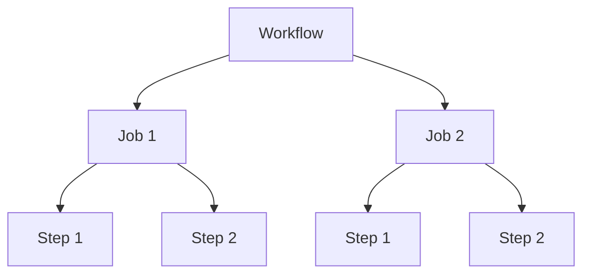
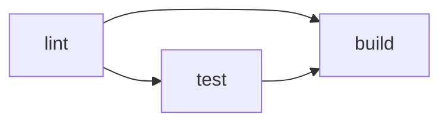

# Phase 1-2: GitHub Actions 入門

## 学習目標

この単元を終えると、以下ができるようになります：

- GitHub Actions のワークフローを作成できる
- トリガー、ジョブ、ステップを設定できる
- 基本的なアクションを使用できる

## 概念解説

### GitHub Actions の構成



| 概念 | 説明 |
|------|------|
| Workflow | 自動化プロセス全体（YAMLファイル） |
| Event | ワークフローを起動するトリガー |
| Job | 同じランナー上で実行されるステップ群 |
| Step | 個々のタスク（コマンド or アクション） |
| Action | 再利用可能なタスク |
| Runner | ワークフローを実行する仮想マシン |

## ハンズオン

### 演習1: 最初のワークフロー

```yaml
# .github/workflows/hello.yml
name: Hello World

# トリガー
on:
  push:
    branches: [main]
  workflow_dispatch:  # 手動実行

jobs:
  greet:
    runs-on: ubuntu-latest
    
    steps:
      - name: Say Hello
        run: echo "Hello, GitHub Actions!"
      
      - name: Show Date
        run: date
      
      - name: Show Environment
        run: |
          echo "Runner: $RUNNER_OS"
          echo "Repository: $GITHUB_REPOSITORY"
          echo "Branch: $GITHUB_REF"
```

```bash
# リポジトリに push
git add .github/workflows/hello.yml
git commit -m "Add first workflow"
git push
```

### 演習2: トリガー（Events）

```yaml
on:
  # Push 時
  push:
    branches: [main, develop]
    paths:
      - 'src/**'
      - '!src/**/*.md'  # md は除外
  
  # PR 時
  pull_request:
    branches: [main]
    types: [opened, synchronize]
  
  # 手動実行
  workflow_dispatch:
    inputs:
      environment:
        description: 'Deploy environment'
        required: true
        default: 'staging'
        type: choice
        options:
          - staging
          - production
  
  # スケジュール（cron）
  schedule:
    - cron: '0 9 * * 1-5'  # 平日9時（UTC）
```

### 演習3: 複数ジョブ

```yaml
name: Build and Test

on: push

jobs:
  lint:
    runs-on: ubuntu-latest
    steps:
      - uses: actions/checkout@v4
      - name: Run Lint
        run: echo "Linting..."
  
  test:
    runs-on: ubuntu-latest
    needs: lint  # lint 完了後に実行
    steps:
      - uses: actions/checkout@v4
      - name: Run Tests
        run: echo "Testing..."
  
  build:
    runs-on: ubuntu-latest
    needs: [lint, test]  # 両方完了後に実行
    steps:
      - uses: actions/checkout@v4
      - name: Build
        run: echo "Building..."
```



### 演習4: 環境変数と Secrets

```yaml
name: With Environment

on: push

env:
  APP_ENV: production  # ワークフロー全体

jobs:
  deploy:
    runs-on: ubuntu-latest
    env:
      JOB_ENV: deploy  # ジョブ全体
    
    steps:
      - name: Show Env
        env:
          STEP_ENV: step  # ステップのみ
        run: |
          echo "APP_ENV: $APP_ENV"
          echo "JOB_ENV: $JOB_ENV"
          echo "STEP_ENV: $STEP_ENV"
      
      - name: Use Secret
        env:
          API_KEY: ${{ secrets.API_KEY }}
        run: |
          echo "Using API Key..."
          # 注意: secrets は echo しても隠される
```

**Secrets の設定方法**
1. GitHub リポジトリ → Settings → Secrets and variables → Actions
2. New repository secret をクリック
3. Name と Value を入力

### 演習5: マトリックス戦略

```yaml
name: Matrix Build

on: push

jobs:
  test:
    runs-on: ${{ matrix.os }}
    strategy:
      matrix:
        os: [ubuntu-latest, macos-latest, windows-latest]
        python-version: ['3.10', '3.11', '3.12']
        exclude:
          - os: windows-latest
            python-version: '3.10'
    
    steps:
      - uses: actions/checkout@v4
      
      - name: Set up Python
        uses: actions/setup-python@v5
        with:
          python-version: ${{ matrix.python-version }}
      
      - name: Show version
        run: python --version
```

### 演習6: アーティファクト

```yaml
name: Artifact Example

on: push

jobs:
  build:
    runs-on: ubuntu-latest
    steps:
      - uses: actions/checkout@v4
      
      - name: Build
        run: |
          mkdir dist
          echo "Build output" > dist/app.txt
      
      - name: Upload Artifact
        uses: actions/upload-artifact@v4
        with:
          name: build-output
          path: dist/
  
  deploy:
    needs: build
    runs-on: ubuntu-latest
    steps:
      - name: Download Artifact
        uses: actions/download-artifact@v4
        with:
          name: build-output
          path: downloaded/
      
      - name: Show
        run: cat downloaded/app.txt
```

### 演習7: キャッシュ

```yaml
name: With Cache

on: push

jobs:
  build:
    runs-on: ubuntu-latest
    steps:
      - uses: actions/checkout@v4
      
      - name: Set up Python
        uses: actions/setup-python@v5
        with:
          python-version: '3.11'
      
      - name: Cache pip
        uses: actions/cache@v4
        with:
          path: ~/.cache/pip
          key: ${{ runner.os }}-pip-${{ hashFiles('**/requirements.txt') }}
          restore-keys: |
            ${{ runner.os }}-pip-
      
      - name: Install dependencies
        run: pip install -r requirements.txt
```

## よく使うアクション

| アクション | 用途 |
|-----------|------|
| actions/checkout | リポジトリのチェックアウト |
| actions/setup-python | Python 環境セットアップ |
| actions/setup-node | Node.js 環境セットアップ |
| actions/cache | 依存関係のキャッシュ |
| actions/upload-artifact | アーティファクトのアップロード |
| docker/build-push-action | Docker イメージのビルド・プッシュ |

## 理解度確認

### 問題

GitHub Actions で `lint` ジョブが完了した後に `test` ジョブを実行するための設定はどれか。

**A.** `depends-on: lint`

**B.** `needs: lint`

**C.** `after: lint`

**D.** `requires: lint`

---

### 解答・解説

**正解: B**

```yaml
jobs:
  lint:
    runs-on: ubuntu-latest
    # ...
  
  test:
    runs-on: ubuntu-latest
    needs: lint  # lint 完了後に実行
    # ...
```

`needs` キーワードで依存関係を指定します。

---

## 次のステップ

GitHub Actions の基本を学びました。次はテストの自動化を学びましょう。

**次の単元**: [Phase 2-1: テスト自動化](../phase2/01_テスト自動化.md)
