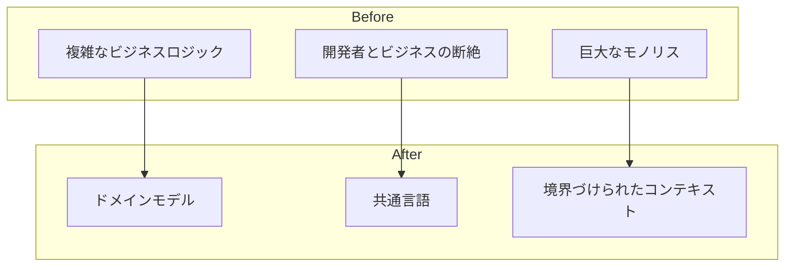
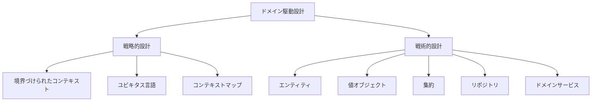
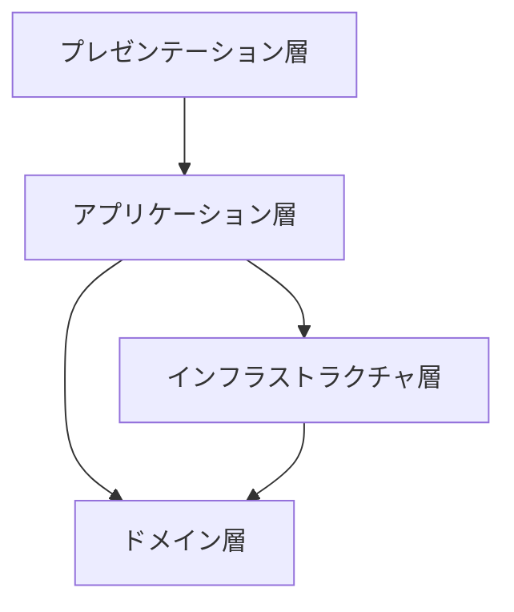

# Phase 1-1: DDD 概要

## 学習目標

この単元を終えると、以下ができるようになります：

- DDD が解決する問題を説明できる
- 戦略的設計と戦術的設計を区別できる
- DDD を適用すべき場面を判断できる

## なぜ DDD か



### よくある問題

| 問題 | DDD の解決策 |
|------|------------|
| ビジネスルールがコード全体に散らばる | ドメイン層に集約 |
| 開発者とビジネス担当者の用語が違う | ユビキタス言語 |
| システムが巨大化して変更困難 | 境界づけられたコンテキスト |

## DDD の構成



### 戦略的設計 vs 戦術的設計

| 戦略的設計 | 戦術的設計 |
|-----------|----------|
| システム全体の構造 | コードレベルの設計 |
| コンテキストの分割 | クラス・オブジェクト |
| チーム間の関係 | 実装パターン |

## レイヤードアーキテクチャ



| 層 | 責務 |
|----|------|
| **プレゼンテーション** | UI、API |
| **アプリケーション** | ユースケース、オーケストレーション |
| **ドメイン** | ビジネスロジック、ルール |
| **インフラストラクチャ** | DB、外部サービス |

## DDD を適用すべき場面

### ✅ 適している

- 複雑なビジネスロジックがある
- ドメインエキスパートがいる
- 長期的に保守するシステム

### ❌ 適していない

- 単純な CRUD アプリ
- 短期間のプロトタイプ
- ドメインエキスパートがいない

## ハンズオン

### 演習1: 問題のあるコード

```python
# bad_code.py
"""
典型的な問題のあるコード
- ビジネスロジックが散らばっている
- 検証が重複している
- ドメイン知識が不明確
"""

class OrderService:
    def create_order(self, user_id: int, items: list, coupon_code: str = None):
        # ユーザー検証（ここでやるべき？）
        user = self.db.get_user(user_id)
        if not user or not user.is_active:
            raise Exception('Invalid user')
        
        # 在庫チェック（ドメインロジック？インフラ？）
        for item in items:
            stock = self.db.get_stock(item['product_id'])
            if stock < item['quantity']:
                raise Exception('Out of stock')
        
        # 価格計算（ビジネスルールがここに...）
        total = 0
        for item in items:
            product = self.db.get_product(item['product_id'])
            total += product.price * item['quantity']
        
        # クーポン適用（また別のビジネスルール）
        if coupon_code:
            coupon = self.db.get_coupon(coupon_code)
            if coupon and coupon.is_valid():
                if coupon.type == 'percent':
                    total *= (1 - coupon.value / 100)
                else:
                    total -= coupon.value
        
        # 税金計算（またビジネスルール）
        tax = total * 0.1
        total += tax
        
        # 注文作成
        order = Order(
            user_id=user_id,
            items=items,
            total=total,
            status='pending'
        )
        self.db.save(order)
        
        # 在庫更新（トランザクション管理は？）
        for item in items:
            self.db.reduce_stock(item['product_id'], item['quantity'])
        
        # 通知送信（ここでやるべき？）
        self.email_service.send(user.email, 'Order created')
        
        return order
```

### 演習2: DDD で改善

```python
# ddd_approach.py
"""
DDDで整理したコード
"""

from dataclasses import dataclass
from typing import List
from abc import ABC, abstractmethod

# ===== ドメイン層 =====

# 値オブジェクト
@dataclass(frozen=True)
class Money:
    amount: int  # 通貨の最小単位（円）
    
    def add(self, other: 'Money') -> 'Money':
        return Money(self.amount + other.amount)
    
    def multiply(self, factor: float) -> 'Money':
        return Money(int(self.amount * factor))
    
    def apply_discount(self, percent: int) -> 'Money':
        return self.multiply(1 - percent / 100)

@dataclass(frozen=True)
class OrderItem:
    product_id: str
    quantity: int
    unit_price: Money
    
    @property
    def subtotal(self) -> Money:
        return self.unit_price.multiply(self.quantity)

# エンティティ
class Order:
    def __init__(self, order_id: str, customer_id: str):
        self.order_id = order_id
        self.customer_id = customer_id
        self.items: List[OrderItem] = []
        self.status = 'draft'
    
    def add_item(self, item: OrderItem):
        if self.status != 'draft':
            raise DomainException('Cannot modify confirmed order')
        self.items.append(item)
    
    def calculate_total(self) -> Money:
        total = Money(0)
        for item in self.items:
            total = total.add(item.subtotal)
        return total
    
    def confirm(self):
        if not self.items:
            raise DomainException('Order must have items')
        self.status = 'confirmed'

# ドメイン例外
class DomainException(Exception):
    pass

# リポジトリインターフェース（ドメイン層で定義）
class OrderRepository(ABC):
    @abstractmethod
    def save(self, order: Order): pass
    
    @abstractmethod
    def find_by_id(self, order_id: str) -> Order: pass

# ===== アプリケーション層 =====

class CreateOrderUseCase:
    def __init__(self, order_repo: OrderRepository):
        self.order_repo = order_repo
    
    def execute(self, command: 'CreateOrderCommand') -> str:
        order = Order(
            order_id=self.generate_id(),
            customer_id=command.customer_id
        )
        
        for item in command.items:
            order.add_item(item)
        
        order.confirm()
        self.order_repo.save(order)
        
        return order.order_id
```

## 理解度確認

### 問題

DDD の「ドメイン層」に含まれるべきものはどれか。

**A.** REST API のエンドポイント定義

**B.** データベースのクエリ

**C.** ビジネスルールとエンティティ

**D.** UI のバリデーション

---

### 解答・解説

**正解: C**

ドメイン層はビジネスロジックの中核です。エンティティ、値オブジェクト、集約、ドメインサービスなどが含まれます。インフラ（DB）やプレゼンテーション（API、UI）は別の層です。

---

## 次のステップ

DDD 概要を学びました。次はユビキタス言語を学びましょう。

**次の単元**: [Phase 1-2: ユビキタス言語](./02_ユビキタス言語.md)
