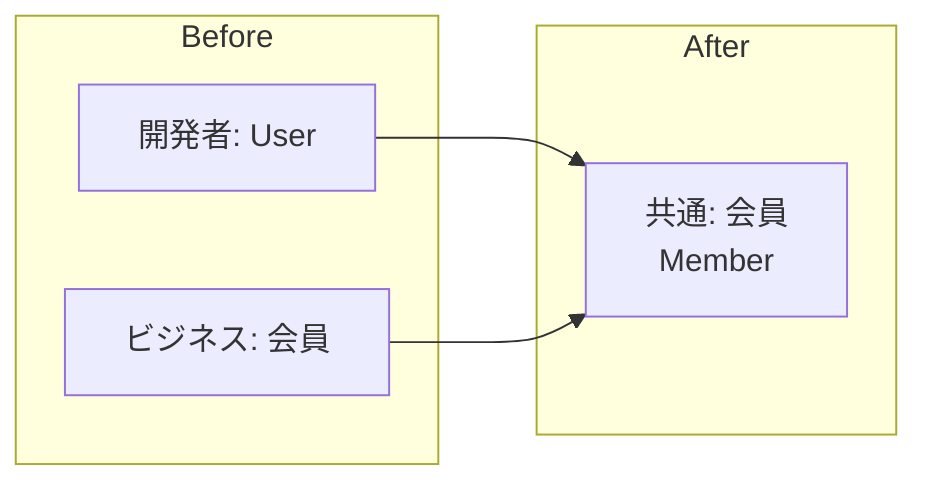

# Phase 1-2: ユビキタス言語

## 学習目標

この単元を終えると、以下ができるようになります：

- ユビキタス言語の重要性を説明できる
- ドメインエキスパートとの協業ができる
- 用語集を作成できる

## ユビキタス言語とは



**開発者とビジネス担当者が同じ言葉を使う**

### よくある問題

| 開発者の言葉 | ビジネスの言葉 | 混乱 |
|------------|-------------|------|
| User | 顧客、会員、利用者 | どれ？ |
| Order | 注文、受注、オーダー | 意味が違う？ |
| Item | 商品、アイテム、品目 | 何を指す？ |

## ユビキタス言語の原則

### 1. コードに反映する

```python
# ❌ Bad: 曖昧な名前
class User:
    def process_order(self, data): pass

# ✅ Good: ドメイン言語
class Member:
    def place_order(self, cart: ShoppingCart) -> Order: pass
```

### 2. ドキュメントに反映する

```markdown
# 用語集

## 会員（Member）
サービスに登録した利用者。ゲストは含まない。

## 注文（Order）
会員が商品を購入する行為。カートから注文を作成する。

## カート（Cart）
購入予定の商品を一時的に保持する場所。
```

## ハンズオン

### 演習1: EC サイトの用語集

```python
# ubiquitous_language.py
"""
ECサイトのユビキタス言語

用語集:
- Member（会員）: サービスに登録した利用者
- Guest（ゲスト）: 未登録の利用者
- Product（商品）: 販売対象の品物
- SKU（在庫管理単位）: 商品のサイズ・色などのバリエーション
- Cart（カート）: 購入予定商品の一時保管場所
- Order（注文）: 購入の確定
- OrderLine（注文明細）: 注文内の1商品
- Shipment（出荷）: 商品を発送すること
- Payment（支払い）: 代金の決済
"""

from dataclasses import dataclass
from typing import List
from enum import Enum

# 言葉がそのままクラス名に
class MemberStatus(Enum):
    ACTIVE = 'active'      # 有効会員
    SUSPENDED = 'suspended'  # 停止中
    WITHDRAWN = 'withdrawn'  # 退会済み

@dataclass
class Member:
    """会員: サービスに登録した利用者"""
    member_id: str
    name: str
    email: str
    status: MemberStatus

@dataclass
class Product:
    """商品: 販売対象の品物"""
    product_id: str
    name: str
    description: str

@dataclass
class SKU:
    """SKU: 商品のバリエーション（サイズ、色など）"""
    sku_code: str
    product: Product
    size: str
    color: str
    price: int
    stock_quantity: int

@dataclass
class CartItem:
    """カートアイテム: カート内の1商品"""
    sku: SKU
    quantity: int

class Cart:
    """カート: 購入予定商品の一時保管場所"""
    def __init__(self, member: Member):
        self.member = member
        self.items: List[CartItem] = []
    
    def add_item(self, sku: SKU, quantity: int):
        """カートに商品を追加"""
        # ビジネス用語でメソッド名を定義
        pass
    
    def remove_item(self, sku: SKU):
        """カートから商品を削除"""
        pass
    
    def checkout(self) -> 'Order':
        """注文を確定（チェックアウト）"""
        pass

@dataclass
class OrderLine:
    """注文明細: 注文内の1商品"""
    sku: SKU
    quantity: int
    unit_price: int
    
    @property
    def line_total(self) -> int:
        """明細合計"""
        return self.unit_price * self.quantity

class OrderStatus(Enum):
    PENDING = 'pending'        # 注文確定待ち
    CONFIRMED = 'confirmed'    # 注文確定
    SHIPPED = 'shipped'        # 出荷済み
    DELIVERED = 'delivered'    # 配達完了
    CANCELLED = 'cancelled'    # キャンセル

class Order:
    """注文: 購入の確定"""
    def __init__(self, order_id: str, member: Member):
        self.order_id = order_id
        self.member = member
        self.lines: List[OrderLine] = []
        self.status = OrderStatus.PENDING
    
    def confirm(self):
        """注文を確定"""
        self.status = OrderStatus.CONFIRMED
    
    def ship(self):
        """出荷する"""
        if self.status != OrderStatus.CONFIRMED:
            raise DomainError('確定済みの注文のみ出荷できます')
        self.status = OrderStatus.SHIPPED
    
    def cancel(self):
        """注文をキャンセル"""
        if self.status == OrderStatus.SHIPPED:
            raise DomainError('出荷済みの注文はキャンセルできません')
        self.status = OrderStatus.CANCELLED

class DomainError(Exception):
    """ドメインエラー: ビジネスルール違反"""
    pass
```

### 演習2: イベントストーミング

```python
# event_storming.py
"""
イベントストーミングの結果をコードに反映

ドメインイベント:
- MemberRegistered（会員登録完了）
- OrderPlaced（注文確定）
- OrderShipped（出荷完了）
- PaymentReceived（入金確認）
"""

from dataclasses import dataclass
from datetime import datetime
from abc import ABC

class DomainEvent(ABC):
    """ドメインイベントの基底クラス"""
    occurred_at: datetime

@dataclass
class MemberRegistered(DomainEvent):
    """会員登録完了イベント"""
    member_id: str
    email: str
    occurred_at: datetime = None
    
    def __post_init__(self):
        self.occurred_at = datetime.now()

@dataclass
class OrderPlaced(DomainEvent):
    """注文確定イベント"""
    order_id: str
    member_id: str
    total_amount: int
    occurred_at: datetime = None
    
    def __post_init__(self):
        self.occurred_at = datetime.now()

@dataclass
class OrderShipped(DomainEvent):
    """出荷完了イベント"""
    order_id: str
    tracking_number: str
    occurred_at: datetime = None

@dataclass
class PaymentReceived(DomainEvent):
    """入金確認イベント"""
    order_id: str
    amount: int
    payment_method: str
    occurred_at: datetime = None
```

## 理解度確認

### 問題

ユビキタス言語を実践する上で最も重要なことは何か。

**A.** 英語でクラス名を付ける

**B.** 開発者とドメインエキスパートが同じ用語を使う

**C.** ドキュメントを詳細に書く

**D.** データベース設計を先に行う

---

### 解答・解説

**正解: B**

ユビキタス言語の核心は、開発者とドメインエキスパート（ビジネス担当者）が同じ言葉を使うことです。コード、ドキュメント、会話すべてで一貫した用語を使用します。

---

## 次のステップ

ユビキタス言語を学びました。次はエンティティと値オブジェクトを学びましょう。

**次の単元**: [Phase 2-1: エンティティと値オブジェクト](../phase2/01_エンティティと値オブジェクト.md)
