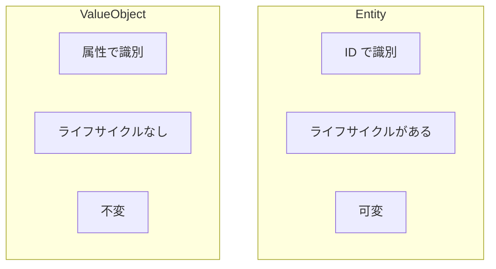

# Phase 2-1: エンティティと値オブジェクト

## 学習目標

この単元を終えると、以下ができるようになります：

- エンティティと値オブジェクトを区別できる
- 適切に実装できる
- 不変性の利点を理解できる

## エンティティ vs 値オブジェクト



| 特性 | エンティティ | 値オブジェクト |
|------|------------|--------------|
| **識別** | ID | 全属性 |
| **等価性** | ID が同じ | 属性がすべて同じ |
| **可変性** | 可変 | 不変 |
| **例** | 会員、注文 | 住所、金額、日付範囲 |

## ハンズオン

### 演習1: 値オブジェクト

```python
# value_objects.py
from dataclasses import dataclass
from typing import Optional
import re

@dataclass(frozen=True)  # frozen=True で不変に
class Money:
    """金額を表す値オブジェクト"""
    amount: int  # 最小通貨単位（円）
    currency: str = 'JPY'
    
    def __post_init__(self):
        if self.amount < 0:
            raise ValueError('金額は0以上である必要があります')
    
    def add(self, other: 'Money') -> 'Money':
        if self.currency != other.currency:
            raise ValueError('通貨が異なります')
        return Money(self.amount + other.amount, self.currency)
    
    def subtract(self, other: 'Money') -> 'Money':
        if self.currency != other.currency:
            raise ValueError('通貨が異なります')
        return Money(self.amount - other.amount, self.currency)
    
    def multiply(self, factor: int) -> 'Money':
        return Money(self.amount * factor, self.currency)
    
    def apply_discount(self, percent: int) -> 'Money':
        if not 0 <= percent <= 100:
            raise ValueError('割引率は0-100の範囲')
        discounted = int(self.amount * (100 - percent) / 100)
        return Money(discounted, self.currency)

@dataclass(frozen=True)
class Email:
    """メールアドレスを表す値オブジェクト"""
    value: str
    
    def __post_init__(self):
        if not self._is_valid_email(self.value):
            raise ValueError(f'無効なメールアドレス: {self.value}')
    
    @staticmethod
    def _is_valid_email(email: str) -> bool:
        pattern = r'^[a-zA-Z0-9._%+-]+@[a-zA-Z0-9.-]+\.[a-zA-Z]{2,}$'
        return bool(re.match(pattern, email))
    
    @property
    def domain(self) -> str:
        return self.value.split('@')[1]

@dataclass(frozen=True)
class Address:
    """住所を表す値オブジェクト"""
    postal_code: str
    prefecture: str
    city: str
    street: str
    building: Optional[str] = None
    
    def __post_init__(self):
        if not re.match(r'^\d{3}-\d{4}$', self.postal_code):
            raise ValueError('郵便番号の形式が不正です')
    
    @property
    def full_address(self) -> str:
        addr = f'{self.postal_code} {self.prefecture}{self.city}{self.street}'
        if self.building:
            addr += f' {self.building}'
        return addr

@dataclass(frozen=True)
class DateRange:
    """日付範囲を表す値オブジェクト"""
    from datetime import date
    
    start: date
    end: date
    
    def __post_init__(self):
        if self.start > self.end:
            raise ValueError('開始日は終了日以前である必要があります')
    
    def overlaps(self, other: 'DateRange') -> bool:
        return self.start <= other.end and other.start <= self.end
    
    @property
    def days(self) -> int:
        return (self.end - self.start).days + 1

# 使用例
def demo():
    # 金額
    price = Money(1000)
    tax = Money(100)
    total = price.add(tax)
    print(f'合計: {total.amount}円')
    
    discounted = total.apply_discount(10)
    print(f'10%オフ: {discounted.amount}円')
    
    # 等価性（値が同じなら等しい）
    m1 = Money(1000)
    m2 = Money(1000)
    print(f'm1 == m2: {m1 == m2}')  # True
    
    # メール
    email = Email('user@example.com')
    print(f'ドメイン: {email.domain}')
    
    # 住所
    address = Address(
        postal_code='100-0001',
        prefecture='東京都',
        city='千代田区',
        street='千代田1-1'
    )
    print(f'住所: {address.full_address}')

if __name__ == '__main__':
    demo()
```

### 演習2: エンティティ

```python
# entities.py
from dataclasses import dataclass, field
from typing import List, Optional
from datetime import datetime
import uuid

@dataclass(frozen=True)
class MemberId:
    """会員IDを表す値オブジェクト"""
    value: str
    
    @classmethod
    def generate(cls) -> 'MemberId':
        return cls(str(uuid.uuid4()))

class Member:
    """会員エンティティ"""
    
    def __init__(
        self,
        member_id: MemberId,
        email: Email,
        name: str
    ):
        self._member_id = member_id
        self._email = email
        self._name = name
        self._status = 'active'
        self._created_at = datetime.now()
    
    @property
    def member_id(self) -> MemberId:
        return self._member_id
    
    @property
    def email(self) -> Email:
        return self._email
    
    @property
    def name(self) -> str:
        return self._name
    
    @property
    def is_active(self) -> bool:
        return self._status == 'active'
    
    def change_email(self, new_email: Email):
        """メールアドレスを変更"""
        self._email = new_email
    
    def change_name(self, new_name: str):
        """名前を変更"""
        if not new_name or len(new_name) > 100:
            raise ValueError('名前は1-100文字')
        self._name = new_name
    
    def suspend(self):
        """会員を停止"""
        self._status = 'suspended'
    
    def reactivate(self):
        """会員を再開"""
        self._status = 'active'
    
    def __eq__(self, other):
        """エンティティはIDで等価性を判断"""
        if not isinstance(other, Member):
            return False
        return self._member_id == other._member_id
    
    def __hash__(self):
        return hash(self._member_id)

# 使用例
def demo():
    member_id = MemberId.generate()
    email = Email('user@example.com')
    
    member1 = Member(member_id, email, '田中太郎')
    
    # 属性を変更してもIDが同じなら同一エンティティ
    member1.change_name('田中次郎')
    
    member2 = Member(member_id, email, '別の名前')
    
    print(f'member1 == member2: {member1 == member2}')  # True（IDが同じ）

if __name__ == '__main__':
    demo()
```

### 演習3: 複合値オブジェクト

```python
# composite_value_objects.py
from dataclasses import dataclass
from typing import List

@dataclass(frozen=True)
class OrderItem:
    """注文明細（値オブジェクト）"""
    product_id: str
    product_name: str
    unit_price: Money
    quantity: int
    
    def __post_init__(self):
        if self.quantity < 1:
            raise ValueError('数量は1以上')
    
    @property
    def subtotal(self) -> Money:
        return self.unit_price.multiply(self.quantity)

@dataclass(frozen=True)
class OrderSummary:
    """注文概要（値オブジェクト）"""
    items: tuple  # 不変にするためtupleを使用
    
    @property
    def total_items(self) -> int:
        return sum(item.quantity for item in self.items)
    
    @property
    def total_amount(self) -> Money:
        total = Money(0)
        for item in self.items:
            total = total.add(item.subtotal)
        return total
    
    @classmethod
    def from_items(cls, items: List[OrderItem]) -> 'OrderSummary':
        return cls(tuple(items))
```

## 理解度確認

### 問題

以下のうち、値オブジェクトとして適切なのはどれか。

**A.** 顧客

**B.** 注文

**C.** 金額

**D.** 商品

---

### 解答・解説

**正解: C**

金額（Money）は典型的な値オブジェクトです。「1000円」と「1000円」は同じ価値であり、識別の必要がありません。一方、顧客、注文、商品はそれぞれ固有のIDを持ち、ライフサイクルがあるエンティティです。

---

## 次のステップ

エンティティと値オブジェクトを学びました。次は集約を学びましょう。

**次の単元**: [Phase 2-2: 集約](./02_集約.md)
