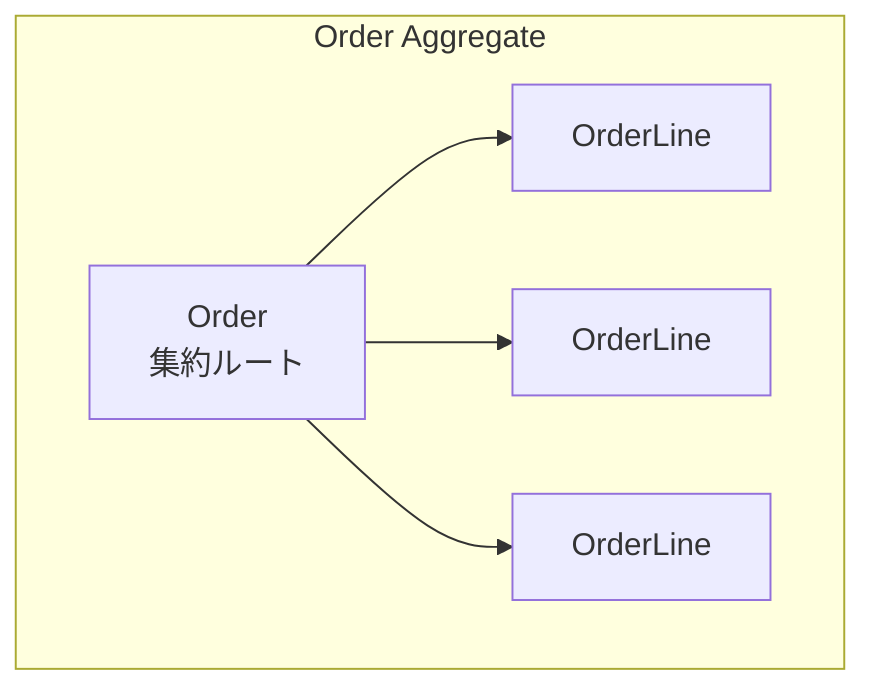

# Phase 2-2: 集約

## 学習目標

この単元を終えると、以下ができるようになります：

- 集約の境界を定義できる
- 集約ルートを識別できる
- 不変条件を守る設計ができる

## 集約とは



### 集約のルール

1. **集約ルート経由でアクセス** - 内部エンティティへの直接アクセスは禁止
2. **トランザクション境界** - 集約は1トランザクションで保存
3. **不変条件の保護** - 集約内で整合性を維持

## ハンズオン

### 演習1: 注文集約

```python
# order_aggregate.py
from dataclasses import dataclass
from typing import List, Optional
from datetime import datetime
from enum import Enum
import uuid

# 値オブジェクト
@dataclass(frozen=True)
class OrderId:
    value: str
    
    @classmethod
    def generate(cls) -> 'OrderId':
        return cls(str(uuid.uuid4()))

@dataclass(frozen=True)
class Money:
    amount: int

@dataclass(frozen=True)
class OrderLineId:
    value: str
    
    @classmethod
    def generate(cls) -> 'OrderLineId':
        return cls(str(uuid.uuid4()))

class OrderStatus(Enum):
    DRAFT = 'draft'
    CONFIRMED = 'confirmed'
    SHIPPED = 'shipped'
    CANCELLED = 'cancelled'

# 集約内のエンティティ
class OrderLine:
    """注文明細（集約内エンティティ）"""
    
    def __init__(
        self,
        line_id: OrderLineId,
        product_id: str,
        product_name: str,
        unit_price: Money,
        quantity: int
    ):
        self._line_id = line_id
        self._product_id = product_id
        self._product_name = product_name
        self._unit_price = unit_price
        self._quantity = quantity
        
        if quantity < 1:
            raise ValueError('数量は1以上')
    
    @property
    def line_id(self) -> OrderLineId:
        return self._line_id
    
    @property
    def product_id(self) -> str:
        return self._product_id
    
    @property
    def subtotal(self) -> Money:
        return Money(self._unit_price.amount * self._quantity)
    
    def change_quantity(self, new_quantity: int):
        if new_quantity < 1:
            raise ValueError('数量は1以上')
        self._quantity = new_quantity

# 集約ルート
class Order:
    """注文集約ルート"""
    
    MAX_LINES = 100
    MAX_TOTAL = Money(10_000_000)  # 1000万円
    
    def __init__(self, order_id: OrderId, customer_id: str):
        self._order_id = order_id
        self._customer_id = customer_id
        self._lines: List[OrderLine] = []
        self._status = OrderStatus.DRAFT
        self._created_at = datetime.now()
    
    @property
    def order_id(self) -> OrderId:
        return self._order_id
    
    @property
    def status(self) -> OrderStatus:
        return self._status
    
    @property
    def total(self) -> Money:
        return Money(sum(line.subtotal.amount for line in self._lines))
    
    @property
    def lines(self) -> List[OrderLine]:
        """読み取り専用のコピーを返す"""
        return list(self._lines)
    
    # ===== ビジネスメソッド =====
    
    def add_line(
        self,
        product_id: str,
        product_name: str,
        unit_price: Money,
        quantity: int
    ) -> OrderLineId:
        """注文明細を追加"""
        self._ensure_modifiable()
        
        if len(self._lines) >= self.MAX_LINES:
            raise OrderError('明細数が上限を超えています')
        
        line_id = OrderLineId.generate()
        line = OrderLine(line_id, product_id, product_name, unit_price, quantity)
        
        # 不変条件: 合計金額チェック
        new_total = Money(self.total.amount + line.subtotal.amount)
        if new_total.amount > self.MAX_TOTAL.amount:
            raise OrderError('注文金額が上限を超えています')
        
        self._lines.append(line)
        return line_id
    
    def remove_line(self, line_id: OrderLineId):
        """注文明細を削除"""
        self._ensure_modifiable()
        
        line = self._find_line(line_id)
        if not line:
            raise OrderError('明細が見つかりません')
        
        self._lines.remove(line)
    
    def change_line_quantity(self, line_id: OrderLineId, new_quantity: int):
        """明細の数量を変更"""
        self._ensure_modifiable()
        
        line = self._find_line(line_id)
        if not line:
            raise OrderError('明細が見つかりません')
        
        old_subtotal = line.subtotal.amount
        new_subtotal = line._unit_price.amount * new_quantity
        new_total = Money(self.total.amount - old_subtotal + new_subtotal)
        
        if new_total.amount > self.MAX_TOTAL.amount:
            raise OrderError('注文金額が上限を超えています')
        
        line.change_quantity(new_quantity)
    
    def confirm(self):
        """注文を確定"""
        if not self._lines:
            raise OrderError('明細がありません')
        
        self._status = OrderStatus.CONFIRMED
    
    def ship(self):
        """出荷"""
        if self._status != OrderStatus.CONFIRMED:
            raise OrderError('確定済みの注文のみ出荷できます')
        
        self._status = OrderStatus.SHIPPED
    
    def cancel(self):
        """キャンセル"""
        if self._status == OrderStatus.SHIPPED:
            raise OrderError('出荷済みの注文はキャンセルできません')
        
        self._status = OrderStatus.CANCELLED
    
    # ===== プライベートメソッド =====
    
    def _ensure_modifiable(self):
        if self._status != OrderStatus.DRAFT:
            raise OrderError('下書き状態の注文のみ変更できます')
    
    def _find_line(self, line_id: OrderLineId) -> Optional[OrderLine]:
        for line in self._lines:
            if line.line_id == line_id:
                return line
        return None

class OrderError(Exception):
    """注文ドメインエラー"""
    pass
```

### 演習2: 集約の設計ガイドライン

```python
# aggregate_design.py
"""
集約設計のガイドライン
"""

# ❌ 大きすぎる集約
class BadOrder:
    """問題: 集約が大きすぎる"""
    def __init__(self):
        self.lines = []
        self.customer = Customer()  # 顧客全体を含む
        self.payments = []           # 支払い履歴すべて
        self.shipments = []          # 出荷履歴すべて

# ✅ 適切なサイズの集約
class GoodOrder:
    """改善: 必要最小限のデータ"""
    def __init__(self):
        self.lines = []
        self.customer_id = None      # IDのみ参照
        # payments, shipments は別の集約

# ❌ 集約間の直接参照
class BadProduct:
    """問題: 別の集約を直接参照"""
    def __init__(self):
        self.category = Category()   # 直接参照

# ✅ IDによる参照
class GoodProduct:
    """改善: IDで参照"""
    def __init__(self):
        self.category_id = None      # IDのみ

# 集約設計の原則
"""
1. 小さく保つ
   - メモリとパフォーマンスのため
   - 変更の競合を減らすため

2. IDで参照
   - 他の集約はIDで参照
   - 必要に応じて取得

3. 結果整合性を許容
   - 集約間は即時整合性でなくてよい
   - ドメインイベントで同期

4. 不変条件で境界を決める
   - 同時に守るべきルールがある範囲が集約
"""
```

### 演習3: 在庫管理の例

```python
# inventory_aggregate.py
from dataclasses import dataclass
from typing import List
from datetime import datetime

@dataclass(frozen=True)
class InventoryId:
    value: str

@dataclass(frozen=True)
class StockMovement:
    """在庫移動記録（値オブジェクト）"""
    movement_type: str  # 'in' or 'out'
    quantity: int
    reason: str
    occurred_at: datetime

class Inventory:
    """在庫集約"""
    
    def __init__(self, inventory_id: InventoryId, product_id: str):
        self._inventory_id = inventory_id
        self._product_id = product_id
        self._quantity = 0
        self._movements: List[StockMovement] = []
    
    @property
    def quantity(self) -> int:
        return self._quantity
    
    def receive(self, quantity: int, reason: str = '入荷'):
        """入庫"""
        if quantity < 1:
            raise InventoryError('数量は1以上')
        
        self._quantity += quantity
        self._movements.append(StockMovement(
            movement_type='in',
            quantity=quantity,
            reason=reason,
            occurred_at=datetime.now()
        ))
    
    def ship(self, quantity: int, order_id: str):
        """出庫"""
        if quantity < 1:
            raise InventoryError('数量は1以上')
        
        if self._quantity < quantity:
            raise InventoryError(
                f'在庫不足: 現在{self._quantity}, 要求{quantity}'
            )
        
        self._quantity -= quantity
        self._movements.append(StockMovement(
            movement_type='out',
            quantity=quantity,
            reason=f'注文{order_id}への出荷',
            occurred_at=datetime.now()
        ))
    
    def reserve(self, quantity: int, order_id: str) -> bool:
        """在庫予約（引当）"""
        if self._quantity >= quantity:
            self.ship(quantity, order_id)
            return True
        return False

class InventoryError(Exception):
    pass
```

## 理解度確認

### 問題

集約ルートの役割として正しいものはどれか。

**A.** データベースへのアクセスを担当

**B.** 集約内の不変条件を守り、唯一の入り口となる

**C.** UI からの入力を受け付ける

**D.** 外部 API との通信を行う

---

### 解答・解説

**正解: B**

集約ルートは集約内の不変条件（ビジネスルール）を守り、外部からのアクセスはすべて集約ルートを経由します。これにより、集約内の整合性が保たれます。

---

## 次のステップ

集約を学びました。次はリポジトリを学びましょう。

**次の単元**: [Phase 3-1: リポジトリ](../phase3/01_リポジトリ.md)
