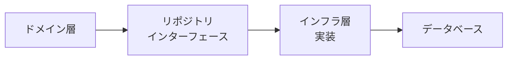

# Phase 3-1: リポジトリ

## 学習目標

この単元を終えると、以下ができるようになります：

- リポジトリパターンを実装できる
- 永続化を抽象化できる
- テスト可能な設計ができる

## リポジトリとは



**永続化の詳細をドメインから隠蔽**

### リポジトリの責務

| する | しない |
|------|-------|
| 集約の保存・取得 | ビジネスロジック |
| コレクションのような操作 | 複雑なクエリ |
| ID による検索 | 複数集約をまたぐ操作 |

## ハンズオン

### 演習1: リポジトリインターフェース

```python
# repository_interface.py
from abc import ABC, abstractmethod
from typing import Optional, List

class OrderRepository(ABC):
    """注文リポジトリのインターフェース（ドメイン層で定義）"""
    
    @abstractmethod
    def save(self, order: Order) -> None:
        """注文を保存"""
        pass
    
    @abstractmethod
    def find_by_id(self, order_id: OrderId) -> Optional[Order]:
        """IDで注文を取得"""
        pass
    
    @abstractmethod
    def find_by_customer_id(self, customer_id: str) -> List[Order]:
        """顧客の注文一覧を取得"""
        pass
    
    @abstractmethod
    def delete(self, order: Order) -> None:
        """注文を削除"""
        pass
    
    @abstractmethod
    def next_id(self) -> OrderId:
        """次のIDを生成"""
        pass
```

### 演習2: インメモリ実装

```python
# inmemory_repository.py
from typing import Dict, Optional, List
import uuid

class InMemoryOrderRepository(OrderRepository):
    """テスト用のインメモリ実装"""
    
    def __init__(self):
        self._orders: Dict[str, Order] = {}
    
    def save(self, order: Order) -> None:
        self._orders[order.order_id.value] = order
    
    def find_by_id(self, order_id: OrderId) -> Optional[Order]:
        return self._orders.get(order_id.value)
    
    def find_by_customer_id(self, customer_id: str) -> List[Order]:
        return [
            order for order in self._orders.values()
            if order._customer_id == customer_id
        ]
    
    def delete(self, order: Order) -> None:
        self._orders.pop(order.order_id.value, None)
    
    def next_id(self) -> OrderId:
        return OrderId(str(uuid.uuid4()))
```

### 演習3: SQLAlchemy 実装

```python
# sqlalchemy_repository.py
from sqlalchemy import create_engine, Column, String, Integer, DateTime, ForeignKey
from sqlalchemy.ext.declarative import declarative_base
from sqlalchemy.orm import sessionmaker, relationship
from typing import Optional, List

Base = declarative_base()

# ORM モデル（インフラ層）
class OrderModel(Base):
    __tablename__ = 'orders'
    
    id = Column(String, primary_key=True)
    customer_id = Column(String, nullable=False)
    status = Column(String, nullable=False)
    created_at = Column(DateTime, nullable=False)
    
    lines = relationship('OrderLineModel', back_populates='order')

class OrderLineModel(Base):
    __tablename__ = 'order_lines'
    
    id = Column(String, primary_key=True)
    order_id = Column(String, ForeignKey('orders.id'), nullable=False)
    product_id = Column(String, nullable=False)
    product_name = Column(String, nullable=False)
    unit_price = Column(Integer, nullable=False)
    quantity = Column(Integer, nullable=False)
    
    order = relationship('OrderModel', back_populates='lines')

class SqlAlchemyOrderRepository(OrderRepository):
    """SQLAlchemy 実装"""
    
    def __init__(self, session):
        self._session = session
    
    def save(self, order: Order) -> None:
        # ドメインモデル → ORMモデル
        order_model = self._to_model(order)
        
        existing = self._session.query(OrderModel).get(order.order_id.value)
        if existing:
            # 更新
            self._session.merge(order_model)
        else:
            # 新規
            self._session.add(order_model)
        
        self._session.commit()
    
    def find_by_id(self, order_id: OrderId) -> Optional[Order]:
        model = self._session.query(OrderModel).get(order_id.value)
        if not model:
            return None
        return self._to_entity(model)
    
    def find_by_customer_id(self, customer_id: str) -> List[Order]:
        models = self._session.query(OrderModel).filter_by(
            customer_id=customer_id
        ).all()
        return [self._to_entity(m) for m in models]
    
    def delete(self, order: Order) -> None:
        model = self._session.query(OrderModel).get(order.order_id.value)
        if model:
            self._session.delete(model)
            self._session.commit()
    
    def next_id(self) -> OrderId:
        return OrderId.generate()
    
    # マッパー
    def _to_model(self, order: Order) -> OrderModel:
        return OrderModel(
            id=order.order_id.value,
            customer_id=order._customer_id,
            status=order.status.value,
            created_at=order._created_at,
            lines=[
                OrderLineModel(
                    id=line.line_id.value,
                    order_id=order.order_id.value,
                    product_id=line._product_id,
                    product_name=line._product_name,
                    unit_price=line._unit_price.amount,
                    quantity=line._quantity
                )
                for line in order.lines
            ]
        )
    
    def _to_entity(self, model: OrderModel) -> Order:
        order = Order(
            order_id=OrderId(model.id),
            customer_id=model.customer_id
        )
        order._status = OrderStatus(model.status)
        order._created_at = model.created_at
        
        for line_model in model.lines:
            line = OrderLine(
                line_id=OrderLineId(line_model.id),
                product_id=line_model.product_id,
                product_name=line_model.product_name,
                unit_price=Money(line_model.unit_price),
                quantity=line_model.quantity
            )
            order._lines.append(line)
        
        return order
```

### 演習4: テスト

```python
# test_order.py
import pytest

class TestOrder:
    def test_add_line(self):
        # Arrange
        repo = InMemoryOrderRepository()
        order = Order(repo.next_id(), 'customer-1')
        
        # Act
        line_id = order.add_line(
            product_id='product-1',
            product_name='商品A',
            unit_price=Money(1000),
            quantity=2
        )
        
        # Assert
        assert len(order.lines) == 1
        assert order.total.amount == 2000
    
    def test_confirm_without_lines_fails(self):
        repo = InMemoryOrderRepository()
        order = Order(repo.next_id(), 'customer-1')
        
        with pytest.raises(OrderError):
            order.confirm()
    
    def test_repository_save_and_find(self):
        repo = InMemoryOrderRepository()
        order_id = repo.next_id()
        order = Order(order_id, 'customer-1')
        order.add_line('product-1', '商品A', Money(1000), 1)
        
        # 保存
        repo.save(order)
        
        # 取得
        found = repo.find_by_id(order_id)
        
        assert found is not None
        assert found.order_id == order_id
        assert len(found.lines) == 1
```

## 理解度確認

### 問題

リポジトリパターンの主な利点は何か。

**A.** データベースのパフォーマンスが向上する

**B.** ドメイン層がインフラの詳細に依存しなくなる

**C.** コード量が減る

**D.** 複雑なクエリが書きやすくなる

---

### 解答・解説

**正解: B**

リポジトリパターンにより、ドメイン層はデータベースや ORM の詳細を知る必要がなくなります。これにより、テストが容易になり、インフラの変更がドメインに影響しなくなります。

---

## 次のステップ

リポジトリを学びました。次はドメインサービスを学びましょう。

**次の単元**: [Phase 3-2: ドメインサービス](./02_ドメインサービス.md)
