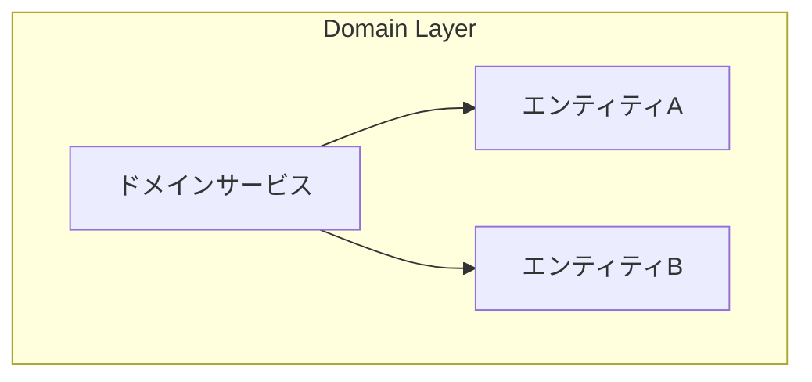

# Phase 3-2: ドメインサービス

## 学習目標

この単元を終えると、以下ができるようになります：

- ドメインサービスの適切な使い方がわかる
- アプリケーションサービスとの違いを理解できる
- ドメインイベントを活用できる

## ドメインサービスとは



**単一のエンティティに属さないドメインロジック**

### いつ使うか

| ドメインサービスを使う | エンティティに書く |
|---------------------|------------------|
| 複数の集約にまたがる操作 | 1つの集約内で完結 |
| 外部情報が必要 | エンティティ自身の状態で判断 |
| 計算ロジックのみ | 状態を持つ |

## ハンズオン

### 演習1: ドメインサービス

```python
# domain_service.py
from abc import ABC, abstractmethod

class TransferService:
    """送金ドメインサービス"""
    
    def __init__(
        self,
        account_repo: 'AccountRepository',
        transfer_limit_policy: 'TransferLimitPolicy'
    ):
        self.account_repo = account_repo
        self.transfer_limit_policy = transfer_limit_policy
    
    def transfer(
        self,
        from_account_id: str,
        to_account_id: str,
        amount: Money
    ) -> None:
        """送金を実行"""
        # 送金元・送金先を取得
        from_account = self.account_repo.find_by_id(from_account_id)
        to_account = self.account_repo.find_by_id(to_account_id)
        
        if not from_account or not to_account:
            raise TransferError('口座が見つかりません')
        
        # 送金限度額チェック（ポリシー）
        if not self.transfer_limit_policy.is_allowed(from_account, amount):
            raise TransferError('送金限度額を超えています')
        
        # 送金実行（2つの集約を操作）
        from_account.withdraw(amount)
        to_account.deposit(amount)
        
        # 保存
        self.account_repo.save(from_account)
        self.account_repo.save(to_account)

class TransferLimitPolicy(ABC):
    """送金限度額ポリシー"""
    
    @abstractmethod
    def is_allowed(self, account: 'Account', amount: Money) -> bool:
        pass

class DailyTransferLimitPolicy(TransferLimitPolicy):
    """1日あたりの送金限度額"""
    
    DAILY_LIMIT = Money(1_000_000)  # 100万円
    
    def is_allowed(self, account: 'Account', amount: Money) -> bool:
        today_total = account.get_today_transfer_total()
        return today_total.add(amount).amount <= self.DAILY_LIMIT.amount

class TransferError(Exception):
    pass
```

### 演習2: アプリケーションサービス

```python
# application_service.py
from dataclasses import dataclass

@dataclass
class CreateOrderCommand:
    """注文作成コマンド"""
    customer_id: str
    items: list  # [{'product_id': '', 'quantity': 1}, ...]

@dataclass
class CreateOrderResult:
    """注文作成結果"""
    order_id: str
    total: int

class OrderApplicationService:
    """注文アプリケーションサービス"""
    
    def __init__(
        self,
        order_repo: OrderRepository,
        product_repo: ProductRepository,
        inventory_service: 'InventoryService',
        notification_service: 'NotificationService'
    ):
        self.order_repo = order_repo
        self.product_repo = product_repo
        self.inventory_service = inventory_service
        self.notification_service = notification_service
    
    def create_order(self, command: CreateOrderCommand) -> CreateOrderResult:
        """注文を作成"""
        # 注文を作成
        order_id = self.order_repo.next_id()
        order = Order(order_id, command.customer_id)
        
        # 商品を追加
        for item in command.items:
            product = self.product_repo.find_by_id(item['product_id'])
            if not product:
                raise ApplicationError(f'商品が見つかりません: {item["product_id"]}')
            
            order.add_line(
                product_id=product.product_id,
                product_name=product.name,
                unit_price=product.price,
                quantity=item['quantity']
            )
        
        # 在庫確認（ドメインサービス）
        if not self.inventory_service.check_availability(order):
            raise ApplicationError('在庫が不足しています')
        
        # 注文確定
        order.confirm()
        
        # 在庫引当
        self.inventory_service.reserve(order)
        
        # 保存
        self.order_repo.save(order)
        
        # 通知（アプリケーション層の責務）
        self.notification_service.notify_order_created(order)
        
        return CreateOrderResult(
            order_id=order.order_id.value,
            total=order.total.amount
        )

class ApplicationError(Exception):
    pass
```

### 演習3: ドメインイベント

```python
# domain_events.py
from dataclasses import dataclass
from datetime import datetime
from typing import List, Callable
from abc import ABC

class DomainEvent(ABC):
    """ドメインイベント基底"""
    pass

@dataclass
class OrderConfirmed(DomainEvent):
    """注文確定イベント"""
    order_id: str
    customer_id: str
    total_amount: int
    occurred_at: datetime = None
    
    def __post_init__(self):
        self.occurred_at = datetime.now()

@dataclass
class PaymentReceived(DomainEvent):
    """支払い完了イベント"""
    order_id: str
    amount: int
    payment_method: str
    occurred_at: datetime = None

# イベントパブリッシャー
class DomainEventPublisher:
    _handlers: dict = {}
    
    @classmethod
    def subscribe(cls, event_type: type, handler: Callable):
        if event_type not in cls._handlers:
            cls._handlers[event_type] = []
        cls._handlers[event_type].append(handler)
    
    @classmethod
    def publish(cls, event: DomainEvent):
        event_type = type(event)
        if event_type in cls._handlers:
            for handler in cls._handlers[event_type]:
                handler(event)

# イベントハンドラー
class InventoryEventHandler:
    def __init__(self, inventory_service: 'InventoryService'):
        self.inventory_service = inventory_service
    
    def handle_order_confirmed(self, event: OrderConfirmed):
        """注文確定時に在庫を確定"""
        self.inventory_service.commit_reservation(event.order_id)

class NotificationEventHandler:
    def __init__(self, email_service: 'EmailService'):
        self.email_service = email_service
    
    def handle_order_confirmed(self, event: OrderConfirmed):
        """注文確定時にメール送信"""
        self.email_service.send_order_confirmation(
            event.order_id,
            event.customer_id
        )

# エンティティでイベントを発行
class Order:
    def __init__(self, order_id: OrderId, customer_id: str):
        self._events: List[DomainEvent] = []
        # ...
    
    def confirm(self):
        # ビジネスロジック
        self._status = OrderStatus.CONFIRMED
        
        # イベント発行
        self._events.append(OrderConfirmed(
            order_id=self.order_id.value,
            customer_id=self._customer_id,
            total_amount=self.total.amount
        ))
    
    def get_domain_events(self) -> List[DomainEvent]:
        events = self._events.copy()
        self._events.clear()
        return events
```

## アプリケーションサービス vs ドメインサービス

| アプリケーションサービス | ドメインサービス |
|----------------------|----------------|
| ユースケースの調整 | ドメインロジック |
| トランザクション管理 | 計算・判定 |
| 外部サービス呼び出し | 複数集約の操作 |
| 入力変換 | ビジネスルール |

## 理解度確認

### 問題

2つの口座間で送金を行うロジックは、どこに実装すべきか。

**A.** Account エンティティ

**B.** ドメインサービス

**C.** アプリケーションサービス

**D.** リポジトリ

---

### 解答・解説

**正解: B**

送金は2つの Account 集約にまたがる操作であり、単一のエンティティには属しません。このようなドメインロジックはドメインサービスに実装します。

---

## 次のステップ

ドメインサービスを学びました。次は境界づけられたコンテキストを学びましょう。

**次の単元**: [Phase 4-1: 境界づけられたコンテキスト](../phase4/01_境界づけられたコンテキスト.md)
