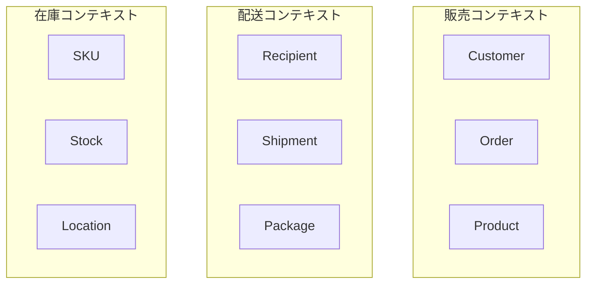

# Phase 4-1: 境界づけられたコンテキスト

## 学習目標

この単元を終えると、以下ができるようになります：

- 境界づけられたコンテキストを識別できる
- コンテキストごとのモデルを設計できる
- マイクロサービスの境界を定義できる

## 境界づけられたコンテキストとは



**同じ言葉でも、コンテキストによって意味が異なる**

### 例: 「商品」

| コンテキスト | 「商品」の意味 | 重要な属性 |
|------------|-------------|----------|
| 販売 | 売れるもの | 価格、説明、画像 |
| 在庫 | 管理するもの | SKU、数量、ロケーション |
| 配送 | 届けるもの | 重量、サイズ、梱包方法 |

## ハンズオン

### 演習1: コンテキストの分離

```python
# sales_context/models.py
"""販売コンテキストのモデル"""

class Product:
    """販売における商品"""
    def __init__(
        self,
        product_id: str,
        name: str,
        description: str,
        price: Money,
        images: list
    ):
        self.product_id = product_id
        self.name = name
        self.description = description
        self.price = price
        self.images = images
    
    def is_available_for_sale(self) -> bool:
        return self.price.amount > 0

class Order:
    """注文"""
    def __init__(self, order_id: str, customer_id: str):
        self.order_id = order_id
        self.customer_id = customer_id
        self.lines = []
    
    def add_product(self, product: Product, quantity: int):
        self.lines.append({
            'product_id': product.product_id,
            'name': product.name,
            'unit_price': product.price,
            'quantity': quantity
        })
```

```python
# inventory_context/models.py
"""在庫コンテキストのモデル"""

class SKU:
    """在庫管理における商品"""
    def __init__(
        self,
        sku_code: str,
        product_id: str,  # 販売コンテキストへの参照
        location: str
    ):
        self.sku_code = sku_code
        self.product_id = product_id
        self.location = location
        self.quantity = 0
    
    def receive(self, quantity: int):
        self.quantity += quantity
    
    def ship(self, quantity: int):
        if self.quantity < quantity:
            raise InsufficientStockError()
        self.quantity -= quantity
```

```python
# shipping_context/models.py
"""配送コンテキストのモデル"""

class Package:
    """配送における荷物"""
    def __init__(
        self,
        package_id: str,
        order_id: str,  # 販売コンテキストへの参照
        weight: float,
        dimensions: dict
    ):
        self.package_id = package_id
        self.order_id = order_id
        self.weight = weight
        self.dimensions = dimensions
        self.status = 'preparing'
    
    def dispatch(self, tracking_number: str):
        self.tracking_number = tracking_number
        self.status = 'dispatched'

class Recipient:
    """受取人（Customerとは別の概念）"""
    def __init__(self, name: str, address: Address, phone: str):
        self.name = name
        self.address = address
        self.phone = phone
```

### 演習2: コンテキスト間の連携

```python
# anti_corruption_layer.py
"""
腐敗防止層（Anti-Corruption Layer）
外部コンテキストのモデルを自コンテキストのモデルに変換
"""

class ShippingContextAdapter:
    """販売コンテキスト → 配送コンテキストの変換"""
    
    def __init__(self, order_repo, customer_repo):
        self.order_repo = order_repo
        self.customer_repo = customer_repo
    
    def create_shipment_from_order(self, order_id: str) -> 'Shipment':
        # 販売コンテキストから注文を取得
        order = self.order_repo.find_by_id(order_id)
        customer = self.customer_repo.find_by_id(order.customer_id)
        
        # 配送コンテキストのモデルに変換
        recipient = Recipient(
            name=customer.name,
            address=customer.shipping_address,
            phone=customer.phone
        )
        
        packages = []
        for line in order.lines:
            package = Package(
                package_id=self.generate_package_id(),
                order_id=order.order_id,
                weight=self.calculate_weight(line),
                dimensions=self.calculate_dimensions(line)
            )
            packages.append(package)
        
        return Shipment(
            shipment_id=self.generate_shipment_id(),
            order_id=order.order_id,
            recipient=recipient,
            packages=packages
        )
```

### 演習3: イベント駆動連携

```python
# event_driven_integration.py
"""
イベント駆動でのコンテキスト間連携
"""

# 販売コンテキストでイベント発行
class OrderConfirmed:
    """注文確定イベント（販売コンテキスト）"""
    def __init__(self, order_id: str, customer_id: str, items: list):
        self.order_id = order_id
        self.customer_id = customer_id
        self.items = items

# 在庫コンテキストでイベント購読
class InventoryEventHandler:
    """在庫コンテキストのイベントハンドラ"""
    
    def __init__(self, stock_service):
        self.stock_service = stock_service
    
    def handle_order_confirmed(self, event: OrderConfirmed):
        """注文確定時に在庫を引き当て"""
        for item in event.items:
            self.stock_service.reserve(
                product_id=item['product_id'],
                quantity=item['quantity'],
                order_id=event.order_id
            )

# 配送コンテキストでイベント購読
class ShippingEventHandler:
    """配送コンテキストのイベントハンドラ"""
    
    def __init__(self, shipment_service):
        self.shipment_service = shipment_service
    
    def handle_order_confirmed(self, event: OrderConfirmed):
        """注文確定時に配送準備開始"""
        self.shipment_service.prepare_shipment(event.order_id)
```

### 演習4: マイクロサービス境界

```yaml
# サービス構成例
services:
  # 販売サービス
  sales-service:
    context: Sales
    responsibilities:
      - 商品カタログ管理
      - 注文受付
      - 顧客管理
    database: sales_db
    events:
      publishes:
        - OrderConfirmed
        - OrderCancelled
    
  # 在庫サービス
  inventory-service:
    context: Inventory
    responsibilities:
      - 在庫管理
      - 入荷処理
      - 引当処理
    database: inventory_db
    events:
      subscribes:
        - OrderConfirmed
      publishes:
        - StockReserved
        - OutOfStock
    
  # 配送サービス
  shipping-service:
    context: Shipping
    responsibilities:
      - 配送手配
      - 追跡
      - 配達完了
    database: shipping_db
    events:
      subscribes:
        - StockReserved
      publishes:
        - ShipmentDispatched
        - ShipmentDelivered
```

## 理解度確認

### 問題

同じ「顧客」という概念が、販売コンテキストでは「購入者」、配送コンテキストでは「受取人」と呼ばれる場合、どうすべきか。

**A.** 1つの Customer クラスで両方を表現

**B.** 各コンテキストで別々のモデルを定義

**C.** 継承を使って共通部分を抽出

**D.** どちらか一方の呼び方に統一

---

### 解答・解説

**正解: B**

境界づけられたコンテキストでは、同じ概念でもコンテキストごとに異なるモデルを持つのが正しいアプローチです。各コンテキストで必要な属性・振る舞いが異なるため、別々に定義します。

---

## 次のステップ

境界づけられたコンテキストを学びました。次はコンテキストマップを学びましょう。

**次の単元**: [Phase 4-2: コンテキストマップ](./02_コンテキストマップ.md)
