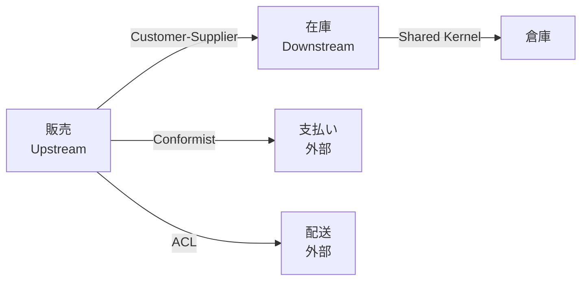

# Phase 4-2: コンテキストマップ

## 学習目標

この単元を終えると、以下ができるようになります：

- コンテキスト間の関係を図示できる
- 統合パターンを選択できる
- チーム間の協業を設計できる

## コンテキストマップとは



**コンテキスト間の関係と統合パターンを可視化**

## 統合パターン

| パターン | 関係 | 説明 |
|---------|------|------|
| **Shared Kernel** | 対等 | 共通のモデルを共有 |
| **Customer-Supplier** | 上流-下流 | 上流が下流の要求を考慮 |
| **Conformist** | 従属 | 下流が上流に完全に従う |
| **Anti-Corruption Layer** | 防御的 | 変換層で保護 |
| **Open Host Service** | 公開 | 標準APIを公開 |
| **Published Language** | 標準化 | 共通言語で通信 |

## ハンズオン

### 演習1: コンテキストマップの作成

```python
# context_map.py
"""
ECサイトのコンテキストマップ

販売コンテキスト (Core Domain)
    ↓ Customer-Supplier
在庫コンテキスト (Supporting)
    ↓ Anti-Corruption Layer
倉庫管理システム (External)

販売コンテキスト
    ↓ Open Host Service
モバイルアプリ (Frontend)

販売コンテキスト
    ← Conformist
決済サービス (External: Stripe)
"""

# Core Domain: 販売コンテキスト
class SalesContext:
    """コアドメイン: 販売"""
    
    # 公開API（Open Host Service）
    def get_product_catalog(self):
        """商品カタログAPI"""
        pass
    
    def create_order(self, customer_id, items):
        """注文作成API"""
        pass
    
    # 在庫コンテキストへの通知（Customer-Supplier）
    def notify_order_confirmed(self, order):
        """注文確定を通知"""
        event = OrderConfirmedEvent(
            order_id=order.order_id,
            items=order.lines
        )
        self.event_bus.publish(event)

# Supporting Domain: 在庫コンテキスト
class InventoryContext:
    """サポートドメイン: 在庫"""
    
    def handle_order_confirmed(self, event):
        """販売コンテキストからのイベント処理"""
        for item in event.items:
            self.reserve_stock(item.product_id, item.quantity)
```

### 演習2: Customer-Supplier パターン

```python
# customer_supplier.py
"""
Customer-Supplier パターン
上流（販売）が下流（在庫）の要求を考慮する
"""

# 上流（Supplier）: 販売コンテキスト
class SalesOrderService:
    def __init__(self, inventory_client: 'InventoryClient'):
        self.inventory_client = inventory_client
    
    def create_order(self, customer_id, items):
        # 下流（在庫）の要求を考慮して在庫確認
        for item in items:
            if not self.inventory_client.check_availability(
                item.product_id,
                item.quantity
            ):
                raise InsufficientStockError(item.product_id)
        
        # 注文作成
        order = Order(customer_id)
        for item in items:
            order.add_item(item)
        
        return order

# 下流（Customer）: 在庫コンテキスト
class InventoryService:
    """在庫サービス - 販売コンテキストの要求に応える"""
    
    def check_availability(self, product_id: str, quantity: int) -> bool:
        stock = self.stock_repo.find_by_product(product_id)
        return stock.available_quantity >= quantity
    
    def reserve(self, product_id: str, quantity: int, order_id: str):
        stock = self.stock_repo.find_by_product(product_id)
        stock.reserve(quantity, order_id)
        self.stock_repo.save(stock)
```

### 演習3: Anti-Corruption Layer

```python
# anti_corruption_layer.py
"""
Anti-Corruption Layer パターン
外部システムの影響から自コンテキストを保護
"""

# 外部システムのモデル（変更できない）
class ExternalWarehouseAPI:
    def get_stock_level(self, sku: str) -> dict:
        return {
            'sku': sku,
            'qty_on_hand': 100,
            'qty_reserved': 20,
            'location_code': 'WH-A-1-1'
        }
    
    def create_shipment_order(self, order: dict) -> dict:
        return {
            'shipment_id': 'SHP-12345',
            'status': 'PENDING',
            'eta': '2024-01-20'
        }

# 自コンテキストのモデル
class Stock:
    def __init__(self, product_id: str, available: int, reserved: int):
        self.product_id = product_id
        self.available = available
        self.reserved = reserved

class ShipmentRequest:
    def __init__(self, order_id: str, items: list, address: 'Address'):
        self.order_id = order_id
        self.items = items
        self.address = address

# 腐敗防止層
class WarehouseAntiCorruptionLayer:
    """外部倉庫システムとの変換層"""
    
    def __init__(self, external_api: ExternalWarehouseAPI):
        self.external_api = external_api
    
    def get_stock(self, product_id: str) -> Stock:
        """外部形式 → 自コンテキスト形式に変換"""
        sku = self._product_id_to_sku(product_id)
        external_data = self.external_api.get_stock_level(sku)
        
        return Stock(
            product_id=product_id,
            available=external_data['qty_on_hand'] - external_data['qty_reserved'],
            reserved=external_data['qty_reserved']
        )
    
    def request_shipment(self, request: ShipmentRequest) -> str:
        """自コンテキスト形式 → 外部形式に変換"""
        external_order = {
            'reference_id': request.order_id,
            'line_items': [
                {'sku': self._product_id_to_sku(i.product_id), 'qty': i.quantity}
                for i in request.items
            ],
            'ship_to': {
                'name': request.address.recipient,
                'addr1': request.address.street,
                'city': request.address.city,
                'postal': request.address.postal_code
            }
        }
        
        result = self.external_api.create_shipment_order(external_order)
        return result['shipment_id']
    
    def _product_id_to_sku(self, product_id: str) -> str:
        """商品IDをSKUに変換（マッピング）"""
        # 実際にはマッピングテーブルを参照
        return f'SKU-{product_id}'
```

### 演習4: Published Language

```python
# published_language.py
"""
Published Language パターン
コンテキスト間で共通の言語（スキーマ）を使用
"""

from pydantic import BaseModel
from typing import List
from datetime import datetime

# 公開イベントスキーマ（Published Language）
class OrderConfirmedEventV1(BaseModel):
    """注文確定イベント v1"""
    event_type: str = 'order.confirmed'
    version: str = '1.0'
    occurred_at: datetime
    
    order_id: str
    customer_id: str
    items: List[dict]  # [{'product_id': '', 'quantity': 1, 'price': 100}]
    total_amount: int
    currency: str = 'JPY'

class ShipmentDispatchedEventV1(BaseModel):
    """出荷完了イベント v1"""
    event_type: str = 'shipment.dispatched'
    version: str = '1.0'
    occurred_at: datetime
    
    shipment_id: str
    order_id: str
    tracking_number: str
    carrier: str
    estimated_delivery: datetime

# イベントバス（メッセージング）
class EventBus:
    def publish(self, event: BaseModel, topic: str):
        """イベントを発行（JSON形式）"""
        message = event.json()
        # Kafka, SQS, etc. に送信
        print(f'Publishing to {topic}: {message}')
    
    def subscribe(self, topic: str, handler):
        """イベントを購読"""
        pass
```

## 理解度確認

### 問題

外部の決済サービス（Stripe）を使用する場合、最適なパターンはどれか。

**A.** Shared Kernel

**B.** Customer-Supplier

**C.** Conformist または Anti-Corruption Layer

**D.** Open Host Service

---

### 解答・解説

**正解: C**

外部サービスの API は変更できないため、その仕様に従う（Conformist）か、自コンテキストを保護する変換層を設ける（Anti-Corruption Layer）のが適切です。Stripe のような標準的な API なら Conformist、独自形式なら ACL が良いでしょう。

---

## 次のステップ

コンテキストマップを学びました。次は総仕上げです。

**次の単元**: [Phase 5-1: 総仕上げ](../phase5/01_総仕上げ.md)
