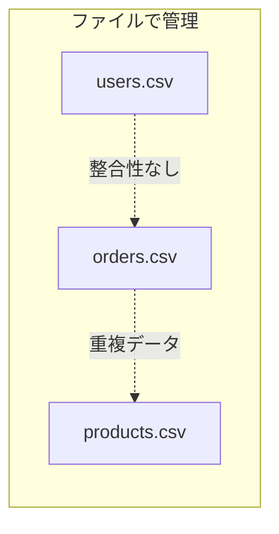
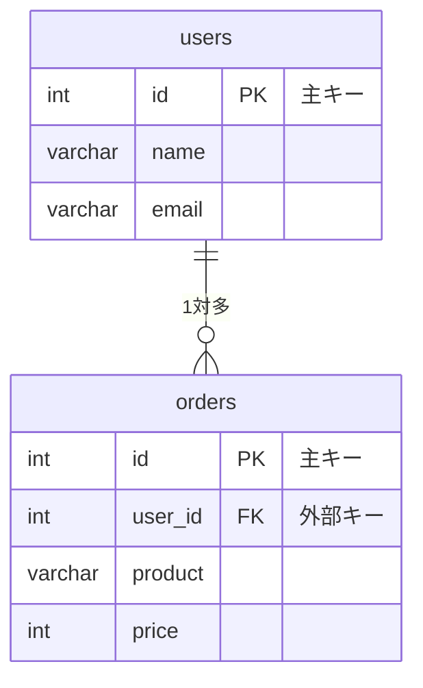

# Phase 1: データベースとは ～ RDB の基本概念 ～

## 学習目標

この単元を終えると、以下ができるようになります：

- データベースの役割と種類を説明できる
- RDB の基本構造（テーブル、行、列）を理解できる
- 主キー・外部キーの概念を説明できる
- MySQL の基本構造を把握できる

## 概念解説

### なぜデータベースが必要か？



| ファイル管理の問題 | データベースの解決策 |
|------------------|-------------------|
| データの重複 | 正規化で重複排除 |
| 整合性が保てない | 制約・トランザクション |
| 検索が遅い | インデックス |
| 同時アクセスで壊れる | ロック機構 |
| バックアップが大変 | 自動バックアップ |

### AWS で例えると...

| 概念 | AWS での例 |
|------|-----------|
| MySQL | RDS for MySQL, Aurora |
| テーブル | DynamoDB のテーブル（構造は異なる） |
| SQL クエリ | Athena でのクエリ |
| バックアップ | RDS スナップショット |

### RDB の基本構造

```mermaid
graph TB
    subgraph "Database: practice"
        subgraph "Table: users"
            H1[id | name | email]
            R1[1 | 田中 | tanaka@example.com]
            R2[2 | 佐藤 | sato@example.com]
        end
        subgraph "Table: orders"
            H2[id | user_id | product | price]
            R3[1 | 1 | 商品A | 1000]
            R4[2 | 1 | 商品B | 2000]
        end
    end
```

| 用語 | 説明 | 例 |
|------|------|-----|
| データベース | テーブルの集まり | practice |
| テーブル | データの表 | users, orders |
| 行（レコード） | 1件のデータ | 田中さんの情報 |
| 列（カラム） | データの属性 | name, email |
| 主キー (PK) | 行を一意に識別 | id |
| 外部キー (FK) | 他テーブルへの参照 | user_id |

### 主キーと外部キー



## ハンズオン

### 演習1: データベースの構造を確認

```bash
docker exec -it mysql-practice mysql -u student -pstudentpass << 'EOF'
-- データベース一覧
SHOW DATABASES;

-- 使用するデータベースを選択
USE practice;

-- テーブル一覧（まだ空）
SHOW TABLES;

-- MySQL のシステム情報
SELECT VERSION(), CURRENT_USER(), DATABASE();
EOF
```

### 演習2: 最初のテーブルを作成

```bash
docker exec -it mysql-practice mysql -u student -pstudentpass practice << 'EOF'
-- ユーザーテーブル作成
CREATE TABLE users (
    id INT AUTO_INCREMENT PRIMARY KEY,
    name VARCHAR(50) NOT NULL,
    email VARCHAR(100) UNIQUE NOT NULL,
    created_at TIMESTAMP DEFAULT CURRENT_TIMESTAMP
);

-- テーブル構造を確認
DESCRIBE users;

-- 詳細な定義を確認
SHOW CREATE TABLE users;
EOF
```

### 演習3: データを挿入して確認

```bash
docker exec -it mysql-practice mysql -u student -pstudentpass practice << 'EOF'
-- データ挿入
INSERT INTO users (name, email) VALUES 
    ('田中太郎', 'tanaka@example.com'),
    ('佐藤花子', 'sato@example.com'),
    ('鈴木一郎', 'suzuki@example.com');

-- データ確認
SELECT * FROM users;

-- 特定の列だけ取得
SELECT id, name FROM users;

-- 条件で絞り込み
SELECT * FROM users WHERE name = '田中太郎';
EOF
```

### 演習4: 関連テーブルを作成

```bash
docker exec -it mysql-practice mysql -u student -pstudentpass practice << 'EOF'
-- 注文テーブル（外部キー付き）
CREATE TABLE orders (
    id INT AUTO_INCREMENT PRIMARY KEY,
    user_id INT NOT NULL,
    product VARCHAR(100) NOT NULL,
    price INT NOT NULL,
    ordered_at TIMESTAMP DEFAULT CURRENT_TIMESTAMP,
    FOREIGN KEY (user_id) REFERENCES users(id)
);

-- 注文データを挿入
INSERT INTO orders (user_id, product, price) VALUES
    (1, 'ノートPC', 150000),
    (1, 'マウス', 3000),
    (2, 'キーボード', 8000);

-- データ確認
SELECT * FROM orders;
EOF
```

### 演習5: テーブル情報の確認

```bash
docker exec -it mysql-practice mysql -u student -pstudentpass practice << 'EOF'
-- 全テーブル一覧
SHOW TABLES;

-- テーブルのサイズ情報
SELECT 
    table_name,
    table_rows,
    ROUND(data_length / 1024, 2) AS data_kb
FROM information_schema.tables
WHERE table_schema = 'practice';
EOF
```

## 現場でよくある落とし穴

| 落とし穴 | 説明 | 対策 |
|---------|------|------|
| 主キーを設定しない | データの一意性が保てない | 必ず主キーを設定 |
| 適切でないデータ型 | 容量増大、検索遅延 | 適切なデータ型を選択 |
| 外部キー未設定 | データ不整合が発生 | 参照整合性を設定 |

## 理解度確認

### 問題

以下のテーブル定義で、`user_id` が外部キーとして正しく機能するために必要な条件はどれか。

```sql
CREATE TABLE orders (
    id INT AUTO_INCREMENT PRIMARY KEY,
    user_id INT NOT NULL,
    product VARCHAR(100)
);
```

**A.** `user_id` に UNIQUE 制約を追加する

**B.** 参照先テーブル（users）の主キーと同じデータ型にし、FOREIGN KEY 制約を追加する

**C.** `user_id` を VARCHAR 型に変更する

**D.** `user_id` に DEFAULT 値を設定する

---

### 解答・解説

**正解: B**

外部キーが正しく機能するには：
1. 参照先テーブル（users）が存在する
2. 参照先の列（users.id）が主キーまたは UNIQUE
3. データ型が一致する
4. FOREIGN KEY 制約を明示的に追加

```sql
CREATE TABLE orders (
    id INT AUTO_INCREMENT PRIMARY KEY,
    user_id INT NOT NULL,
    product VARCHAR(100),
    FOREIGN KEY (user_id) REFERENCES users(id)
);
```

---

## まとめ

| 用語 | 説明 |
|------|------|
| データベース | テーブルの集まり |
| テーブル | 行と列で構成されるデータの表 |
| 主キー (PK) | 行を一意に識別する列 |
| 外部キー (FK) | 他テーブルを参照する列 |
| AUTO_INCREMENT | 自動採番 |

## 次のステップ

データベースの基本概念を理解しました。次は SQL でデータを取得する方法を学びましょう。

**次の単元**: [Phase 2-1: SELECT 基礎](../phase2/01_SELECT基礎.md)
