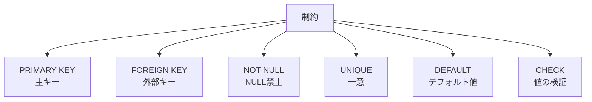

# Phase 3-1: テーブル設計 ～ CREATE TABLE とデータ型 ～

## 学習目標

この単元を終えると、以下ができるようになります：

- CREATE TABLE でテーブルを作成できる
- 適切なデータ型を選択できる
- 制約（NOT NULL, UNIQUE, DEFAULT）を設定できる
- テーブル定義を変更できる

## 概念解説

### データ型の選択

| カテゴリ | データ型 | 用途 | サイズ |
|---------|---------|------|--------|
| 整数 | TINYINT | 0-255 | 1バイト |
| 整数 | INT | 約±21億 | 4バイト |
| 整数 | BIGINT | 巨大な数値 | 8バイト |
| 小数 | DECIMAL(M,D) | 金額など正確な値 | 可変 |
| 小数 | FLOAT/DOUBLE | 科学計算 | 4-8バイト |
| 文字列 | VARCHAR(N) | 可変長文字列 | 最大N文字 |
| 文字列 | TEXT | 長文 | 最大64KB |
| 日時 | DATE | 日付のみ | 3バイト |
| 日時 | DATETIME | 日時 | 8バイト |
| 日時 | TIMESTAMP | 日時（タイムゾーン対応） | 4バイト |
| 真偽 | BOOLEAN | true/false | 1バイト |

### 制約の種類



## ハンズオン

### 演習1: 基本的なテーブル作成

```bash
docker exec -it mysql-practice mysql -u student -pstudentpass practice << 'EOF'
-- 商品テーブル
CREATE TABLE products (
    id INT AUTO_INCREMENT PRIMARY KEY,
    name VARCHAR(100) NOT NULL,
    description TEXT,
    price DECIMAL(10,2) NOT NULL,
    stock INT NOT NULL DEFAULT 0,
    is_active BOOLEAN DEFAULT TRUE,
    created_at TIMESTAMP DEFAULT CURRENT_TIMESTAMP,
    updated_at TIMESTAMP DEFAULT CURRENT_TIMESTAMP ON UPDATE CURRENT_TIMESTAMP
);

-- 構造確認
DESCRIBE products;
SHOW CREATE TABLE products\G
EOF
```

### 演習2: 各種データ型の確認

```bash
docker exec -it mysql-practice mysql -u student -pstudentpass practice << 'EOF'
-- データ型テスト用テーブル
CREATE TABLE datatype_test (
    id INT AUTO_INCREMENT PRIMARY KEY,
    
    -- 整数型
    tiny_val TINYINT,           -- -128 ~ 127
    int_val INT,                -- ±約21億
    big_val BIGINT,             -- ±約922京
    
    -- 小数型
    decimal_val DECIMAL(10,2),  -- 金額用（正確）
    float_val FLOAT,            -- 概算値
    
    -- 文字列型
    char_val CHAR(10),          -- 固定長
    varchar_val VARCHAR(255),   -- 可変長
    text_val TEXT,              -- 長文
    
    -- 日時型
    date_val DATE,
    time_val TIME,
    datetime_val DATETIME,
    timestamp_val TIMESTAMP DEFAULT CURRENT_TIMESTAMP,
    
    -- 真偽型
    bool_val BOOLEAN
);

-- データ挿入テスト
INSERT INTO datatype_test (
    tiny_val, int_val, big_val,
    decimal_val, float_val,
    char_val, varchar_val, text_val,
    date_val, time_val, datetime_val,
    bool_val
) VALUES (
    100, 1000000, 9999999999999,
    12345.67, 3.14159,
    'fixed', 'variable length', 'Long text content here...',
    '2024-01-15', '14:30:00', '2024-01-15 14:30:00',
    TRUE
);

SELECT * FROM datatype_test\G

DROP TABLE datatype_test;
EOF
```

### 演習3: 制約の設定

```bash
docker exec -it mysql-practice mysql -u student -pstudentpass practice << 'EOF'
-- 制約付きテーブル
CREATE TABLE employees (
    id INT AUTO_INCREMENT PRIMARY KEY,
    employee_code VARCHAR(10) NOT NULL UNIQUE,
    name VARCHAR(50) NOT NULL,
    email VARCHAR(100) UNIQUE,
    age INT CHECK (age >= 18 AND age <= 100),
    salary DECIMAL(10,2) DEFAULT 0.00,
    department_id INT,
    hire_date DATE NOT NULL,
    created_at TIMESTAMP DEFAULT CURRENT_TIMESTAMP
);

-- 正常なデータ
INSERT INTO employees (employee_code, name, email, age, salary, hire_date)
VALUES ('EMP001', '山田太郎', 'yamada@example.com', 25, 300000, '2024-01-01');

-- UNIQUE 制約違反を確認
-- INSERT INTO employees (employee_code, name, hire_date)
-- VALUES ('EMP001', '重複テスト', '2024-01-01');
-- → ERROR: Duplicate entry 'EMP001'

-- CHECK 制約違反を確認（MySQL 8.0.16以降）
-- INSERT INTO employees (employee_code, name, age, hire_date)
-- VALUES ('EMP002', '年齢テスト', 150, '2024-01-01');
-- → ERROR: Check constraint violated

SELECT * FROM employees;
EOF
```

### 演習4: テーブル定義の変更（ALTER TABLE）

```bash
docker exec -it mysql-practice mysql -u student -pstudentpass practice << 'EOF'
-- 列の追加
ALTER TABLE products ADD COLUMN category VARCHAR(50);
ALTER TABLE products ADD COLUMN weight DECIMAL(5,2) AFTER price;

-- 列の変更
ALTER TABLE products MODIFY COLUMN name VARCHAR(200) NOT NULL;

-- 列名の変更
ALTER TABLE products CHANGE COLUMN category product_category VARCHAR(50);

-- 列の削除
ALTER TABLE products DROP COLUMN weight;

-- デフォルト値の変更
ALTER TABLE products ALTER COLUMN is_active SET DEFAULT FALSE;

-- インデックスの追加
ALTER TABLE products ADD INDEX idx_category (product_category);

-- 構造確認
DESCRIBE products;
EOF
```

### 演習5: 適切なデータ型の選択

```bash
docker exec -it mysql-practice mysql -u student -pstudentpass practice << 'EOF'
-- ECサイトの注文テーブル（実践的な設計）
CREATE TABLE shop_orders (
    -- 主キー: BIGINT（大量データ対応）
    id BIGINT AUTO_INCREMENT PRIMARY KEY,
    
    -- 注文番号: 一意な文字列
    order_number VARCHAR(20) NOT NULL UNIQUE,
    
    -- 外部キー参照
    customer_id INT NOT NULL,
    
    -- 金額: DECIMAL で正確に
    subtotal DECIMAL(12,2) NOT NULL,
    tax DECIMAL(12,2) NOT NULL,
    shipping_fee DECIMAL(8,2) DEFAULT 0,
    total DECIMAL(12,2) NOT NULL,
    
    -- ステータス: ENUM で選択肢を制限
    status ENUM('pending', 'paid', 'shipped', 'delivered', 'cancelled') 
           DEFAULT 'pending',
    
    -- 配送先: TEXT ではなく VARCHAR（検索可能に）
    shipping_address VARCHAR(500),
    
    -- 備考: TEXT（長文可能性あり）
    notes TEXT,
    
    -- 日時: TIMESTAMP（タイムゾーン対応）
    ordered_at TIMESTAMP DEFAULT CURRENT_TIMESTAMP,
    shipped_at TIMESTAMP NULL,
    delivered_at TIMESTAMP NULL,
    
    -- インデックス
    INDEX idx_customer (customer_id),
    INDEX idx_status (status),
    INDEX idx_ordered_at (ordered_at)
);

DESCRIBE shop_orders;
DROP TABLE shop_orders;
EOF
```

### 演習6: テーブルの削除と再作成

```bash
docker exec -it mysql-practice mysql -u student -pstudentpass practice << 'EOF'
-- IF EXISTS で安全に削除
DROP TABLE IF EXISTS temp_table;

-- IF NOT EXISTS で安全に作成
CREATE TABLE IF NOT EXISTS temp_table (
    id INT PRIMARY KEY,
    value VARCHAR(100)
);

-- テーブルの存在確認
SHOW TABLES LIKE 'temp%';

-- 削除
DROP TABLE temp_table;
EOF
```

## 現場でよくある落とし穴

| 落とし穴 | 説明 | 対策 |
|---------|------|------|
| VARCHAR のサイズ過大 | 無駄にメモリ消費 | 適切なサイズを設定 |
| FLOAT で金額計算 | 誤差が発生 | DECIMAL を使用 |
| NOT NULL 未設定 | NULL が混入 | 必須項目には NOT NULL |
| INT で ID | データ量増加で溢れる | BIGINT を検討 |

## 理解度確認

### 問題

商品価格を格納する列として最も適切なデータ型はどれか。価格は日本円で、最大9,999,999円まで、税込み価格で小数点以下2桁を格納する必要がある。

**A.** `INT`

**B.** `FLOAT`

**C.** `DECIMAL(10,2)`

**D.** `VARCHAR(20)`

---

### 解答・解説

**正解: C**

- **A.** INT は整数のみで小数点以下を格納できない。
- **B.** FLOAT は浮動小数点数で、金額計算に誤差が生じる可能性がある。
- **C.** 正解。DECIMAL は正確な小数を扱え、金額に最適。DECIMAL(10,2) は整数部8桁、小数部2桁。
- **D.** VARCHAR は文字列型で、計算ができず、ソートも正しくできない。

---

## まとめ

| データ型 | 用途 |
|---------|------|
| INT/BIGINT | ID、カウント |
| DECIMAL | 金額、正確な小数 |
| VARCHAR | 一般的な文字列 |
| TEXT | 長文 |
| TIMESTAMP | 日時 |
| BOOLEAN | フラグ |

## 次のステップ

テーブルの作成方法を学びました。次は正規化とリレーションについて学びましょう。

**次の単元**: [Phase 3-2: 正規化とリレーション](./02_正規化とリレーション.md)
