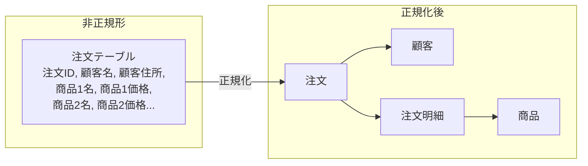
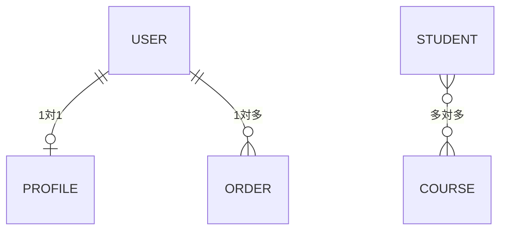

# Phase 3-2: 正規化とリレーション ～ データの整理と関連付け ～

## 学習目標

この単元を終えると、以下ができるようになります：

- 正規化の概念を理解できる
- 1対1、1対多、多対多の関係を設計できる
- 外部キー制約を設定できる
- ER図を読み書きできる

## 概念解説

### 正規化とは

データの重複を排除し、整合性を保ちやすくする設計手法。



### 正規化のレベル

| レベル | 内容 | 例 |
|--------|------|-----|
| 第1正規形 | 繰り返し項目を排除 | 商品1, 商品2... → 明細テーブル |
| 第2正規形 | 部分関数従属を排除 | 主キーの一部に依存する列を分離 |
| 第3正規形 | 推移的関数従属を排除 | 非キー項目間の依存を分離 |

### リレーションの種類



| 関係 | 例 | 実装方法 |
|------|-----|---------|
| 1対1 | ユーザー ↔ プロフィール | 一方のテーブルに外部キー |
| 1対多 | ユーザー → 注文 | 多側に外部キー |
| 多対多 | 学生 ↔ 授業 | 中間テーブル |

## ハンズオン

### 演習1: 正規化の実践

```bash
docker exec -it mysql-practice mysql -u student -pstudentpass practice << 'EOF'
-- ★ 悪い例：正規化されていないテーブル
CREATE TABLE bad_orders (
    order_id INT PRIMARY KEY,
    customer_name VARCHAR(100),
    customer_email VARCHAR(100),
    customer_address VARCHAR(200),
    product1_name VARCHAR(100),
    product1_price INT,
    product1_qty INT,
    product2_name VARCHAR(100),
    product2_price INT,
    product2_qty INT
);

-- 問題点：
-- 1. 商品が3つ以上だと列を追加する必要がある
-- 2. 同じ顧客情報が複数行に重複する
-- 3. 商品情報も重複する

DROP TABLE bad_orders;

-- ★ 良い例：正規化されたテーブル群
-- 顧客テーブル
CREATE TABLE customers (
    id INT AUTO_INCREMENT PRIMARY KEY,
    name VARCHAR(100) NOT NULL,
    email VARCHAR(100) UNIQUE,
    address VARCHAR(200)
);

-- 商品テーブル
CREATE TABLE catalog_products (
    id INT AUTO_INCREMENT PRIMARY KEY,
    name VARCHAR(100) NOT NULL,
    price DECIMAL(10,2) NOT NULL
);

-- 注文テーブル
CREATE TABLE customer_orders (
    id INT AUTO_INCREMENT PRIMARY KEY,
    customer_id INT NOT NULL,
    ordered_at TIMESTAMP DEFAULT CURRENT_TIMESTAMP,
    FOREIGN KEY (customer_id) REFERENCES customers(id)
);

-- 注文明細テーブル（中間テーブル的役割）
CREATE TABLE order_items (
    id INT AUTO_INCREMENT PRIMARY KEY,
    order_id INT NOT NULL,
    product_id INT NOT NULL,
    quantity INT NOT NULL DEFAULT 1,
    price_at_order DECIMAL(10,2) NOT NULL,
    FOREIGN KEY (order_id) REFERENCES customer_orders(id),
    FOREIGN KEY (product_id) REFERENCES catalog_products(id)
);

SHOW TABLES;
EOF
```

### 演習2: 外部キー制約の動作確認

```bash
docker exec -it mysql-practice mysql -u student -pstudentpass practice << 'EOF'
-- データ挿入
INSERT INTO customers (name, email, address) VALUES
    ('田中太郎', 'tanaka@example.com', '東京都渋谷区'),
    ('佐藤花子', 'sato@example.com', '大阪府大阪市');

INSERT INTO catalog_products (name, price) VALUES
    ('ノートPC', 150000),
    ('マウス', 3000),
    ('キーボード', 8000);

INSERT INTO customer_orders (customer_id) VALUES (1), (2);

INSERT INTO order_items (order_id, product_id, quantity, price_at_order) VALUES
    (1, 1, 1, 150000),
    (1, 2, 2, 3000),
    (2, 3, 1, 8000);

-- 確認
SELECT * FROM customers;
SELECT * FROM customer_orders;
SELECT * FROM order_items;

-- ★ 外部キー制約の確認
-- 存在しない customer_id で注文を作成しようとする
-- INSERT INTO customer_orders (customer_id) VALUES (999);
-- → ERROR: Cannot add or update a child row: a foreign key constraint fails
EOF
```

### 演習3: 1対1 リレーション

```bash
docker exec -it mysql-practice mysql -u student -pstudentpass practice << 'EOF'
-- ユーザーと詳細プロフィール（1対1）
CREATE TABLE user_accounts (
    id INT AUTO_INCREMENT PRIMARY KEY,
    username VARCHAR(50) NOT NULL UNIQUE,
    password_hash VARCHAR(255) NOT NULL
);

CREATE TABLE user_profiles (
    id INT AUTO_INCREMENT PRIMARY KEY,
    user_id INT NOT NULL UNIQUE,  -- UNIQUE で1対1を保証
    bio TEXT,
    avatar_url VARCHAR(255),
    website VARCHAR(255),
    FOREIGN KEY (user_id) REFERENCES user_accounts(id) ON DELETE CASCADE
);

INSERT INTO user_accounts (username, password_hash) VALUES
    ('john_doe', 'hash123'),
    ('jane_doe', 'hash456');

INSERT INTO user_profiles (user_id, bio, website) VALUES
    (1, 'Software Engineer', 'https://johndoe.com'),
    (2, 'Designer', 'https://janedoe.com');

-- 結合して取得
SELECT u.username, p.bio, p.website
FROM user_accounts u
JOIN user_profiles p ON u.id = p.user_id;
EOF
```

### 演習4: 1対多 リレーション

```bash
docker exec -it mysql-practice mysql -u student -pstudentpass practice << 'EOF'
-- 部署とメンバー（1対多）
CREATE TABLE departments (
    id INT AUTO_INCREMENT PRIMARY KEY,
    name VARCHAR(50) NOT NULL UNIQUE
);

CREATE TABLE members (
    id INT AUTO_INCREMENT PRIMARY KEY,
    name VARCHAR(100) NOT NULL,
    department_id INT,
    FOREIGN KEY (department_id) REFERENCES departments(id) ON DELETE SET NULL
);

INSERT INTO departments (name) VALUES ('開発部'), ('営業部'), ('人事部');

INSERT INTO members (name, department_id) VALUES
    ('田中', 1), ('佐藤', 1), ('鈴木', 1),
    ('高橋', 2), ('伊藤', 2),
    ('渡辺', 3);

-- 部署ごとのメンバー数
SELECT d.name AS department, COUNT(m.id) AS member_count
FROM departments d
LEFT JOIN members m ON d.id = m.department_id
GROUP BY d.id, d.name;
EOF
```

### 演習5: 多対多 リレーション

```bash
docker exec -it mysql-practice mysql -u student -pstudentpass practice << 'EOF'
-- 学生と授業（多対多）
CREATE TABLE students (
    id INT AUTO_INCREMENT PRIMARY KEY,
    name VARCHAR(100) NOT NULL
);

CREATE TABLE courses (
    id INT AUTO_INCREMENT PRIMARY KEY,
    name VARCHAR(100) NOT NULL,
    credits INT NOT NULL
);

-- 中間テーブル（多対多を実現）
CREATE TABLE enrollments (
    id INT AUTO_INCREMENT PRIMARY KEY,
    student_id INT NOT NULL,
    course_id INT NOT NULL,
    enrolled_at DATE NOT NULL,
    grade VARCHAR(2),
    FOREIGN KEY (student_id) REFERENCES students(id) ON DELETE CASCADE,
    FOREIGN KEY (course_id) REFERENCES courses(id) ON DELETE CASCADE,
    UNIQUE KEY unique_enrollment (student_id, course_id)  -- 重複登録防止
);

INSERT INTO students (name) VALUES ('山田'), ('鈴木'), ('佐藤');
INSERT INTO courses (name, credits) VALUES 
    ('データベース入門', 2), 
    ('Web開発', 3), 
    ('機械学習', 3);

INSERT INTO enrollments (student_id, course_id, enrolled_at, grade) VALUES
    (1, 1, '2024-04-01', 'A'),
    (1, 2, '2024-04-01', 'B'),
    (2, 1, '2024-04-01', 'A'),
    (2, 3, '2024-04-01', NULL),
    (3, 2, '2024-04-01', 'C'),
    (3, 3, '2024-04-01', 'B');

-- 学生ごとの履修科目
SELECT s.name AS student, GROUP_CONCAT(c.name) AS courses
FROM students s
JOIN enrollments e ON s.id = e.student_id
JOIN courses c ON e.course_id = c.id
GROUP BY s.id, s.name;

-- 授業ごとの履修者数
SELECT c.name AS course, COUNT(e.student_id) AS student_count
FROM courses c
LEFT JOIN enrollments e ON c.id = e.course_id
GROUP BY c.id, c.name;
EOF
```

### 演習6: ON DELETE オプション

```bash
docker exec -it mysql-practice mysql -u student -pstudentpass practice << 'EOF'
-- ON DELETE オプションのテスト
CREATE TABLE parent_table (
    id INT AUTO_INCREMENT PRIMARY KEY,
    name VARCHAR(50)
);

-- CASCADE: 親削除時に子も削除
CREATE TABLE child_cascade (
    id INT AUTO_INCREMENT PRIMARY KEY,
    parent_id INT,
    FOREIGN KEY (parent_id) REFERENCES parent_table(id) ON DELETE CASCADE
);

-- SET NULL: 親削除時に NULL に
CREATE TABLE child_setnull (
    id INT AUTO_INCREMENT PRIMARY KEY,
    parent_id INT,
    FOREIGN KEY (parent_id) REFERENCES parent_table(id) ON DELETE SET NULL
);

-- RESTRICT: 子がある場合、親削除を拒否（デフォルト）
CREATE TABLE child_restrict (
    id INT AUTO_INCREMENT PRIMARY KEY,
    parent_id INT,
    FOREIGN KEY (parent_id) REFERENCES parent_table(id) ON DELETE RESTRICT
);

INSERT INTO parent_table (name) VALUES ('Parent1'), ('Parent2');
INSERT INTO child_cascade (parent_id) VALUES (1);
INSERT INTO child_setnull (parent_id) VALUES (1);
INSERT INTO child_restrict (parent_id) VALUES (2);

-- CASCADE テスト
DELETE FROM parent_table WHERE id = 1;
SELECT * FROM child_cascade;  -- 子も削除される
SELECT * FROM child_setnull;  -- parent_id が NULL になる

-- RESTRICT テスト
-- DELETE FROM parent_table WHERE id = 2;
-- → ERROR: Cannot delete or update a parent row

-- クリーンアップ
DROP TABLE child_cascade, child_setnull, child_restrict, parent_table;
EOF
```

## 現場でよくある落とし穴

| 落とし穴 | 説明 | 対策 |
|---------|------|------|
| 外部キーなしの設計 | データ不整合が発生 | 外部キー制約を設定 |
| 過度な正規化 | JOIN が多くなり遅くなる | 適度な非正規化も検討 |
| CASCADE の誤用 | 意図しないデータ削除 | 慎重に設定、RESTRICT を検討 |

## 理解度確認

### 問題

「著者」と「書籍」の関係で、1人の著者が複数の書籍を書け、1つの書籍に複数の著者がいる場合の設計として正しいものはどれか。

**A.** 書籍テーブルに author_name 列を追加

**B.** 著者テーブルに外部キー book_id を追加

**C.** 書籍テーブルに外部キー author_id を追加

**D.** 著者テーブル、書籍テーブル、著者書籍テーブル（中間テーブル）を作成

---

### 解答・解説

**正解: D**

これは多対多の関係なので、中間テーブルが必要です。

```sql
CREATE TABLE authors (id INT PRIMARY KEY, name VARCHAR(100));
CREATE TABLE books (id INT PRIMARY KEY, title VARCHAR(200));
CREATE TABLE author_books (
    author_id INT,
    book_id INT,
    PRIMARY KEY (author_id, book_id),
    FOREIGN KEY (author_id) REFERENCES authors(id),
    FOREIGN KEY (book_id) REFERENCES books(id)
);
```

---

## まとめ

| 概念 | 説明 |
|------|------|
| 正規化 | データ重複を排除する設計手法 |
| 1対1 | UNIQUE な外部キーで実現 |
| 1対多 | 多側に外部キーを配置 |
| 多対多 | 中間テーブルで実現 |
| ON DELETE | 親削除時の動作を制御 |

## 次のステップ

正規化とリレーションを学びました。次は複数テーブルを結合するJOIN操作を学びましょう。

**次の単元**: [Phase 4-1: JOIN 操作](../phase4/01_JOIN操作.md)
