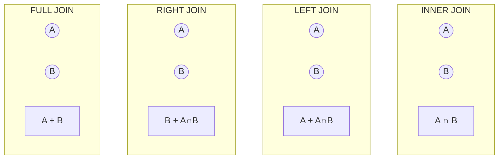

# Phase 4-1: JOIN 操作 ～ テーブルを結合する ～

## 学習目標

この単元を終えると、以下ができるようになります：

- INNER JOIN で共通データを取得できる
- LEFT/RIGHT JOIN で片側のデータも取得できる
- 複数テーブルを結合できる
- 自己結合を理解できる

## 概念解説

### JOIN の種類



| JOIN | 説明 |
|------|------|
| INNER JOIN | 両方に存在するデータのみ |
| LEFT JOIN | 左テーブルの全データ + 右の一致データ |
| RIGHT JOIN | 右テーブルの全データ + 左の一致データ |
| CROSS JOIN | すべての組み合わせ（直積） |

## ハンズオン

### 演習0: サンプルデータ準備

```bash
docker exec -it mysql-practice mysql -u student -pstudentpass practice << 'EOF'
-- 既存テーブルをクリア
DROP TABLE IF EXISTS order_items;
DROP TABLE IF EXISTS customer_orders;
DROP TABLE IF EXISTS catalog_products;
DROP TABLE IF EXISTS members;
DROP TABLE IF EXISTS departments;
DROP TABLE IF EXISTS enrollments;
DROP TABLE IF EXISTS students;
DROP TABLE IF EXISTS courses;
DROP TABLE IF EXISTS user_profiles;
DROP TABLE IF EXISTS user_accounts;
DROP TABLE IF EXISTS customers;
DROP TABLE IF EXISTS employees;
DROP TABLE IF EXISTS products;

-- 部署テーブル
CREATE TABLE dept (
    id INT PRIMARY KEY,
    name VARCHAR(50) NOT NULL
);

-- 社員テーブル
CREATE TABLE emp (
    id INT PRIMARY KEY,
    name VARCHAR(50) NOT NULL,
    dept_id INT,
    manager_id INT,
    salary INT,
    FOREIGN KEY (dept_id) REFERENCES dept(id)
);

-- プロジェクトテーブル
CREATE TABLE proj (
    id INT PRIMARY KEY,
    name VARCHAR(100) NOT NULL,
    budget INT
);

-- 社員プロジェクト（中間テーブル）
CREATE TABLE emp_proj (
    emp_id INT,
    proj_id INT,
    role VARCHAR(50),
    PRIMARY KEY (emp_id, proj_id),
    FOREIGN KEY (emp_id) REFERENCES emp(id),
    FOREIGN KEY (proj_id) REFERENCES proj(id)
);

-- データ挿入
INSERT INTO dept VALUES (1, '開発部'), (2, '営業部'), (3, '人事部'), (4, '経理部');

INSERT INTO emp VALUES
    (1, '田中', 1, NULL, 600000),
    (2, '佐藤', 1, 1, 450000),
    (3, '鈴木', 1, 1, 400000),
    (4, '高橋', 2, NULL, 550000),
    (5, '伊藤', 2, 4, 380000),
    (6, '渡辺', 3, NULL, 500000),
    (7, '山本', NULL, NULL, 350000);  -- 部署未配属

INSERT INTO proj VALUES
    (1, 'Webリニューアル', 5000000),
    (2, 'モバイルアプリ', 8000000),
    (3, '社内システム刷新', 3000000);

INSERT INTO emp_proj VALUES
    (1, 1, 'リーダー'),
    (2, 1, 'メンバー'),
    (3, 1, 'メンバー'),
    (1, 2, 'リーダー'),
    (3, 2, 'メンバー'),
    (4, 3, 'リーダー'),
    (5, 3, 'メンバー');

SELECT 'データ準備完了' AS status;
EOF
```

### 演習1: INNER JOIN

```bash
docker exec -it mysql-practice mysql -u student -pstudentpass practice << 'EOF'
-- 基本的な INNER JOIN
SELECT e.name AS 社員名, d.name AS 部署名
FROM emp e
INNER JOIN dept d ON e.dept_id = d.id;

-- 部署未配属（山本）は表示されない

-- JOIN（INNER は省略可能）
SELECT e.name, d.name AS dept
FROM emp e
JOIN dept d ON e.dept_id = d.id;

-- 条件を追加
SELECT e.name, d.name AS dept, e.salary
FROM emp e
JOIN dept d ON e.dept_id = d.id
WHERE e.salary >= 400000;
EOF
```

### 演習2: LEFT JOIN

```bash
docker exec -it mysql-practice mysql -u student -pstudentpass practice << 'EOF'
-- LEFT JOIN（左テーブルの全データ）
SELECT e.name AS 社員名, d.name AS 部署名
FROM emp e
LEFT JOIN dept d ON e.dept_id = d.id;

-- 山本（部署未配属）も表示される。部署名は NULL

-- 部署未配属の社員を抽出
SELECT e.name AS 社員名
FROM emp e
LEFT JOIN dept d ON e.dept_id = d.id
WHERE d.id IS NULL;

-- 各部署の社員数（社員がいない部署も表示）
SELECT d.name AS 部署名, COUNT(e.id) AS 社員数
FROM dept d
LEFT JOIN emp e ON d.id = e.dept_id
GROUP BY d.id, d.name;
-- 経理部は 0 と表示される
EOF
```

### 演習3: RIGHT JOIN

```bash
docker exec -it mysql-practice mysql -u student -pstudentpass practice << 'EOF'
-- RIGHT JOIN（右テーブルの全データ）
SELECT e.name AS 社員名, d.name AS 部署名
FROM emp e
RIGHT JOIN dept d ON e.dept_id = d.id;

-- 経理部（社員なし）も表示される

-- LEFT JOIN で同じ結果
SELECT e.name AS 社員名, d.name AS 部署名
FROM dept d
LEFT JOIN emp e ON d.id = e.dept_id;
EOF
```

### 演習4: 複数テーブルの結合

```bash
docker exec -it mysql-practice mysql -u student -pstudentpass practice << 'EOF'
-- 社員 → 部署 → プロジェクト
SELECT 
    e.name AS 社員名,
    d.name AS 部署名,
    p.name AS プロジェクト名,
    ep.role AS 役割
FROM emp e
LEFT JOIN dept d ON e.dept_id = d.id
LEFT JOIN emp_proj ep ON e.id = ep.emp_id
LEFT JOIN proj p ON ep.proj_id = p.id
ORDER BY e.id;

-- プロジェクトごとのメンバー一覧
SELECT 
    p.name AS プロジェクト,
    p.budget AS 予算,
    GROUP_CONCAT(e.name ORDER BY ep.role) AS メンバー
FROM proj p
JOIN emp_proj ep ON p.id = ep.proj_id
JOIN emp e ON ep.emp_id = e.id
GROUP BY p.id, p.name, p.budget;
EOF
```

### 演習5: 自己結合

```bash
docker exec -it mysql-practice mysql -u student -pstudentpass practice << 'EOF'
-- 社員とその上司（自己結合）
SELECT 
    e.name AS 社員名,
    m.name AS 上司名
FROM emp e
LEFT JOIN emp m ON e.manager_id = m.id;

-- 上司がいる社員のみ
SELECT 
    e.name AS 社員名,
    m.name AS 上司名
FROM emp e
INNER JOIN emp m ON e.manager_id = m.id;

-- 上司より給料が高い社員
SELECT 
    e.name AS 社員名,
    e.salary AS 社員給料,
    m.name AS 上司名,
    m.salary AS 上司給料
FROM emp e
JOIN emp m ON e.manager_id = m.id
WHERE e.salary > m.salary;
EOF
```

### 演習6: CROSS JOIN

```bash
docker exec -it mysql-practice mysql -u student -pstudentpass practice << 'EOF'
-- CROSS JOIN（直積）
-- すべての組み合わせを生成
SELECT d.name AS 部署, p.name AS プロジェクト
FROM dept d
CROSS JOIN proj p
LIMIT 10;

-- 実用例：カレンダー生成
CREATE TEMPORARY TABLE years (y INT);
CREATE TEMPORARY TABLE months (m INT);
INSERT INTO years VALUES (2024), (2025);
INSERT INTO months VALUES (1),(2),(3),(4),(5),(6),(7),(8),(9),(10),(11),(12);

SELECT y AS 年, m AS 月
FROM years CROSS JOIN months
ORDER BY y, m;
EOF
```

## 現場でよくある落とし穴

| 落とし穴 | 説明 | 対策 |
|---------|------|------|
| ON 条件の漏れ | 意図しない直積になる | 必ず結合条件を確認 |
| LEFT vs INNER | NULLデータが消える | 要件に応じて使い分け |
| 結合順序 | パフォーマンスに影響 | 小さいテーブルから結合 |

## 理解度確認

### 問題

以下の2つのテーブルがある場合、「すべての社員と、配属されている場合はその部署名」を取得するSQLとして正しいものはどれか。

```
emp: id=1 田中 dept_id=1, id=2 佐藤 dept_id=NULL
dept: id=1 開発部
```

**A.** `SELECT e.name, d.name FROM emp e INNER JOIN dept d ON e.dept_id = d.id`

**B.** `SELECT e.name, d.name FROM emp e LEFT JOIN dept d ON e.dept_id = d.id`

**C.** `SELECT e.name, d.name FROM emp e RIGHT JOIN dept d ON e.dept_id = d.id`

**D.** `SELECT e.name, d.name FROM emp e, dept d WHERE e.dept_id = d.id`

---

### 解答・解説

**正解: B**

- **A.** INNER JOIN は両方にデータがある場合のみ。佐藤（dept_id=NULL）が除外される。
- **B.** 正解。LEFT JOIN は左テーブル（emp）の全データを取得。佐藤も表示され、部署名はNULL。
- **C.** RIGHT JOIN は右テーブル（dept）を基準にするため、佐藤が除外される。
- **D.** 暗黙的 INNER JOIN と同じ。佐藤が除外される。

---

## まとめ

| JOIN | 結果 |
|------|------|
| INNER JOIN | 両方に存在するデータ |
| LEFT JOIN | 左の全データ + 右の一致データ |
| RIGHT JOIN | 右の全データ + 左の一致データ |
| CROSS JOIN | すべての組み合わせ |
| 自己結合 | 同じテーブルを結合 |

## 次のステップ

JOIN 操作を学びました。次は集計と分析の方法を学びましょう。

**次の単元**: [Phase 4-2: 集計と分析](./02_集計と分析.md)
