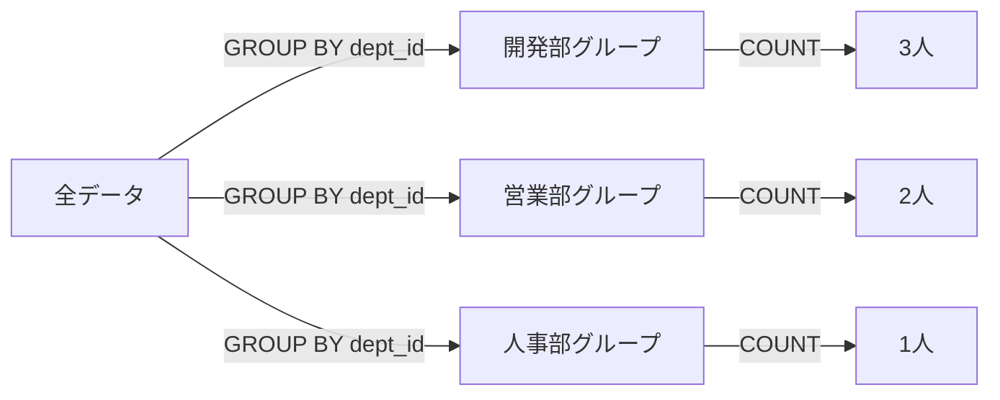

# Phase 4-2: 集計と分析 ～ GROUP BY とサブクエリ ～

## 学習目標

この単元を終えると、以下ができるようになります：

- 集計関数（COUNT, SUM, AVG, MAX, MIN）を使える
- GROUP BY でグループ化できる
- HAVING で集計結果を絞り込める
- サブクエリを使った複雑なクエリを書ける

## 概念解説

### 集計関数

| 関数 | 説明 |
|------|------|
| COUNT(*) | 行数 |
| COUNT(列) | NULL以外の件数 |
| SUM(列) | 合計 |
| AVG(列) | 平均 |
| MAX(列) | 最大値 |
| MIN(列) | 最小値 |

### GROUP BY の仕組み



## ハンズオン

### 演習1: 基本的な集計

```bash
docker exec -it mysql-practice mysql -u student -pstudentpass practice << 'EOF'
-- 全社員数
SELECT COUNT(*) AS 社員数 FROM emp;

-- 部署配属済みの社員数（NULL除外）
SELECT COUNT(dept_id) AS 配属済み社員数 FROM emp;

-- 給料の統計
SELECT 
    COUNT(*) AS 人数,
    SUM(salary) AS 給料合計,
    AVG(salary) AS 平均給料,
    MAX(salary) AS 最高給料,
    MIN(salary) AS 最低給料
FROM emp;

-- 給料を整形して表示
SELECT 
    FORMAT(AVG(salary), 0) AS 平均給料,
    FORMAT(MAX(salary), 0) AS 最高給料
FROM emp;
EOF
```

### 演習2: GROUP BY

```bash
docker exec -it mysql-practice mysql -u student -pstudentpass practice << 'EOF'
-- 部署ごとの社員数
SELECT 
    d.name AS 部署名,
    COUNT(e.id) AS 社員数
FROM dept d
LEFT JOIN emp e ON d.id = e.dept_id
GROUP BY d.id, d.name;

-- 部署ごとの給料統計
SELECT 
    d.name AS 部署名,
    COUNT(e.id) AS 人数,
    FORMAT(AVG(e.salary), 0) AS 平均給料,
    FORMAT(MAX(e.salary), 0) AS 最高給料,
    FORMAT(MIN(e.salary), 0) AS 最低給料
FROM dept d
LEFT JOIN emp e ON d.id = e.dept_id
GROUP BY d.id, d.name;

-- プロジェクトごとのメンバー数と役割
SELECT 
    p.name AS プロジェクト名,
    COUNT(ep.emp_id) AS メンバー数,
    SUM(CASE WHEN ep.role = 'リーダー' THEN 1 ELSE 0 END) AS リーダー数
FROM proj p
LEFT JOIN emp_proj ep ON p.id = ep.proj_id
GROUP BY p.id, p.name;
EOF
```

### 演習3: HAVING

```bash
docker exec -it mysql-practice mysql -u student -pstudentpass practice << 'EOF'
-- 社員が2人以上いる部署
SELECT 
    d.name AS 部署名,
    COUNT(e.id) AS 社員数
FROM dept d
JOIN emp e ON d.id = e.dept_id
GROUP BY d.id, d.name
HAVING COUNT(e.id) >= 2;

-- 平均給料が40万以上の部署
SELECT 
    d.name AS 部署名,
    FORMAT(AVG(e.salary), 0) AS 平均給料
FROM dept d
JOIN emp e ON d.id = e.dept_id
GROUP BY d.id, d.name
HAVING AVG(e.salary) >= 400000;

-- WHERE と HAVING の違い
-- WHERE: グループ化前の絞り込み
-- HAVING: グループ化後の絞り込み
SELECT 
    d.name AS 部署名,
    COUNT(e.id) AS 社員数,
    FORMAT(AVG(e.salary), 0) AS 平均給料
FROM dept d
JOIN emp e ON d.id = e.dept_id
WHERE e.salary >= 400000           -- 個々の社員で絞り込み
GROUP BY d.id, d.name
HAVING COUNT(e.id) >= 1;           -- 集計結果で絞り込み
EOF
```

### 演習4: サブクエリ - WHERE句

```bash
docker exec -it mysql-practice mysql -u student -pstudentpass practice << 'EOF'
-- 平均給料より高い給料の社員
SELECT name, salary
FROM emp
WHERE salary > (SELECT AVG(salary) FROM emp);

-- 開発部の社員一覧（サブクエリ版）
SELECT name
FROM emp
WHERE dept_id = (SELECT id FROM dept WHERE name = '開発部');

-- 複数値を返すサブクエリ（IN）
SELECT name
FROM emp
WHERE dept_id IN (
    SELECT id FROM dept WHERE name IN ('開発部', '営業部')
);

-- EXISTS：プロジェクトに参加している社員
SELECT e.name
FROM emp e
WHERE EXISTS (
    SELECT 1 FROM emp_proj ep WHERE ep.emp_id = e.id
);
EOF
```

### 演習5: サブクエリ - FROM句

```bash
docker exec -it mysql-practice mysql -u student -pstudentpass practice << 'EOF'
-- 部署ごとの統計をさらに集計
SELECT 
    AVG(社員数) AS 平均社員数,
    MAX(社員数) AS 最大社員数
FROM (
    SELECT 
        d.name AS 部署名,
        COUNT(e.id) AS 社員数
    FROM dept d
    LEFT JOIN emp e ON d.id = e.dept_id
    GROUP BY d.id, d.name
) AS dept_stats;

-- ランキングを作成（サブクエリでソート済みデータ）
SELECT 
    @rank := @rank + 1 AS 順位,
    name,
    salary
FROM (
    SELECT name, salary FROM emp ORDER BY salary DESC
) AS sorted,
(SELECT @rank := 0) AS r;
EOF
```

### 演習6: サブクエリ - SELECT句

```bash
docker exec -it mysql-practice mysql -u student -pstudentpass practice << 'EOF'
-- 各社員の給料と全体平均の比較
SELECT 
    name,
    salary,
    (SELECT AVG(salary) FROM emp) AS 全体平均,
    salary - (SELECT AVG(salary) FROM emp) AS 差額
FROM emp;

-- 各社員が参加しているプロジェクト数
SELECT 
    e.name,
    (SELECT COUNT(*) FROM emp_proj ep WHERE ep.emp_id = e.id) AS プロジェクト数
FROM emp e;
EOF
```

### 演習7: 相関サブクエリ

```bash
docker exec -it mysql-practice mysql -u student -pstudentpass practice << 'EOF'
-- 各部署で最高給料の社員
SELECT e.name, e.salary, d.name AS 部署名
FROM emp e
JOIN dept d ON e.dept_id = d.id
WHERE e.salary = (
    SELECT MAX(salary)
    FROM emp e2
    WHERE e2.dept_id = e.dept_id  -- 外側のクエリを参照
);

-- 部署平均より給料が高い社員
SELECT e.name, e.salary, d.name AS 部署名
FROM emp e
JOIN dept d ON e.dept_id = d.id
WHERE e.salary > (
    SELECT AVG(salary)
    FROM emp e2
    WHERE e2.dept_id = e.dept_id
);
EOF
```

### 演習8: ウィンドウ関数（MySQL 8.0+）

```bash
docker exec -it mysql-practice mysql -u student -pstudentpass practice << 'EOF'
-- ランキング
SELECT 
    name,
    salary,
    RANK() OVER (ORDER BY salary DESC) AS 全体順位,
    DENSE_RANK() OVER (ORDER BY salary DESC) AS 詰め順位
FROM emp;

-- 部署内ランキング
SELECT 
    name,
    d.name AS 部署名,
    salary,
    RANK() OVER (PARTITION BY e.dept_id ORDER BY salary DESC) AS 部署内順位
FROM emp e
JOIN dept d ON e.dept_id = d.id;

-- 累計
SELECT 
    name,
    salary,
    SUM(salary) OVER (ORDER BY salary) AS 累計給料
FROM emp;

-- 前の行との比較
SELECT 
    name,
    salary,
    LAG(salary) OVER (ORDER BY salary) AS 前の人の給料,
    salary - LAG(salary) OVER (ORDER BY salary) AS 差額
FROM emp;
EOF
```

## 現場でよくある落とし穴

| 落とし穴 | 説明 | 対策 |
|---------|------|------|
| GROUP BY 漏れ | SELECT に非集計列がある | 集計しない列は全て GROUP BY に |
| WHERE vs HAVING | 集計前後の混同 | WHERE=行、HAVING=グループ |
| サブクエリの性能 | 毎行実行で遅くなる | JOIN に書き換え検討 |

## 理解度確認

### 問題

部署ごとの社員数を集計し、社員が3人以上いる部署のみを表示するSQLとして正しいものはどれか。

**A.**
```sql
SELECT dept_id, COUNT(*) 
FROM emp 
WHERE COUNT(*) >= 3 
GROUP BY dept_id;
```

**B.**
```sql
SELECT dept_id, COUNT(*) 
FROM emp 
GROUP BY dept_id 
HAVING COUNT(*) >= 3;
```

**C.**
```sql
SELECT dept_id, COUNT(*) 
FROM emp 
GROUP BY dept_id 
WHERE COUNT(*) >= 3;
```

**D.**
```sql
SELECT dept_id, COUNT(*) >= 3 
FROM emp 
GROUP BY dept_id;
```

---

### 解答・解説

**正解: B**

- **A.** WHERE 句で集計関数は使えない。
- **B.** 正解。GROUP BY の後に HAVING で集計結果を絞り込む。
- **C.** WHERE は GROUP BY より前に書く必要があり、集計関数も使えない。
- **D.** COUNT(*) >= 3 は条件式で、SELECT 句では真偽値が返る。

---

## まとめ

| 機能 | 用途 |
|------|------|
| 集計関数 | COUNT, SUM, AVG, MAX, MIN |
| GROUP BY | グループ化 |
| HAVING | 集計結果の絞り込み |
| サブクエリ | クエリ内にクエリを埋め込む |
| ウィンドウ関数 | ランキング、累計など |

## 次のステップ

集計と分析を学びました。次はパフォーマンス最適化のためのインデックスを学びましょう。

**次の単元**: [Phase 5-1: インデックス](../phase5/01_インデックス.md)
