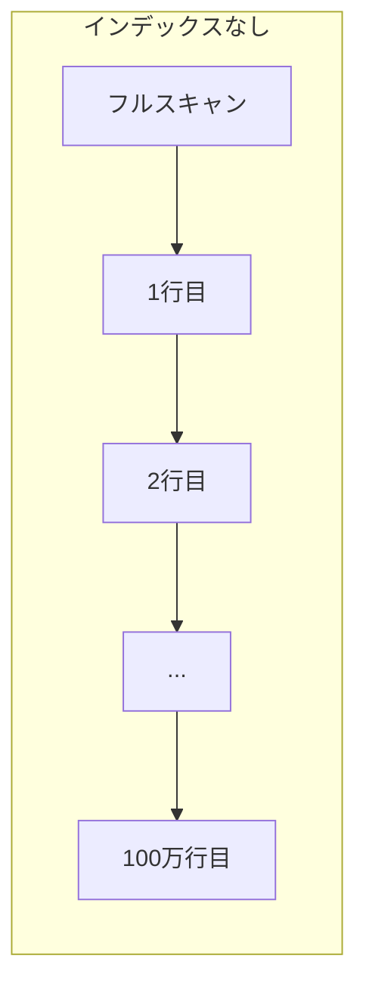
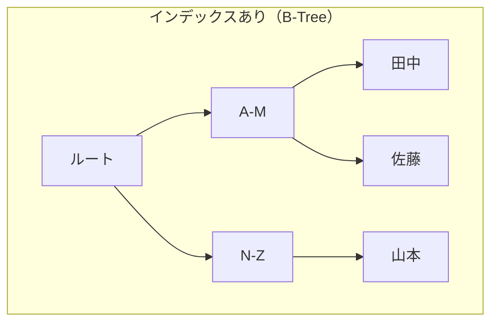

# Phase 5-1: インデックス ～ 検索を高速化する ～

## 学習目標

この単元を終えると、以下ができるようになります：

- インデックスの仕組みを理解できる
- 適切なインデックスを作成できる
- EXPLAIN で実行計画を確認できる
- インデックスのメリット・デメリットを説明できる

## 概念解説

### インデックスとは





| 比較 | インデックスなし | インデックスあり |
|------|----------------|-----------------|
| 検索 | O(n) 全件スキャン | O(log n) 二分探索 |
| 100万件検索 | 約100万回比較 | 約20回比較 |

### AWS で例えると...

| MySQL インデックス | AWS |
|-------------------|-----|
| PRIMARY KEY | DynamoDB のパーティションキー |
| SECONDARY INDEX | DynamoDB の GSI/LSI |
| EXPLAIN | RDS Performance Insights |

## ハンズオン

### 演習1: テストデータ作成

```bash
docker exec -it mysql-practice mysql -u student -pstudentpass practice << 'EOF'
-- 大量データ用テーブル
CREATE TABLE access_logs (
    id INT AUTO_INCREMENT PRIMARY KEY,
    user_id INT NOT NULL,
    path VARCHAR(255) NOT NULL,
    method VARCHAR(10) NOT NULL,
    status_code INT NOT NULL,
    response_time INT,
    accessed_at DATETIME NOT NULL,
    ip_address VARCHAR(45)
);

-- プロシージャで10万件挿入
DELIMITER //
CREATE PROCEDURE insert_logs()
BEGIN
    DECLARE i INT DEFAULT 0;
    WHILE i < 100000 DO
        INSERT INTO access_logs (user_id, path, method, status_code, response_time, accessed_at, ip_address)
        VALUES (
            FLOOR(RAND() * 1000) + 1,
            CONCAT('/api/v1/', ELT(FLOOR(RAND() * 5) + 1, 'users', 'posts', 'comments', 'likes', 'follows')),
            ELT(FLOOR(RAND() * 4) + 1, 'GET', 'POST', 'PUT', 'DELETE'),
            ELT(FLOOR(RAND() * 4) + 1, 200, 201, 400, 500),
            FLOOR(RAND() * 1000),
            DATE_ADD('2024-01-01', INTERVAL FLOOR(RAND() * 365) DAY),
            CONCAT(FLOOR(RAND() * 256), '.', FLOOR(RAND() * 256), '.', FLOOR(RAND() * 256), '.', FLOOR(RAND() * 256))
        );
        SET i = i + 1;
    END WHILE;
END //
DELIMITER ;

CALL insert_logs();
DROP PROCEDURE insert_logs;

SELECT COUNT(*) FROM access_logs;
EOF
```

### 演習2: インデックスなしの検索

```bash
docker exec -it mysql-practice mysql -u student -pstudentpass practice << 'EOF'
-- インデックスなしで検索（遅い）
SELECT * FROM access_logs WHERE user_id = 500;

-- 実行計画を確認
EXPLAIN SELECT * FROM access_logs WHERE user_id = 500;
-- type: ALL（フルスキャン）、rows: 約10万

-- 実行時間を計測
SET profiling = 1;
SELECT COUNT(*) FROM access_logs WHERE user_id = 500;
SHOW PROFILES;
EOF
```

### 演習3: インデックスの作成と効果確認

```bash
docker exec -it mysql-practice mysql -u student -pstudentpass practice << 'EOF'
-- インデックス作成
CREATE INDEX idx_user_id ON access_logs(user_id);

-- インデックス確認
SHOW INDEX FROM access_logs;

-- 再度検索
EXPLAIN SELECT * FROM access_logs WHERE user_id = 500;
-- type: ref（インデックス使用）、rows: 約100

-- 実行時間を比較
SET profiling = 1;
SELECT COUNT(*) FROM access_logs WHERE user_id = 500;
SHOW PROFILES;
-- 大幅に高速化されている
EOF
```

### 演習4: 複合インデックス

```bash
docker exec -it mysql-practice mysql -u student -pstudentpass practice << 'EOF'
-- 複合条件での検索
EXPLAIN SELECT * FROM access_logs 
WHERE user_id = 500 AND status_code = 200;

-- 複合インデックス作成
CREATE INDEX idx_user_status ON access_logs(user_id, status_code);

-- 再度確認
EXPLAIN SELECT * FROM access_logs 
WHERE user_id = 500 AND status_code = 200;

-- ★ 複合インデックスの順序は重要
-- idx_user_status(user_id, status_code) の場合:
-- ✅ WHERE user_id = 500                    -- 使われる
-- ✅ WHERE user_id = 500 AND status_code = 200  -- 使われる
-- ❌ WHERE status_code = 200                -- 使われない（先頭列が条件にない）
EOF
```

### 演習5: カバリングインデックス

```bash
docker exec -it mysql-practice mysql -u student -pstudentpass practice << 'EOF'
-- 通常のクエリ（インデックス → テーブル参照）
EXPLAIN SELECT user_id, status_code, response_time 
FROM access_logs WHERE user_id = 500;

-- カバリングインデックス（インデックスだけで完結）
CREATE INDEX idx_user_covering ON access_logs(user_id, status_code, response_time);

EXPLAIN SELECT user_id, status_code, response_time 
FROM access_logs WHERE user_id = 500;
-- Extra: Using index（テーブル参照なし、高速）
EOF
```

### 演習6: インデックスが効かないケース

```bash
docker exec -it mysql-practice mysql -u student -pstudentpass practice << 'EOF'
-- path にインデックス作成
CREATE INDEX idx_path ON access_logs(path);

-- ✅ 前方一致は効く
EXPLAIN SELECT * FROM access_logs WHERE path LIKE '/api/v1/users%';

-- ❌ 中間一致・後方一致は効かない
EXPLAIN SELECT * FROM access_logs WHERE path LIKE '%users%';
EXPLAIN SELECT * FROM access_logs WHERE path LIKE '%users';

-- ❌ 関数を使うと効かない
EXPLAIN SELECT * FROM access_logs WHERE YEAR(accessed_at) = 2024;

-- ✅ 範囲条件に書き換えると効く
CREATE INDEX idx_accessed_at ON access_logs(accessed_at);
EXPLAIN SELECT * FROM access_logs 
WHERE accessed_at >= '2024-01-01' AND accessed_at < '2025-01-01';

-- ❌ 型変換が発生すると効かない
-- user_id は INT なのに文字列で比較
EXPLAIN SELECT * FROM access_logs WHERE user_id = '500';
-- ※ MySQL は暗黙変換するが、効率が落ちる場合がある
EOF
```

### 演習7: インデックスの管理

```bash
docker exec -it mysql-practice mysql -u student -pstudentpass practice << 'EOF'
-- インデックス一覧
SHOW INDEX FROM access_logs;

-- インデックスのサイズ確認
SELECT 
    index_name,
    ROUND(stat_value * @@innodb_page_size / 1024 / 1024, 2) AS size_mb
FROM mysql.innodb_index_stats
WHERE table_name = 'access_logs'
AND stat_name = 'size'
ORDER BY size_mb DESC;

-- 不要なインデックス削除
DROP INDEX idx_user_status ON access_logs;
DROP INDEX idx_user_covering ON access_logs;

-- 残りを確認
SHOW INDEX FROM access_logs;
EOF
```

## インデックス設計の指針

```markdown
## インデックスを張るべき列
- WHERE 句でよく使う列
- JOIN の結合条件に使う列
- ORDER BY、GROUP BY で使う列
- 外部キー

## インデックスを張らない方が良い場合
- カーディナリティが低い（値の種類が少ない）
- 更新頻度が非常に高いテーブル
- 小さいテーブル（全件スキャンでも十分速い）

## 複合インデックスの順序
1. 等価条件（=）で使う列を先に
2. 範囲条件（<, >, BETWEEN）で使う列は後に
3. カーディナリティが高い列を先に
```

## 現場でよくある落とし穴

| 落とし穴 | 説明 | 対策 |
|---------|------|------|
| インデックス過多 | INSERT/UPDATE が遅くなる | 必要最小限に |
| LIKE '%keyword%' | インデックスが効かない | 全文検索を検討 |
| 型の不一致 | 暗黙変換でインデックス無効 | 正しい型で比較 |

## 理解度確認

### 問題

以下のクエリでインデックスが効果的に使用されるものはどれか。（インデックスは `idx_name` が `name` 列に作成されている）

**A.** `SELECT * FROM users WHERE name LIKE '%田中%'`

**B.** `SELECT * FROM users WHERE UPPER(name) = 'TANAKA'`

**C.** `SELECT * FROM users WHERE name LIKE '田中%'`

**D.** `SELECT * FROM users WHERE name = 123`

---

### 解答・解説

**正解: C**

- **A.** 中間一致（%で始まる）はインデックスが効かない。
- **B.** 関数を適用するとインデックスが効かない。
- **C.** 正解。前方一致はインデックスが効く。
- **D.** 型が違う（name は文字列、123 は数値）ため、暗黙の型変換が発生し効率が落ちる。

---

## まとめ

| 項目 | 説明 |
|------|------|
| インデックス | 検索を高速化するデータ構造 |
| B-Tree | MySQL のデフォルトインデックス型 |
| 複合インデックス | 複数列を組み合わせたインデックス |
| EXPLAIN | 実行計画を確認するコマンド |

## 次のステップ

インデックスを学びました。次はトランザクションとデータの整合性について学びましょう。

**次の単元**: [Phase 5-2: トランザクション](./02_トランザクション.md)
