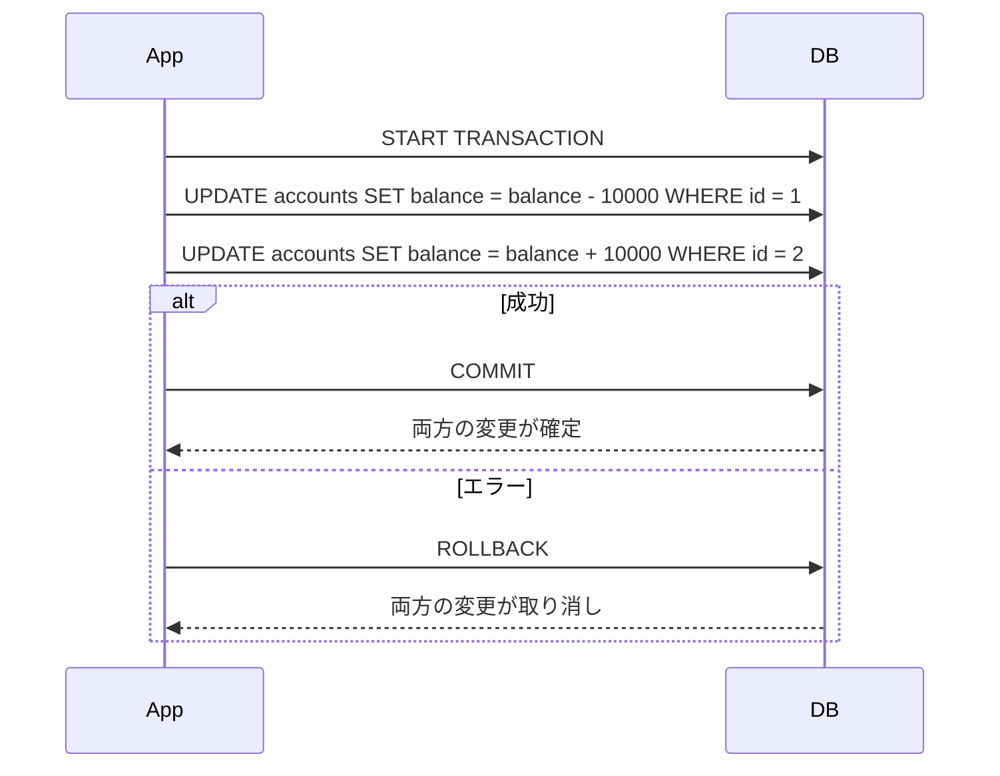

# Phase 5-2: トランザクション ～ データの整合性を保つ ～

## 学習目標

この単元を終えると、以下ができるようになります：

- トランザクションの ACID 特性を説明できる
- COMMIT と ROLLBACK を使い分けられる
- デッドロックを理解し対処できる
- 適切な分離レベルを選択できる

## 概念解説

### トランザクションとは

複数の操作を「1つのまとまり」として扱う仕組み。



### ACID 特性

| 特性 | 説明 | 例 |
|------|------|-----|
| Atomicity（原子性） | 全て成功か全て失敗 | 送金は引き出しと入金がセット |
| Consistency（一貫性） | 整合性を維持 | 残高がマイナスにならない |
| Isolation（分離性） | 他のトランザクションから見えない | 処理中の中間状態を見せない |
| Durability（永続性） | 確定したら消えない | コミット後は電源断でも保持 |

### AWS で例えると...

| MySQL | AWS |
|-------|-----|
| トランザクション | DynamoDB TransactWriteItems |
| ACID | Aurora の ACID 対応 |
| 分離レベル | Aurora のスナップショット分離 |

## ハンズオン

### 演習1: 基本的なトランザクション

```bash
docker exec -it mysql-practice mysql -u student -pstudentpass practice << 'EOF'
-- 銀行口座テーブル
CREATE TABLE accounts (
    id INT PRIMARY KEY,
    name VARCHAR(50),
    balance INT NOT NULL,
    CHECK (balance >= 0)
);

INSERT INTO accounts VALUES
    (1, '田中', 100000),
    (2, '佐藤', 50000);

SELECT * FROM accounts;
EOF
```

```bash
# トランザクションのテスト（成功パターン）
docker exec -it mysql-practice mysql -u student -pstudentpass practice << 'EOF'
-- 送金処理（成功）
START TRANSACTION;

-- 田中から1万円引き出し
UPDATE accounts SET balance = balance - 10000 WHERE id = 1;

-- 佐藤に1万円入金
UPDATE accounts SET balance = balance + 10000 WHERE id = 2;

-- 確定
COMMIT;

SELECT * FROM accounts;
-- 田中: 90000, 佐藤: 60000
EOF
```

### 演習2: ROLLBACK

```bash
docker exec -it mysql-practice mysql -u student -pstudentpass practice << 'EOF'
-- 送金処理（失敗パターン）
START TRANSACTION;

UPDATE accounts SET balance = balance - 10000 WHERE id = 1;

-- ここで問題発生を想定（例：佐藤の口座が凍結されている）
-- 処理を中断

ROLLBACK;

SELECT * FROM accounts;
-- 変更が取り消され、元の値のまま
-- 田中: 90000, 佐藤: 60000
EOF
```

### 演習3: SAVEPOINT

```bash
docker exec -it mysql-practice mysql -u student -pstudentpass practice << 'EOF'
START TRANSACTION;

UPDATE accounts SET balance = balance - 5000 WHERE id = 1;
SAVEPOINT after_first;

UPDATE accounts SET balance = balance - 5000 WHERE id = 1;
SAVEPOINT after_second;

-- やっぱり2回目の引き出しはキャンセル
ROLLBACK TO after_first;

-- 1回目の引き出しは確定
COMMIT;

SELECT * FROM accounts;
-- 田中: 85000（5000だけ減っている）
EOF
```

### 演習4: ロックの確認

```bash
# ターミナル1: ロック取得
docker exec -it mysql-practice mysql -u student -pstudentpass practice << 'EOF'
START TRANSACTION;
SELECT * FROM accounts WHERE id = 1 FOR UPDATE;
-- このまま COMMIT せずに待機
EOF
```

別ターミナルで：
```bash
# ターミナル2: ロック待ち
docker exec -it mysql-practice mysql -u student -pstudentpass practice << 'EOF'
-- 同じ行を更新しようとする
UPDATE accounts SET balance = balance + 1000 WHERE id = 1;
-- → ロック待ちになる（タイムアウトまで）
EOF
```

### 演習5: デッドロック

```bash
docker exec -it mysql-practice mysql -u student -pstudentpass practice << 'EOF'
-- デッドロックの再現（単一セッションでのシミュレーション）

-- テーブル準備
CREATE TABLE deadlock_test (
    id INT PRIMARY KEY,
    value INT
);
INSERT INTO deadlock_test VALUES (1, 100), (2, 200);

-- デッドロック発生パターンの説明:
-- トランザクションA: 行1をロック → 行2をロックしようとする
-- トランザクションB: 行2をロック → 行1をロックしようとする
-- → お互いに待ち合って進まない = デッドロック

-- MySQL はデッドロックを検出し、片方を強制ロールバックする
-- エラー: Deadlock found when trying to get lock

DROP TABLE deadlock_test;
EOF
```

### 演習6: 分離レベル

```bash
docker exec -it mysql-practice mysql -u student -pstudentpass practice << 'EOF'
-- 現在の分離レベル確認
SELECT @@transaction_isolation;

-- 分離レベル一覧
-- READ UNCOMMITTED: 他のコミット前データも見える（ダーティリード）
-- READ COMMITTED:   コミット済みデータのみ見える
-- REPEATABLE READ:  トランザクション開始時のスナップショット（MySQL デフォルト）
-- SERIALIZABLE:     最も厳格、同時実行性が低い

-- 分離レベルの変更
SET SESSION TRANSACTION ISOLATION LEVEL READ COMMITTED;
SELECT @@transaction_isolation;

-- 元に戻す
SET SESSION TRANSACTION ISOLATION LEVEL REPEATABLE READ;
EOF
```

### 演習7: 実践的なトランザクション処理

```bash
docker exec -it mysql-practice mysql -u student -pstudentpass practice << 'EOF'
-- 注文処理の例
CREATE TABLE inventory (
    product_id INT PRIMARY KEY,
    name VARCHAR(100),
    stock INT NOT NULL CHECK (stock >= 0),
    price INT NOT NULL
);

CREATE TABLE order_history (
    id INT AUTO_INCREMENT PRIMARY KEY,
    product_id INT,
    quantity INT,
    total_price INT,
    ordered_at TIMESTAMP DEFAULT CURRENT_TIMESTAMP
);

INSERT INTO inventory VALUES
    (1, 'ノートPC', 10, 150000),
    (2, 'マウス', 50, 3000);

SELECT * FROM inventory;
EOF
```

```bash
docker exec -it mysql-practice mysql -u student -pstudentpass practice << 'EOF'
DELIMITER //

CREATE PROCEDURE place_order(
    IN p_product_id INT,
    IN p_quantity INT
)
BEGIN
    DECLARE v_stock INT;
    DECLARE v_price INT;
    
    -- トランザクション開始
    START TRANSACTION;
    
    -- 在庫確認（ロック取得）
    SELECT stock, price INTO v_stock, v_price
    FROM inventory
    WHERE product_id = p_product_id
    FOR UPDATE;
    
    -- 在庫チェック
    IF v_stock < p_quantity THEN
        ROLLBACK;
        SIGNAL SQLSTATE '45000' SET MESSAGE_TEXT = '在庫不足';
    END IF;
    
    -- 在庫減少
    UPDATE inventory
    SET stock = stock - p_quantity
    WHERE product_id = p_product_id;
    
    -- 注文記録
    INSERT INTO order_history (product_id, quantity, total_price)
    VALUES (p_product_id, p_quantity, v_price * p_quantity);
    
    COMMIT;
    SELECT '注文完了' AS result;
END //

DELIMITER ;

-- 注文実行
CALL place_order(1, 2);  -- ノートPC 2台
SELECT * FROM inventory;
SELECT * FROM order_history;

-- 在庫不足テスト
-- CALL place_order(1, 100);  -- エラー: 在庫不足
EOF
```

## 現場でよくある落とし穴

| 落とし穴 | 説明 | 対策 |
|---------|------|------|
| COMMIT 忘れ | 変更が反映されない | 明示的に COMMIT |
| 長いトランザクション | ロック長期化、デッドロック | 短く保つ |
| FOR UPDATE 忘れ | 更新前に他から変更される | 更新予定の行はロック |

## 理解度確認

### 問題

銀行の送金処理で「田中の口座から引き出し」と「佐藤の口座に入金」を行う場合、途中でエラーが発生した際の正しい動作はどれか。

**A.** 田中の引き出しだけが確定され、佐藤への入金は行われない

**B.** 両方の操作がキャンセルされ、元の状態に戻る

**C.** 佐藤への入金だけが行われ、田中の残高は変わらない

**D.** エラーを無視して両方の操作が確定される

---

### 解答・解説

**正解: B**

ACID の Atomicity（原子性）により、トランザクション内の操作は「全て成功」か「全て失敗」のどちらかになります。途中でエラーが発生した場合は ROLLBACK され、開始前の状態に戻ります。

---

## まとめ

| 概念 | 説明 |
|------|------|
| ACID | 原子性、一貫性、分離性、永続性 |
| COMMIT | 変更を確定 |
| ROLLBACK | 変更を取り消し |
| FOR UPDATE | 行ロックを取得 |
| 分離レベル | 同時実行時の見え方を制御 |

## 次のステップ

トランザクションを学びました。最後に実践プロジェクトで総仕上げを行いましょう。

**次の単元**: [Phase 6-1: 総仕上げ](../phase6/01_総仕上げ.md)
