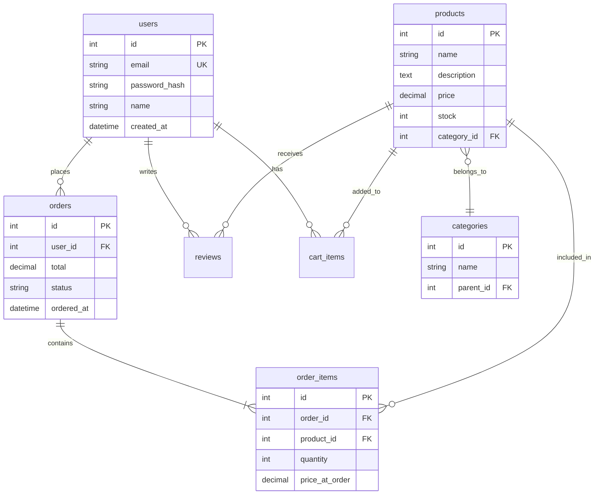

# Phase 6: 総仕上げ ～ 実践プロジェクトとチェックリスト ～

## 学習目標

この単元を終えると、以下ができるようになります：

- 要件からデータベース設計ができる
- 実践的な SQL を書ける
- パフォーマンスを考慮した設計ができる

## 実践プロジェクト: ECサイトのデータベース

### 要件

- ユーザー登録・認証
- 商品カタログ（カテゴリ付き）
- ショッピングカート
- 注文・決済
- レビュー機能

### ER図



### テーブル作成

```bash
docker exec -it mysql-practice mysql -u student -pstudentpass practice << 'EOF'
-- ECサイトのテーブル作成

-- ユーザー
CREATE TABLE ec_users (
    id INT AUTO_INCREMENT PRIMARY KEY,
    email VARCHAR(255) NOT NULL UNIQUE,
    password_hash VARCHAR(255) NOT NULL,
    name VARCHAR(100) NOT NULL,
    phone VARCHAR(20),
    address VARCHAR(500),
    created_at TIMESTAMP DEFAULT CURRENT_TIMESTAMP,
    updated_at TIMESTAMP DEFAULT CURRENT_TIMESTAMP ON UPDATE CURRENT_TIMESTAMP,
    INDEX idx_email (email)
);

-- カテゴリ（階層構造）
CREATE TABLE ec_categories (
    id INT AUTO_INCREMENT PRIMARY KEY,
    name VARCHAR(100) NOT NULL,
    parent_id INT NULL,
    sort_order INT DEFAULT 0,
    FOREIGN KEY (parent_id) REFERENCES ec_categories(id),
    INDEX idx_parent (parent_id)
);

-- 商品
CREATE TABLE ec_products (
    id INT AUTO_INCREMENT PRIMARY KEY,
    name VARCHAR(200) NOT NULL,
    description TEXT,
    price DECIMAL(10,2) NOT NULL,
    stock INT NOT NULL DEFAULT 0,
    category_id INT,
    is_active BOOLEAN DEFAULT TRUE,
    created_at TIMESTAMP DEFAULT CURRENT_TIMESTAMP,
    updated_at TIMESTAMP DEFAULT CURRENT_TIMESTAMP ON UPDATE CURRENT_TIMESTAMP,
    FOREIGN KEY (category_id) REFERENCES ec_categories(id),
    INDEX idx_category (category_id),
    INDEX idx_active_price (is_active, price)
);

-- カート
CREATE TABLE ec_cart_items (
    id INT AUTO_INCREMENT PRIMARY KEY,
    user_id INT NOT NULL,
    product_id INT NOT NULL,
    quantity INT NOT NULL DEFAULT 1,
    added_at TIMESTAMP DEFAULT CURRENT_TIMESTAMP,
    FOREIGN KEY (user_id) REFERENCES ec_users(id) ON DELETE CASCADE,
    FOREIGN KEY (product_id) REFERENCES ec_products(id) ON DELETE CASCADE,
    UNIQUE KEY uk_user_product (user_id, product_id)
);

-- 注文
CREATE TABLE ec_orders (
    id INT AUTO_INCREMENT PRIMARY KEY,
    user_id INT NOT NULL,
    subtotal DECIMAL(12,2) NOT NULL,
    tax DECIMAL(12,2) NOT NULL,
    shipping_fee DECIMAL(8,2) DEFAULT 0,
    total DECIMAL(12,2) NOT NULL,
    status ENUM('pending', 'paid', 'shipped', 'delivered', 'cancelled') DEFAULT 'pending',
    shipping_address VARCHAR(500),
    ordered_at TIMESTAMP DEFAULT CURRENT_TIMESTAMP,
    shipped_at TIMESTAMP NULL,
    delivered_at TIMESTAMP NULL,
    FOREIGN KEY (user_id) REFERENCES ec_users(id),
    INDEX idx_user (user_id),
    INDEX idx_status (status),
    INDEX idx_ordered_at (ordered_at)
);

-- 注文明細
CREATE TABLE ec_order_items (
    id INT AUTO_INCREMENT PRIMARY KEY,
    order_id INT NOT NULL,
    product_id INT NOT NULL,
    product_name VARCHAR(200) NOT NULL,
    quantity INT NOT NULL,
    price_at_order DECIMAL(10,2) NOT NULL,
    FOREIGN KEY (order_id) REFERENCES ec_orders(id) ON DELETE CASCADE,
    FOREIGN KEY (product_id) REFERENCES ec_products(id),
    INDEX idx_order (order_id)
);

-- レビュー
CREATE TABLE ec_reviews (
    id INT AUTO_INCREMENT PRIMARY KEY,
    user_id INT NOT NULL,
    product_id INT NOT NULL,
    rating TINYINT NOT NULL CHECK (rating BETWEEN 1 AND 5),
    title VARCHAR(200),
    content TEXT,
    created_at TIMESTAMP DEFAULT CURRENT_TIMESTAMP,
    FOREIGN KEY (user_id) REFERENCES ec_users(id),
    FOREIGN KEY (product_id) REFERENCES ec_products(id),
    UNIQUE KEY uk_user_product (user_id, product_id),
    INDEX idx_product_rating (product_id, rating)
);

SELECT 'テーブル作成完了' AS status;
EOF
```

### サンプルデータ

```bash
docker exec -it mysql-practice mysql -u student -pstudentpass practice << 'EOF'
-- サンプルデータ挿入

INSERT INTO ec_users (email, password_hash, name, address) VALUES
    ('user1@example.com', 'hash1', '田中太郎', '東京都渋谷区'),
    ('user2@example.com', 'hash2', '佐藤花子', '大阪府大阪市'),
    ('user3@example.com', 'hash3', '鈴木一郎', '愛知県名古屋市');

INSERT INTO ec_categories (id, name, parent_id) VALUES
    (1, '家電', NULL),
    (2, 'パソコン', 1),
    (3, 'スマートフォン', 1),
    (4, 'ファッション', NULL),
    (5, 'メンズ', 4),
    (6, 'レディース', 4);

INSERT INTO ec_products (name, description, price, stock, category_id) VALUES
    ('ノートPC A', '高性能ノートPC', 150000, 10, 2),
    ('ノートPC B', 'コスパ最強PC', 80000, 20, 2),
    ('スマホ X', '最新スマートフォン', 120000, 15, 3),
    ('スマホ Y', 'お手頃スマホ', 50000, 30, 3),
    ('Tシャツ', 'シンプルTシャツ', 3000, 100, 5),
    ('ワンピース', '春物ワンピース', 8000, 50, 6);

INSERT INTO ec_reviews (user_id, product_id, rating, title, content) VALUES
    (1, 1, 5, '最高！', 'とても満足しています'),
    (2, 1, 4, '良い', '概ね満足'),
    (1, 3, 5, '素晴らしい', 'カメラが最高'),
    (3, 2, 3, '普通', '値段相応');

SELECT 'サンプルデータ挿入完了' AS status;
EOF
```

### 実践クエリ

```bash
docker exec -it mysql-practice mysql -u student -pstudentpass practice << 'EOF'
-- 1. カテゴリ別商品数
SELECT 
    c.name AS カテゴリ,
    COUNT(p.id) AS 商品数
FROM ec_categories c
LEFT JOIN ec_products p ON c.id = p.category_id
GROUP BY c.id, c.name
ORDER BY 商品数 DESC;

-- 2. 商品一覧（レビュー情報付き）
SELECT 
    p.name AS 商品名,
    p.price AS 価格,
    COALESCE(AVG(r.rating), 0) AS 平均評価,
    COUNT(r.id) AS レビュー数
FROM ec_products p
LEFT JOIN ec_reviews r ON p.id = r.product_id
GROUP BY p.id, p.name, p.price
ORDER BY 平均評価 DESC, レビュー数 DESC;

-- 3. 売上ランキング（仮想データで）
-- 注文があると仮定したクエリ
SELECT 
    p.name AS 商品名,
    SUM(oi.quantity) AS 販売数,
    SUM(oi.quantity * oi.price_at_order) AS 売上金額
FROM ec_order_items oi
JOIN ec_products p ON oi.product_id = p.id
GROUP BY p.id, p.name
ORDER BY 売上金額 DESC
LIMIT 10;

-- 4. ユーザーの購入履歴
SELECT 
    u.name AS ユーザー名,
    o.id AS 注文ID,
    o.total AS 合計金額,
    o.status AS ステータス,
    GROUP_CONCAT(oi.product_name) AS 商品
FROM ec_users u
JOIN ec_orders o ON u.id = o.user_id
JOIN ec_order_items oi ON o.id = oi.order_id
GROUP BY u.id, u.name, o.id, o.total, o.status
ORDER BY o.ordered_at DESC;
EOF
```

### 注文処理のプロシージャ

```bash
docker exec -it mysql-practice mysql -u student -pstudentpass practice << 'EOF'
DELIMITER //

CREATE PROCEDURE create_order(IN p_user_id INT)
BEGIN
    DECLARE v_order_id INT;
    DECLARE v_subtotal DECIMAL(12,2);
    DECLARE v_tax DECIMAL(12,2);
    DECLARE v_total DECIMAL(12,2);
    
    START TRANSACTION;
    
    -- 小計計算
    SELECT SUM(p.price * ci.quantity) INTO v_subtotal
    FROM ec_cart_items ci
    JOIN ec_products p ON ci.product_id = p.id
    WHERE ci.user_id = p_user_id;
    
    IF v_subtotal IS NULL OR v_subtotal = 0 THEN
        ROLLBACK;
        SIGNAL SQLSTATE '45000' SET MESSAGE_TEXT = 'カートが空です';
    END IF;
    
    SET v_tax = ROUND(v_subtotal * 0.1, 2);
    SET v_total = v_subtotal + v_tax;
    
    -- 注文作成
    INSERT INTO ec_orders (user_id, subtotal, tax, total)
    VALUES (p_user_id, v_subtotal, v_tax, v_total);
    SET v_order_id = LAST_INSERT_ID();
    
    -- 注文明細作成 & 在庫減少
    INSERT INTO ec_order_items (order_id, product_id, product_name, quantity, price_at_order)
    SELECT v_order_id, p.id, p.name, ci.quantity, p.price
    FROM ec_cart_items ci
    JOIN ec_products p ON ci.product_id = p.id
    WHERE ci.user_id = p_user_id;
    
    UPDATE ec_products p
    JOIN ec_cart_items ci ON p.id = ci.product_id
    SET p.stock = p.stock - ci.quantity
    WHERE ci.user_id = p_user_id;
    
    -- カートクリア
    DELETE FROM ec_cart_items WHERE user_id = p_user_id;
    
    COMMIT;
    SELECT v_order_id AS order_id, v_total AS total;
END //

DELIMITER ;

-- テスト
INSERT INTO ec_cart_items (user_id, product_id, quantity) VALUES (1, 1, 1), (1, 5, 2);
CALL create_order(1);
SELECT * FROM ec_orders;
SELECT * FROM ec_order_items;
EOF
```

## データベース設計チェックリスト

```markdown
## テーブル設計
- [ ] 適切な主キーが設定されている
- [ ] 外部キーで参照整合性を保証
- [ ] NOT NULL 制約が必要な列に設定
- [ ] 適切なデータ型を選択
- [ ] 適切なインデックスを作成

## 正規化
- [ ] 第3正規形まで正規化
- [ ] 必要に応じた非正規化

## パフォーマンス
- [ ] 検索条件の列にインデックス
- [ ] 結合条件の列にインデックス
- [ ] EXPLAIN で実行計画を確認

## セキュリティ
- [ ] パスワードはハッシュ化
- [ ] 個人情報の適切な管理
- [ ] SQLインジェクション対策

## 運用
- [ ] バックアップ計画
- [ ] マイグレーション戦略
```

## 理解度確認

### 問題

ECサイトで「ユーザーごとの累計購入金額ランキング」を取得する SQL として正しいものはどれか。

**A.**
```sql
SELECT user_id, SUM(total) 
FROM ec_orders 
ORDER BY SUM(total) DESC;
```

**B.**
```sql
SELECT u.name, SUM(o.total) AS total_spent
FROM ec_users u
JOIN ec_orders o ON u.id = o.user_id
WHERE o.status != 'cancelled'
GROUP BY u.id, u.name
ORDER BY total_spent DESC;
```

**C.**
```sql
SELECT u.name, o.total
FROM ec_users u, ec_orders o
WHERE u.id = o.user_id
ORDER BY o.total DESC;
```

**D.**
```sql
SELECT name, total FROM ec_orders
GROUP BY user_id
ORDER BY total DESC;
```

---

### 解答・解説

**正解: B**

- **A.** SELECT に user_id があるが GROUP BY がない。
- **B.** 正解。ユーザーでグループ化し、キャンセル以外の注文を集計。
- **C.** グループ化がなく、個別の注文ごとに表示される。
- **D.** 文法エラー。name が ec_orders にない。

---

## 🎉 データベース基礎 完了！

### 学習の総まとめ

| Phase | 学んだこと |
|-------|-----------|
| 0 | Docker で MySQL 環境構築 |
| 1 | RDB の概念、テーブル構造 |
| 2 | SELECT, INSERT, UPDATE, DELETE |
| 3 | テーブル設計、正規化 |
| 4 | JOIN、集計、サブクエリ |
| 5 | インデックス、トランザクション |
| 6 | 実践プロジェクト |

### 次に学ぶべきカリキュラム

- **Redis・キャッシュ戦略** - DB 負荷軽減
- **パフォーマンスチューニング** - クエリ最適化
- **NoSQL 深掘り** - MongoDB, DynamoDB

---

**お疲れ様でした！🗃️**
