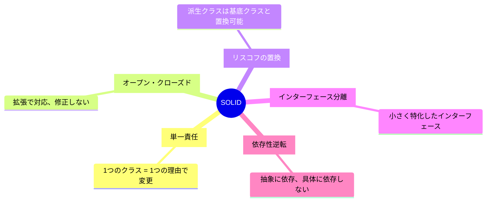

# Phase 1-1: SOLID 原則 ～ 良い設計の基本 ～

## 学習目標

この単元を終えると、以下ができるようになります：

- SOLID 原則の各項目を説明できる
- 原則に違反したコードを識別できる
- 原則に従ったリファクタリングができる

## 概念解説

### SOLID とは

| 原則 | 英語 | 日本語 |
|------|------|--------|
| S | Single Responsibility | 単一責任の原則 |
| O | Open/Closed | オープン・クローズドの原則 |
| L | Liskov Substitution | リスコフの置換原則 |
| I | Interface Segregation | インターフェース分離の原則 |
| D | Dependency Inversion | 依存性逆転の原則 |

## ハンズオン

### 演習1: 単一責任の原則 (SRP)

**「クラスを変更する理由は1つだけであるべき」**

```python
# ❌ 悪い例：複数の責任を持つ
class UserManager:
    def __init__(self, db):
        self.db = db
    
    def create_user(self, name, email):
        # ユーザー作成（ビジネスロジック）
        user = {"name": name, "email": email}
        self.db.insert("users", user)
        
        # メール送信（通知の責任）
        self.send_welcome_email(email)
        
        # ログ出力（ロギングの責任）
        self.log(f"User created: {email}")
        
        return user
    
    def send_welcome_email(self, email):
        print(f"Sending welcome email to {email}")
    
    def log(self, message):
        print(f"[LOG] {message}")
```

```python
# ✅ 良い例：責任を分離
class UserService:
    def __init__(self, user_repository, email_service, logger):
        self.user_repository = user_repository
        self.email_service = email_service
        self.logger = logger
    
    def create_user(self, name: str, email: str) -> dict:
        user = {"name": name, "email": email}
        self.user_repository.save(user)
        self.email_service.send_welcome(email)
        self.logger.info(f"User created: {email}")
        return user

class UserRepository:
    def __init__(self, db):
        self.db = db
    
    def save(self, user: dict):
        self.db.insert("users", user)

class EmailService:
    def send_welcome(self, email: str):
        print(f"Sending welcome email to {email}")

class Logger:
    def info(self, message: str):
        print(f"[INFO] {message}")
```

### 演習2: オープン・クローズドの原則 (OCP)

**「拡張に対して開いて、修正に対して閉じている」**

```python
# ❌ 悪い例：新しい割引を追加するたびに修正が必要
class DiscountCalculator:
    def calculate(self, price: float, discount_type: str) -> float:
        if discount_type == "percentage":
            return price * 0.9  # 10% off
        elif discount_type == "fixed":
            return price - 100
        elif discount_type == "vip":  # 新規追加のたびに修正
            return price * 0.8
        return price
```

```python
# ✅ 良い例：拡張で対応可能
from abc import ABC, abstractmethod

class DiscountStrategy(ABC):
    @abstractmethod
    def apply(self, price: float) -> float:
        pass

class PercentageDiscount(DiscountStrategy):
    def __init__(self, percent: float):
        self.percent = percent
    
    def apply(self, price: float) -> float:
        return price * (1 - self.percent / 100)

class FixedDiscount(DiscountStrategy):
    def __init__(self, amount: float):
        self.amount = amount
    
    def apply(self, price: float) -> float:
        return max(0, price - self.amount)

class VIPDiscount(DiscountStrategy):
    def apply(self, price: float) -> float:
        return price * 0.8

# 新しい割引タイプを追加しても、既存コードは変更不要
class SeasonalDiscount(DiscountStrategy):
    def apply(self, price: float) -> float:
        return price * 0.7

class DiscountCalculator:
    def calculate(self, price: float, strategy: DiscountStrategy) -> float:
        return strategy.apply(price)
```

### 演習3: リスコフの置換原則 (LSP)

**「サブクラスはその基底クラスと置換可能でなければならない」**

```python
# ❌ 悪い例：正方形は長方形の一種だが、振る舞いが異なる
class Rectangle:
    def __init__(self, width: int, height: int):
        self._width = width
        self._height = height
    
    def set_width(self, width: int):
        self._width = width
    
    def set_height(self, height: int):
        self._height = height
    
    def area(self) -> int:
        return self._width * self._height

class Square(Rectangle):
    def __init__(self, side: int):
        super().__init__(side, side)
    
    def set_width(self, width: int):
        self._width = width
        self._height = width  # 正方形なので両方変える
    
    def set_height(self, height: int):
        self._width = height
        self._height = height

# 問題：Rectangle として使うと予期しない動作
def resize(rect: Rectangle):
    rect.set_width(10)
    rect.set_height(5)
    assert rect.area() == 50  # Square だと失敗！
```

```python
# ✅ 良い例：共通の抽象を使う
from abc import ABC, abstractmethod

class Shape(ABC):
    @abstractmethod
    def area(self) -> int:
        pass

class Rectangle(Shape):
    def __init__(self, width: int, height: int):
        self.width = width
        self.height = height
    
    def area(self) -> int:
        return self.width * self.height

class Square(Shape):
    def __init__(self, side: int):
        self.side = side
    
    def area(self) -> int:
        return self.side * self.side
```

### 演習4: インターフェース分離の原則 (ISP)

**「クライアントが使用しないメソッドに依存することを強制してはならない」**

```python
# ❌ 悪い例：大きすぎるインターフェース
from abc import ABC, abstractmethod

class Worker(ABC):
    @abstractmethod
    def work(self): pass
    
    @abstractmethod
    def eat(self): pass
    
    @abstractmethod
    def sleep(self): pass

class Robot(Worker):
    def work(self):
        print("Working...")
    
    def eat(self):
        pass  # ロボットは食べない！
    
    def sleep(self):
        pass  # ロボットは寝ない！
```

```python
# ✅ 良い例：インターフェースを分離
from abc import ABC, abstractmethod

class Workable(ABC):
    @abstractmethod
    def work(self): pass

class Eatable(ABC):
    @abstractmethod
    def eat(self): pass

class Sleepable(ABC):
    @abstractmethod
    def sleep(self): pass

class Human(Workable, Eatable, Sleepable):
    def work(self):
        print("Working...")
    
    def eat(self):
        print("Eating...")
    
    def sleep(self):
        print("Sleeping...")

class Robot(Workable):
    def work(self):
        print("Working...")
```

### 演習5: 依存性逆転の原則 (DIP)

**「上位モジュールは下位モジュールに依存すべきでない。両者は抽象に依存すべき」**

```python
# ❌ 悪い例：具体的な実装に依存
class MySQLDatabase:
    def query(self, sql: str):
        print(f"MySQL: {sql}")

class UserRepository:
    def __init__(self):
        self.db = MySQLDatabase()  # 具体的な実装に依存
    
    def find_by_id(self, user_id: int):
        return self.db.query(f"SELECT * FROM users WHERE id = {user_id}")
```

```python
# ✅ 良い例：抽象に依存
from abc import ABC, abstractmethod

class Database(ABC):
    @abstractmethod
    def query(self, sql: str): pass

class MySQLDatabase(Database):
    def query(self, sql: str):
        print(f"MySQL: {sql}")

class PostgreSQLDatabase(Database):
    def query(self, sql: str):
        print(f"PostgreSQL: {sql}")

class UserRepository:
    def __init__(self, db: Database):  # 抽象に依存
        self.db = db
    
    def find_by_id(self, user_id: int):
        return self.db.query(f"SELECT * FROM users WHERE id = {user_id}")

# 使用時に具体的な実装を注入
mysql_db = MySQLDatabase()
repo = UserRepository(mysql_db)  # DI (Dependency Injection)
```

## SOLID 原則まとめ



## 理解度確認

### 問題

以下のコードはどの SOLID 原則に違反しているか。

```python
class ReportGenerator:
    def generate(self, data):
        report = self.format_data(data)
        self.save_to_file(report)
        self.send_email(report)
        return report
```

**A.** オープン・クローズドの原則

**B.** 単一責任の原則

**C.** リスコフの置換原則

**D.** 依存性逆転の原則

---

### 解答・解説

**正解: B**

ReportGenerator は以下の3つの責任を持っています：
1. レポートのフォーマット
2. ファイルへの保存
3. メール送信

これらは別々のクラスに分離すべきです。

---

## 次のステップ

SOLID 原則を学びました。次は読みやすいコードの書き方を学びましょう。

**次の単元**: [Phase 1-2: クリーンコード](./02_クリーンコード.md)
