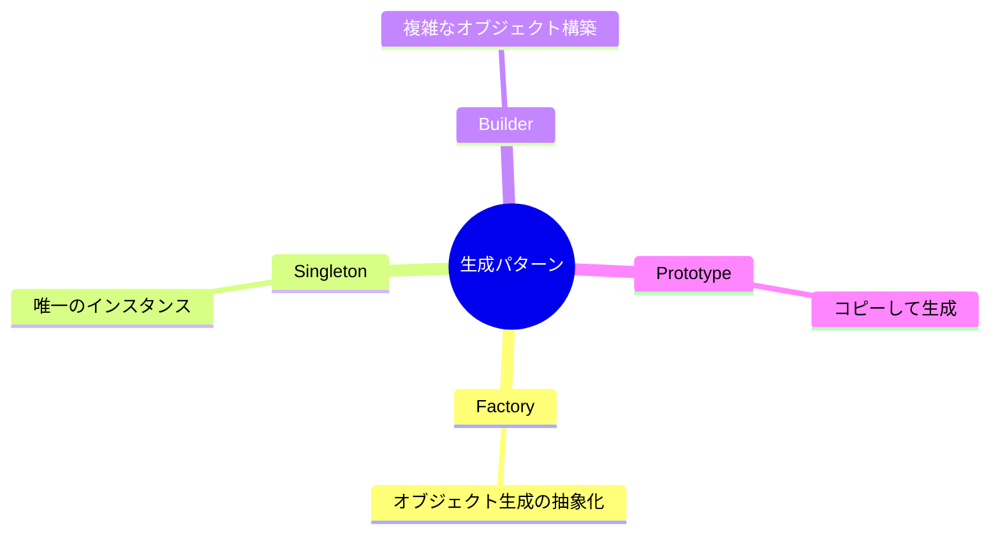

# Phase 2-1: 生成パターン ～ オブジェクトの生成を制御 ～

## 学習目標

この単元を終えると、以下ができるようになります：

- Factory パターンでオブジェクト生成を抽象化できる
- Singleton パターンを適切に使用できる
- Builder パターンで複雑なオブジェクトを構築できる

## 概念解説

### 生成パターンとは

オブジェクトの生成プロセスを柔軟にし、コードの結合度を下げるパターン。



## ハンズオン

### 演習1: Factory Method パターン

```python
# ❌ 使う側で具体的なクラスを知っている必要がある
class PDFReport:
    def generate(self, data):
        return f"PDF: {data}"

class ExcelReport:
    def generate(self, data):
        return f"Excel: {data}"

# 使用側
def export_data(format_type, data):
    if format_type == "pdf":
        report = PDFReport()
    elif format_type == "excel":
        report = ExcelReport()
    # 新しいフォーマットを追加するたびに修正が必要
    return report.generate(data)
```

```python
# ✅ Factory Method パターン
from abc import ABC, abstractmethod

# 抽象クラス
class Report(ABC):
    @abstractmethod
    def generate(self, data: str) -> str:
        pass

# 具体的な実装
class PDFReport(Report):
    def generate(self, data: str) -> str:
        return f"📄 PDF Report: {data}"

class ExcelReport(Report):
    def generate(self, data: str) -> str:
        return f"📊 Excel Report: {data}"

class HTMLReport(Report):
    def generate(self, data: str) -> str:
        return f"🌐 HTML Report: {data}"

# Factory
class ReportFactory:
    _reports = {
        "pdf": PDFReport,
        "excel": ExcelReport,
        "html": HTMLReport,
    }
    
    @classmethod
    def create(cls, format_type: str) -> Report:
        report_class = cls._reports.get(format_type)
        if not report_class:
            raise ValueError(f"Unknown format: {format_type}")
        return report_class()
    
    @classmethod
    def register(cls, format_type: str, report_class: type):
        """新しいレポートタイプを登録"""
        cls._reports[format_type] = report_class

# 使用側は具体的なクラスを知らなくて良い
def export_data(format_type: str, data: str) -> str:
    report = ReportFactory.create(format_type)
    return report.generate(data)

# テスト
print(export_data("pdf", "売上データ"))
print(export_data("excel", "在庫データ"))
print(export_data("html", "顧客データ"))

# 新しいフォーマットを追加（既存コード修正なし）
class CSVReport(Report):
    def generate(self, data: str) -> str:
        return f"📋 CSV Report: {data}"

ReportFactory.register("csv", CSVReport)
print(export_data("csv", "ログデータ"))
```

### 演習2: Abstract Factory パターン

```python
from abc import ABC, abstractmethod

# 抽象プロダクト
class Button(ABC):
    @abstractmethod
    def render(self) -> str:
        pass

class Input(ABC):
    @abstractmethod
    def render(self) -> str:
        pass

# 具体的なプロダクト（Material Design）
class MaterialButton(Button):
    def render(self) -> str:
        return "<md-button>Click</md-button>"

class MaterialInput(Input):
    def render(self) -> str:
        return "<md-input placeholder='Enter text'/>"

# 具体的なプロダクト（Bootstrap）
class BootstrapButton(Button):
    def render(self) -> str:
        return "<button class='btn btn-primary'>Click</button>"

class BootstrapInput(Input):
    def render(self) -> str:
        return "<input class='form-control'/>"

# 抽象ファクトリ
class UIFactory(ABC):
    @abstractmethod
    def create_button(self) -> Button:
        pass
    
    @abstractmethod
    def create_input(self) -> Input:
        pass

# 具体的なファクトリ
class MaterialUIFactory(UIFactory):
    def create_button(self) -> Button:
        return MaterialButton()
    
    def create_input(self) -> Input:
        return MaterialInput()

class BootstrapUIFactory(UIFactory):
    def create_button(self) -> Button:
        return BootstrapButton()
    
    def create_input(self) -> Input:
        return BootstrapInput()

# 使用側（どのUIフレームワークかを意識しない）
class LoginForm:
    def __init__(self, ui_factory: UIFactory):
        self.button = ui_factory.create_button()
        self.input = ui_factory.create_input()
    
    def render(self) -> str:
        return f"""
        <form>
            {self.input.render()}
            {self.button.render()}
        </form>
        """

# テスト
material_form = LoginForm(MaterialUIFactory())
print("Material Design:")
print(material_form.render())

bootstrap_form = LoginForm(BootstrapUIFactory())
print("\nBootstrap:")
print(bootstrap_form.render())
```

### 演習3: Singleton パターン

```python
# ❌ 悪い例：毎回新しいインスタンス
class DatabaseConnection:
    def __init__(self):
        print("Creating new connection...")
        self.connected = True

# 複数のインスタンスが作られる
conn1 = DatabaseConnection()
conn2 = DatabaseConnection()
print(conn1 is conn2)  # False
```

```python
# ✅ Singleton パターン（Python 的な実装）
class DatabaseConnection:
    _instance = None
    
    def __new__(cls):
        if cls._instance is None:
            cls._instance = super().__new__(cls)
            cls._instance._initialize()
        return cls._instance
    
    def _initialize(self):
        print("Creating new connection...")
        self.connected = True
    
    def query(self, sql: str):
        return f"Executing: {sql}"

# 同じインスタンスが返される
conn1 = DatabaseConnection()
conn2 = DatabaseConnection()
print(conn1 is conn2)  # True
print(conn1.query("SELECT * FROM users"))
```

```python
# ✅ より Pythonic な実装：モジュールレベル変数
# database.py
class _DatabaseConnection:
    def __init__(self):
        print("Creating new connection...")
        self.connected = True
    
    def query(self, sql: str):
        return f"Executing: {sql}"

# モジュールレベルでインスタンス化
connection = _DatabaseConnection()

# 使用側
# from database import connection
# connection.query("SELECT * FROM users")
```

```python
# ⚠️ Singleton の注意点
# - テストが難しくなる
- マルチスレッドで問題が起きる可能性
# - グローバル状態は避けるべき

# 代替案：DI（依存性注入）を使う
class UserService:
    def __init__(self, db_connection):  # 外部から注入
        self.db = db_connection
```

### 演習4: Builder パターン

```python
# ❌ 悪い例：コンストラクタの引数が多すぎる
class Email:
    def __init__(self, to, subject, body, cc=None, bcc=None, 
                 attachments=None, priority=None, html=False):
        self.to = to
        self.subject = subject
        self.body = body
        self.cc = cc or []
        self.bcc = bcc or []
        self.attachments = attachments or []
        self.priority = priority
        self.html = html

# 使いにくい
email = Email("user@example.com", "Hello", "Body", None, None, 
              ["file.pdf"], "high", True)
```

```python
# ✅ Builder パターン
from dataclasses import dataclass, field
from typing import Optional

@dataclass
class Email:
    to: str
    subject: str
    body: str
    cc: list[str] = field(default_factory=list)
    bcc: list[str] = field(default_factory=list)
    attachments: list[str] = field(default_factory=list)
    priority: Optional[str] = None
    html: bool = False

class EmailBuilder:
    def __init__(self):
        self._to = ""
        self._subject = ""
        self._body = ""
        self._cc = []
        self._bcc = []
        self._attachments = []
        self._priority = None
        self._html = False
    
    def to(self, address: str) -> 'EmailBuilder':
        self._to = address
        return self
    
    def subject(self, subject: str) -> 'EmailBuilder':
        self._subject = subject
        return self
    
    def body(self, body: str) -> 'EmailBuilder':
        self._body = body
        return self
    
    def cc(self, *addresses: str) -> 'EmailBuilder':
        self._cc.extend(addresses)
        return self
    
    def bcc(self, *addresses: str) -> 'EmailBuilder':
        self._bcc.extend(addresses)
        return self
    
    def attach(self, *files: str) -> 'EmailBuilder':
        self._attachments.extend(files)
        return self
    
    def priority(self, priority: str) -> 'EmailBuilder':
        self._priority = priority
        return self
    
    def as_html(self) -> 'EmailBuilder':
        self._html = True
        return self
    
    def build(self) -> Email:
        if not self._to:
            raise ValueError("Recipient is required")
        if not self._subject:
            raise ValueError("Subject is required")
        
        return Email(
            to=self._to,
            subject=self._subject,
            body=self._body,
            cc=self._cc,
            bcc=self._bcc,
            attachments=self._attachments,
            priority=self._priority,
            html=self._html
        )

# 使いやすい！
email = (EmailBuilder()
    .to("user@example.com")
    .subject("重要なお知らせ")
    .body("<h1>Hello</h1>")
    .cc("manager@example.com")
    .attach("report.pdf", "data.xlsx")
    .priority("high")
    .as_html()
    .build())

print(email)
```

## 生成パターンまとめ

| パターン | 用途 | 使用場面 |
|---------|------|---------|
| Factory Method | オブジェクト生成の抽象化 | タイプに応じたオブジェクト生成 |
| Abstract Factory | 関連オブジェクト群の生成 | UIテーマ、プラットフォーム対応 |
| Singleton | 唯一のインスタンス保証 | 設定、DB接続（要注意） |
| Builder | 複雑なオブジェクト構築 | 多数のオプションがある場合 |

## 理解度確認

### 問題

以下の要件に最も適したパターンはどれか。

「HTTPリクエストを作成する。メソッド、URL、ヘッダー、ボディ、タイムアウトなど多くのオプションがあり、段階的に設定したい。」

**A.** Factory Method

**B.** Singleton

**C.** Builder

**D.** Abstract Factory

---

### 解答・解説

**正解: C**

Builder パターンは：
- 多数のオプションがある
- 段階的に設定したい
- 最後に完成したオブジェクトを取得

という要件に最適です。

```python
request = (HttpRequestBuilder()
    .method("POST")
    .url("https://api.example.com/users")
    .header("Content-Type", "application/json")
    .body({"name": "John"})
    .timeout(30)
    .build())
```

---

## 次のステップ

生成パターンを学びました。次は構造パターンを学びましょう。

**次の単元**: [Phase 2-2: 構造パターン](./02_構造パターン.md)
