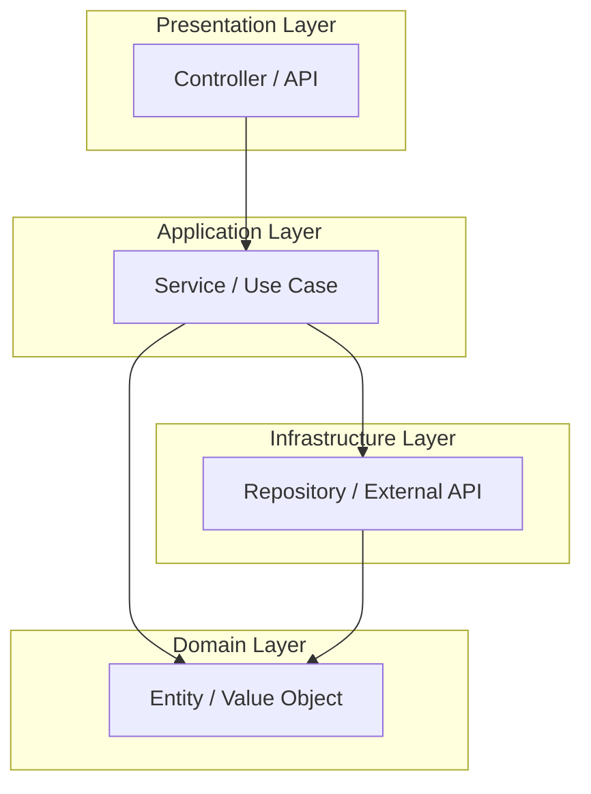
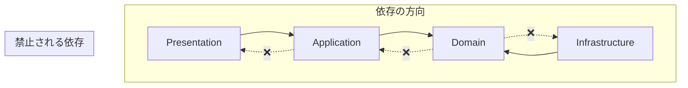

# Phase 4-1: レイヤードアーキテクチャ

## 学習目標

この単元を終えると、以下ができるようになります：

- レイヤードアーキテクチャの各層の役割を説明できる
- 適切なレイヤー分けでコードを設計できる
- レイヤー間の依存関係のルールを理解できる

## 概念解説

### レイヤードアーキテクチャとは

アプリケーションを責任ごとの層に分割する設計手法。



### 各レイヤーの責任

| レイヤー | 責任 | 例 |
|---------|------|-----|
| Presentation | ユーザーI/F、リクエスト/レスポンス処理 | Controller, API Handler |
| Application | ユースケース、トランザクション | Service, Use Case |
| Domain | ビジネスルール、エンティティ | Entity, Value Object |
| Infrastructure | 外部システムとの通信 | Repository, API Client |

## ハンズオン

### 演習1: レイヤードアーキテクチャの実装

```
project/
├── presentation/
│   └── user_controller.py
├── application/
│   └── user_service.py
├── domain/
│   ├── entities/
│   │   └── user.py
│   └── repositories/
│       └── user_repository.py
├── infrastructure/
│   └── mysql_user_repository.py
└── main.py
```

```python
# domain/entities/user.py
from dataclasses import dataclass
from datetime import datetime
from typing import Optional

@dataclass
class User:
    """ユーザーエンティティ"""
    id: Optional[int]
    name: str
    email: str
    created_at: datetime
    
    def __post_init__(self):
        self._validate()
    
    def _validate(self):
        if not self.name or len(self.name) < 2:
            raise ValueError("Name must be at least 2 characters")
        if not self.email or "@" not in self.email:
            raise ValueError("Invalid email format")
    
    def change_email(self, new_email: str):
        """メールアドレス変更のビジネスロジック"""
        if new_email == self.email:
            raise ValueError("New email must be different")
        self.email = new_email
```

```python
# domain/repositories/user_repository.py
from abc import ABC, abstractmethod
from typing import List, Optional
from domain.entities.user import User

class UserRepository(ABC):
    """ユーザーリポジトリのインターフェース"""
    
    @abstractmethod
    def find_by_id(self, user_id: int) -> Optional[User]:
        pass
    
    @abstractmethod
    def find_by_email(self, email: str) -> Optional[User]:
        pass
    
    @abstractmethod
    def find_all(self) -> List[User]:
        pass
    
    @abstractmethod
    def save(self, user: User) -> User:
        pass
    
    @abstractmethod
    def delete(self, user_id: int) -> None:
        pass
```

```python
# infrastructure/mysql_user_repository.py
from datetime import datetime
from typing import List, Optional
from domain.entities.user import User
from domain.repositories.user_repository import UserRepository

class MySQLUserRepository(UserRepository):
    """MySQL実装のユーザーリポジトリ"""
    
    def __init__(self, connection):
        self.conn = connection
    
    def find_by_id(self, user_id: int) -> Optional[User]:
        cursor = self.conn.cursor()
        cursor.execute(
            "SELECT id, name, email, created_at FROM users WHERE id = %s",
            (user_id,)
        )
        row = cursor.fetchone()
        if row:
            return User(
                id=row[0],
                name=row[1],
                email=row[2],
                created_at=row[3]
            )
        return None
    
    def find_by_email(self, email: str) -> Optional[User]:
        cursor = self.conn.cursor()
        cursor.execute(
            "SELECT id, name, email, created_at FROM users WHERE email = %s",
            (email,)
        )
        row = cursor.fetchone()
        if row:
            return User(id=row[0], name=row[1], email=row[2], created_at=row[3])
        return None
    
    def find_all(self) -> List[User]:
        cursor = self.conn.cursor()
        cursor.execute("SELECT id, name, email, created_at FROM users")
        return [
            User(id=row[0], name=row[1], email=row[2], created_at=row[3])
            for row in cursor.fetchall()
        ]
    
    def save(self, user: User) -> User:
        cursor = self.conn.cursor()
        if user.id is None:
            cursor.execute(
                "INSERT INTO users (name, email, created_at) VALUES (%s, %s, %s)",
                (user.name, user.email, user.created_at)
            )
            user.id = cursor.lastrowid
        else:
            cursor.execute(
                "UPDATE users SET name = %s, email = %s WHERE id = %s",
                (user.name, user.email, user.id)
            )
        self.conn.commit()
        return user
    
    def delete(self, user_id: int) -> None:
        cursor = self.conn.cursor()
        cursor.execute("DELETE FROM users WHERE id = %s", (user_id,))
        self.conn.commit()
```

```python
# application/user_service.py
from datetime import datetime
from typing import List, Optional
from domain.entities.user import User
from domain.repositories.user_repository import UserRepository

class UserService:
    """ユーザー関連のユースケースを実装"""
    
    def __init__(self, user_repository: UserRepository):
        self.user_repository = user_repository
    
    def get_user(self, user_id: int) -> Optional[User]:
        """ユーザー取得"""
        return self.user_repository.find_by_id(user_id)
    
    def list_users(self) -> List[User]:
        """ユーザー一覧取得"""
        return self.user_repository.find_all()
    
    def register_user(self, name: str, email: str) -> User:
        """ユーザー登録（ユースケース）"""
        # ビジネスルール：同じメールアドレスは登録できない
        existing = self.user_repository.find_by_email(email)
        if existing:
            raise ValueError("Email already registered")
        
        user = User(
            id=None,
            name=name,
            email=email,
            created_at=datetime.now()
        )
        return self.user_repository.save(user)
    
    def change_email(self, user_id: int, new_email: str) -> User:
        """メールアドレス変更（ユースケース）"""
        user = self.user_repository.find_by_id(user_id)
        if not user:
            raise ValueError("User not found")
        
        # 新しいメールアドレスが他のユーザーに使われていないか確認
        existing = self.user_repository.find_by_email(new_email)
        if existing and existing.id != user_id:
            raise ValueError("Email already in use")
        
        user.change_email(new_email)
        return self.user_repository.save(user)
    
    def delete_user(self, user_id: int) -> None:
        """ユーザー削除"""
        user = self.user_repository.find_by_id(user_id)
        if not user:
            raise ValueError("User not found")
        self.user_repository.delete(user_id)
```

```python
# presentation/user_controller.py
from dataclasses import dataclass, asdict
from typing import List
from application.user_service import UserService

# Request/Response DTO
@dataclass
class CreateUserRequest:
    name: str
    email: str

@dataclass
class UserResponse:
    id: int
    name: str
    email: str
    created_at: str
    
    def to_dict(self):
        return asdict(self)

class UserController:
    """HTTPリクエストを処理するコントローラー"""
    
    def __init__(self, user_service: UserService):
        self.user_service = user_service
    
    def get_user(self, user_id: int) -> dict:
        """GET /users/{id}"""
        try:
            user = self.user_service.get_user(user_id)
            if not user:
                return {"error": "User not found"}, 404
            
            response = UserResponse(
                id=user.id,
                name=user.name,
                email=user.email,
                created_at=user.created_at.isoformat()
            )
            return response.to_dict(), 200
        except Exception as e:
            return {"error": str(e)}, 500
    
    def list_users(self) -> dict:
        """GET /users"""
        try:
            users = self.user_service.list_users()
            return {
                "users": [
                    UserResponse(
                        id=u.id,
                        name=u.name,
                        email=u.email,
                        created_at=u.created_at.isoformat()
                    ).to_dict()
                    for u in users
                ]
            }, 200
        except Exception as e:
            return {"error": str(e)}, 500
    
    def create_user(self, request: CreateUserRequest) -> dict:
        """POST /users"""
        try:
            user = self.user_service.register_user(
                name=request.name,
                email=request.email
            )
            response = UserResponse(
                id=user.id,
                name=user.name,
                email=user.email,
                created_at=user.created_at.isoformat()
            )
            return response.to_dict(), 201
        except ValueError as e:
            return {"error": str(e)}, 400
        except Exception as e:
            return {"error": str(e)}, 500
```

```python
# main.py - アプリケーションの組み立て
from infrastructure.mysql_user_repository import MySQLUserRepository
from application.user_service import UserService
from presentation.user_controller import UserController

def create_app(db_connection):
    # DI：依存関係を組み立て
    user_repository = MySQLUserRepository(db_connection)
    user_service = UserService(user_repository)
    user_controller = UserController(user_service)
    
    return user_controller

# テスト用
from infrastructure.in_memory_user_repository import InMemoryUserRepository

def create_test_app():
    user_repository = InMemoryUserRepository()
    user_service = UserService(user_repository)
    user_controller = UserController(user_service)
    
    return user_controller
```

### 演習2: レイヤー間の依存ルール



**ルール**

| From | To | 許可 |
|------|----|------|
| Presentation | Application | ✅ |
| Application | Domain | ✅ |
| Infrastructure | Domain | ✅ |
| Domain | Application | ❌ |
| Domain | Infrastructure | ❌ |
| Application | Presentation | ❌ |

**なぜ Domain は他に依存しないのか？**

- ビジネスルールは最も変わりにくい
- DBやUIの変更でビジネスルールが壊れてはならない
- テストしやすい

## 理解度確認

### 問題

レイヤードアーキテクチャで「ユーザーがVIPかどうか判定するロジック」を実装する場合、最も適切なレイヤーはどれか。

**A.** Presentation Layer（Controller）

**B.** Application Layer（Service）

**C.** Domain Layer（Entity）

**D.** Infrastructure Layer（Repository）

---

### 解答・解説

**正解: C**

「VIPかどうか」はビジネスルールであり、Domain Layer（User Entity）に実装すべきです。

```python
@dataclass
class User:
    # ...
    total_purchases: float
    
    def is_vip(self) -> bool:
        """VIP判定のビジネスルール"""
        return self.total_purchases >= 100000
```

- Presentation: HTTPの処理のみ
- Application: ユースケースの調整
- Domain: ビジネスルール ← ここ
- Infrastructure: データアクセス

---

## 次のステップ

レイヤードアーキテクチャを学びました。次はクリーンアーキテクチャを学びましょう。

**次の単元**: [Phase 4-2: クリーンアーキテクチャ](./02_クリーンアーキテクチャ.md)
