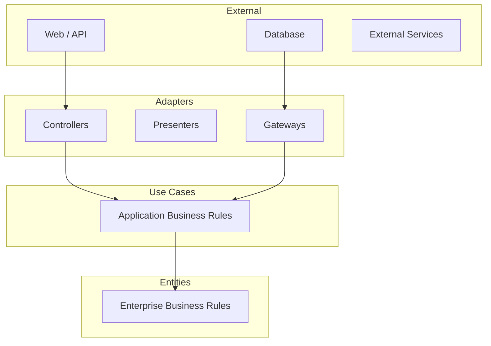

# Phase 4-2: クリーンアーキテクチャ

## 学習目標

この単元を終えると、以下ができるようになります：

- クリーンアーキテクチャの構造を説明できる
- 依存性逆転の原則をアーキテクチャレベルで適用できる
- ユースケース駆動の設計ができる

## 概念解説

### クリーンアーキテクチャとは



### 依存のルール

**「内側の円は外側の円について何も知らない」**

| レイヤー | 責任 | 依存 |
|---------|------|------|
| Entities | ビジネスルール | なし |
| Use Cases | アプリケーション固有のルール | Entities のみ |
| Adapters | データ変換 | Use Cases, Entities |
| External | フレームワーク、DB | すべて |

## ハンズオン

### 演習1: クリーンアーキテクチャの実装

```
project/
├── entities/
│   └── order.py
├── use_cases/
│   ├── ports/
│   │   ├── order_repository.py      # Input Port
│   │   └── payment_gateway.py       # Output Port
│   └── create_order.py              # Use Case
├── adapters/
│   ├── controllers/
│   │   └── order_controller.py
│   └── gateways/
│       ├── mysql_order_repository.py
│       └── stripe_payment_gateway.py
└── main.py
```

```python
# entities/order.py
from dataclasses import dataclass, field
from datetime import datetime
from typing import List
from enum import Enum

class OrderStatus(Enum):
    PENDING = "pending"
    PAID = "paid"
    SHIPPED = "shipped"
    DELIVERED = "delivered"
    CANCELLED = "cancelled"

@dataclass
class OrderItem:
    product_id: str
    product_name: str
    quantity: int
    unit_price: float
    
    @property
    def subtotal(self) -> float:
        return self.quantity * self.unit_price

@dataclass
class Order:
    """注文エンティティ - ビジネスルールを持つ"""
    id: str
    user_id: str
    items: List[OrderItem] = field(default_factory=list)
    status: OrderStatus = OrderStatus.PENDING
    created_at: datetime = field(default_factory=datetime.now)
    
    @property
    def total(self) -> float:
        """合計金額を計算"""
        return sum(item.subtotal for item in self.items)
    
    def add_item(self, item: OrderItem):
        """商品追加のビジネスルール"""
        if self.status != OrderStatus.PENDING:
            raise ValueError("Cannot add item to non-pending order")
        if item.quantity <= 0:
            raise ValueError("Quantity must be positive")
        self.items.append(item)
    
    def pay(self):
        """支払い完了のビジネスルール"""
        if self.status != OrderStatus.PENDING:
            raise ValueError("Order is not pending")
        if not self.items:
            raise ValueError("Cannot pay for empty order")
        self.status = OrderStatus.PAID
    
    def cancel(self):
        """キャンセルのビジネスルール"""
        if self.status in [OrderStatus.SHIPPED, OrderStatus.DELIVERED]:
            raise ValueError("Cannot cancel shipped or delivered order")
        self.status = OrderStatus.CANCELLED
```

```python
# use_cases/ports/order_repository.py
from abc import ABC, abstractmethod
from typing import Optional, List
from entities.order import Order

class OrderRepository(ABC):
    """Output Port - データ永続化のインターフェース"""
    
    @abstractmethod
    def save(self, order: Order) -> Order:
        pass
    
    @abstractmethod
    def find_by_id(self, order_id: str) -> Optional[Order]:
        pass
    
    @abstractmethod
    def find_by_user_id(self, user_id: str) -> List[Order]:
        pass
```

```python
# use_cases/ports/payment_gateway.py
from abc import ABC, abstractmethod
from dataclasses import dataclass

@dataclass
class PaymentResult:
    success: bool
    transaction_id: str
    error_message: str = ""

class PaymentGateway(ABC):
    """Output Port - 決済処理のインターフェース"""
    
    @abstractmethod
    def charge(self, user_id: str, amount: float) -> PaymentResult:
        pass
    
    @abstractmethod
    def refund(self, transaction_id: str, amount: float) -> PaymentResult:
        pass
```

```python
# use_cases/create_order.py
from dataclasses import dataclass
from typing import List
import uuid

from entities.order import Order, OrderItem
from use_cases.ports.order_repository import OrderRepository
from use_cases.ports.payment_gateway import PaymentGateway

# Input DTO
@dataclass
class CreateOrderInput:
    user_id: str
    items: List[dict]  # [{"product_id": "P001", "name": "...", "quantity": 2, "price": 100}]

# Output DTO
@dataclass
class CreateOrderOutput:
    order_id: str
    total: float
    status: str
    transaction_id: str

class CreateOrderUseCase:
    """注文作成ユースケース"""
    
    def __init__(
        self,
        order_repository: OrderRepository,
        payment_gateway: PaymentGateway
    ):
        self.order_repository = order_repository
        self.payment_gateway = payment_gateway
    
    def execute(self, input_data: CreateOrderInput) -> CreateOrderOutput:
        # 1. 注文エンティティを作成
        order = Order(
            id=str(uuid.uuid4()),
            user_id=input_data.user_id
        )
        
        # 2. 商品を追加
        for item in input_data.items:
            order.add_item(OrderItem(
                product_id=item["product_id"],
                product_name=item["name"],
                quantity=item["quantity"],
                unit_price=item["price"]
            ))
        
        # 3. 決済処理
        payment_result = self.payment_gateway.charge(
            user_id=order.user_id,
            amount=order.total
        )
        
        if not payment_result.success:
            raise ValueError(f"Payment failed: {payment_result.error_message}")
        
        # 4. 注文を支払い済みに更新
        order.pay()
        
        # 5. 保存
        saved_order = self.order_repository.save(order)
        
        # 6. 結果を返す
        return CreateOrderOutput(
            order_id=saved_order.id,
            total=saved_order.total,
            status=saved_order.status.value,
            transaction_id=payment_result.transaction_id
        )
```

```python
# adapters/gateways/mysql_order_repository.py
from typing import Optional, List
from entities.order import Order, OrderItem, OrderStatus
from use_cases.ports.order_repository import OrderRepository

class MySQLOrderRepository(OrderRepository):
    """MySQL実装のリポジトリ"""
    
    def __init__(self, connection):
        self.conn = connection
    
    def save(self, order: Order) -> Order:
        cursor = self.conn.cursor()
        
        # 注文を保存
        cursor.execute("""
            INSERT INTO orders (id, user_id, status, created_at)
            VALUES (%s, %s, %s, %s)
            ON DUPLICATE KEY UPDATE status = VALUES(status)
        """, (order.id, order.user_id, order.status.value, order.created_at))
        
        # 注文明細を保存
        for item in order.items:
            cursor.execute("""
                INSERT INTO order_items (order_id, product_id, product_name, quantity, unit_price)
                VALUES (%s, %s, %s, %s, %s)
            """, (order.id, item.product_id, item.product_name, item.quantity, item.unit_price))
        
        self.conn.commit()
        return order
    
    def find_by_id(self, order_id: str) -> Optional[Order]:
        cursor = self.conn.cursor()
        
        cursor.execute("SELECT * FROM orders WHERE id = %s", (order_id,))
        row = cursor.fetchone()
        if not row:
            return None
        
        cursor.execute("SELECT * FROM order_items WHERE order_id = %s", (order_id,))
        items = [
            OrderItem(
                product_id=item[1],
                product_name=item[2],
                quantity=item[3],
                unit_price=item[4]
            )
            for item in cursor.fetchall()
        ]
        
        return Order(
            id=row[0],
            user_id=row[1],
            items=items,
            status=OrderStatus(row[2]),
            created_at=row[3]
        )
    
    def find_by_user_id(self, user_id: str) -> List[Order]:
        # 実装...
        pass
```

```python
# adapters/gateways/stripe_payment_gateway.py
from use_cases.ports.payment_gateway import PaymentGateway, PaymentResult

class StripePaymentGateway(PaymentGateway):
    """Stripe実装の決済ゲートウェイ"""
    
    def __init__(self, api_key: str):
        self.api_key = api_key
    
    def charge(self, user_id: str, amount: float) -> PaymentResult:
        # 実際はStripe APIを呼び出す
        print(f"Charging {amount} for user {user_id}")
        return PaymentResult(
            success=True,
            transaction_id="txn_123456"
        )
    
    def refund(self, transaction_id: str, amount: float) -> PaymentResult:
        print(f"Refunding {amount} for transaction {transaction_id}")
        return PaymentResult(
            success=True,
            transaction_id=transaction_id
        )
```

```python
# adapters/controllers/order_controller.py
from dataclasses import asdict
from use_cases.create_order import CreateOrderUseCase, CreateOrderInput

class OrderController:
    """HTTPアダプター"""
    
    def __init__(self, create_order_use_case: CreateOrderUseCase):
        self.create_order_use_case = create_order_use_case
    
    def create_order(self, request_body: dict) -> tuple[dict, int]:
        """POST /orders"""
        try:
            input_data = CreateOrderInput(
                user_id=request_body["user_id"],
                items=request_body["items"]
            )
            
            output = self.create_order_use_case.execute(input_data)
            
            return asdict(output), 201
        
        except ValueError as e:
            return {"error": str(e)}, 400
        except Exception as e:
            return {"error": "Internal server error"}, 500
```

```python
# main.py - 組み立て
def create_app(db_connection, stripe_api_key):
    # Infrastructure
    order_repository = MySQLOrderRepository(db_connection)
    payment_gateway = StripePaymentGateway(stripe_api_key)
    
    # Use Cases
    create_order_use_case = CreateOrderUseCase(
        order_repository=order_repository,
        payment_gateway=payment_gateway
    )
    
    # Controllers
    order_controller = OrderController(create_order_use_case)
    
    return order_controller
```

### 演習2: テスト容易性

```python
# テスト用のモック
class InMemoryOrderRepository(OrderRepository):
    def __init__(self):
        self.orders = {}
    
    def save(self, order: Order) -> Order:
        self.orders[order.id] = order
        return order
    
    def find_by_id(self, order_id: str) -> Optional[Order]:
        return self.orders.get(order_id)
    
    def find_by_user_id(self, user_id: str) -> List[Order]:
        return [o for o in self.orders.values() if o.user_id == user_id]

class MockPaymentGateway(PaymentGateway):
    def __init__(self, should_succeed: bool = True):
        self.should_succeed = should_succeed
        self.charges = []
    
    def charge(self, user_id: str, amount: float) -> PaymentResult:
        self.charges.append({"user_id": user_id, "amount": amount})
        return PaymentResult(
            success=self.should_succeed,
            transaction_id="mock_txn_123",
            error_message="" if self.should_succeed else "Card declined"
        )
    
    def refund(self, transaction_id: str, amount: float) -> PaymentResult:
        return PaymentResult(success=True, transaction_id=transaction_id)

# テスト
def test_create_order_success():
    # Arrange
    repo = InMemoryOrderRepository()
    gateway = MockPaymentGateway(should_succeed=True)
    use_case = CreateOrderUseCase(repo, gateway)
    
    input_data = CreateOrderInput(
        user_id="user_123",
        items=[
            {"product_id": "P001", "name": "Book", "quantity": 2, "price": 1500}
        ]
    )
    
    # Act
    output = use_case.execute(input_data)
    
    # Assert
    assert output.total == 3000
    assert output.status == "paid"
    assert len(gateway.charges) == 1
    assert gateway.charges[0]["amount"] == 3000

def test_create_order_payment_failure():
    # Arrange
    repo = InMemoryOrderRepository()
    gateway = MockPaymentGateway(should_succeed=False)
    use_case = CreateOrderUseCase(repo, gateway)
    
    input_data = CreateOrderInput(
        user_id="user_123",
        items=[
            {"product_id": "P001", "name": "Book", "quantity": 1, "price": 1000}
        ]
    )
    
    # Act & Assert
    try:
        use_case.execute(input_data)
        assert False, "Should raise ValueError"
    except ValueError as e:
        assert "Payment failed" in str(e)

test_create_order_success()
test_create_order_payment_failure()
print("All tests passed!")
```

## レイヤードとクリーンの比較

| 観点 | レイヤード | クリーン |
|------|-----------|---------|
| 依存の方向 | 上から下へ一方向 | 外から内へ（逆転可能） |
| テスト容易性 | 中程度 | 高い |
| 複雑さ | シンプル | やや複雑 |
| 適用場面 | 中小規模 | 大規模・長期保守 |

## 理解度確認

### 問題

クリーンアーキテクチャで「決済処理を Stripe から PayPal に変更する」場合、どの部分を変更する必要があるか。

**A.** Entity と Use Case

**B.** Use Case の Port インターフェースと Adapter

**C.** Adapter（Gateway）のみ

**D.** すべてのレイヤー

---

### 解答・解説

**正解: C**

クリーンアーキテクチャでは：
- PaymentGateway インターフェース（Port）は変更なし
- StripePaymentGateway → PayPalPaymentGateway に差し替えるだけ
- Use Case や Entity は決済の詳細を知らないので変更不要

これが「依存性逆転の原則」の効果です。

---

## 次のステップ

クリーンアーキテクチャを学びました。次は総仕上げとしてリファクタリング実践に取り組みましょう。

**次の単元**: [Phase 5-1: 総仕上げ](../phase5/01_総仕上げ.md)
