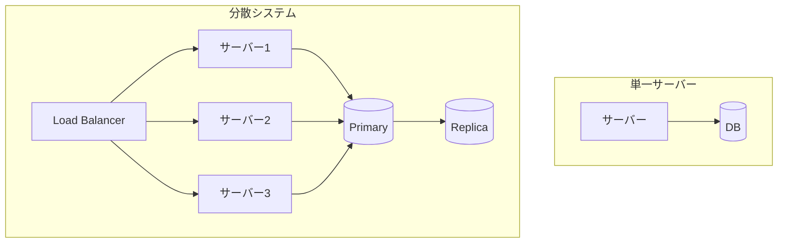
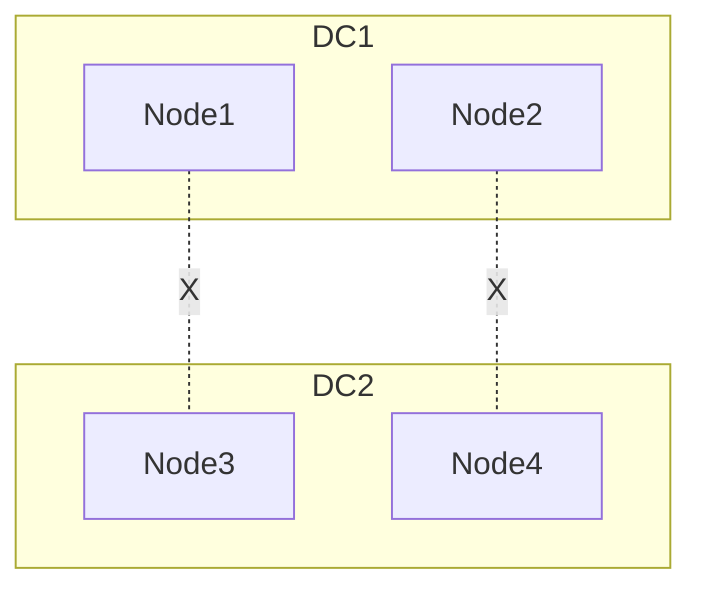

# Phase 1-1: 分散システム入門

## 学習目標

この単元を終えると、以下ができるようになります：

- 分散システムの必要性を説明できる
- 分散システムの課題を理解できる
- 設計上の考慮点を把握できる

## なぜ分散システムか



### 分散システムが必要な理由

| 理由 | 説明 |
|------|------|
| **スケーラビリティ** | 1台では処理しきれないトラフィック |
| **可用性** | 障害時もサービス継続 |
| **レイテンシ** | 地理的に近い場所で処理 |
| **法規制** | データの地域保持要件 |

## 分散システムの8つの誤解

```python
# fallacies_of_distributed_computing.py
"""
分散コンピューティングの8つの誤解
（開発者がよく陥る間違った前提）
"""

fallacies = [
    "1. ネットワークは信頼できる",     # → 常に失敗を想定
    "2. レイテンシはゼロ",              # → 遅延を考慮した設計
    "3. 帯域幅は無限",                  # → データ量を最適化
    "4. ネットワークは安全",            # → 認証・暗号化必須
    "5. トポロジは変化しない",          # → 動的な構成に対応
    "6. 管理者は1人",                   # → 複数チームの協調
    "7. 転送コストはゼロ",              # → 通信コストを意識
    "8. ネットワークは均質",            # → 異なる環境を考慮
]
```

## 分散システムの課題

### 1. 部分障害


**一部のノードだけが障害を起こす**

### 2. ネットワーク分断



## ハンズオン

### 演習1: 障害シミュレーション

```python
# failure_simulation.py
import random
import time
from typing import Optional

class UnreliableService:
    """信頼性のないサービス（障害シミュレーション）"""
    
    def __init__(self, failure_rate: float = 0.3):
        self.failure_rate = failure_rate
    
    def call(self, request: dict) -> dict:
        # ランダムな遅延
        delay = random.uniform(0.01, 0.5)
        time.sleep(delay)
        
        # ランダムな障害
        if random.random() < self.failure_rate:
            raise ServiceUnavailableError('Service temporarily unavailable')
        
        return {'status': 'success', 'data': request}

class ServiceUnavailableError(Exception):
    pass

# リトライ戦略
def retry_with_backoff(
    func,
    max_retries: int = 3,
    initial_delay: float = 0.1,
    backoff_factor: float = 2.0
) -> Optional[dict]:
    """指数バックオフ付きリトライ"""
    delay = initial_delay
    last_error = None
    
    for attempt in range(max_retries):
        try:
            return func()
        except ServiceUnavailableError as e:
            last_error = e
            print(f'Attempt {attempt + 1} failed, retrying in {delay:.2f}s...')
            time.sleep(delay)
            delay *= backoff_factor
    
    raise last_error

# 使用例
def demo():
    service = UnreliableService(failure_rate=0.5)
    
    try:
        result = retry_with_backoff(
            lambda: service.call({'user_id': '123'}),
            max_retries=5
        )
        print(f'Success: {result}')
    except ServiceUnavailableError:
        print('All retries failed')

if __name__ == '__main__':
    demo()
```

### 演習2: サーキットブレーカー

```python
# circuit_breaker.py
import time
from enum import Enum
from typing import Callable, Any

class CircuitState(Enum):
    CLOSED = 'closed'      # 正常
    OPEN = 'open'          # 遮断中
    HALF_OPEN = 'half_open'  # 試行中

class CircuitBreaker:
    """サーキットブレーカーパターン"""
    
    def __init__(
        self,
        failure_threshold: int = 5,
        recovery_timeout: float = 30.0,
        success_threshold: int = 3
    ):
        self.failure_threshold = failure_threshold
        self.recovery_timeout = recovery_timeout
        self.success_threshold = success_threshold
        
        self.state = CircuitState.CLOSED
        self.failure_count = 0
        self.success_count = 0
        self.last_failure_time = None
    
    def call(self, func: Callable[[], Any]) -> Any:
        if self.state == CircuitState.OPEN:
            if self._should_attempt_reset():
                self.state = CircuitState.HALF_OPEN
            else:
                raise CircuitOpenError('Circuit breaker is OPEN')
        
        try:
            result = func()
            self._record_success()
            return result
        except Exception as e:
            self._record_failure()
            raise
    
    def _should_attempt_reset(self) -> bool:
        return (
            self.last_failure_time is not None and
            time.time() - self.last_failure_time >= self.recovery_timeout
        )
    
    def _record_success(self):
        self.failure_count = 0
        
        if self.state == CircuitState.HALF_OPEN:
            self.success_count += 1
            if self.success_count >= self.success_threshold:
                self.state = CircuitState.CLOSED
                self.success_count = 0
    
    def _record_failure(self):
        self.failure_count += 1
        self.last_failure_time = time.time()
        self.success_count = 0
        
        if self.failure_count >= self.failure_threshold:
            self.state = CircuitState.OPEN

class CircuitOpenError(Exception):
    pass

# 使用例
def demo():
    breaker = CircuitBreaker(failure_threshold=3, recovery_timeout=5.0)
    service = UnreliableService(failure_rate=0.8)
    
    for i in range(10):
        try:
            result = breaker.call(lambda: service.call({'id': i}))
            print(f'Call {i}: Success')
        except CircuitOpenError:
            print(f'Call {i}: Circuit OPEN - Fast fail')
        except ServiceUnavailableError:
            print(f'Call {i}: Service failed')
        
        print(f'  State: {breaker.state.value}')
        time.sleep(0.5)
```

### 演習3: タイムアウト設計

```python
# timeout_design.py
import asyncio
from typing import Optional

async def call_with_timeout(
    coro,
    timeout: float
) -> Optional[dict]:
    """タイムアウト付き呼び出し"""
    try:
        return await asyncio.wait_for(coro, timeout=timeout)
    except asyncio.TimeoutError:
        return None

async def slow_service():
    """遅いサービス"""
    await asyncio.sleep(5)
    return {'status': 'success'}

async def demo():
    # 2秒でタイムアウト
    result = await call_with_timeout(slow_service(), timeout=2.0)
    
    if result is None:
        print('Timeout! Falling back...')
    else:
        print(f'Result: {result}')

# asyncio.run(demo())
```

## AWS での分散パターン

| パターン | AWS サービス |
|---------|-------------|
| ロードバランシング | ALB, NLB |
| サービスディスカバリ | Cloud Map |
| サーキットブレーカー | App Mesh |
| リトライ | Lambda + SQS |

## 理解度確認

### 問題

分散システムでサービス間通信が失敗した場合、最初に試すべき対策は何か。

**A.** 即座にエラーを返す

**B.** 指数バックオフでリトライ

**C.** サーバーを再起動

**D.** ログを確認する

---

### 解答・解説

**正解: B**

一時的な障害の場合、リトライで回復することが多いです。指数バックオフにより、システムへの負荷を抑えながらリトライできます。即座のエラーはユーザー体験を損ない、障害の連鎖を防げません。

---

## 次のステップ

分散システム入門を学びました。次は CAP 定理を学びましょう。

**次の単元**: [Phase 1-2: CAP 定理](./02_CAP定理.md)
