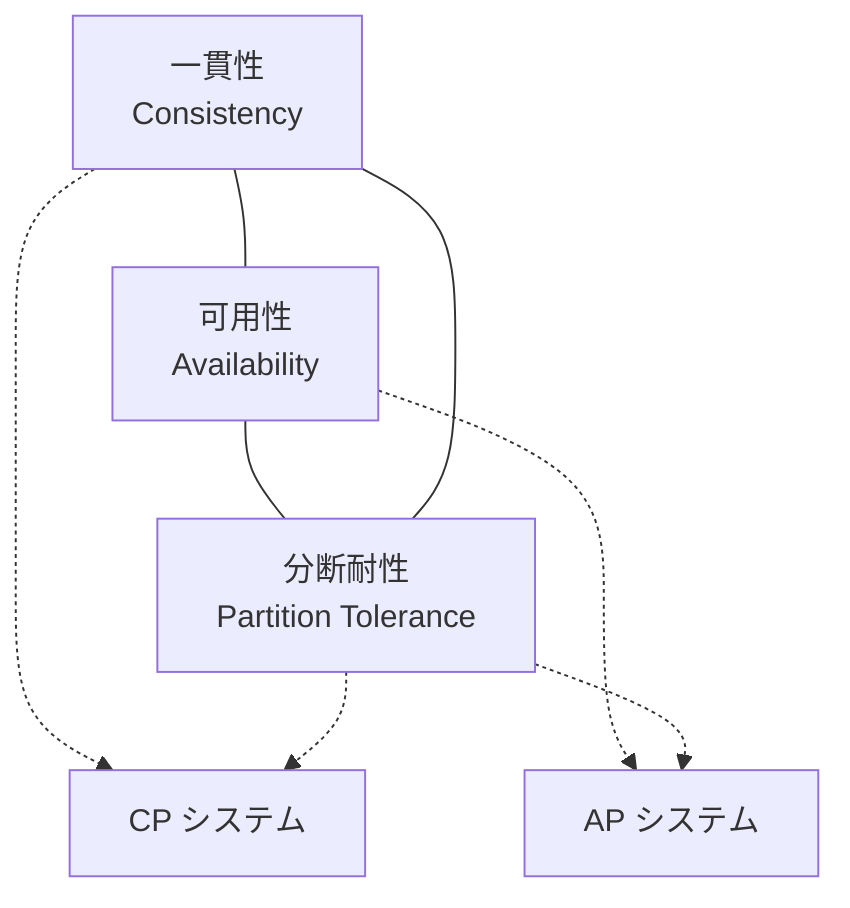
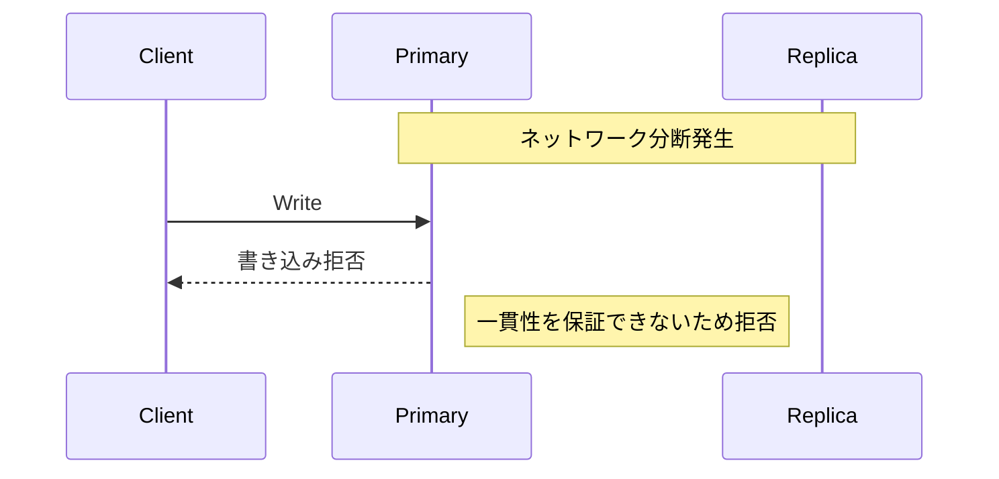
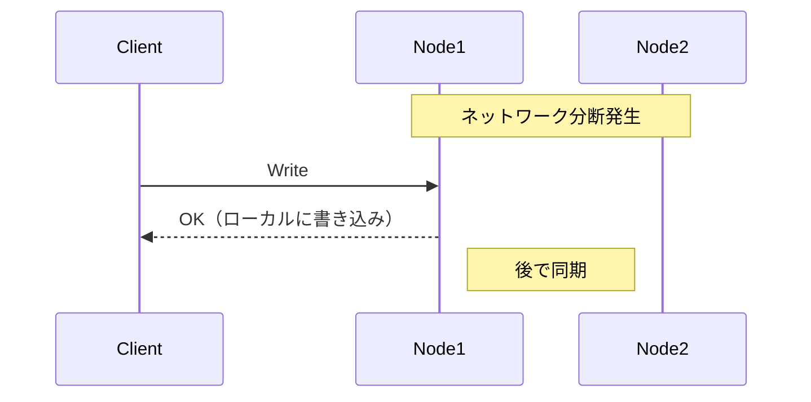

# Phase 1-2: CAP 定理

## 学習目標

この単元を終えると、以下ができるようになります：

- CAP 定理を説明できる
- CP/AP システムを区別できる
- ユースケースに応じた選択ができる

## CAP 定理とは



**ネットワーク分断時に、一貫性と可用性の両方は保証できない**

### 3つの特性

| 特性 | 説明 |
|------|------|
| **Consistency (C)** | すべてのノードが同じデータを見る |
| **Availability (A)** | すべてのリクエストに応答する |
| **Partition Tolerance (P)** | ネットワーク分断でも動作する |

### なぜ P は必須か

```
分散システムではネットワーク分断は必ず起きる
→ P は必須
→ C か A のどちらかを選択
```

## CP vs AP

### CP システム（一貫性重視）



**例**: 銀行口座、在庫管理

### AP システム（可用性重視）



**例**: ショッピングカート、いいね数

## ハンズオン

### 演習1: CP システム実装

```python
# cp_system.py
"""
CPシステム：一貫性重視
書き込みは過半数のレプリカに確認してから成功
"""

from typing import List, Optional
from dataclasses import dataclass
import threading
import time

@dataclass
class Node:
    id: str
    data: dict
    is_available: bool = True

class CPStorage:
    """一貫性重視のストレージ"""
    
    def __init__(self, nodes: List[Node]):
        self.nodes = nodes
        self.quorum = len(nodes) // 2 + 1  # 過半数
    
    def write(self, key: str, value: str) -> bool:
        """過半数への書き込みが成功したら成功"""
        successful_writes = 0
        
        for node in self.nodes:
            if not node.is_available:
                continue
            
            try:
                node.data[key] = value
                successful_writes += 1
            except Exception:
                pass
        
        if successful_writes >= self.quorum:
            return True
        else:
            # ロールバック
            for node in self.nodes:
                if key in node.data:
                    del node.data[key]
            raise ConsistencyError(
                f'Quorum not reached: {successful_writes}/{self.quorum}'
            )
    
    def read(self, key: str) -> Optional[str]:
        """過半数から同じ値が読めたら成功"""
        values = {}
        
        for node in self.nodes:
            if not node.is_available:
                continue
            
            value = node.data.get(key)
            if value is not None:
                values[value] = values.get(value, 0) + 1
        
        # 過半数が同じ値を持っているか確認
        for value, count in values.items():
            if count >= self.quorum:
                return value
        
        raise ConsistencyError('No quorum agreement')

class ConsistencyError(Exception):
    pass

# 使用例
def demo_cp():
    nodes = [
        Node(id='node1', data={}),
        Node(id='node2', data={}),
        Node(id='node3', data={}),
    ]
    storage = CPStorage(nodes)
    
    # 正常時
    storage.write('user:1', 'Alice')
    print(f'Read: {storage.read("user:1")}')
    
    # 2ノード停止（過半数不可）
    nodes[1].is_available = False
    nodes[2].is_available = False
    
    try:
        storage.write('user:2', 'Bob')
    except ConsistencyError as e:
        print(f'Write failed: {e}')  # 一貫性のため拒否

if __name__ == '__main__':
    demo_cp()
```

### 演習2: AP システム実装

```python
# ap_system.py
"""
APシステム：可用性重視
ローカルに書き込んで後で同期
"""

from typing import List, Optional, Dict
from dataclasses import dataclass, field
from datetime import datetime
import uuid

@dataclass
class VersionedValue:
    value: str
    version: str  # Vector Clock or timestamp
    node_id: str

@dataclass
class APNode:
    id: str
    data: Dict[str, VersionedValue] = field(default_factory=dict)
    pending_sync: List[dict] = field(default_factory=list)

class APStorage:
    """可用性重視のストレージ"""
    
    def __init__(self, nodes: List[APNode]):
        self.nodes = nodes
    
    def write(self, node_id: str, key: str, value: str) -> bool:
        """ローカルノードに即座に書き込み"""
        node = self._get_node(node_id)
        
        versioned = VersionedValue(
            value=value,
            version=str(uuid.uuid4()),
            node_id=node_id
        )
        
        node.data[key] = versioned
        
        # 他のノードへの同期をキューに追加
        node.pending_sync.append({
            'key': key,
            'value': versioned
        })
        
        return True  # 常に成功（可用性重視）
    
    def read(self, node_id: str, key: str) -> Optional[str]:
        """ローカルノードから即座に読み取り"""
        node = self._get_node(node_id)
        versioned = node.data.get(key)
        return versioned.value if versioned else None
    
    def sync(self):
        """バックグラウンドでの同期処理"""
        for node in self.nodes:
            for sync_item in node.pending_sync:
                for other_node in self.nodes:
                    if other_node.id == node.id:
                        continue
                    
                    self._merge(other_node, sync_item['key'], sync_item['value'])
            
            node.pending_sync.clear()
    
    def _merge(self, node: APNode, key: str, incoming: VersionedValue):
        """競合解決（Last Writer Wins）"""
        existing = node.data.get(key)
        
        if existing is None:
            node.data[key] = incoming
        elif incoming.version > existing.version:
            node.data[key] = incoming
        # それ以外は既存を維持
    
    def _get_node(self, node_id: str) -> APNode:
        for node in self.nodes:
            if node.id == node_id:
                return node
        raise ValueError(f'Node not found: {node_id}')

# 使用例
def demo_ap():
    nodes = [
        APNode(id='tokyo'),
        APNode(id='osaka'),
    ]
    storage = APStorage(nodes)
    
    # 分断中に両方で書き込み
    storage.write('tokyo', 'cart:1', 'itemA')
    storage.write('osaka', 'cart:1', 'itemB')  # 競合!
    
    print(f'Tokyo sees: {storage.read("tokyo", "cart:1")}')  # itemA
    print(f'Osaka sees: {storage.read("osaka", "cart:1")}')  # itemB
    
    # 同期後
    storage.sync()
    print('After sync:')
    print(f'Tokyo sees: {storage.read("tokyo", "cart:1")}')
    print(f'Osaka sees: {storage.read("osaka", "cart:1")}')

if __name__ == '__main__':
    demo_ap()
```

## 実際のシステム分類

| システム | タイプ | 理由 |
|---------|-------|------|
| PostgreSQL | CP | ACID トランザクション |
| DynamoDB | AP（設定可能） | 高可用性優先 |
| MongoDB | CP | 書き込み確認設定 |
| Cassandra | AP | 結果整合性 |
| Redis Cluster | CP | データ損失を防ぐ |

## 理解度確認

### 問題

ECサイトのショッピングカートに最適なのはどちらか。

**A.** CP システム（一貫性重視）

**B.** AP システム（可用性重視）

---

### 解答・解説

**正解: B**

ショッピングカートは一時的な不整合を許容できます。ユーザーがカートに商品を追加したときに「システムエラー」より、後で同期されるほうがユーザー体験が良いです。最終的な注文確定時に整合性を確認すれば十分です。

---

## 次のステップ

CAP 定理を学びました。次は一貫性モデルを学びましょう。

**次の単元**: [Phase 2-1: 一貫性モデル](../phase2/01_一貫性モデル.md)
