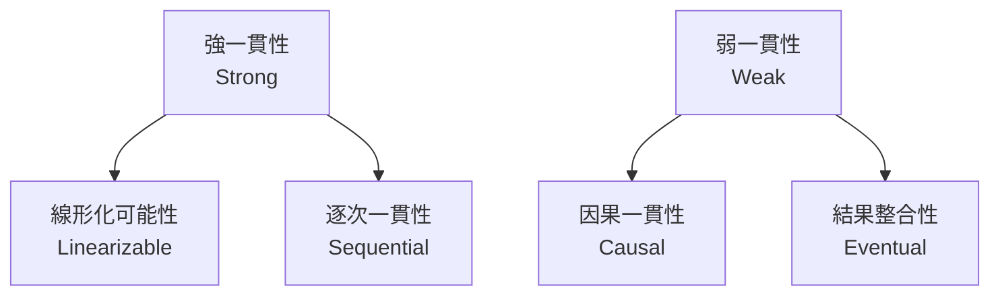

# Phase 2-1: 一貫性モデル

## 学習目標

この単元を終えると、以下ができるようになります：

- 一貫性モデルの違いを説明できる
- 強一貫性と結果整合性を使い分けられる
- 要件に応じたモデルを選択できる

## 一貫性モデルの種類



| モデル | 保証 | 遅延 |
|-------|------|------|
| **線形化可能性** | 最新の値を常に返す | 高 |
| **逐次一貫性** | 操作順序が保証 | 中 |
| **因果一貫性** | 因果関係が保証 | 低 |
| **結果整合性** | 最終的に一致 | 最低 |

## ハンズオン

### 演習1: 強一貫性

```python
# strong_consistency.py
"""
強一貫性：すべての読み取りが最新の書き込みを見る
"""

import threading
from typing import Optional

class StrongConsistentStore:
    """強一貫性ストア（単一リーダー）"""
    
    def __init__(self):
        self._data = {}
        self._lock = threading.RLock()
    
    def write(self, key: str, value: str) -> None:
        """書き込み（ロック取得）"""
        with self._lock:
            self._data[key] = value
    
    def read(self, key: str) -> Optional[str]:
        """読み取り（ロック取得）"""
        with self._lock:
            return self._data.get(key)

# 分散環境での強一貫性
class DistributedStrongStore:
    """分散強一貫性ストア"""
    
    def __init__(self, nodes: list, primary_id: str):
        self.nodes = {n.id: n for n in nodes}
        self.primary_id = primary_id
    
    def write(self, key: str, value: str) -> bool:
        """プライマリ経由で書き込み"""
        primary = self.nodes[self.primary_id]
        
        # プライマリに書き込み
        primary.data[key] = value
        
        # すべてのレプリカに同期（同期的）
        for node_id, node in self.nodes.items():
            if node_id != self.primary_id:
                node.data[key] = value
        
        return True
    
    def read(self, key: str) -> Optional[str]:
        """プライマリから読み取り"""
        primary = self.nodes[self.primary_id]
        return primary.data.get(key)
```

### 演習2: 結果整合性

```python
# eventual_consistency.py
"""
結果整合性：最終的に一致する
"""

import time
import random
from typing import Dict, Optional
from dataclasses import dataclass, field
from threading import Thread
from queue import Queue

@dataclass
class Event:
    key: str
    value: str
    timestamp: float

class EventualConsistentNode:
    """結果整合性ノード"""
    
    def __init__(self, node_id: str):
        self.node_id = node_id
        self.data: Dict[str, str] = {}
        self.event_queue: Queue = Queue()
        self.version: Dict[str, float] = {}  # key -> timestamp
    
    def local_write(self, key: str, value: str) -> Event:
        """ローカル書き込み"""
        timestamp = time.time()
        self.data[key] = value
        self.version[key] = timestamp
        
        event = Event(key=key, value=value, timestamp=timestamp)
        return event
    
    def apply_event(self, event: Event) -> bool:
        """イベントを適用（競合解決）"""
        current_version = self.version.get(event.key, 0)
        
        # Last Writer Wins
        if event.timestamp > current_version:
            self.data[event.key] = event.value
            self.version[event.key] = event.timestamp
            return True
        return False
    
    def read(self, key: str) -> Optional[str]:
        """ローカル読み取り（古い可能性あり）"""
        return self.data.get(key)

class EventualConsistentCluster:
    """結果整合性クラスター"""
    
    def __init__(self, nodes: list):
        self.nodes = {n.node_id: n for n in nodes}
        self.pending_events = []
    
    def write(self, node_id: str, key: str, value: str):
        """任意のノードに書き込み"""
        node = self.nodes[node_id]
        event = node.local_write(key, value)
        self.pending_events.append((node_id, event))
    
    def gossip_sync(self):
        """ゴシッププロトコルで同期"""
        for source_id, event in self.pending_events:
            for target_id, target_node in self.nodes.items():
                if target_id != source_id:
                    # ランダムな遅延（ネットワーク遅延シミュレーション）
                    time.sleep(random.uniform(0.01, 0.1))
                    target_node.apply_event(event)
        
        self.pending_events.clear()

# 使用例
def demo_eventual():
    nodes = [
        EventualConsistentNode('node1'),
        EventualConsistentNode('node2'),
        EventualConsistentNode('node3'),
    ]
    cluster = EventualConsistentCluster(nodes)
    
    # 異なるノードに同じキーを書き込み（競合）
    cluster.write('node1', 'counter', '100')
    time.sleep(0.01)  # わずかに遅延
    cluster.write('node2', 'counter', '200')
    
    print('Before sync:')
    for node in nodes:
        print(f'  {node.node_id}: {node.read("counter")}')
    
    # 同期
    cluster.gossip_sync()
    
    print('After sync:')
    for node in nodes:
        print(f'  {node.node_id}: {node.read("counter")}')

if __name__ == '__main__':
    demo_eventual()
```

### 演習3: 因果一貫性

```python
# causal_consistency.py
"""
因果一貫性：因果関係のある操作の順序を保証
"""

from dataclasses import dataclass, field
from typing import Dict, List, Optional

@dataclass
class VectorClock:
    """ベクタークロック"""
    clocks: Dict[str, int] = field(default_factory=dict)
    
    def increment(self, node_id: str):
        self.clocks[node_id] = self.clocks.get(node_id, 0) + 1
    
    def merge(self, other: 'VectorClock'):
        for node_id, clock in other.clocks.items():
            self.clocks[node_id] = max(
                self.clocks.get(node_id, 0),
                clock
            )
    
    def happens_before(self, other: 'VectorClock') -> bool:
        """自分が other より前に発生したか"""
        for node_id, clock in self.clocks.items():
            if clock > other.clocks.get(node_id, 0):
                return False
        return any(
            self.clocks.get(n, 0) < c
            for n, c in other.clocks.items()
        )
    
    def concurrent(self, other: 'VectorClock') -> bool:
        """並行か（因果関係なし）"""
        return not self.happens_before(other) and not other.happens_before(self)

@dataclass
class CausalEvent:
    key: str
    value: str
    vector_clock: VectorClock

class CausalConsistentNode:
    """因果一貫性ノード"""
    
    def __init__(self, node_id: str):
        self.node_id = node_id
        self.data: Dict[str, str] = {}
        self.clock = VectorClock()
        self.pending: List[CausalEvent] = []
    
    def write(self, key: str, value: str) -> CausalEvent:
        self.clock.increment(self.node_id)
        self.data[key] = value
        
        return CausalEvent(
            key=key,
            value=value,
            vector_clock=VectorClock(clocks=dict(self.clock.clocks))
        )
    
    def receive(self, event: CausalEvent):
        """イベントを受信（因果順序を保証）"""
        # 因果順序チェック
        if event.vector_clock.happens_before(self.clock):
            # 古いイベントは無視
            return
        
        # 適用
        self.data[event.key] = event.value
        self.clock.merge(event.vector_clock)

# 使用例
def demo_causal():
    node1 = CausalConsistentNode('node1')
    node2 = CausalConsistentNode('node2')
    
    # node1 が x を書き込み
    event1 = node1.write('x', '1')
    
    # node2 が受信
    node2.receive(event1)
    
    # node2 が x を読んで y を書き込み（因果関係あり）
    event2 = node2.write('y', node2.data.get('x', '') + '0')
    
    # node1 が受信（因果順序が保証される）
    node1.receive(event2)
    
    print(f'node1: x={node1.data.get("x")}, y={node1.data.get("y")}')
    print(f'node2: x={node2.data.get("x")}, y={node2.data.get("y")}')

if __name__ == '__main__':
    demo_causal()
```

## ユースケース別選択

| ユースケース | 一貫性モデル | 理由 |
|------------|------------|------|
| 銀行残高 | 強一貫性 | 正確な残高が必須 |
| いいね数 | 結果整合性 | 多少のずれは許容 |
| メッセージ順序 | 因果一貫性 | 会話の順序が重要 |
| 在庫数 | 強一貫性 | 売り切れ判定に必要 |

## 理解度確認

### 問題

SNS の「いいね」数の表示に最適な一貫性モデルはどれか。

**A.** 線形化可能性

**B.** 逐次一貫性

**C.** 結果整合性

**D.** 因果一貫性

---

### 解答・解説

**正解: C**

「いいね」数は多少の遅延や一時的なずれがあっても問題ありません。結果整合性により、高い可用性と低レイテンシを実現できます。

---

## 次のステップ

一貫性モデルを学びました。次はレプリケーションを学びましょう。

**次の単元**: [Phase 2-2: レプリケーション](./02_レプリケーション.md)
