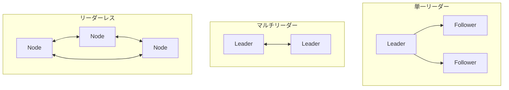

# Phase 2-2: レプリケーション

## 学習目標

この単元を終えると、以下ができるようになります：

- レプリケーション戦略を選択できる
- リーダー/フォロワー構成を設計できる
- 障害時の動作を理解できる

## レプリケーション戦略



## ハンズオン

### 演習1: 単一リーダーレプリケーション

```python
# single_leader.py
"""
単一リーダーレプリケーション
- 書き込みはリーダーのみ
- 読み取りはフォロワーでも可能
"""

from typing import List, Optional, Dict
from dataclasses import dataclass, field
from enum import Enum
import time

class NodeRole(Enum):
    LEADER = 'leader'
    FOLLOWER = 'follower'

@dataclass
class ReplicationLog:
    """レプリケーションログ"""
    sequence: int
    operation: str
    key: str
    value: str
    timestamp: float

class ReplicatedNode:
    def __init__(self, node_id: str, role: NodeRole):
        self.node_id = node_id
        self.role = role
        self.data: Dict[str, str] = {}
        self.log: List[ReplicationLog] = []
        self.last_applied_seq = 0
    
    def write(self, key: str, value: str) -> Optional[ReplicationLog]:
        if self.role != NodeRole.LEADER:
            raise NotLeaderError('Only leader can write')
        
        seq = len(self.log) + 1
        log_entry = ReplicationLog(
            sequence=seq,
            operation='SET',
            key=key,
            value=value,
            timestamp=time.time()
        )
        
        self.log.append(log_entry)
        self.data[key] = value
        self.last_applied_seq = seq
        
        return log_entry
    
    def apply_log(self, log_entry: ReplicationLog) -> bool:
        """ログを適用（フォロワー用）"""
        if log_entry.sequence != self.last_applied_seq + 1:
            return False  # 順序が正しくない
        
        self.log.append(log_entry)
        self.data[log_entry.key] = log_entry.value
        self.last_applied_seq = log_entry.sequence
        return True
    
    def read(self, key: str) -> Optional[str]:
        return self.data.get(key)

class NotLeaderError(Exception):
    pass

class SingleLeaderCluster:
    """単一リーダークラスター"""
    
    def __init__(self):
        self.leader = ReplicatedNode('leader', NodeRole.LEADER)
        self.followers = [
            ReplicatedNode('follower1', NodeRole.FOLLOWER),
            ReplicatedNode('follower2', NodeRole.FOLLOWER),
        ]
    
    def write(self, key: str, value: str, sync: bool = True) -> bool:
        """書き込み"""
        log_entry = self.leader.write(key, value)
        
        if sync:
            # 同期レプリケーション
            for follower in self.followers:
                follower.apply_log(log_entry)
        else:
            # 非同期レプリケーション（バックグラウンドで同期）
            pass
        
        return True
    
    def read(self, key: str, read_from_leader: bool = False) -> Optional[str]:
        """読み取り"""
        if read_from_leader:
            return self.leader.read(key)
        else:
            # フォロワーからの読み取り（古い可能性あり）
            return self.followers[0].read(key)

# 使用例
def demo():
    cluster = SingleLeaderCluster()
    
    cluster.write('user:1', 'Alice')
    
    print(f'Leader: {cluster.read("user:1", read_from_leader=True)}')
    print(f'Follower: {cluster.read("user:1", read_from_leader=False)}')

if __name__ == '__main__':
    demo()
```

### 演習2: マルチリーダーレプリケーション

```python
# multi_leader.py
"""
マルチリーダーレプリケーション
- 複数のリーダーが書き込みを受け付ける
- 競合解決が必要
"""

from typing import Dict, List
from dataclasses import dataclass
import time

@dataclass
class VersionedData:
    value: str
    version: int
    leader_id: str
    timestamp: float

class MultiLeaderNode:
    def __init__(self, node_id: str):
        self.node_id = node_id
        self.data: Dict[str, VersionedData] = {}
        self.version = 0
    
    def write(self, key: str, value: str) -> VersionedData:
        self.version += 1
        versioned = VersionedData(
            value=value,
            version=self.version,
            leader_id=self.node_id,
            timestamp=time.time()
        )
        self.data[key] = versioned
        return versioned
    
    def receive_replication(self, key: str, incoming: VersionedData):
        """レプリケーション受信（競合解決）"""
        existing = self.data.get(key)
        
        if existing is None:
            self.data[key] = incoming
            return
        
        # 競合解決: Last Writer Wins (timestamp)
        if incoming.timestamp > existing.timestamp:
            self.data[key] = incoming
        elif incoming.timestamp == existing.timestamp:
            # タイムスタンプが同じ場合はリーダーIDで決定
            if incoming.leader_id > existing.leader_id:
                self.data[key] = incoming

class MultiLeaderCluster:
    def __init__(self, num_leaders: int = 2):
        self.leaders = [
            MultiLeaderNode(f'leader{i}')
            for i in range(num_leaders)
        ]
    
    def write(self, leader_index: int, key: str, value: str):
        leader = self.leaders[leader_index]
        versioned = leader.write(key, value)
        
        # 他のリーダーに非同期でレプリケーション
        for i, other in enumerate(self.leaders):
            if i != leader_index:
                other.receive_replication(key, versioned)
    
    def read(self, leader_index: int, key: str) -> str:
        return self.leaders[leader_index].data.get(key).value

# 使用例
def demo_multi():
    cluster = MultiLeaderCluster(num_leaders=2)
    
    # 両方のリーダーに同時書き込み（競合）
    cluster.write(0, 'config', 'value_from_leader0')
    time.sleep(0.001)
    cluster.write(1, 'config', 'value_from_leader1')
    
    # 同期後
    print(f'Leader0: {cluster.read(0, "config")}')
    print(f'Leader1: {cluster.read(1, "config")}')

if __name__ == '__main__':
    demo_multi()
```

### 演習3: リーダー選出

```python
# leader_election.py
"""
リーダー選出（簡易版）
"""

from typing import List, Optional
from dataclasses import dataclass
import random
import time

@dataclass
class Node:
    node_id: str
    is_leader: bool = False
    last_heartbeat: float = 0
    term: int = 0

class LeaderElection:
    """簡易リーダー選出"""
    
    HEARTBEAT_TIMEOUT = 1.0
    ELECTION_TIMEOUT = 2.0
    
    def __init__(self, nodes: List[Node]):
        self.nodes = nodes
        self.current_leader: Optional[str] = None
    
    def start_election(self, candidate_id: str):
        """選挙開始"""
        candidate = self._get_node(candidate_id)
        candidate.term += 1
        
        votes = 1  # 自分に投票
        
        for node in self.nodes:
            if node.node_id != candidate_id:
                # 投票を依頼
                if self._request_vote(node, candidate.term):
                    votes += 1
        
        # 過半数獲得
        if votes > len(self.nodes) // 2:
            candidate.is_leader = True
            self.current_leader = candidate_id
            print(f'{candidate_id} became leader (term {candidate.term})')
            return True
        
        return False
    
    def _request_vote(self, node: Node, term: int) -> bool:
        """投票依頼"""
        if term > node.term:
            node.term = term
            return True
        return False
    
    def _get_node(self, node_id: str) -> Node:
        for node in self.nodes:
            if node.node_id == node_id:
                return node
        raise ValueError(f'Node not found: {node_id}')
    
    def detect_leader_failure(self):
        """リーダー障害検知"""
        if self.current_leader:
            leader = self._get_node(self.current_leader)
            if time.time() - leader.last_heartbeat > self.HEARTBEAT_TIMEOUT:
                print(f'Leader {self.current_leader} failed!')
                leader.is_leader = False
                self.current_leader = None
                
                # 新しいリーダーを選出
                candidates = [n for n in self.nodes if not n.is_leader]
                if candidates:
                    new_candidate = random.choice(candidates)
                    self.start_election(new_candidate.node_id)

# 使用例
def demo_election():
    nodes = [
        Node('node1'),
        Node('node2'),
        Node('node3'),
    ]
    election = LeaderElection(nodes)
    
    # 初期リーダー選出
    election.start_election('node1')
    
    # リーダー障害シミュレーション
    time.sleep(1.5)
    election.detect_leader_failure()

if __name__ == '__main__':
    demo_election()
```

## AWS でのレプリケーション

| サービス | レプリケーション |
|---------|----------------|
| RDS | 単一リーダー（Multi-AZ） |
| Aurora | 単一リーダー + 読み取りレプリカ |
| DynamoDB | リーダーレス（Global Tables） |
| ElastiCache | 単一リーダー（Redis Cluster） |

## 理解度確認

### 問題

地理的に離れた2つのデータセンターで同時書き込みを許可する場合、最適なレプリケーション戦略は何か。

**A.** 単一リーダー

**B.** マルチリーダー

**C.** リーダーレス

**D.** レプリケーションなし

---

### 解答・解説

**正解: B**

マルチリーダーレプリケーションは、複数の場所で同時に書き込みを受け付けられます。地理的に離れた場所でのレイテンシを削減できます。ただし、競合解決が必要です。

---

## 次のステップ

レプリケーションを学びました。次は合意アルゴリズムを学びましょう。

**次の単元**: [Phase 3-1: 合意アルゴリズム](../phase3/01_合意アルゴリズム.md)
