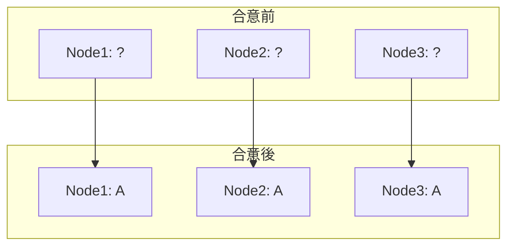
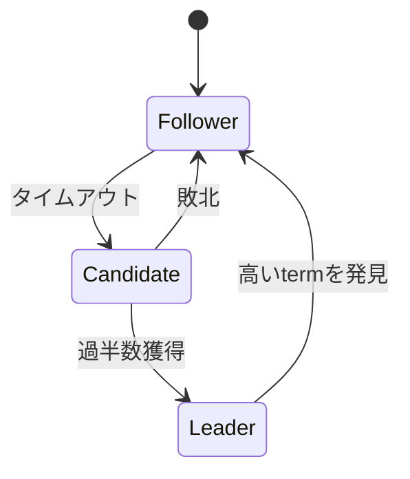

# Phase 3-1: 合意アルゴリズム

## 学習目標

この単元を終えると、以下ができるようになります：

- 合意問題を理解できる
- Raft アルゴリズムを説明できる
- 分散システムでの合意の重要性を理解できる

## 合意問題とは



**複数のノードが1つの値に合意する**

### 合意の要件

| 要件 | 説明 |
|------|------|
| **合意** | すべての正常ノードが同じ値に合意 |
| **妥当性** | 合意された値は誰かが提案した値 |
| **終了** | すべての正常ノードが最終的に決定 |

## Raft アルゴリズム



## ハンズオン

### 演習1: Raft 実装（簡易版）

```python
# raft_simplified.py
"""
Raft アルゴリズム（簡易版）
"""

from enum import Enum
from typing import List, Optional, Dict
from dataclasses import dataclass, field
import random
import time
import threading

class State(Enum):
    FOLLOWER = 'follower'
    CANDIDATE = 'candidate'
    LEADER = 'leader'

@dataclass
class LogEntry:
    term: int
    command: str

@dataclass
class RaftNode:
    node_id: str
    state: State = State.FOLLOWER
    current_term: int = 0
    voted_for: Optional[str] = None
    log: List[LogEntry] = field(default_factory=list)
    commit_index: int = 0
    last_heartbeat: float = field(default_factory=time.time)
    
    # リーダー用
    next_index: Dict[str, int] = field(default_factory=dict)
    match_index: Dict[str, int] = field(default_factory=dict)

class RaftCluster:
    """Raftクラスター"""
    
    ELECTION_TIMEOUT_MIN = 0.15
    ELECTION_TIMEOUT_MAX = 0.30
    HEARTBEAT_INTERVAL = 0.05
    
    def __init__(self, node_ids: List[str]):
        self.nodes = {
            node_id: RaftNode(node_id=node_id)
            for node_id in node_ids
        }
        self.leader_id: Optional[str] = None
    
    def request_vote(self, candidate_id: str, term: int) -> Dict[str, bool]:
        """投票リクエスト"""
        candidate = self.nodes[candidate_id]
        votes = {}
        
        for node_id, node in self.nodes.items():
            if node_id == candidate_id:
                votes[node_id] = True
                continue
            
            # 投票判定
            if term > node.current_term:
                node.current_term = term
                node.voted_for = candidate_id
                votes[node_id] = True
            elif term == node.current_term and node.voted_for in (None, candidate_id):
                node.voted_for = candidate_id
                votes[node_id] = True
            else:
                votes[node_id] = False
        
        return votes
    
    def start_election(self, candidate_id: str) -> bool:
        """選挙開始"""
        candidate = self.nodes[candidate_id]
        candidate.current_term += 1
        candidate.state = State.CANDIDATE
        candidate.voted_for = candidate_id
        
        print(f'[{candidate_id}] Starting election for term {candidate.current_term}')
        
        votes = self.request_vote(candidate_id, candidate.current_term)
        vote_count = sum(1 for v in votes.values() if v)
        
        if vote_count > len(self.nodes) // 2:
            # リーダーになる
            candidate.state = State.LEADER
            self.leader_id = candidate_id
            print(f'[{candidate_id}] Became leader for term {candidate.current_term}')
            
            # next_index を初期化
            for node_id in self.nodes:
                candidate.next_index[node_id] = len(candidate.log) + 1
                candidate.match_index[node_id] = 0
            
            return True
        else:
            candidate.state = State.FOLLOWER
            return False
    
    def append_entries(self, leader_id: str, entries: List[LogEntry]) -> bool:
        """エントリ追加（ログレプリケーション）"""
        if self.leader_id != leader_id:
            return False
        
        leader = self.nodes[leader_id]
        
        # リーダーのログに追加
        for entry in entries:
            leader.log.append(entry)
        
        # フォロワーにレプリケーション
        success_count = 1  # 自分
        
        for node_id, node in self.nodes.items():
            if node_id == leader_id:
                continue
            
            # ログを同期
            for entry in entries:
                node.log.append(entry)
            node.last_heartbeat = time.time()
            success_count += 1
        
        # 過半数に書き込まれたらコミット
        if success_count > len(self.nodes) // 2:
            leader.commit_index = len(leader.log)
            return True
        
        return False
    
    def client_request(self, command: str) -> bool:
        """クライアントリクエスト"""
        if not self.leader_id:
            raise NoLeaderError('No leader available')
        
        leader = self.nodes[self.leader_id]
        entry = LogEntry(term=leader.current_term, command=command)
        
        return self.append_entries(self.leader_id, [entry])

class NoLeaderError(Exception):
    pass

# 使用例
def demo_raft():
    cluster = RaftCluster(['node1', 'node2', 'node3', 'node4', 'node5'])
    
    # リーダー選出
    cluster.start_election('node1')
    
    # クライアントリクエスト
    cluster.client_request('SET x = 1')
    cluster.client_request('SET y = 2')
    
    # ログ確認
    for node_id, node in cluster.nodes.items():
        print(f'{node_id}: {[e.command for e in node.log]}')

if __name__ == '__main__':
    demo_raft()
```

### 演習2: ログレプリケーション

```python
# log_replication.py
"""
Raftのログレプリケーション詳細
"""

from dataclasses import dataclass
from typing import List, Optional

@dataclass
class LogEntry:
    term: int
    index: int
    command: str

class ReplicatedLog:
    """レプリケートされたログ"""
    
    def __init__(self):
        self.entries: List[LogEntry] = []
        self.commit_index = 0
        self.last_applied = 0
    
    def append(self, term: int, command: str) -> int:
        """エントリ追加"""
        index = len(self.entries) + 1
        entry = LogEntry(term=term, index=index, command=command)
        self.entries.append(entry)
        return index
    
    def get_entry(self, index: int) -> Optional[LogEntry]:
        """エントリ取得"""
        if 0 < index <= len(self.entries):
            return self.entries[index - 1]
        return None
    
    def last_log_index(self) -> int:
        return len(self.entries)
    
    def last_log_term(self) -> int:
        if self.entries:
            return self.entries[-1].term
        return 0
    
    def truncate_from(self, index: int):
        """指定インデックス以降を削除"""
        if index <= len(self.entries):
            self.entries = self.entries[:index - 1]
    
    def apply_committed(self) -> List[str]:
        """コミット済みエントリを適用"""
        commands = []
        while self.last_applied < self.commit_index:
            self.last_applied += 1
            entry = self.get_entry(self.last_applied)
            if entry:
                commands.append(entry.command)
        return commands

# AppendEntries RPC シミュレーション
@dataclass
class AppendEntriesRequest:
    term: int
    leader_id: str
    prev_log_index: int
    prev_log_term: int
    entries: List[LogEntry]
    leader_commit: int

@dataclass
class AppendEntriesResponse:
    term: int
    success: bool

def handle_append_entries(
    log: ReplicatedLog,
    current_term: int,
    request: AppendEntriesRequest
) -> AppendEntriesResponse:
    """AppendEntries RPCの処理"""
    
    # 古いtermからのリクエストは拒否
    if request.term < current_term:
        return AppendEntriesResponse(term=current_term, success=False)
    
    # ログの整合性チェック
    if request.prev_log_index > 0:
        prev_entry = log.get_entry(request.prev_log_index)
        if not prev_entry or prev_entry.term != request.prev_log_term:
            return AppendEntriesResponse(term=current_term, success=False)
    
    # 競合するエントリを削除し、新しいエントリを追加
    for entry in request.entries:
        existing = log.get_entry(entry.index)
        if existing and existing.term != entry.term:
            log.truncate_from(entry.index)
        log.entries.append(entry)
    
    # コミットインデックスを更新
    if request.leader_commit > log.commit_index:
        log.commit_index = min(request.leader_commit, log.last_log_index())
    
    return AppendEntriesResponse(term=current_term, success=True)
```

## 合意アルゴリズムの比較

| アルゴリズム | 特徴 | 使用例 |
|------------|------|-------|
| **Raft** | 理解しやすい | etcd, Consul |
| **Paxos** | 理論的に最適 | Google Spanner |
| **ZAB** | Zookeeper専用 | Zookeeper |

## 理解度確認

### 問題

Raftで5ノードクラスターの場合、何ノードがダウンしてもサービスを継続できるか。

**A.** 1ノード

**B.** 2ノード

**C.** 3ノード

**D.** 4ノード

---

### 解答・解説

**正解: B**

5ノードの過半数は3ノードです。3ノードが正常であれば合意が成立するため、2ノードまでのダウンを許容できます。

---

## 次のステップ

合意アルゴリズムを学びました。次は分散トランザクションを学びましょう。

**次の単元**: [Phase 3-2: 分散トランザクション](./02_分散トランザクション.md)
