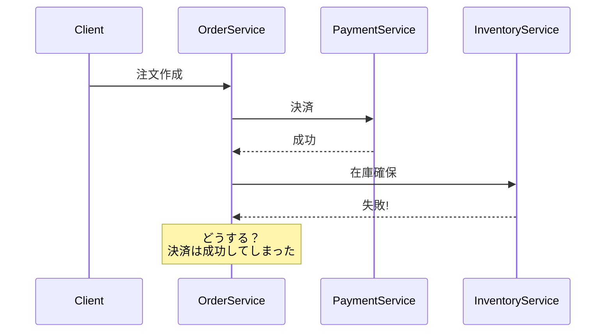
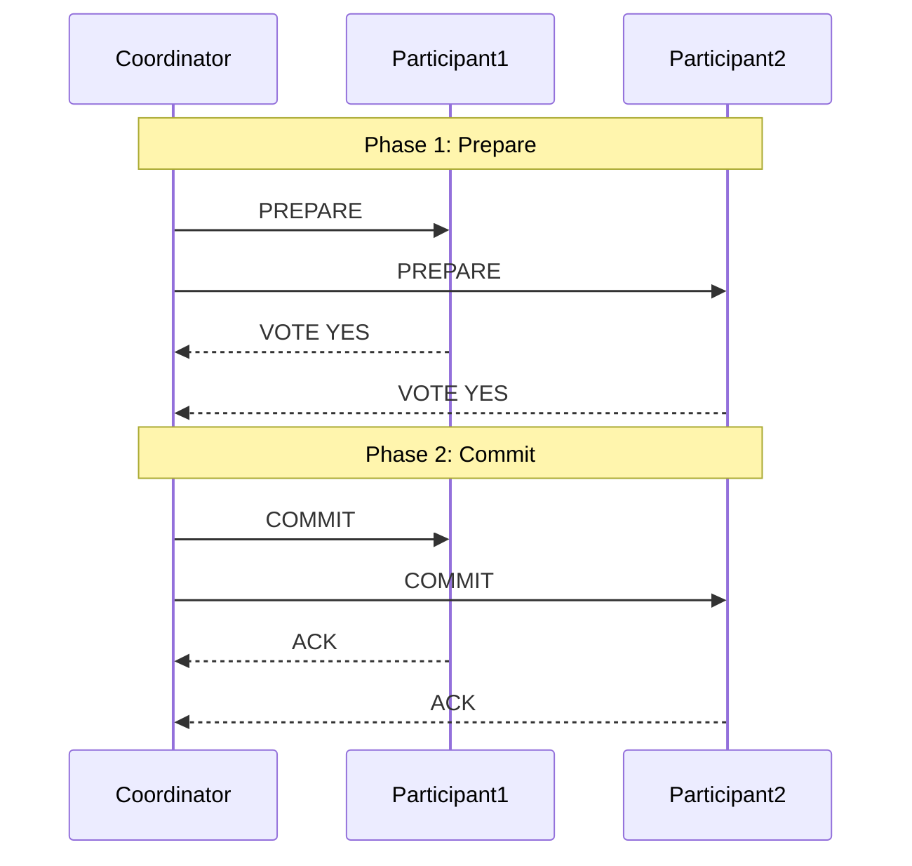

# Phase 3-2: 分散トランザクション

## 学習目標

この単元を終えると、以下ができるようになります：

- 分散トランザクションの課題を理解できる
- 2PC と Saga パターンを実装できる
- ユースケースに応じたパターンを選択できる

## 分散トランザクションの課題



## 2フェーズコミット（2PC）



## ハンズオン

### 演習1: 2PC 実装

```python
# two_phase_commit.py
"""
2フェーズコミット（2PC）実装
"""

from enum import Enum
from typing import Dict, List
from dataclasses import dataclass
import uuid

class TransactionState(Enum):
    INIT = 'init'
    PREPARED = 'prepared'
    COMMITTED = 'committed'
    ABORTED = 'aborted'

class ParticipantState(Enum):
    WORKING = 'working'
    PREPARED = 'prepared'
    COMMITTED = 'committed'
    ABORTED = 'aborted'

@dataclass
class Transaction:
    tx_id: str
    state: TransactionState
    participants: List[str]
    votes: Dict[str, bool]

class Participant:
    """2PCの参加者"""
    
    def __init__(self, name: str):
        self.name = name
        self.local_state: Dict[str, ParticipantState] = {}
        self.pending_data: Dict[str, dict] = {}
    
    def prepare(self, tx_id: str, data: dict) -> bool:
        """Prepare フェーズ"""
        try:
            # ローカルでの検証
            self._validate(data)
            
            # データを一時保存
            self.pending_data[tx_id] = data
            self.local_state[tx_id] = ParticipantState.PREPARED
            
            return True
        except Exception as e:
            self.local_state[tx_id] = ParticipantState.ABORTED
            return False
    
    def commit(self, tx_id: str) -> bool:
        """Commit フェーズ"""
        if self.local_state.get(tx_id) != ParticipantState.PREPARED:
            return False
        
        # 実際のコミット処理
        data = self.pending_data.pop(tx_id, None)
        if data:
            self._apply(data)
        
        self.local_state[tx_id] = ParticipantState.COMMITTED
        return True
    
    def abort(self, tx_id: str) -> bool:
        """Abort フェーズ"""
        self.pending_data.pop(tx_id, None)
        self.local_state[tx_id] = ParticipantState.ABORTED
        return True
    
    def _validate(self, data: dict):
        """データ検証（オーバーライド用）"""
        pass
    
    def _apply(self, data: dict):
        """データ適用（オーバーライド用）"""
        pass

class Coordinator:
    """2PCのコーディネーター"""
    
    def __init__(self, participants: List[Participant]):
        self.participants = participants
        self.transactions: Dict[str, Transaction] = {}
    
    def begin_transaction(self) -> str:
        tx_id = str(uuid.uuid4())
        self.transactions[tx_id] = Transaction(
            tx_id=tx_id,
            state=TransactionState.INIT,
            participants=[p.name for p in self.participants],
            votes={}
        )
        return tx_id
    
    def execute(self, tx_id: str, data: Dict[str, dict]) -> bool:
        """トランザクション実行"""
        tx = self.transactions[tx_id]
        
        # Phase 1: Prepare
        print(f'Phase 1: Preparing transaction {tx_id}')
        all_prepared = True
        
        for participant in self.participants:
            participant_data = data.get(participant.name, {})
            vote = participant.prepare(tx_id, participant_data)
            tx.votes[participant.name] = vote
            
            if vote:
                print(f'  {participant.name}: VOTE YES')
            else:
                print(f'  {participant.name}: VOTE NO')
                all_prepared = False
        
        # Phase 2: Commit or Abort
        if all_prepared:
            print(f'Phase 2: Committing transaction {tx_id}')
            tx.state = TransactionState.PREPARED
            
            for participant in self.participants:
                participant.commit(tx_id)
                print(f'  {participant.name}: COMMITTED')
            
            tx.state = TransactionState.COMMITTED
            return True
        else:
            print(f'Phase 2: Aborting transaction {tx_id}')
            
            for participant in self.participants:
                participant.abort(tx_id)
                print(f'  {participant.name}: ABORTED')
            
            tx.state = TransactionState.ABORTED
            return False

# 具体的な参加者
class OrderService(Participant):
    def __init__(self):
        super().__init__('OrderService')
        self.orders = {}
    
    def _validate(self, data: dict):
        if 'order_id' not in data:
            raise ValueError('order_id is required')
    
    def _apply(self, data: dict):
        self.orders[data['order_id']] = data

class PaymentService(Participant):
    def __init__(self):
        super().__init__('PaymentService')
        self.payments = {}
    
    def _apply(self, data: dict):
        self.payments[data['order_id']] = data['amount']

class InventoryService(Participant):
    def __init__(self):
        super().__init__('InventoryService')
        self.stock = {'item1': 10, 'item2': 5}
    
    def _validate(self, data: dict):
        item = data.get('item_id')
        quantity = data.get('quantity', 0)
        if self.stock.get(item, 0) < quantity:
            raise ValueError(f'Insufficient stock for {item}')
    
    def _apply(self, data: dict):
        item = data['item_id']
        self.stock[item] -= data['quantity']

# 使用例
def demo_2pc():
    order_svc = OrderService()
    payment_svc = PaymentService()
    inventory_svc = InventoryService()
    
    coordinator = Coordinator([order_svc, payment_svc, inventory_svc])
    
    # 成功ケース
    tx_id = coordinator.begin_transaction()
    result = coordinator.execute(tx_id, {
        'OrderService': {'order_id': 'ORD001', 'item': 'item1'},
        'PaymentService': {'order_id': 'ORD001', 'amount': 1000},
        'InventoryService': {'item_id': 'item1', 'quantity': 2}
    })
    print(f'Transaction result: {result}')
    print(f'Inventory: {inventory_svc.stock}')
    
    # 失敗ケース（在庫不足）
    print('\n--- Failure case ---')
    tx_id2 = coordinator.begin_transaction()
    result2 = coordinator.execute(tx_id2, {
        'OrderService': {'order_id': 'ORD002', 'item': 'item2'},
        'PaymentService': {'order_id': 'ORD002', 'amount': 500},
        'InventoryService': {'item_id': 'item2', 'quantity': 100}  # 在庫不足
    })
    print(f'Transaction result: {result2}')

if __name__ == '__main__':
    demo_2pc()
```

### 演習2: Saga パターン

```python
# saga_pattern.py
"""
Sagaパターン実装（コレオグラフィ型）
"""

from dataclasses import dataclass
from typing import List, Callable
from enum import Enum

class SagaStepState(Enum):
    PENDING = 'pending'
    COMPLETED = 'completed'
    COMPENSATED = 'compensated'
    FAILED = 'failed'

@dataclass
class SagaStep:
    name: str
    action: Callable
    compensation: Callable
    state: SagaStepState = SagaStepState.PENDING

class Saga:
    """Saga コーディネーター"""
    
    def __init__(self, name: str):
        self.name = name
        self.steps: List[SagaStep] = []
    
    def add_step(
        self,
        name: str,
        action: Callable,
        compensation: Callable
    ):
        self.steps.append(SagaStep(
            name=name,
            action=action,
            compensation=compensation
        ))
    
    def execute(self, context: dict) -> bool:
        """Saga実行"""
        completed_steps = []
        
        for step in self.steps:
            try:
                print(f'Executing: {step.name}')
                step.action(context)
                step.state = SagaStepState.COMPLETED
                completed_steps.append(step)
                print(f'  ✓ {step.name} completed')
            except Exception as e:
                print(f'  ✗ {step.name} failed: {e}')
                step.state = SagaStepState.FAILED
                
                # 補償トランザクション実行
                self._compensate(completed_steps, context)
                return False
        
        return True
    
    def _compensate(self, completed_steps: List[SagaStep], context: dict):
        """補償トランザクション"""
        print('Starting compensation...')
        
        for step in reversed(completed_steps):
            try:
                print(f'Compensating: {step.name}')
                step.compensation(context)
                step.state = SagaStepState.COMPENSATED
                print(f'  ↩ {step.name} compensated')
            except Exception as e:
                print(f'  ✗ Compensation failed for {step.name}: {e}')

# 具体的な実装
class OrderSaga:
    """注文Saga"""
    
    def __init__(self):
        self.orders = {}
        self.payments = {}
        self.inventory = {'item1': 10, 'item2': 5}
    
    def create_saga(self) -> Saga:
        saga = Saga('CreateOrder')
        
        saga.add_step(
            name='Create Order',
            action=self.create_order,
            compensation=self.cancel_order
        )
        
        saga.add_step(
            name='Reserve Inventory',
            action=self.reserve_inventory,
            compensation=self.release_inventory
        )
        
        saga.add_step(
            name='Process Payment',
            action=self.process_payment,
            compensation=self.refund_payment
        )
        
        saga.add_step(
            name='Confirm Order',
            action=self.confirm_order,
            compensation=lambda ctx: None  # 確認は補償不要
        )
        
        return saga
    
    # アクション
    def create_order(self, ctx: dict):
        order_id = ctx['order_id']
        self.orders[order_id] = {'status': 'created', **ctx}
    
    def reserve_inventory(self, ctx: dict):
        item = ctx['item_id']
        quantity = ctx['quantity']
        
        if self.inventory.get(item, 0) < quantity:
            raise Exception(f'Insufficient stock for {item}')
        
        self.inventory[item] -= quantity
    
    def process_payment(self, ctx: dict):
        order_id = ctx['order_id']
        amount = ctx['amount']
        
        # 支払い処理（失敗をシミュレート可能）
        if ctx.get('simulate_payment_failure'):
            raise Exception('Payment declined')
        
        self.payments[order_id] = amount
    
    def confirm_order(self, ctx: dict):
        order_id = ctx['order_id']
        self.orders[order_id]['status'] = 'confirmed'
    
    # 補償
    def cancel_order(self, ctx: dict):
        order_id = ctx['order_id']
        if order_id in self.orders:
            self.orders[order_id]['status'] = 'cancelled'
    
    def release_inventory(self, ctx: dict):
        item = ctx['item_id']
        quantity = ctx['quantity']
        self.inventory[item] = self.inventory.get(item, 0) + quantity
    
    def refund_payment(self, ctx: dict):
        order_id = ctx['order_id']
        if order_id in self.payments:
            del self.payments[order_id]

# 使用例
def demo_saga():
    order_saga = OrderSaga()
    
    # 成功ケース
    saga = order_saga.create_saga()
    result = saga.execute({
        'order_id': 'ORD001',
        'item_id': 'item1',
        'quantity': 2,
        'amount': 1000
    })
    print(f'\nResult: {result}')
    print(f'Orders: {order_saga.orders}')
    print(f'Inventory: {order_saga.inventory}')
    
    # 失敗ケース
    print('\n--- Failure case ---')
    saga2 = order_saga.create_saga()
    result2 = saga2.execute({
        'order_id': 'ORD002',
        'item_id': 'item1',
        'quantity': 1,
        'amount': 500,
        'simulate_payment_failure': True
    })
    print(f'\nResult: {result2}')
    print(f'Orders: {order_saga.orders}')
    print(f'Inventory: {order_saga.inventory}')

if __name__ == '__main__':
    demo_saga()
```

## 2PC vs Saga

| 特性 | 2PC | Saga |
|------|-----|------|
| 一貫性 | 強一貫性 | 結果整合性 |
| 可用性 | 低い | 高い |
| ロック | 必要 | 不要 |
| 複雑さ | 中 | 高 |
| 適用 | 単一DB | マイクロサービス |

## 理解度確認

### 問題

マイクロサービス環境で複数サービスにまたがるトランザクションに最適なパターンは何か。

**A.** 2フェーズコミット

**B.** Saga パターン

**C.** 分散ロック

**D.** 楽観的ロック

---

### 解答・解説

**正解: B**

マイクロサービスでは各サービスが独自のDBを持つため、2PCは実装困難です。Sagaパターンは補償トランザクションにより結果整合性を保ちながら、各サービスの独立性を維持できます。

---

## 次のステップ

分散トランザクションを学びました。次は総仕上げです。

**次の単元**: [Phase 4-1: 総仕上げ](../phase4/01_総仕上げ.md)
