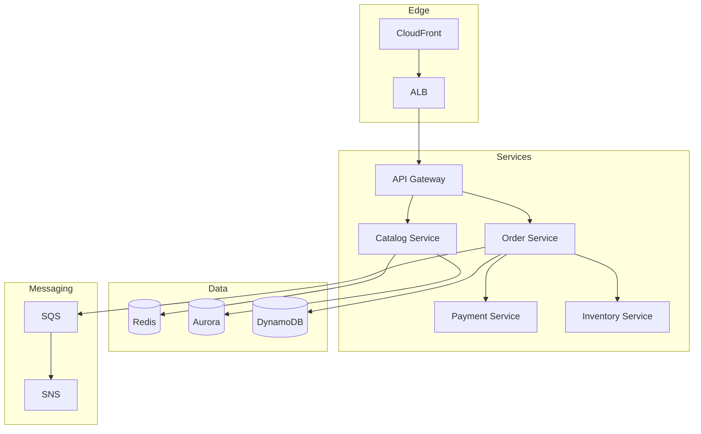

# Phase 4-1: 総仕上げ ～ 分散システム設計演習 ～

## 学習目標

この単元を終えると、以下ができるようになります：

- 分散システムの要件を分析できる
- 適切なパターンを選択できる
- 障害シナリオを考慮した設計ができる

## 総合演習: 分散ECシステム

### 要件

```
機能要件:
- 商品カタログの表示
- 注文処理（在庫確認→決済→出荷）
- ユーザー認証

非機能要件:
- 99.9% の可用性
- 100ms 以下のレスポンス
- 日次100万注文を処理
```

### アーキテクチャ設計



### 実装

```python
# distributed_ec_system.py
"""
分散ECシステムの設計例
"""

from dataclasses import dataclass, field
from typing import Dict, List, Optional
from enum import Enum
from abc import ABC, abstractmethod
import asyncio
import uuid
import time

# ===== ドメインモデル =====

class OrderStatus(Enum):
    PENDING = 'pending'
    PROCESSING = 'processing'
    CONFIRMED = 'confirmed'
    SHIPPED = 'shipped'
    FAILED = 'failed'

@dataclass
class Order:
    order_id: str
    customer_id: str
    items: List[dict]
    total: int
    status: OrderStatus = OrderStatus.PENDING

# ===== サービス =====

class CatalogService:
    """カタログサービス（キャッシュ重視）"""
    
    def __init__(self, cache, db):
        self.cache = cache
        self.db = db
    
    async def get_product(self, product_id: str) -> dict:
        # Cache-Aside パターン
        cached = await self.cache.get(f'product:{product_id}')
        if cached:
            return cached
        
        product = await self.db.get_product(product_id)
        await self.cache.set(f'product:{product_id}', product, ttl=300)
        return product
    
    async def list_products(self, category: str) -> List[dict]:
        # キャッシュなしでDB直接（ページネーション対応）
        return await self.db.list_products(category)

class InventoryService:
    """在庫サービス（強一貫性）"""
    
    def __init__(self, db):
        self.db = db
    
    async def check_availability(self, items: List[dict]) -> bool:
        for item in items:
            stock = await self.db.get_stock(item['product_id'])
            if stock < item['quantity']:
                return False
        return True
    
    async def reserve(self, order_id: str, items: List[dict]) -> bool:
        """在庫予約（トランザクション）"""
        async with self.db.transaction():
            for item in items:
                success = await self.db.reserve_stock(
                    item['product_id'],
                    item['quantity'],
                    order_id
                )
                if not success:
                    raise InsufficientStockError(item['product_id'])
        return True
    
    async def release(self, order_id: str):
        """予約解放"""
        await self.db.release_reservation(order_id)

class PaymentService:
    """決済サービス（冪等性重要）"""
    
    def __init__(self, payment_gateway, db):
        self.gateway = payment_gateway
        self.db = db
    
    async def process(self, order_id: str, amount: int) -> str:
        # 冪等性キー
        idempotency_key = f'payment:{order_id}'
        
        # 既存の決済確認
        existing = await self.db.get_payment(idempotency_key)
        if existing:
            return existing['payment_id']
        
        # 外部決済処理
        result = await self.gateway.charge(
            amount=amount,
            idempotency_key=idempotency_key
        )
        
        # 結果を保存
        await self.db.save_payment({
            'idempotency_key': idempotency_key,
            'payment_id': result['id'],
            'order_id': order_id,
            'amount': amount
        })
        
        return result['id']
    
    async def refund(self, order_id: str):
        """返金"""
        payment = await self.db.get_payment_by_order(order_id)
        if payment:
            await self.gateway.refund(payment['payment_id'])

class OrderService:
    """注文サービス（Saga オーケストレーター）"""
    
    def __init__(
        self,
        inventory: InventoryService,
        payment: PaymentService,
        event_bus,
        db
    ):
        self.inventory = inventory
        self.payment = payment
        self.event_bus = event_bus
        self.db = db
    
    async def create_order(self, customer_id: str, items: List[dict]) -> Order:
        order_id = str(uuid.uuid4())
        total = sum(i['price'] * i['quantity'] for i in items)
        
        order = Order(
            order_id=order_id,
            customer_id=customer_id,
            items=items,
            total=total
        )
        
        # 注文保存
        await self.db.save_order(order)
        
        # Saga 開始
        await self._execute_order_saga(order)
        
        return order
    
    async def _execute_order_saga(self, order: Order):
        """注文Saga実行"""
        try:
            # Step 1: 在庫予約
            await self.inventory.reserve(order.order_id, order.items)
            
            # Step 2: 決済
            payment_id = await self.payment.process(
                order.order_id,
                order.total
            )
            
            # Step 3: 注文確定
            order.status = OrderStatus.CONFIRMED
            await self.db.update_order(order)
            
            # イベント発行
            await self.event_bus.publish('order.confirmed', {
                'order_id': order.order_id,
                'customer_id': order.customer_id
            })
            
        except InsufficientStockError:
            order.status = OrderStatus.FAILED
            await self.db.update_order(order)
            
        except PaymentError:
            # 補償: 在庫予約解放
            await self.inventory.release(order.order_id)
            order.status = OrderStatus.FAILED
            await self.db.update_order(order)
            
        except Exception as e:
            # 補償: すべて元に戻す
            await self.inventory.release(order.order_id)
            await self.payment.refund(order.order_id)
            order.status = OrderStatus.FAILED
            await self.db.update_order(order)

# ===== 障害対策 =====

class CircuitBreaker:
    """サーキットブレーカー"""
    
    def __init__(self, failure_threshold: int = 5, timeout: float = 30):
        self.failure_threshold = failure_threshold
        self.timeout = timeout
        self.failures = 0
        self.last_failure = 0
        self.is_open = False
    
    async def call(self, func, *args, **kwargs):
        if self.is_open:
            if time.time() - self.last_failure > self.timeout:
                self.is_open = False
                self.failures = 0
            else:
                raise CircuitOpenError()
        
        try:
            result = await func(*args, **kwargs)
            self.failures = 0
            return result
        except Exception as e:
            self.failures += 1
            self.last_failure = time.time()
            if self.failures >= self.failure_threshold:
                self.is_open = True
            raise

class Bulkhead:
    """バルクヘッド（リソース分離）"""
    
    def __init__(self, max_concurrent: int = 10):
        self.semaphore = asyncio.Semaphore(max_concurrent)
    
    async def call(self, func, *args, **kwargs):
        async with self.semaphore:
            return await func(*args, **kwargs)

# 例外
class InsufficientStockError(Exception):
    pass

class PaymentError(Exception):
    pass

class CircuitOpenError(Exception):
    pass
```

## 設計チェックリスト

### 可用性

- [ ] 単一障害点がない
- [ ] ヘルスチェックとオートスケーリング
- [ ] サーキットブレーカー実装
- [ ] グレースフルデグラデーション

### 一貫性

- [ ] トランザクション境界の定義
- [ ] Saga パターンの設計
- [ ] 冪等性の保証
- [ ] 補償トランザクション

### パフォーマンス

- [ ] キャッシュ戦略
- [ ] 非同期処理
- [ ] データベースパーティショニング
- [ ] CDN 活用

### 運用

- [ ] 分散トレーシング
- [ ] ログ集約
- [ ] メトリクス監視
- [ ] アラート設定

## カリキュラム完了！

おめでとうございます！分散システム設計のカリキュラムを完了しました。

### 学んだこと

1. **分散システムの課題** - 部分障害、ネットワーク分断
2. **CAP 定理** - 一貫性と可用性のトレードオフ
3. **一貫性モデル** - 強一貫性から結果整合性まで
4. **レプリケーション** - 単一リーダー、マルチリーダー
5. **合意アルゴリズム** - Raft
6. **分散トランザクション** - 2PC、Saga

### AWS での実践

| 概念 | AWS サービス |
|------|-------------|
| 負荷分散 | ALB, NLB |
| サービスメッシュ | App Mesh |
| メッセージング | SQS, SNS, EventBridge |
| 分散DB | DynamoDB, Aurora Global |
| キャッシュ | ElastiCache |
| 監視 | X-Ray, CloudWatch |
