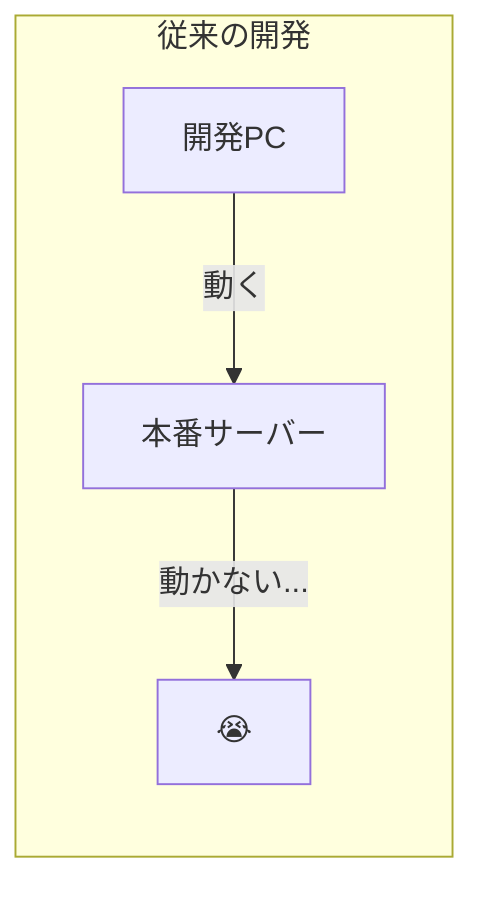
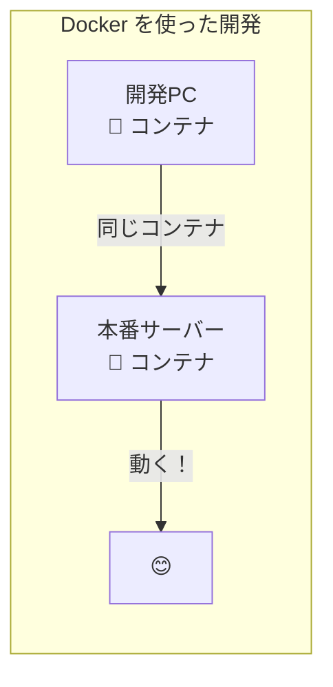
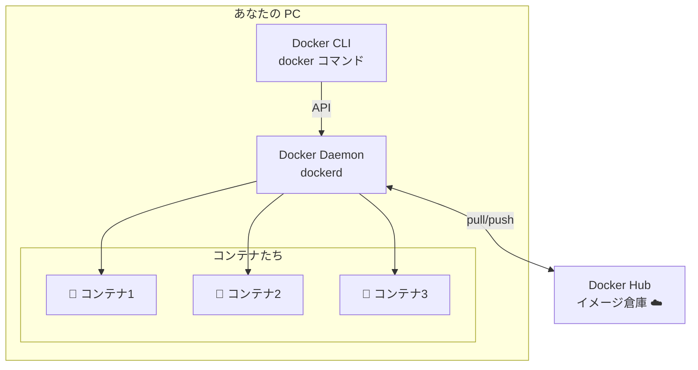

# Phase 0: Docker 環境構築 ～ コンテナの世界へようこそ ～

## 学習目標

この単元を終えると、以下ができるようになります：

- Docker Desktop をインストールし、正常に動作することを確認できる
- `docker` コマンドが使える状態になる
- 最初のコンテナ（hello-world）を実行できる
- Docker の基本的な仕組み（クライアント・サーバー構造）を理解できる

## 概念解説

### Docker とは何か？

**Docker** は、アプリケーションを「コンテナ」という単位でパッケージ化し、どこでも同じように動かせるようにするツールです。





### AWS で例えると...

| Docker 概念 | AWS で似たもの | 説明 |
|------------|---------------|------|
| コンテナ | Lambda 関数 | 軽量で起動が速い実行環境 |
| イメージ | AMI | 環境のスナップショット |
| Docker Hub | ECR | イメージの保管場所 |
| docker run | Lambda invoke | 実行する |

**違い**: Lambda はサーバーレス（インフラを意識しない）、Docker はコンテナを自分で管理

### Docker のアーキテクチャ



**3つの登場人物：**
1. **Docker CLI** - あなたが打つコマンド（`docker run` など）
2. **Docker Daemon** - 裏で動いてコンテナを管理するサービス
3. **Registry** - イメージを保管するクラウド（Docker Hub など）

## インストール手順

### macOS の場合

1. [Docker Desktop for Mac](https://www.docker.com/products/docker-desktop/) にアクセス
2. 「Download for Mac」をクリック
3. `.dmg` ファイルを開き、Docker を Applications にドラッグ
4. Docker.app を起動
5. メニューバーに 🐳 アイコンが表示されれば OK

### Windows の場合

1. [Docker Desktop for Windows](https://www.docker.com/products/docker-desktop/) にアクセス
2. 「Download for Windows」をクリック
3. インストーラーを実行
4. WSL 2 バックエンドを有効にする（推奨）
5. PC を再起動
6. タスクトレイに 🐳 アイコンが表示されれば OK

### Linux の場合

```bash
# Ubuntu/Debian
sudo apt-get update
sudo apt-get install docker.io
sudo systemctl start docker
sudo systemctl enable docker

# 一般ユーザーで docker コマンドを使えるようにする
sudo usermod -aG docker $USER
# ログアウト＆ログインが必要
```

## ハンズオン

### 演習1: インストール確認

```bash
# Docker のバージョンを確認
docker --version
# Docker version 24.0.7, build afdd53b

# より詳細な情報
docker version
# Client と Server 両方の情報が表示される
```

**確認ポイント**: `Client` と `Server` の両方が表示されていれば OK

### 演習2: Docker の状態を確認

```bash
# Docker の詳細情報を表示
docker info

# 確認すべき項目：
# - Server Version
# - Containers: 0
# - Images: 0
# - Storage Driver
```

### 演習3: Hello World を実行

```bash
# 最初のコンテナを実行！
docker run hello-world
```

**出力例：**
```
Unable to find image 'hello-world:latest' locally
latest: Pulling from library/hello-world
...
Hello from Docker!
This message shows that your installation appears to be working correctly.
...
```

**何が起きた？**
1. ローカルに `hello-world` イメージがない → Docker Hub から取得（pull）
2. イメージからコンテナを作成
3. コンテナ内のプログラムを実行（メッセージ表示）
4. プログラム終了 → コンテナも終了

### 演習4: 実行したコンテナを確認

```bash
# 実行中のコンテナを表示
docker ps
# 何も表示されない（hello-world は終了済み）

# 終了したコンテナも含めて表示
docker ps -a
# CONTAINER ID   IMAGE         COMMAND    CREATED          STATUS                      
# abc123...      hello-world   "/hello"   2 minutes ago    Exited (0) 2 minutes ago
```

### 演習5: インタラクティブなコンテナを試す

```bash
# Ubuntu コンテナを起動して中に入る
docker run -it ubuntu bash

# コンテナの中にいる状態
root@container-id:/# 

# Linux コマンドを試してみる
root@container-id:/# cat /etc/os-release
# Ubuntu の情報が表示される

root@container-id:/# ls /
# Linux のディレクトリ構造が見える

# コンテナから出る
root@container-id:/# exit
```

**オプションの意味：**
- `-i` : 標準入力を開いたままにする（Interactive）
- `-t` : 疑似ターミナルを割り当てる（TTY）
- 合わせて `-it` とすることで、対話的にコンテナを操作できる

### 演習6: イメージを確認

```bash
# ダウンロード済みのイメージを表示
docker images

# 出力例：
# REPOSITORY    TAG       IMAGE ID       CREATED        SIZE
# ubuntu        latest    abc123...      2 weeks ago    77.8MB
# hello-world   latest    def456...      3 months ago   13.3kB
```

## 現場でよくある落とし穴

### 1. Docker Desktop が起動していない

```bash
docker ps
# Cannot connect to the Docker daemon at unix:///var/run/docker.sock

# 解決策: Docker Desktop を起動する（🐳 アイコンを確認）
```

### 2. 権限エラー（Linux）

```bash
docker ps
# permission denied while trying to connect to the Docker daemon socket

# 解決策: docker グループに追加
sudo usermod -aG docker $USER
# ログアウト＆ログインが必要
```

### 3. ディスク容量不足

Docker イメージはサイズが大きい場合があります（数GB になることも）。

```bash
# 使っていないものを掃除
docker system prune -a
# 確認プロンプトで y を入力
```

## 理解度確認

### 問題

Docker でコンテナを実行したところ、以下のメッセージが表示されました。

```
Unable to find image 'nginx:latest' locally
latest: Pulling from library/nginx
...
```

この時、Docker は何をしていますか？

**A.** エラーが発生してコンテナの起動に失敗した

**B.** ローカルにイメージがないため、Docker Hub からダウンロードしている

**C.** Docker Desktop が起動していないため、起動を待っている

**D.** ネットワークエラーにより、リトライを試みている

---

### 解答・解説

**正解: B**

- **A.** 誤り。「Unable to find image locally」はエラーではなく、ローカルにイメージがないことを示す情報メッセージです。
- **B.** 正解。Docker はまずローカルでイメージを探し、なければ自動的に Docker Hub（デフォルトのレジストリ）からダウンロード（pull）します。
- **C.** 誤り。Docker Desktop が起動していなければ、別のエラーメッセージ（`Cannot connect to the Docker daemon`）が表示されます。
- **D.** 誤り。「Pulling from」はダウンロード中を示しており、エラーではありません。

**実務での活用：** 初回実行時は必ずイメージのダウンロードが発生するため、時間がかかります。CI/CD ではイメージのキャッシュを活用して高速化します。

---

## まとめ

| 学んだこと | コマンド/概念 |
|-----------|--------------|
| バージョン確認 | `docker --version`, `docker version` |
| 状態確認 | `docker info` |
| コンテナ実行 | `docker run` |
| コンテナ一覧 | `docker ps`, `docker ps -a` |
| イメージ一覧 | `docker images` |
| 対話モード | `docker run -it` |

## 次のステップ

Docker が動く環境が整いました！次はコンテナと仮想マシンの違いを理解し、Docker の本当の価値を学びましょう。

**次の単元**: [Phase 1-1: コンテナとは ～ 仮想マシンとの違いを理解する ～](../phase1/01_コンテナとは.md)
