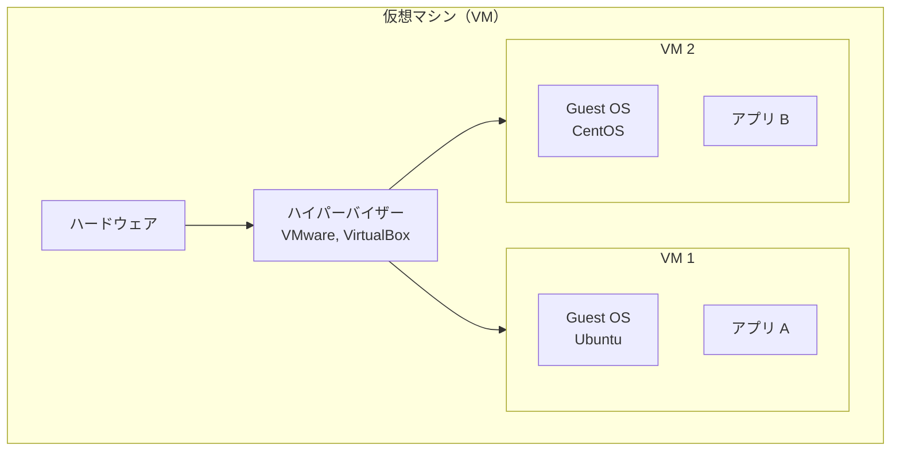
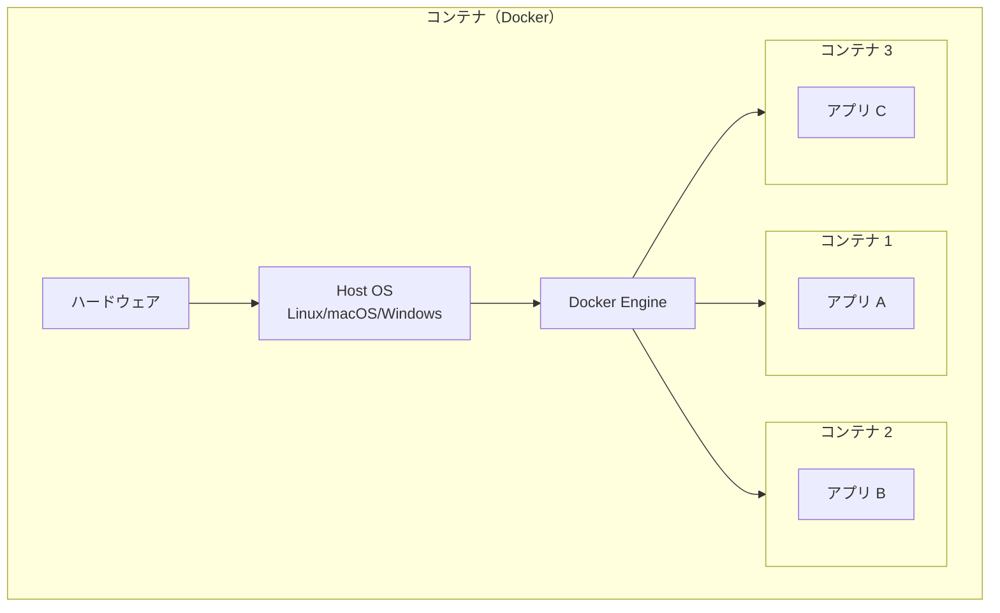
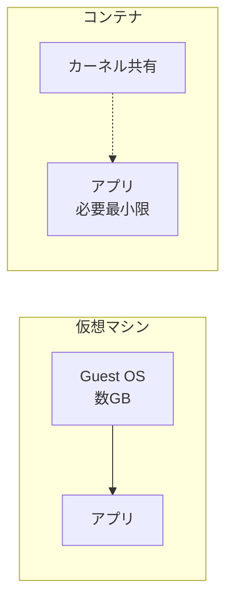
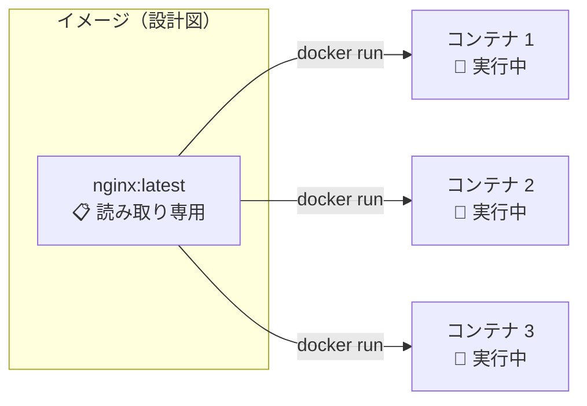
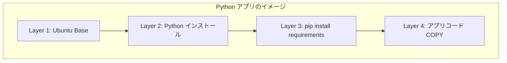
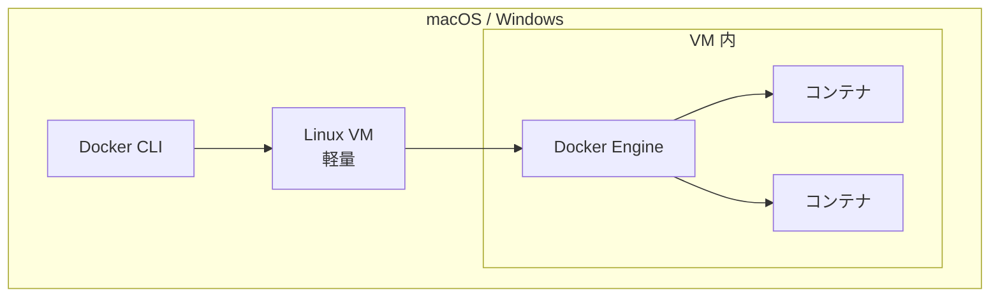

# Phase 1-1: コンテナとは ～ 仮想マシンとの違いを理解する ～

## 学習目標

この単元を終えると、以下ができるようになります：

- コンテナと仮想マシン（VM）の違いを説明できる
- Docker が「軽量で速い」理由を理解できる
- イメージとコンテナの関係を説明できる
- コンテナの隔離（Isolation）の仕組みを概念レベルで理解できる

## 概念解説

### 仮想マシン vs コンテナ





### 違いを表で整理

| 項目 | 仮想マシン | コンテナ |
|------|-----------|---------|
| **OS** | 各 VM にフル OS | ホスト OS のカーネルを共有 |
| **起動時間** | 分単位 | 秒単位 |
| **サイズ** | GB 単位 | MB 単位 |
| **リソース効率** | 重い（OS ごと） | 軽い（カーネル共有） |
| **隔離レベル** | 強い（完全分離） | 中程度（プロセス隔離） |
| **用途** | 異なる OS が必要な場合 | 同じ OS でアプリを分離 |

### AWS で例えると...

| 概念 | AWS サービス | 説明 |
|------|-------------|------|
| 仮想マシン | EC2 | フルの仮想サーバー、OS 丸ごと |
| コンテナ | ECS / Fargate | 軽量、アプリ単位で起動 |
| ハイパーバイザー | EC2 基盤の Nitro | VM を動かす基盤 |
| Docker Engine | ECS Agent | コンテナを動かす基盤 |

**あなたの経験に置き換えると：**
- EC2 で Python アプリを動かす → VM 的
- Lambda で Python 関数を動かす → コンテナに近い発想（起動が速い、軽量）

### コンテナが軽い理由



**ポイント：**
- VM は OS 全体（カーネル + ユーザーランド）を含む
- コンテナは必要な部分だけ（ユーザーランドの一部のみ）
- カーネル（OS の核心部分）はホストと共有

### イメージとコンテナの関係



| 概念 | 説明 | プログラミングで例えると |
|------|------|------------------------|
| イメージ | 設計図、テンプレート（読み取り専用） | クラス定義 |
| コンテナ | イメージから作られた実体（実行中） | インスタンス |

**1つのイメージから何個でもコンテナを作れる！**

### イメージのレイヤー構造



**レイヤーのメリット：**
- 各レイヤーはキャッシュされる
- 変更があった部分だけ再ビルド
- 複数イメージでベースレイヤーを共有（ディスク節約）

## ハンズオン

### 演習1: コンテナの起動速度を体感

```bash
# 時間を計測しながら Ubuntu コンテナを起動
time docker run ubuntu echo "Hello from container!"

# 出力例：
# Hello from container!
# real    0m0.523s  ← 0.5秒で起動！
```

**VM だと数分かかる処理が、コンテナなら1秒未満！**

### 演習2: 複数コンテナを一気に起動

```bash
# 5つのコンテナを連続で起動
for i in 1 2 3 4 5; do
  docker run -d --name web$i nginx
done

# 実行中のコンテナを確認
docker ps

# 出力例：
# CONTAINER ID   IMAGE   COMMAND                  CREATED         STATUS        NAMES
# abc123...      nginx   "/docker-entrypoint.…"   2 seconds ago   Up 1 second   web5
# def456...      nginx   "/docker-entrypoint.…"   2 seconds ago   Up 2 seconds  web4
# ...
```

**5つのサーバーが数秒で立ち上がる！**

```bash
# 後片付け
docker stop web1 web2 web3 web4 web5
docker rm web1 web2 web3 web4 web5
```

### 演習3: コンテナの隔離を確認

```bash
# ターミナル1: コンテナ A を起動
docker run -it --name container_a ubuntu bash

# コンテナ A の中でファイルを作成
root@xxx:/# echo "I am container A" > /tmp/identity.txt
root@xxx:/# cat /tmp/identity.txt
# I am container A
```

**別のターミナルを開いて：**

```bash
# ターミナル2: コンテナ B を起動
docker run -it --name container_b ubuntu bash

# コンテナ B でファイルを確認
root@yyy:/# cat /tmp/identity.txt
# cat: /tmp/identity.txt: No such file or directory

# コンテナ B は別の世界！ A のファイルは見えない
```

**隔離されていることを確認！**

```bash
# 後片付け（両方のターミナルで exit してから）
docker rm container_a container_b
```

### 演習4: イメージのレイヤーを確認

```bash
# nginx イメージのレイヤーを確認
docker history nginx

# 出力例：
# IMAGE          CREATED       CREATED BY                                      SIZE
# abc123...      2 weeks ago   /bin/sh -c #(nop)  CMD ["nginx" "-g" "daemon…   0B
# <missing>      2 weeks ago   /bin/sh -c #(nop)  STOPSIGNAL SIGQUIT           0B
# <missing>      2 weeks ago   /bin/sh -c #(nop)  EXPOSE 80                    0B
# ...
```

各行が1つのレイヤー。`CREATED BY` で何をしたかがわかる。

### 演習5: ホスト OS と カーネル共有を確認

```bash
# ホストの OS 情報
uname -r
# 例: 5.15.0-1051-aws

# コンテナ内の OS 情報
docker run ubuntu uname -r
# 例: 5.15.0-1051-aws  ← 同じ！

# コンテナの「OS」情報（ユーザーランド）
docker run ubuntu cat /etc/os-release
# NAME="Ubuntu"
# VERSION="22.04.3 LTS (Jammy Jellyfish)"
```

**カーネルは共有、ユーザーランドはコンテナごとに異なる**

## 現場でよくある落とし穴

### 1. コンテナ = 軽量 VM と思ってしまう

```
❌ コンテナは小さな VM
⭕ コンテナは隔離されたプロセス
```

コンテナは「プロセス」の延長。OS 全体を含んでいるわけではない。

### 2. コンテナを止めたらデータが消えた

```bash
# コンテナ内でファイルを作成
docker run -it ubuntu bash
root@xxx:/# echo "important data" > /data.txt
root@xxx:/# exit

# 同じイメージで新しいコンテナを起動
docker run -it ubuntu bash
root@yyy:/# cat /data.txt
# cat: /data.txt: No such file or directory  ← 消えた！
```

**解決策**: Volume を使う（Phase 4 で学習）

### 3. Windows/Mac での「カーネル共有」の誤解

macOS や Windows では、Docker Desktop が裏で Linux VM を動かしています。



本番の Linux サーバーでは VM なしでネイティブに動作 → より高速

## 理解度確認

### 問題

Docker コンテナが仮想マシン（VM）より起動が速い主な理由として、最も適切なものはどれか。

**A.** コンテナは CPU やメモリを使わないため

**B.** コンテナはネットワーク機能を持たないため

**C.** コンテナはホスト OS のカーネルを共有し、OS の起動が不要なため

**D.** コンテナはディスクに保存されないため

---

### 解答・解説

**正解: C**

- **A.** 誤り。コンテナも CPU やメモリを使用します。ただし、オーバーヘッドが少ないです。
- **B.** 誤り。コンテナはネットワーク機能を持ち、ポート公開やコンテナ間通信が可能です。
- **C.** 正解。VM は各 VM ごとにゲスト OS を起動する必要がありますが、コンテナはホスト OS のカーネルを共有するため、OS の起動時間が不要です。
- **D.** 誤り。コンテナイメージはディスクに保存されます。

**実務での活用：** 起動が速いため、CI/CD でのテスト実行、オートスケーリング、Blue-Green デプロイなどで威力を発揮します。

---

## まとめ

| 学んだこと | ポイント |
|-----------|---------|
| VM との違い | コンテナは OS カーネルを共有、軽量で高速 |
| イメージとコンテナ | イメージ=設計図、コンテナ=実体 |
| レイヤー構造 | キャッシュ・共有でディスク節約 |
| 隔離 | 各コンテナは独立したファイルシステム |

## 次のステップ

コンテナの概念がわかったら、実際にコンテナを操作してみましょう！

**次の単元**: [Phase 2-1: コンテナ基本操作 ～ run, ps, stop, rm をマスター ～](../phase2/01_コンテナ基本操作.md)
