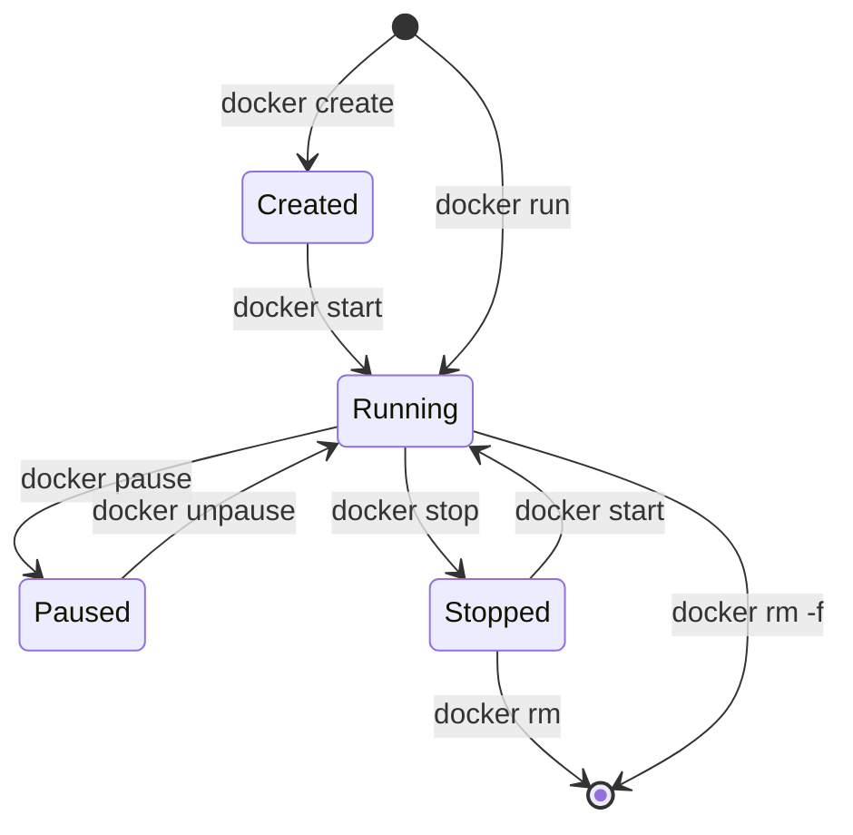
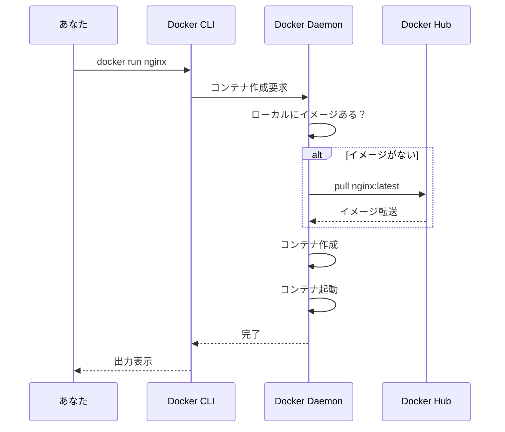

# Phase 2-1: コンテナ基本操作 ～ run, ps, stop, rm をマスター ～

## 学習目標

この単元を終えると、以下ができるようになります：

- `docker run` の主要オプションを使いこなせる
- コンテナのライフサイクル（作成→起動→停止→削除）を理解できる
- `docker ps`, `docker logs`, `docker exec` で状態確認・操作ができる
- バックグラウンド実行とフォアグラウンド実行の違いを説明できる

## 概念解説

### コンテナのライフサイクル



### 主要コマンドの関係

| コマンド | 説明 | Git で例えると |
|---------|------|---------------|
| `docker run` | イメージからコンテナを作成＆起動 | `git clone` + ファイル編集開始 |
| `docker ps` | 実行中のコンテナ一覧 | `git status` |
| `docker stop` | コンテナを停止 | （作業中断） |
| `docker start` | 停止中のコンテナを再開 | （作業再開） |
| `docker rm` | コンテナを削除 | `rm -rf repo/` |

### docker run の動作



## 基本コマンド

### docker run

```bash
docker run [オプション] イメージ名 [コマンド]
```

| オプション | 意味 | 例 |
|-----------|------|-----|
| `-d` | バックグラウンド実行（Detach） | `docker run -d nginx` |
| `-it` | 対話モード（Interactive + TTY） | `docker run -it ubuntu bash` |
| `--name` | コンテナに名前をつける | `docker run --name myapp nginx` |
| `-p` | ポートマッピング | `docker run -p 8080:80 nginx` |
| `--rm` | 終了時に自動削除 | `docker run --rm ubuntu echo hi` |
| `-e` | 環境変数を設定 | `docker run -e DEBUG=1 myapp` |

### docker ps

```bash
docker ps        # 実行中のコンテナのみ
docker ps -a     # 全てのコンテナ（停止中も含む）
docker ps -q     # ID のみ表示
```

### docker stop / start / restart

```bash
docker stop コンテナ名    # 停止（SIGTERM → SIGKILL）
docker start コンテナ名   # 再開
docker restart コンテナ名 # 再起動
docker kill コンテナ名    # 強制停止（SIGKILL）
```

### docker rm

```bash
docker rm コンテナ名       # 停止中のコンテナを削除
docker rm -f コンテナ名    # 実行中でも強制削除
docker rm $(docker ps -aq) # 全コンテナ削除（注意！）
```

### docker logs

```bash
docker logs コンテナ名        # ログを表示
docker logs -f コンテナ名     # リアルタイムで追従（follow）
docker logs --tail 100 コンテナ名  # 最新100行
```

### docker exec

```bash
docker exec コンテナ名 コマンド      # コンテナ内でコマンド実行
docker exec -it コンテナ名 bash     # コンテナに入る
```

## ハンズオン

### 演習1: 基本的なコンテナ起動

```bash
# フォアグラウンドで実行（Ctrl+C で停止）
docker run nginx

# 別ターミナルで確認
docker ps
# nginx が動いているのが見える

# Ctrl+C で停止
```

### 演習2: バックグラウンド実行

```bash
# -d オプションでバックグラウンド実行
docker run -d --name my-nginx nginx

# コンテナ ID が表示される
# abc123def456...

# 確認
docker ps
# CONTAINER ID   IMAGE   ...   NAMES
# abc123...      nginx   ...   my-nginx

# ログを確認
docker logs my-nginx

# リアルタイムでログを追う
docker logs -f my-nginx
# Ctrl+C で終了（コンテナは止まらない）
```

### 演習3: コンテナ内でコマンド実行

```bash
# 実行中の my-nginx コンテナ内でコマンド実行
docker exec my-nginx cat /etc/nginx/nginx.conf

# コンテナに入る（対話モード）
docker exec -it my-nginx bash

# コンテナ内で操作
root@abc123:/# ls /usr/share/nginx/html
# 50x.html  index.html

root@abc123:/# cat /usr/share/nginx/html/index.html
# Welcome to nginx! のHTML

root@abc123:/# exit
```

### 演習4: コンテナのライフサイクル

```bash
# 停止
docker stop my-nginx

# 確認（実行中にはない）
docker ps
# 何も表示されない

# 全コンテナ確認（停止中も含む）
docker ps -a
# STATUS が "Exited" になっている

# 再開
docker start my-nginx

# 確認
docker ps
# また動いている！

# 再起動
docker restart my-nginx
```

### 演習5: 自動削除オプション

```bash
# --rm をつけると終了時に自動削除
docker run --rm ubuntu echo "I will disappear"

# 確認
docker ps -a | grep ubuntu
# 何も出ない（自動削除された）

# 比較: --rm なし
docker run ubuntu echo "I will remain"
docker ps -a | grep ubuntu
# Exited 状態で残っている
```

### 演習6: 環境変数の設定

```bash
# 環境変数を設定してコンテナ起動
docker run --rm -e MY_VAR="Hello" -e DEBUG=true ubuntu env

# 出力に MY_VAR=Hello と DEBUG=true が含まれる

# 実践的な例: MySQL
docker run -d --name my-mysql \
  -e MYSQL_ROOT_PASSWORD=secret123 \
  -e MYSQL_DATABASE=myapp \
  mysql:8

# 確認
docker logs my-mysql
```

### 演習7: 複数コンテナの一括操作

```bash
# 3つのコンテナを起動
docker run -d --name app1 nginx
docker run -d --name app2 nginx
docker run -d --name app3 nginx

# 確認
docker ps

# 全て停止
docker stop app1 app2 app3

# または全コンテナ停止
docker stop $(docker ps -q)

# 全て削除
docker rm app1 app2 app3

# または停止中の全コンテナ削除
docker container prune
# y で確認
```

### 演習8: コンテナの詳細情報

```bash
# コンテナを起動
docker run -d --name inspect-test nginx

# 詳細情報を取得（JSON形式）
docker inspect inspect-test

# 特定の情報だけ抽出（IPアドレス）
docker inspect --format='{{.NetworkSettings.IPAddress}}' inspect-test
# 172.17.0.2 のような出力

# 後片付け
docker rm -f inspect-test
```

## 現場でよくある落とし穴

### 1. コンテナ名の重複

```bash
docker run -d --name myapp nginx
docker run -d --name myapp nginx  # エラー！
# Error: Conflict. The container name "/myapp" is already in use

# 解決策: 古いコンテナを削除するか、別名を使う
docker rm -f myapp
docker run -d --name myapp nginx
```

### 2. フォアグラウンド実行でターミナルが固まる

```bash
docker run nginx  # ターミナルが占有される

# 解決策: -d オプションを使う
docker run -d nginx
```

### 3. コンテナが即座に終了する

```bash
docker run -d ubuntu
docker ps
# 何も表示されない...

# 原因: ubuntu イメージのデフォルトコマンドは bash
# → 入力がないのですぐ終了

# 解決策1: 対話モードで実行
docker run -it ubuntu bash

# 解決策2: 長時間動くコマンドを指定
docker run -d ubuntu sleep infinity
```

### 4. stop が遅い

```bash
docker stop myapp  # 10秒かかる...

# 原因: SIGTERM を受けてもすぐ終了しないアプリ
# Docker は SIGTERM 送信後、10秒待ってから SIGKILL

# 解決策: タイムアウトを短くする
docker stop -t 2 myapp  # 2秒待ってから SIGKILL
```

## 理解度確認

### 問題

以下のコマンドを実行した後、`docker ps` で表示されるコンテナはいくつか。

```bash
docker run -d --name a nginx
docker run -d --name b nginx
docker run --rm --name c ubuntu echo hello
docker stop a
```

**A.** 0個

**B.** 1個

**C.** 2個

**D.** 3個

---

### 解答・解説

**正解: B（1個）**

各コマンドの結果：
1. `docker run -d --name a nginx` → コンテナ a が起動（実行中）
2. `docker run -d --name b nginx` → コンテナ b が起動（実行中）
3. `docker run --rm --name c ubuntu echo hello` → echo 実行後、即終了＆自動削除
4. `docker stop a` → コンテナ a が停止

`docker ps` は**実行中**のコンテナのみ表示するため：
- a: 停止中 → 表示されない
- b: 実行中 → 表示される
- c: 削除済み → 表示されない

**補足**: `docker ps -a` なら a と b の2つが表示されます（c は --rm で削除済み）。

---

## まとめ

| コマンド | 用途 | 覚え方 |
|---------|------|--------|
| `docker run` | 作成＆起動 | 一番使う |
| `docker run -d` | バックグラウンド | Detach |
| `docker run -it` | 対話モード | Interactive + TTY |
| `docker run --rm` | 終了時削除 | Remove |
| `docker ps` | 一覧表示 | Process Status |
| `docker stop/start` | 停止/再開 | |
| `docker rm` | 削除 | Remove |
| `docker logs` | ログ表示 | |
| `docker exec` | 中で実行 | Execute |

## 次のステップ

基本操作ができるようになりました！次はポートマッピングを学んで、コンテナ内のアプリにアクセスできるようにしましょう。

**次の単元**: [Phase 2-2: ポートとネットワーク基礎 ～ コンテナを外部に公開する ～](./02_ポートとネットワーク.md)
