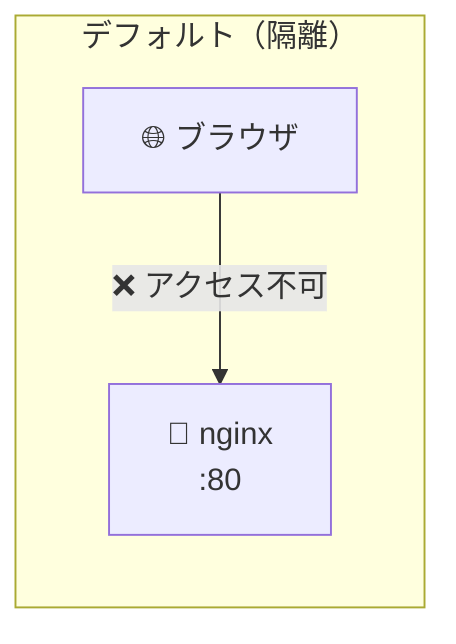
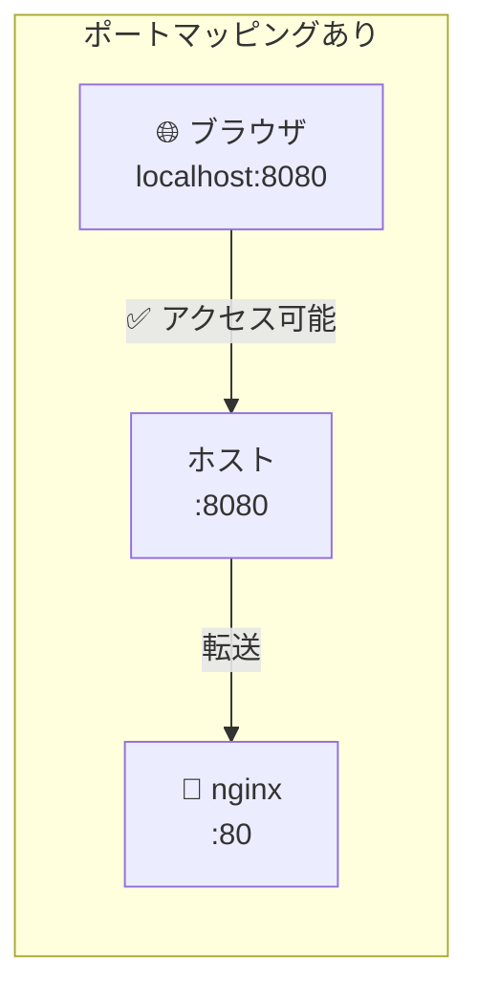
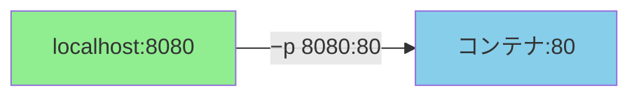

# Phase 2-2: ポートとネットワーク基礎 ～ コンテナを外部に公開する ～

## 学習目標

この単元を終えると、以下ができるようになります：

- `-p` オプションでポートマッピングを設定できる
- コンテナ内のアプリにブラウザからアクセスできる
- ホストポートとコンテナポートの関係を説明できる
- コンテナのネットワーク隔離を理解できる

## 概念解説

### なぜポートマッピングが必要か？

コンテナはデフォルトで隔離されており、外部からアクセスできません。





### AWS で例えると...

| Docker 概念 | AWS で似たもの |
|------------|---------------|
| ポートマッピング `-p` | Security Group のインバウンドルール |
| コンテナポート | EC2 内のアプリがリッスンするポート |
| ホストポート | 外部に公開するポート |
| 複数ポート公開 | 複数ルール追加 |

### ポートマッピングの書式

```bash
docker run -p [ホストポート]:[コンテナポート] イメージ
```



| パラメータ | 説明 | 例 |
|-----------|------|-----|
| ホストポート | あなたの PC で開くポート | 8080 |
| コンテナポート | コンテナ内のアプリが使うポート | 80 |

### よく使うポート番号

| ポート | 用途 | 例 |
|--------|------|-----|
| 80 | HTTP | nginx, Apache |
| 443 | HTTPS | nginx with SSL |
| 3000 | 開発サーバー | React, Express |
| 5000 | Flask | Python Flask |
| 8080 | 代替 HTTP | Tomcat, 開発用 |
| 3306 | MySQL | データベース |
| 5432 | PostgreSQL | データベース |
| 6379 | Redis | キャッシュ |

## ハンズオン

### 演習1: 基本的なポートマッピング

```bash
# nginx をポート 8080 で公開
docker run -d --name web -p 8080:80 nginx

# ブラウザで確認
# http://localhost:8080 にアクセス
# "Welcome to nginx!" が表示される

# または curl で確認
curl http://localhost:8080
```

**ポイント**: ホストの 8080 → コンテナの 80 に転送される

### 演習2: 異なるポートで複数起動

```bash
# 3つの nginx を異なるポートで起動
docker run -d --name web1 -p 8081:80 nginx
docker run -d --name web2 -p 8082:80 nginx
docker run -d --name web3 -p 8083:80 nginx

# 確認
docker ps

# 各ポートにアクセス
curl http://localhost:8081
curl http://localhost:8082
curl http://localhost:8083

# 後片付け
docker rm -f web1 web2 web3
```

### 演習3: 複数ポートを公開

```bash
# 1つのコンテナで複数ポート公開
docker run -d --name multi-port \
  -p 8080:80 \
  -p 8443:443 \
  nginx

# 確認
docker ps
# PORTS: 0.0.0.0:8080->80/tcp, 0.0.0.0:8443->443/tcp

# 後片付け
docker rm -f multi-port
```

### 演習4: ポートの自動割り当て

```bash
# -P（大文字）で EXPOSE されたポートを自動割り当て
docker run -d --name auto-port -P nginx

# 割り当てられたポートを確認
docker ps
# PORTS: 0.0.0.0:55000->80/tcp のように表示

# 割り当てられたポート番号でアクセス
curl http://localhost:55000  # 実際の番号に置き換え

# ポートだけ確認
docker port auto-port
# 80/tcp -> 0.0.0.0:55000

# 後片付け
docker rm -f auto-port
```

### 演習5: バインドアドレスの指定

```bash
# localhost のみからアクセス可能（セキュア）
docker run -d --name local-only -p 127.0.0.1:8080:80 nginx

# 全 IP からアクセス可能（デフォルト）
docker run -d --name public -p 0.0.0.0:8081:80 nginx

# 確認
docker ps
# local-only: 127.0.0.1:8080->80/tcp
# public: 0.0.0.0:8081->80/tcp

# 後片付け
docker rm -f local-only public
```

**セキュリティ**: 開発環境では `127.0.0.1` に限定すると安全

### 演習6: 実践 - Python Flask アプリ

```bash
# まず簡単な Flask アプリを含むコンテナを作る
docker run -d --name flask-app -p 5000:5000 \
  python:3.11-slim \
  bash -c "pip install flask && python -c \"
from flask import Flask
app = Flask(__name__)
@app.route('/')
def hello():
    return 'Hello from Docker!'
app.run(host='0.0.0.0', port=5000)
\""

# 少し待ってから確認（pip install に時間がかかる）
sleep 10
curl http://localhost:5000
# Hello from Docker!

# ログを確認
docker logs flask-app

# 後片付け
docker rm -f flask-app
```

### 演習7: ポート競合の確認

```bash
# 最初のコンテナ
docker run -d --name first -p 8080:80 nginx

# 同じポートで2つ目を起動しようとする
docker run -d --name second -p 8080:80 nginx
# Error: Bind for 0.0.0.0:8080 failed: port is already allocated

# 別のポートなら OK
docker run -d --name second -p 8081:80 nginx

# 後片付け
docker rm -f first second
```

### 演習8: コンテナの IP アドレスを確認

```bash
# コンテナを起動
docker run -d --name ip-test nginx

# IP アドレスを確認
docker inspect --format='{{.NetworkSettings.IPAddress}}' ip-test
# 172.17.0.2 のような出力

# この IP はホストからアクセス可能（Docker ネットワーク内）
curl http://172.17.0.2:80
# Welcome to nginx!

# 後片付け
docker rm -f ip-test
```

**注意**: この IP はコンテナ再起動で変わる可能性がある。本番では名前解決を使う。

## 現場でよくある落とし穴

### 1. ポートがすでに使用中

```bash
docker run -p 8080:80 nginx
# Error: port is already allocated

# 何が使ってるか確認（macOS/Linux）
lsof -i :8080

# 解決策: 別のポートを使う
docker run -p 8081:80 nginx
```

### 2. コンテナ内のアプリが 127.0.0.1 でリッスン

```python
# ❌ これだとコンテナ外からアクセスできない
app.run(host='127.0.0.1', port=5000)

# ✅ 全 IP でリッスンする
app.run(host='0.0.0.0', port=5000)
```

コンテナ内の `127.0.0.1` はコンテナ自身のみ。外部から来るリクエストは別 IP。

### 3. EXPOSE と -p の混同

```dockerfile
# Dockerfile 内の EXPOSE
EXPOSE 80
```

```bash
# EXPOSE はドキュメント的な意味。実際の公開には -p が必要！
docker run -d nginx          # ポート公開されない
docker run -d -p 8080:80 nginx  # ポート公開される
docker run -d -P nginx       # EXPOSE されたポートを自動割り当て
```

### 4. ファイアウォールにブロックされる

```bash
# macOS: 特に問題なし
# Linux: firewalld や iptables を確認
sudo firewall-cmd --list-all

# AWS EC2: Security Group のインバウンドルールを確認
```

## 理解度確認

### 問題

以下のコマンドでコンテナを起動しました。

```bash
docker run -d -p 3000:80 nginx
```

ブラウザからアクセスする正しい URL はどれか。

**A.** http://localhost:80

**B.** http://localhost:3000

**C.** http://container:80

**D.** http://container:3000

---

### 解答・解説

**正解: B**

`-p 3000:80` の意味：
- ホストの **3000** 番ポートを
- コンテナの **80** 番ポートに転送

ブラウザはホスト（あなたの PC）からアクセスするため、ホストポートの **3000** を使います。

- **A.** 誤り。80 はコンテナ内のポート。ホストの 80 には何もリッスンしていない。
- **B.** 正解。ホストポート 3000 にアクセスすると、コンテナの 80 に転送される。
- **C.** 誤り。`container` というホスト名は存在しない。
- **D.** 誤り。同上。

---

## まとめ

| 操作 | コマンド | 例 |
|------|---------|-----|
| 基本公開 | `-p ホスト:コンテナ` | `-p 8080:80` |
| 複数ポート | `-p` を複数回 | `-p 8080:80 -p 3306:3306` |
| ローカル限定 | `127.0.0.1:` を付ける | `-p 127.0.0.1:8080:80` |
| 自動割り当て | `-P`（大文字） | `-P` |
| ポート確認 | `docker port` | `docker port コンテナ名` |

## 次のステップ

コンテナを外部に公開できるようになりました！次はイメージの仕組みを学び、自分でイメージを作れるようになりましょう。

**次の単元**: [Phase 3-1: イメージの基礎 ～ レイヤー構造を理解する ～](../phase3/01_イメージ基礎.md)
