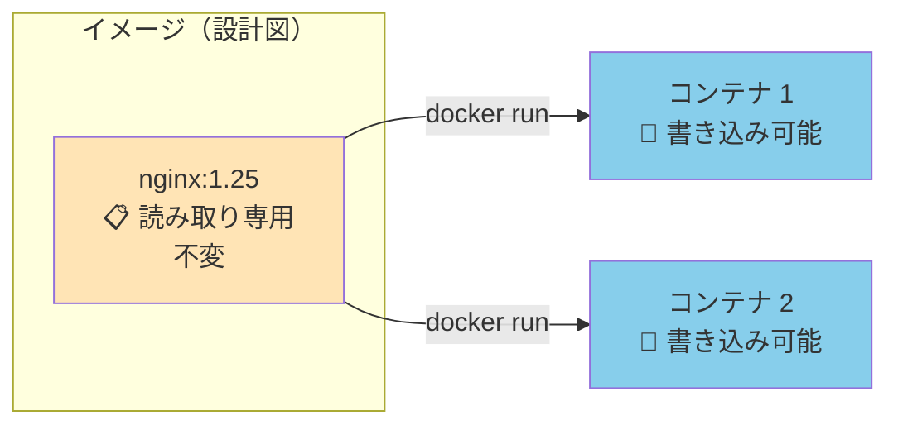
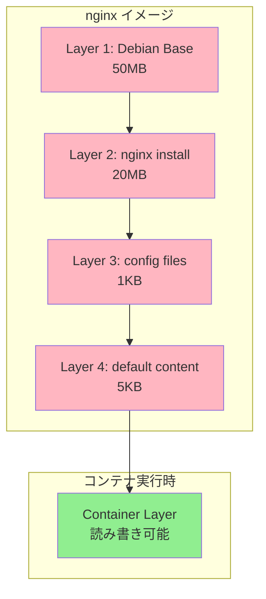

# Phase 3-1: イメージの基礎 ～ レイヤー構造を理解する ～

## 学習目標

この単元を終えると、以下ができるようになります：

- Docker Hub からイメージを検索・取得できる
- イメージのタグ（バージョン）を指定して pull できる
- イメージのレイヤー構造を理解し、キャッシュの仕組みを説明できる
- 不要なイメージを削除してディスク容量を管理できる

## 概念解説

### イメージとは？



| 特性 | イメージ | コンテナ |
|------|---------|---------|
| 状態 | 静的（変更不可） | 動的（変更可能） |
| 役割 | テンプレート | 実行インスタンス |
| 保存 | ディスクに保存 | メモリ + 一時ディスク |

### AWS で例えると...

| Docker | AWS | 説明 |
|--------|-----|------|
| イメージ | AMI | マシンのスナップショット |
| Docker Hub | AWS Marketplace / ECR | イメージ置き場 |
| タグ | AMI ID / バージョン | 特定のバージョンを指定 |
| pull | AMI からインスタンス起動 | イメージを取得 |

### イメージの命名規則

```
[レジストリ/]リポジトリ:タグ
```

| 例 | 説明 |
|----|------|
| `nginx` | 公式イメージ、latest タグ |
| `nginx:1.25` | バージョン指定 |
| `nginx:alpine` | Alpine Linux ベース（軽量） |
| `myuser/myapp:v1` | ユーザーのイメージ |
| `gcr.io/project/app:latest` | Google Container Registry |
| `123456789.dkr.ecr.ap-northeast-1.amazonaws.com/myapp:v1` | AWS ECR |

### レイヤー構造



**レイヤーのメリット：**
1. **キャッシュ**: 同じレイヤーは再利用（ダウンロード不要）
2. **共有**: 複数イメージで同じベースレイヤーを共有
3. **差分保存**: 変更があった部分だけ新しいレイヤーに

## 基本コマンド

### docker pull

```bash
docker pull nginx              # latest を取得
docker pull nginx:1.25         # バージョン指定
docker pull nginx:alpine       # Alpine 版
```

### docker images

```bash
docker images                  # 全イメージ一覧
docker images nginx            # nginx 関連のみ
docker images -q               # ID のみ
docker images --digests        # ダイジェスト（ハッシュ）も表示
```

### docker rmi（イメージ削除）

```bash
docker rmi nginx               # 削除
docker rmi nginx:1.25          # タグ指定で削除
docker rmi $(docker images -q) # 全削除（注意！）
```

### docker image prune

```bash
docker image prune             # 未使用イメージ削除
docker image prune -a          # 使用中以外を全削除
```

## ハンズオン

### 演習1: イメージの検索と取得

```bash
# Docker Hub でイメージを検索
docker search python

# 出力例:
# NAME                   DESCRIPTION                                     STARS
# python                 Python is an interpreted, interactive...       9000
# pypy                   PyPy is a fast, compliant alternative...       400

# Python 公式イメージを取得
docker pull python:3.11

# 取得確認
docker images python
```

### 演習2: タグの違いを体験

```bash
# 通常版
docker pull python:3.11

# Slim 版（軽量）
docker pull python:3.11-slim

# Alpine 版（超軽量）
docker pull python:3.11-alpine

# サイズを比較
docker images python

# 出力例:
# REPOSITORY   TAG           IMAGE ID       SIZE
# python       3.11          abc123...      1.01GB  ← フル版
# python       3.11-slim     def456...      131MB   ← Slim
# python       3.11-alpine   ghi789...      51.5MB  ← Alpine
```

**タグの選び方：**
- 開発時: フル版（デバッグツールが豊富）
- 本番: slim または alpine（軽量・セキュア）

### 演習3: レイヤーを確認

```bash
# nginx イメージのレイヤーを表示
docker history nginx

# 出力例:
# IMAGE          CREATED        CREATED BY                                      SIZE
# abc123         2 weeks ago    CMD ["nginx" "-g" "daemon off;"]                0B
# <missing>      2 weeks ago    EXPOSE 80                                       0B
# <missing>      2 weeks ago    COPY file:xxx in /etc/nginx/nginx.conf          1KB
# <missing>      2 weeks ago    RUN /bin/sh -c apt-get update && apt-get...     20MB
# <missing>      2 weeks ago    FROM debian:bookworm-slim                       50MB
```

各行が1つのレイヤー。下から上に積み重なっている。

### 演習4: キャッシュの効果を体験

```bash
# 1回目の pull（時間計測）
time docker pull node:18

# いったん削除
docker rmi node:18

# 2回目の pull（ベースレイヤーがキャッシュされている場合は速い）
time docker pull node:18

# 関連イメージを pull（共通レイヤーはキャッシュ利用）
time docker pull node:20
# "Already exists" と表示されるレイヤーがある
```

### 演習5: イメージの詳細を確認

```bash
# イメージの詳細情報
docker inspect nginx

# 特定の情報を抽出
docker inspect --format='{{.Config.Cmd}}' nginx
# [nginx -g daemon off;]

docker inspect --format='{{.Config.ExposedPorts}}' nginx
# map[80/tcp:{}]

# 作成日時
docker inspect --format='{{.Created}}' nginx
```

### 演習6: イメージのサイズ管理

```bash
# 現在のディスク使用量を確認
docker system df

# 出力例:
# TYPE            TOTAL     ACTIVE    SIZE      RECLAIMABLE
# Images          5         2         1.5GB     1.1GB (73%)
# Containers      3         1         50MB      45MB (90%)
# Volumes         2         1         200MB     100MB (50%)

# 詳細表示
docker system df -v

# 未使用イメージを削除
docker image prune
# y で確認

# より積極的に削除（使用中以外を全削除）
docker image prune -a
```

### 演習7: イメージの保存と読み込み

```bash
# イメージをファイルに保存（オフライン環境への転送用）
docker save nginx:latest -o nginx.tar
ls -lh nginx.tar
# 約 190MB のファイルができる

# いったん削除
docker rmi nginx:latest

# ファイルから読み込み
docker load -i nginx.tar
docker images nginx
# 復元された！

# 後片付け
rm nginx.tar
```

### 演習8: Docker Hub でイメージを探索

```bash
# 公式イメージの情報を見る
# https://hub.docker.com/_/python にアクセス

# タグ一覧を確認（Web で見るのが一般的）
# - Supported tags
# - Quick reference
# - How to use this image

# 特定のタグが存在するか確認
docker pull python:3.11-bookworm
docker pull python:nonexistent-tag  # エラーになる
```

## 現場でよくある落とし穴

### 1. latest タグの罠

```bash
docker pull nginx          # latest を取得
docker pull nginx:latest   # 同じ

# ❌ 問題: latest は常に最新を指すので、昨日と今日で違うイメージかも

# ✅ 本番ではバージョンを固定する
docker pull nginx:1.25.3
```

### 2. イメージがどんどん増える

```bash
docker images
# たくさんのイメージ...

# 定期的に掃除する
docker image prune -a
docker system prune -a  # コンテナ・ボリュームも含む
```

### 3. pull に時間がかかる

```bash
# 大きいイメージは時間がかかる
docker pull tensorflow/tensorflow:latest-gpu  # 数GB

# 対策:
# 1. slim/alpine を使う
# 2. CI/CD でイメージをキャッシュする
# 3. プライベートレジストリを近い場所に置く
```

### 4. アーキテクチャの違い

```bash
# M1/M2 Mac (ARM) で x86 イメージを pull
docker pull --platform linux/amd64 some-image

# 警告が出ることがある
# WARNING: The requested image's platform (linux/amd64) does not match...
```

## 理解度確認

### 問題

Docker イメージのレイヤー構造について、正しい説明はどれか。

**A.** レイヤーは書き込み可能で、コンテナ実行中に変更される

**B.** 各レイヤーは独立しており、他のイメージと共有されない

**C.** レイヤーは読み取り専用で、複数のイメージ間で共有できる

**D.** レイヤーはコンテナ起動時に毎回ダウンロードされる

---

### 解答・解説

**正解: C**

- **A.** 誤り。イメージのレイヤーは読み取り専用。書き込み可能なのはコンテナ実行時に追加される「Container Layer」のみ。
- **B.** 誤り。同じベースイメージを使う複数のイメージは、共通のレイヤーを共有してディスク容量を節約する。
- **C.** 正解。レイヤーは不変（immutable）で読み取り専用。複数のイメージやコンテナで共有される。
- **D.** 誤り。一度ダウンロードされたレイヤーはキャッシュされ、再利用される。

**実務での活用：** Dockerfile を書く際、変更頻度の低い処理（apt-get install など）を上のレイヤーに、頻繁に変わる処理（アプリコードの COPY）を下のレイヤーにすると、キャッシュ効率が良くなります。

---

## まとめ

| 操作 | コマンド | 例 |
|------|---------|-----|
| 取得 | `docker pull` | `docker pull nginx:1.25` |
| 一覧 | `docker images` | `docker images` |
| 削除 | `docker rmi` | `docker rmi nginx:1.25` |
| 履歴 | `docker history` | `docker history nginx` |
| 掃除 | `docker image prune` | `docker image prune -a` |
| 保存 | `docker save` | `docker save nginx -o nginx.tar` |
| 読込 | `docker load` | `docker load -i nginx.tar` |

## 次のステップ

イメージの仕組みがわかりました！次は自分でイメージを作る Dockerfile を学びましょう。

**次の単元**: [Phase 3-2: Dockerfile 入門 ～ 自分だけのイメージを作る ～](./02_Dockerfile入門.md)
