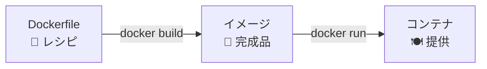

# Phase 3-2: Dockerfile 入門 ～ 自分だけのイメージを作る ～

## 学習目標

この単元を終えると、以下ができるようになります：

- Dockerfile の基本命令（FROM, RUN, COPY, CMD, EXPOSE）を使える
- 自分の Python アプリを Docker イメージにできる
- `docker build` でイメージをビルドできる
- ビルドキャッシュの仕組みを理解し、効率的な Dockerfile を書ける

## 概念解説

### Dockerfile とは？



Dockerfile は「イメージの作り方」を記述したテキストファイル。料理のレシピのようなもの。

### AWS で例えると...

| Dockerfile | AWS | 説明 |
|------------|-----|------|
| FROM | ベース AMI 選択 | 土台を決める |
| RUN | UserData でコマンド実行 | セットアップ処理 |
| COPY | S3 からファイル取得 | ファイル配置 |
| EXPOSE | Security Group 設定 | ポート開放 |
| CMD | 起動スクリプト | 起動コマンド |

### 基本命令

| 命令 | 説明 | 例 |
|------|------|-----|
| `FROM` | ベースイメージを指定 | `FROM python:3.11-slim` |
| `RUN` | コマンドを実行（ビルド時） | `RUN pip install flask` |
| `COPY` | ファイルをコピー | `COPY app.py /app/` |
| `ADD` | COPY + tar展開/URL対応 | `ADD archive.tar.gz /app/` |
| `WORKDIR` | 作業ディレクトリを設定 | `WORKDIR /app` |
| `ENV` | 環境変数を設定 | `ENV DEBUG=false` |
| `EXPOSE` | ポートをドキュメント | `EXPOSE 5000` |
| `CMD` | デフォルト実行コマンド | `CMD ["python", "app.py"]` |
| `ENTRYPOINT` | 固定の実行コマンド | `ENTRYPOINT ["python"]` |

### Dockerfile の構造

```dockerfile
# 1. ベースイメージ（必須・最初に書く）
FROM python:3.11-slim

# 2. メタデータ（任意）
LABEL maintainer="you@example.com"

# 3. 環境変数（任意）
ENV PYTHONUNBUFFERED=1

# 4. 作業ディレクトリ設定
WORKDIR /app

# 5. 依存関係インストール（先にやるとキャッシュが効く）
COPY requirements.txt .
RUN pip install --no-cache-dir -r requirements.txt

# 6. アプリケーションコードをコピー
COPY . .

# 7. ポート公開（ドキュメント目的）
EXPOSE 5000

# 8. 起動コマンド
CMD ["python", "app.py"]
```

## ハンズオン

### 演習1: 最初の Dockerfile

```bash
# 作業ディレクトリを作成
mkdir -p ~/docker-practice/hello-docker
cd ~/docker-practice/hello-docker
```

```bash
# Dockerfile を作成
cat << 'EOF' > Dockerfile
FROM python:3.11-slim

WORKDIR /app

RUN echo "print('Hello from Docker!')" > hello.py

CMD ["python", "hello.py"]
EOF
```

```bash
# ビルド
docker build -t my-hello .

# 実行
docker run --rm my-hello
# Hello from Docker!
```

### 演習2: Python Flask アプリをコンテナ化

```bash
# プロジェクトディレクトリ作成
mkdir -p ~/docker-practice/flask-app
cd ~/docker-practice/flask-app
```

```bash
# アプリケーションコードを作成
cat << 'EOF' > app.py
from flask import Flask
import os

app = Flask(__name__)

@app.route('/')
def hello():
    name = os.getenv('APP_NAME', 'World')
    return f'Hello, {name}! I am running in Docker.'

@app.route('/health')
def health():
    return 'OK'

if __name__ == '__main__':
    app.run(host='0.0.0.0', port=5000)
EOF
```

```bash
# requirements.txt を作成
cat << 'EOF' > requirements.txt
flask==3.0.0
EOF
```

```bash
# Dockerfile を作成
cat << 'EOF' > Dockerfile
# ベースイメージ
FROM python:3.11-slim

# 作業ディレクトリ
WORKDIR /app

# 依存関係を先にコピー（キャッシュ効率化）
COPY requirements.txt .
RUN pip install --no-cache-dir -r requirements.txt

# アプリコードをコピー
COPY app.py .

# ポートを公開
EXPOSE 5000

# 起動コマンド
CMD ["python", "app.py"]
EOF
```

```bash
# ビルド
docker build -t my-flask-app .

# 実行
docker run -d --name flask-test -p 5000:5000 my-flask-app

# アクセス確認
curl http://localhost:5000
# Hello, World! I am running in Docker.

curl http://localhost:5000/health
# OK

# 環境変数を変えて実行
docker rm -f flask-test
docker run -d --name flask-test -p 5000:5000 -e APP_NAME="Docker Learner" my-flask-app

curl http://localhost:5000
# Hello, Docker Learner! I am running in Docker.

# 後片付け
docker rm -f flask-test
```

### 演習3: ビルドキャッシュを体験

```bash
cd ~/docker-practice/flask-app

# 1回目のビルド（時間計測）
time docker build -t my-flask-app:v1 .

# 何も変えずに2回目
time docker build -t my-flask-app:v2 .
# "Using cache" と表示され、一瞬で終わる

# app.py を少し変更
echo "" >> app.py

# 3回目のビルド
time docker build -t my-flask-app:v3 .
# requirements.txt 以降はキャッシュが使える
```

### 演習4: CMD と ENTRYPOINT の違い

```bash
mkdir -p ~/docker-practice/cmd-test
cd ~/docker-practice/cmd-test
```

```bash
# CMD を使う場合
cat << 'EOF' > Dockerfile.cmd
FROM python:3.11-slim
CMD ["python", "--version"]
EOF

docker build -t cmd-test -f Dockerfile.cmd .

# デフォルトコマンド実行
docker run --rm cmd-test
# Python 3.11.x

# 上書き可能
docker run --rm cmd-test python -c "print('Override!')"
# Override!
```

```bash
# ENTRYPOINT を使う場合
cat << 'EOF' > Dockerfile.entry
FROM python:3.11-slim
ENTRYPOINT ["python"]
CMD ["--version"]
EOF

docker build -t entry-test -f Dockerfile.entry .

# デフォルト
docker run --rm entry-test
# Python 3.11.x

# CMD 部分だけ上書き
docker run --rm entry-test -c "print('Hello!')"
# Hello!

# ENTRYPOINT は固定（python コマンドは変わらない）
```

**使い分け：**
- `CMD`: 上書き可能なデフォルトコマンド
- `ENTRYPOINT`: 固定のコマンド、引数だけ変更したい時

### 演習5: .dockerignore を使う

```bash
cd ~/docker-practice/flask-app

# 不要なファイルを作成
mkdir -p __pycache__
echo "secret=password123" > .env
echo "node_modules/" > .gitignore
mkdir -p .git

# .dockerignore を作成
cat << 'EOF' > .dockerignore
__pycache__
*.pyc
.env
.git
.gitignore
*.md
EOF

# ビルドして確認
docker build -t my-flask-app:clean .

# コンテナ内を確認
docker run --rm my-flask-app:clean ls -la
# .env や __pycache__ がないことを確認
```

### 演習6: ARG でビルド時変数

```bash
mkdir -p ~/docker-practice/arg-test
cd ~/docker-practice/arg-test
```

```bash
cat << 'EOF' > Dockerfile
FROM python:3.11-slim

# ビルド時引数
ARG APP_VERSION=1.0.0

# 環境変数に変換（実行時に使うため）
ENV VERSION=$APP_VERSION

RUN echo "Building version: $APP_VERSION"

CMD python -c "import os; print(f'Version: {os.getenv(\"VERSION\")}')"
EOF

# デフォルト値でビルド
docker build -t arg-test:default .
docker run --rm arg-test:default
# Version: 1.0.0

# 値を変更してビルド
docker build --build-arg APP_VERSION=2.0.0 -t arg-test:v2 .
docker run --rm arg-test:v2
# Version: 2.0.0
```

### 演習7: HEALTHCHECK を追加

```bash
cd ~/docker-practice/flask-app

# Dockerfile を更新
cat << 'EOF' > Dockerfile
FROM python:3.11-slim

WORKDIR /app

COPY requirements.txt .
RUN pip install --no-cache-dir -r requirements.txt

COPY app.py .

EXPOSE 5000

# ヘルスチェック追加
HEALTHCHECK --interval=30s --timeout=3s --start-period=5s --retries=3 \
  CMD curl -f http://localhost:5000/health || exit 1

# curl をインストール（slim にはない）
RUN apt-get update && apt-get install -y curl && rm -rf /var/lib/apt/lists/*

CMD ["python", "app.py"]
EOF

# ビルド＆実行
docker build -t my-flask-app:health .
docker run -d --name health-test -p 5000:5000 my-flask-app:health

# ヘルスステータス確認
docker ps
# STATUS に (healthy) と表示される（30秒後）

# 詳細確認
docker inspect --format='{{json .State.Health}}' health-test | python -m json.tool

# 後片付け
docker rm -f health-test
```

## 現場でよくある落とし穴

### 1. COPY の順番でキャッシュが効かない

```dockerfile
# ❌ 悪い例（毎回依存関係インストール）
COPY . .
RUN pip install -r requirements.txt

# ✅ 良い例（依存関係はキャッシュされる）
COPY requirements.txt .
RUN pip install -r requirements.txt
COPY . .
```

### 2. 不要なファイルが入る

```bash
# イメージサイズを確認
docker images my-flask-app

# .git や node_modules が入っていると巨大に
# .dockerignore で除外する
```

### 3. ルートユーザーで実行

```dockerfile
# ❌ デフォルトは root（セキュリティリスク）
CMD ["python", "app.py"]

# ✅ 一般ユーザーで実行
RUN useradd -m appuser
USER appuser
CMD ["python", "app.py"]
```

### 4. 絶対パスでコピー

```dockerfile
# ❌ ホストの絶対パスは使えない
COPY /Users/me/app.py /app/

# ✅ ビルドコンテキストからの相対パス
COPY app.py /app/
```

## 理解度確認

### 問題

以下の Dockerfile でビルドした場合、キャッシュが最も効率的に使われる順序はどれか。

```dockerfile
FROM python:3.11-slim
WORKDIR /app
# ここに以下のどの順序で書くか？
```

**A.**
```dockerfile
COPY . .
COPY requirements.txt .
RUN pip install -r requirements.txt
```

**B.**
```dockerfile
COPY requirements.txt .
COPY . .
RUN pip install -r requirements.txt
```

**C.**
```dockerfile
COPY requirements.txt .
RUN pip install -r requirements.txt
COPY . .
```

**D.**
```dockerfile
RUN pip install -r requirements.txt
COPY requirements.txt .
COPY . .
```

---

### 解答・解説

**正解: C**

- **A.** 誤り。`COPY . .` が先にあるため、任意のファイル変更で全てのレイヤーが無効化される。
- **B.** 誤り。pip install の前に `COPY . .` があるため、アプリコード変更で pip install からやり直しになる。
- **C.** 正解。requirements.txt が変わらない限り、pip install のキャッシュが有効。アプリコード変更時は最後の `COPY . .` だけ再実行。
- **D.** 誤り。pip install 時に requirements.txt がまだコピーされていないためエラーになる。

**原則**: 変更頻度が低いもの（依存関係）を先に、変更頻度が高いもの（アプリコード）を後に書く。

---

## まとめ

| 命令 | 用途 | ポイント |
|------|------|---------|
| `FROM` | ベース指定 | slim/alpine で軽量化 |
| `WORKDIR` | 作業ディレクトリ | 必ず設定する |
| `COPY` | ファイルコピー | 順番でキャッシュ効率が変わる |
| `RUN` | コマンド実行 | なるべくまとめる |
| `ENV` | 環境変数 | 設定値の外部化 |
| `EXPOSE` | ポート宣言 | ドキュメント目的 |
| `CMD` | 起動コマンド | 上書き可能 |
| `ENTRYPOINT` | 固定コマンド | 引数だけ変更 |

## 次のステップ

自分でイメージを作れるようになりました！次はデータの永続化を学びましょう。

**次の単元**: [Phase 4-1: ボリュームとマウント ～ データを永続化する ～](../phase4/01_ボリュームとマウント.md)
