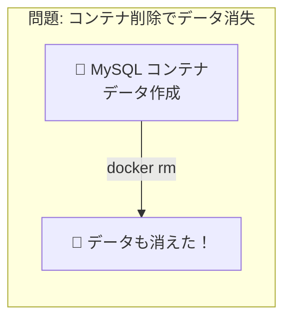
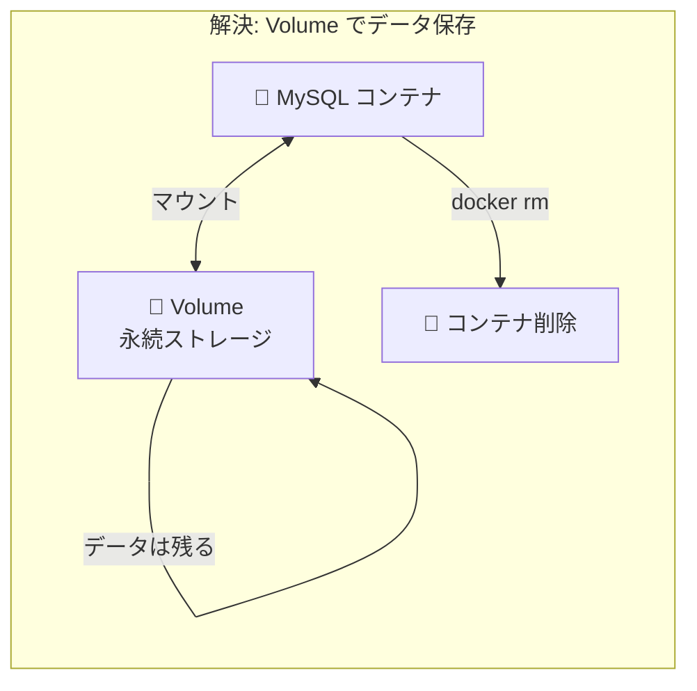
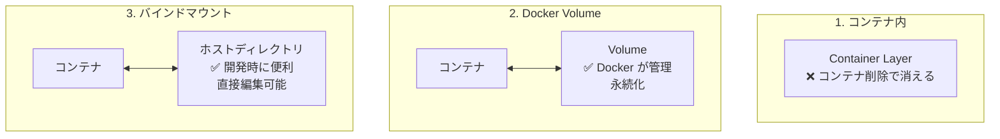

# Phase 4-1: ボリュームとマウント ～ データを永続化する ～

## 学習目標

この単元を終えると、以下ができるようになります：

- コンテナのデータが消える問題を理解できる
- Docker Volume を作成・管理できる
- バインドマウントで開発効率を上げられる
- 用途に応じて Volume とバインドマウントを使い分けられる

## 概念解説

### なぜデータ永続化が必要か？





### AWS で例えると...

| Docker | AWS | 説明 |
|--------|-----|------|
| コンテナ内ストレージ | インスタンスストア | 一時的、停止で消える |
| Docker Volume | EBS | 永続的、独立管理 |
| バインドマウント | EFS マウント | ホストのディレクトリを共有 |

### 3つのデータ管理方法



| 方式 | 管理者 | 用途 | 性能 |
|------|--------|------|------|
| コンテナ内 | Docker | 一時データ | 最速 |
| Volume | Docker | 本番データ（DB等） | 速い |
| バインドマウント | ユーザー | 開発時のコード共有 | 環境依存 |

### Volume とバインドマウントの違い

| 項目 | Volume | バインドマウント |
|------|--------|-----------------|
| 場所 | Docker 管理下 | ホストの任意の場所 |
| 作成 | `docker volume create` | 自動（ディレクトリ指定） |
| バックアップ | Docker コマンドで | 通常のファイル操作で |
| 可搬性 | 高い | ホスト依存 |
| 推奨用途 | 本番データ | 開発時のソース共有 |

## 基本コマンド

### Volume 操作

```bash
docker volume create mydata     # 作成
docker volume ls                # 一覧
docker volume inspect mydata    # 詳細
docker volume rm mydata         # 削除
docker volume prune             # 未使用を全削除
```

### マウントオプション

```bash
# Volume マウント（-v または --mount）
docker run -v mydata:/app/data nginx
docker run --mount source=mydata,target=/app/data nginx

# バインドマウント
docker run -v /host/path:/container/path nginx
docker run --mount type=bind,source=/host/path,target=/container/path nginx

# 読み取り専用
docker run -v mydata:/app/data:ro nginx
```

## ハンズオン

### 演習1: データが消える問題を体験

```bash
# コンテナを起動してファイルを作成
docker run -it --name data-test ubuntu bash

# コンテナ内でファイル作成
root@xxx:/# echo "Important data" > /data.txt
root@xxx:/# cat /data.txt
# Important data
root@xxx:/# exit

# コンテナを削除
docker rm data-test

# 新しいコンテナで確認
docker run --rm ubuntu cat /data.txt
# cat: /data.txt: No such file or directory
# データが消えた！
```

### 演習2: Docker Volume で永続化

```bash
# Volume を作成
docker volume create mydata

# Volume 一覧
docker volume ls
# DRIVER    VOLUME NAME
# local     mydata

# Volume の詳細
docker volume inspect mydata
# Mountpoint が表示される

# Volume をマウントしてコンテナ起動
docker run -it --name vol-test -v mydata:/app/data ubuntu bash

# データを作成
root@xxx:/# echo "Persistent data" > /app/data/important.txt
root@xxx:/# exit

# コンテナを削除
docker rm vol-test

# 新しいコンテナで確認
docker run --rm -v mydata:/app/data ubuntu cat /app/data/important.txt
# Persistent data
# データが残っている！
```

### 演習3: バインドマウントで開発

```bash
# 作業ディレクトリ作成
mkdir -p ~/docker-practice/bind-test
cd ~/docker-practice/bind-test

# ホストでファイル作成
echo "Hello from host!" > index.html

# バインドマウントで nginx 起動
docker run -d --name web-dev \
  -p 8080:80 \
  -v $(pwd):/usr/share/nginx/html:ro \
  nginx

# アクセス確認
curl http://localhost:8080
# Hello from host!

# ホストでファイルを編集（コンテナ再起動不要！）
echo "Updated content!" > index.html

# 即座に反映
curl http://localhost:8080
# Updated content!

# 後片付け
docker rm -f web-dev
```

### 演習4: Python 開発環境を構築

```bash
mkdir -p ~/docker-practice/python-dev
cd ~/docker-practice/python-dev

# アプリケーション作成
cat << 'EOF' > app.py
from flask import Flask
app = Flask(__name__)

@app.route('/')
def hello():
    return 'Hello! Edit me and refresh!'

if __name__ == '__main__':
    app.run(host='0.0.0.0', port=5000, debug=True)
EOF

# requirements.txt
echo "flask==3.0.0" > requirements.txt

# 開発用 Dockerfile
cat << 'EOF' > Dockerfile
FROM python:3.11-slim
WORKDIR /app
COPY requirements.txt .
RUN pip install --no-cache-dir -r requirements.txt
# ソースコードはマウントするのでコピーしない
CMD ["python", "app.py"]
EOF

# ビルド
docker build -t flask-dev .

# バインドマウントで起動（ソースコードを共有）
docker run -d --name flask-dev \
  -p 5000:5000 \
  -v $(pwd):/app \
  flask-dev

# アクセス確認
curl http://localhost:5000
# Hello! Edit me and refresh!

# ホストでコードを編集
sed -i '' 's/Edit me and refresh/I was edited/' app.py 2>/dev/null || \
sed -i 's/Edit me and refresh/I was edited/' app.py

# Flask の debug=True により自動リロード
sleep 2
curl http://localhost:5000
# Hello! I was edited!

# 後片付け
docker rm -f flask-dev
```

### 演習5: MySQL のデータを永続化

```bash
# MySQL 用の Volume 作成
docker volume create mysql-data

# MySQL 起動（データを Volume に保存）
docker run -d --name mysql-prod \
  -e MYSQL_ROOT_PASSWORD=secret123 \
  -e MYSQL_DATABASE=myapp \
  -v mysql-data:/var/lib/mysql \
  -p 3306:3306 \
  mysql:8

# 起動を待つ
sleep 30

# データを作成
docker exec -it mysql-prod mysql -uroot -psecret123 -e "
  USE myapp;
  CREATE TABLE users (id INT PRIMARY KEY, name VARCHAR(100));
  INSERT INTO users VALUES (1, 'Alice'), (2, 'Bob');
  SELECT * FROM users;
"

# コンテナを削除
docker rm -f mysql-prod

# 新しいコンテナで同じ Volume をマウント
docker run -d --name mysql-new \
  -e MYSQL_ROOT_PASSWORD=secret123 \
  -v mysql-data:/var/lib/mysql \
  -p 3306:3306 \
  mysql:8

# 起動を待つ
sleep 30

# データが残っているか確認
docker exec -it mysql-new mysql -uroot -psecret123 -e "
  USE myapp;
  SELECT * FROM users;
"
# Alice と Bob が表示される！

# 後片付け
docker rm -f mysql-new
docker volume rm mysql-data
```

### 演習6: Volume のバックアップ

```bash
# データ入りの Volume を作成
docker volume create backup-test
docker run --rm -v backup-test:/data ubuntu bash -c "
  echo 'File 1' > /data/file1.txt
  echo 'File 2' > /data/file2.txt
  echo 'Important' > /data/important.txt
"

# Volume の内容を tar でバックアップ
docker run --rm \
  -v backup-test:/source:ro \
  -v $(pwd):/backup \
  ubuntu tar cvf /backup/volume-backup.tar -C /source .

# バックアップファイル確認
ls -lh volume-backup.tar
tar tvf volume-backup.tar

# Volume を削除
docker volume rm backup-test

# 新しい Volume にリストア
docker volume create backup-restored
docker run --rm \
  -v backup-restored:/target \
  -v $(pwd):/backup \
  ubuntu tar xvf /backup/volume-backup.tar -C /target

# 確認
docker run --rm -v backup-restored:/data ubuntu ls -la /data
# file1.txt file2.txt important.txt が復元されている

# 後片付け
docker volume rm backup-restored
rm volume-backup.tar
```

### 演習7: 匿名 Volume と名前付き Volume

```bash
# 匿名 Volume（自動生成される長い名前）
docker run -d --name anon-vol -v /app/data nginx
docker inspect anon-vol --format='{{range .Mounts}}{{.Name}}{{end}}'
# 長いランダムな名前が表示される

# 名前付き Volume（管理しやすい）
docker run -d --name named-vol -v my-named-vol:/app/data nginx
docker volume ls
# my-named-vol が表示される

# 後片付け
docker rm -f anon-vol named-vol
docker volume prune -f
```

## 現場でよくある落とし穴

### 1. バインドマウントのパーミッション問題

```bash
# Linux でよくある問題: コンテナ内のユーザーとホストのユーザーが異なる
docker run --rm -v $(pwd):/app ubuntu touch /app/created-by-container.txt
ls -la created-by-container.txt
# root:root になっている...

# 解決策1: ユーザー ID を合わせる
docker run --rm -u $(id -u):$(id -g) -v $(pwd):/app ubuntu touch /app/owned-by-me.txt

# 解決策2: Dockerfile でユーザーを作成
```

### 2. Volume の場所がわからない

```bash
# Volume の実際の場所を確認
docker volume inspect mydata --format='{{.Mountpoint}}'
# /var/lib/docker/volumes/mydata/_data

# 注意: macOS/Windows では Docker VM 内なので直接アクセスできない
```

### 3. コンテナ内の既存データが上書きされる

```bash
# nginx のデフォルトコンテンツがある場所にマウント
docker run -d -v myempty:/usr/share/nginx/html nginx

# 空の Volume がマウントされ、デフォルトの index.html が見えなくなる
# 対策: 初回起動時にデータをコピーするか、別のパスを使う
```

### 4. Volume を削除し忘れてディスクがいっぱい

```bash
# 使われていない Volume を確認
docker volume ls -f dangling=true

# 掃除
docker volume prune
```

## 理解度確認

### 問題

開発中の Web アプリケーションのソースコードをコンテナと共有し、ホストで編集した変更を即座にコンテナに反映させたい。最適な方法はどれか。

**A.** Docker Volume を使用する

**B.** バインドマウントを使用する

**C.** COPY 命令で Dockerfile に含める

**D.** docker cp コマンドでコピーする

---

### 解答・解説

**正解: B**

- **A.** 誤り。Docker Volume は Docker が管理するため、ホストから直接ファイルを編集するのには向いていません。本番データ（DB など）の永続化に適しています。
- **B.** 正解。バインドマウントはホストのディレクトリをコンテナにマウントするため、ホストでの変更が即座にコンテナに反映されます。開発時のホットリロードに最適です。
- **C.** 誤り。COPY はビルド時に一度だけコピーします。変更のたびに再ビルドが必要になり、開発効率が下がります。
- **D.** 誤り。docker cp は手動でのコピーなので、変更のたびにコマンド実行が必要です。自動反映されません。

---

## まとめ

| 方式 | コマンド | 用途 |
|------|---------|------|
| Volume 作成 | `docker volume create name` | 永続データ用 |
| Volume マウント | `-v name:/path` | DBデータなど |
| バインドマウント | `-v /host:/container` | 開発時のソース共有 |
| 読み取り専用 | `-v /host:/container:ro` | 設定ファイルなど |
| Volume 削除 | `docker volume rm name` | 不要な Volume 削除 |
| Volume 掃除 | `docker volume prune` | 未使用を全削除 |

## 次のステップ

データの永続化ができるようになりました！次はコンテナ間のネットワークを学びましょう。

**次の単元**: [Phase 4-2: Docker ネットワーク ～ コンテナ間通信を理解する ～](./02_Dockerネットワーク.md)
