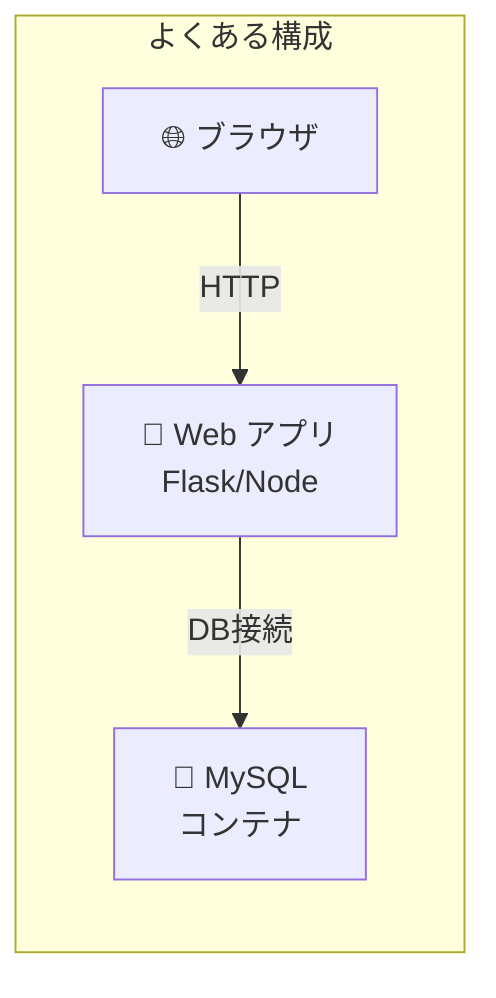
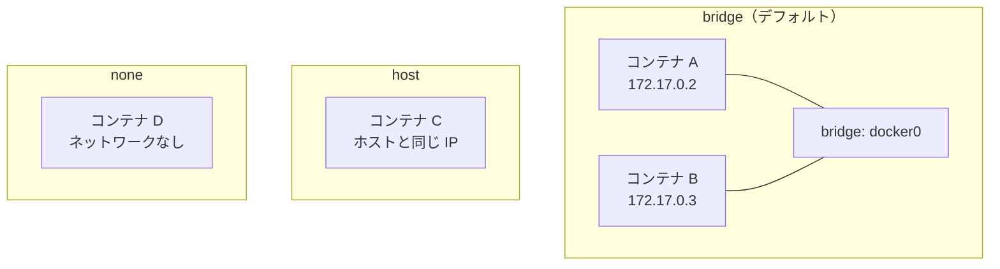

# Phase 4-2: Docker ネットワーク ～ コンテナ間通信を理解する ～

## 学習目標

この単元を終えると、以下ができるようになります：

- Docker ネットワークの種類（bridge, host, none）を説明できる
- カスタムネットワークを作成し、コンテナ間通信を設定できる
- コンテナ名で他のコンテナに接続できる（DNS）
- 実践的な Web + DB 構成を構築できる

## 概念解説

### なぜ Docker ネットワークが必要か？



コンテナ間の通信を安全かつ簡単に行うために、Docker ネットワークを使います。

### AWS で例えると...

| Docker ネットワーク | AWS | 説明 |
|-------------------|-----|------|
| bridge（デフォルト） | デフォルト VPC | 自動で割り当てられる |
| カスタム bridge | カスタム VPC | 自分で設計・管理 |
| host | EC2 のホストネットワーク | コンテナ隔離なし |
| none | ENI なし | ネットワーク隔離 |
| コンテナ名で接続 | Route 53 Private DNS | 名前解決 |

### ネットワークドライバーの種類



| ドライバー | 特徴 | 用途 |
|-----------|------|------|
| **bridge** | コンテナ間通信可能、ホストと分離 | 一般的な用途 |
| **host** | ホストのネットワークをそのまま使用 | 高性能が必要な場合 |
| **none** | ネットワークなし | セキュリティ隔離 |
| **overlay** | 複数ホスト間でコンテナ接続 | Docker Swarm/K8s |

### デフォルト bridge vs カスタム bridge

| 項目 | デフォルト bridge | カスタム bridge |
|------|------------------|----------------|
| DNS（名前解決） | ❌ 使えない | ✅ 使える |
| 隔離 | 全コンテナが同居 | ネットワークごとに隔離 |
| 推奨 | 開発・テスト | 本番・複雑な構成 |

## 基本コマンド

### ネットワーク操作

```bash
docker network ls                    # 一覧
docker network create mynet          # 作成
docker network inspect mynet         # 詳細
docker network rm mynet              # 削除
docker network prune                 # 未使用を削除
```

### コンテナをネットワークに接続

```bash
# 起動時に接続
docker run --network mynet --name app nginx

# 実行中のコンテナを接続
docker network connect mynet container-name

# 切断
docker network disconnect mynet container-name
```

## ハンズオン

### 演習1: デフォルト bridge ネットワークを確認

```bash
# 2つのコンテナを起動
docker run -d --name web1 nginx
docker run -d --name web2 nginx

# IP アドレスを確認
docker inspect web1 --format='{{.NetworkSettings.IPAddress}}'
# 172.17.0.2
docker inspect web2 --format='{{.NetworkSettings.IPAddress}}'
# 172.17.0.3

# IP で通信できる
docker exec web1 curl -s http://172.17.0.3 | head -3

# ❌ 名前では通信できない（デフォルト bridge の制限）
docker exec web1 curl -s http://web2
# curl: (6) Could not resolve host: web2

# 後片付け
docker rm -f web1 web2
```

### 演習2: カスタム bridge ネットワークを作成

```bash
# カスタムネットワーク作成
docker network create myapp-network

# ネットワーク一覧確認
docker network ls

# 詳細確認
docker network inspect myapp-network

# このネットワークでコンテナを起動
docker run -d --name web1 --network myapp-network nginx
docker run -d --name web2 --network myapp-network nginx

# ✅ 名前で通信できる！
docker exec web1 curl -s http://web2 | head -3
# <!DOCTYPE html>...

# web2 → web1 も OK
docker exec web2 curl -s http://web1 | head -3

# 後片付け
docker rm -f web1 web2
docker network rm myapp-network
```

### 演習3: Web + DB 構成を構築

```bash
# アプリ用ネットワーク作成
docker network create webapp-net

# MySQL コンテナ起動
docker run -d --name mysql-db \
  --network webapp-net \
  -e MYSQL_ROOT_PASSWORD=secret123 \
  -e MYSQL_DATABASE=myapp \
  mysql:8

# 起動を待つ
echo "Waiting for MySQL to start..."
sleep 30

# Python アプリを作成
mkdir -p ~/docker-practice/webapp
cd ~/docker-practice/webapp

cat << 'EOF' > app.py
from flask import Flask
import mysql.connector
import os

app = Flask(__name__)

@app.route('/')
def hello():
    try:
        conn = mysql.connector.connect(
            host='mysql-db',  # コンテナ名で接続！
            user='root',
            password='secret123',
            database='myapp'
        )
        cursor = conn.cursor()
        cursor.execute("SELECT VERSION()")
        version = cursor.fetchone()[0]
        conn.close()
        return f'Connected to MySQL {version}!'
    except Exception as e:
        return f'Error: {e}'

if __name__ == '__main__':
    app.run(host='0.0.0.0', port=5000)
EOF

cat << 'EOF' > requirements.txt
flask==3.0.0
mysql-connector-python==8.2.0
EOF

cat << 'EOF' > Dockerfile
FROM python:3.11-slim
WORKDIR /app
COPY requirements.txt .
RUN pip install --no-cache-dir -r requirements.txt
COPY app.py .
EXPOSE 5000
CMD ["python", "app.py"]
EOF

# ビルド
docker build -t webapp .

# Web アプリ起動（同じネットワークに参加）
docker run -d --name webapp \
  --network webapp-net \
  -p 5000:5000 \
  webapp

# 少し待ってからアクセス
sleep 5
curl http://localhost:5000
# Connected to MySQL 8.x.x!

# 後片付け
docker rm -f webapp mysql-db
docker network rm webapp-net
```

### 演習4: ネットワーク隔離を確認

```bash
# 2つの独立したネットワークを作成
docker network create frontend-net
docker network create backend-net

# フロントエンド用コンテナ
docker run -d --name frontend --network frontend-net nginx

# バックエンド用コンテナ
docker run -d --name backend --network backend-net nginx

# API コンテナ（両方のネットワークに接続）
docker run -d --name api --network frontend-net nginx
docker network connect backend-net api

# 接続状況を確認
docker inspect api --format='{{range $k, $v := .NetworkSettings.Networks}}{{$k}} {{end}}'
# frontend-net backend-net

# frontend → api: OK
docker exec frontend curl -s http://api | head -1

# frontend → backend: NG（異なるネットワーク）
docker exec frontend curl -s --connect-timeout 3 http://backend
# タイムアウトまたは解決失敗

# api → backend: OK（api は backend-net にも接続）
docker exec api curl -s http://backend | head -1

# 後片付け
docker rm -f frontend backend api
docker network rm frontend-net backend-net
```

### 演習5: host ネットワークモード

```bash
# host モードで起動（Linux のみ完全動作）
docker run -d --name host-nginx --network host nginx

# macOS/Windows では Docker VM の host になる
# Linux ではホストの IP とポートをそのまま使用

# ポートマッピング不要で 80 番ポートが使える（Linux）
curl http://localhost:80

# 後片付け
docker rm -f host-nginx
```

### 演習6: ネットワークのサブネット指定

```bash
# カスタムサブネットでネットワーク作成
docker network create \
  --subnet=192.168.100.0/24 \
  --gateway=192.168.100.1 \
  custom-subnet

# 固定 IP でコンテナ起動
docker run -d --name fixed-ip \
  --network custom-subnet \
  --ip 192.168.100.10 \
  nginx

# IP 確認
docker inspect fixed-ip --format='{{.NetworkSettings.Networks.custom-subnet.IPAddress}}'
# 192.168.100.10

# 後片付け
docker rm -f fixed-ip
docker network rm custom-subnet
```

### 演習7: コンテナ間の通信をデバッグ

```bash
# ネットワーク作成
docker network create debug-net

# 2つのコンテナ起動
docker run -d --name server --network debug-net nginx
docker run -d --name client --network debug-net ubuntu sleep infinity

# DNS 解決を確認
docker exec client apt-get update && docker exec client apt-get install -y dnsutils curl

docker exec client nslookup server
# Address: 172.xx.xx.xx

# 接続テスト
docker exec client curl -s http://server | head -3

# ping テスト
docker exec client apt-get install -y iputils-ping
docker exec client ping -c 3 server

# 後片付け
docker rm -f server client
docker network rm debug-net
```

## 現場でよくある落とし穴

### 1. デフォルト bridge で名前解決できない

```bash
# ❌ デフォルト bridge では名前解決できない
docker run -d --name db mysql
docker run --rm nginx curl http://db
# Could not resolve host

# ✅ カスタムネットワークを使う
docker network create mynet
docker run -d --name db --network mynet mysql
docker run --rm --network mynet nginx curl http://db
```

### 2. ポートの競合

```bash
docker run -d -p 80:80 nginx
docker run -d -p 80:80 nginx  # エラー！
# port is already allocated

# 対策: 異なるポートを使うか、host モードで1つだけ
```

### 3. コンテナ名の重複

```bash
docker run -d --name web nginx
docker run -d --name web nginx  # エラー！
# Conflict. The container name "/web" is already in use

# 対策: 既存コンテナを削除するか別名を使う
```

### 4. ネットワークを削除できない

```bash
docker network rm mynet
# error: network mynet has active endpoints

# 対策: 接続中のコンテナを先に停止・削除
docker rm -f $(docker network inspect mynet -f '{{range .Containers}}{{.Name}} {{end}}')
docker network rm mynet
```

## 理解度確認

### 問題

Docker のカスタム bridge ネットワークを使用する主なメリットとして、正しいものはどれか。

**A.** コンテナの起動速度が向上する

**B.** コンテナ名で他のコンテナに接続できる（DNS 解決）

**C.** ホストのポートを自動的に開放する

**D.** コンテナのメモリ使用量が削減される

---

### 解答・解説

**正解: B**

- **A.** 誤り。ネットワークの種類は起動速度に影響しません。
- **B.** 正解。カスタム bridge ネットワークでは、Docker の内蔵 DNS により、コンテナ名で他のコンテナのIPアドレスを解決できます。これにより、IPアドレスを直接指定する必要がなくなり、構成が簡単になります。
- **C.** 誤り。ポート開放は `-p` オプションで明示的に指定する必要があります。
- **D.** 誤り。ネットワークの種類はメモリ使用量に影響しません。

---

## まとめ

| 操作 | コマンド | 用途 |
|------|---------|------|
| ネットワーク作成 | `docker network create name` | 隔離・名前解決 |
| 接続して起動 | `--network name` | 新規コンテナ |
| 後から接続 | `docker network connect` | 既存コンテナ |
| 切断 | `docker network disconnect` | ネットワーク変更 |
| 一覧 | `docker network ls` | 確認 |
| 詳細 | `docker network inspect` | デバッグ |

## 次のステップ

コンテナ間の通信ができるようになりました！次は Docker Compose で複数コンテナを一括管理しましょう。

**次の単元**: [Phase 5-1: Docker Compose 入門 ～ 複数コンテナを一括管理 ～](../phase5/01_Compose入門.md)
